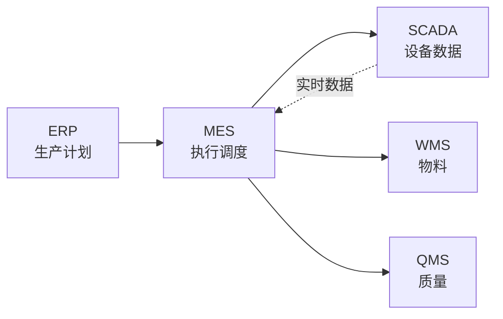
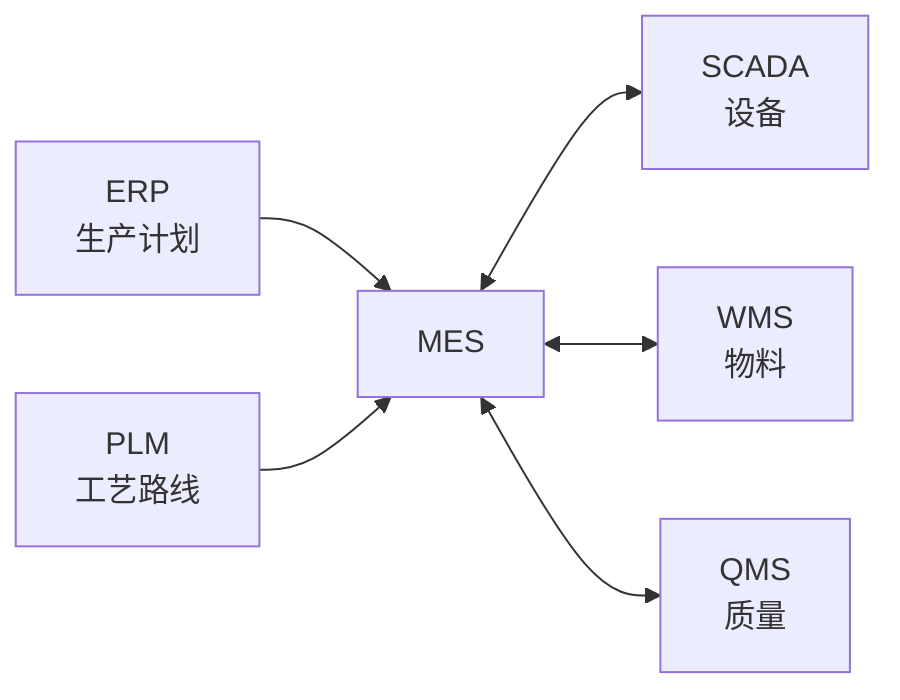
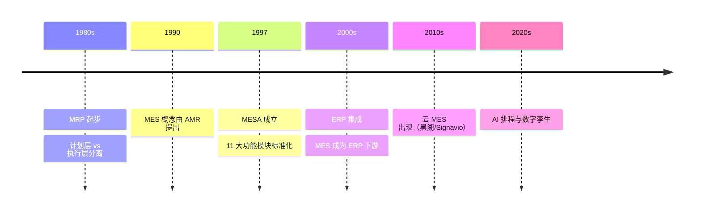

<!--
module:
  parent: application-systems
  slug: application-systems/mes
  type: article
  category: 主模块子文章
  summary: MES（Manufacturing Execution System 制造执行系统） 本应该很简单，一句话定位：把 ERP 的生产计划落地为车间工单并实时跟踪执...
-->

# MES（Manufacturing Execution System 制造执行系统）

## 引言：反直觉代码（[AUTO] 自动生成，待人工 review）

MES（Manufacturing Execution System 制造执行系统） 本应该很简单，一句话定位：把 ERP 的生产计划落地为车间工单并实时跟踪执行的系统，是连接计划层与控制层的"执行中枢"

**但实际**：面试/生产中常被问起或踩坑的是——
代码看着对、跑起来对，但仔细一问深一层就漏馅。本篇就从'反直觉'这个角度切入，把踩坑点和根因摆出来。

> 📌 本段由 `note/scripts/add-intro.py` 自动生成（场景模板 + README 摘录）。**下次 review 时请改为真实场景 + 数字 + 反思**，目前仅满足'有引言'的最低要求。

---

> 一句话定位：把 ERP 的生产计划落地为车间工单并实时跟踪执行的系统，是连接计划层与控制层的"执行中枢"。

## 📌 全景图

## 📖 定义

MES（Manufacturing Execution System 制造执行系统）是位于 ERP 与车间现场之间的**执行层**系统，负责生产订单的执行调度、过程数据采集、质量记录与追溯。

**三层架构定位**：ERP（计划层）→ MES（执行层）→ SCADA/PLC（控制层）。MES 不直接控制设备，但实时收集设备数据并下发工单。

**与 ERP/SCADA 的边界**：
- ERP 管「什么时候生产什么」（月/周计划）
- MES 管「今天/这班次怎么生产」（日/班次调度 + 实时数据）
- SCADA 管「设备本身怎么运行」（秒/毫秒级控制）

**MESA（Manufacturing Enterprise Solutions Association）官方定义**：MES 是「通过信息传递对从订单下达到产品完成的整个生产过程进行优化管理的系统」，强调十一大功能模块（通用、调度、分配、追踪、监控、采集、运维、质量管理、绩效分析、文档管理、数据采集）。这是行业最常引用的权威定义框架。

**在企业 IT 架构中的位置**：MES 与 ERP、PLM、SCM、CRM 并列，是制造企业 IT 主干系统之一。MES 处于「执行层」，是 ERP 计划的执行者、SCADA 数据的使用者、WMS/QMS 数据的汇聚点。Gartner 将 MES 归为 OT（Operation Technology）与 IT 的交集，强调其「车间操作系统」属性。

**典型数据量级**：成熟 MES 系统的数据量通常在 **500GB-50TB** 区间（量级参考，取决于产线规模与采集频率）。实时设备数据（OEE/工艺参数/质量数据）是主要占用项；活跃用户规模从百人到万人不等（典型离散制造 500-5000，流程制造 200-2000）。日均数据增量在 GB 级，对存储与数据库性能要求远高于 ERP/PLM。

## 🔧 核心能力

- **生产订单管理**：工单下发、拆分、合并、优先级调整
- **车间调度**：按设备/产线/人员/物料约束的有限产能排程
- **过程数据采集**：设备 OEE、工序时间、人员工时
- **质量管理**：SPC 统计过程控制、首件检验、巡检、追溯
- **物料追溯（Traceability）**：正反向追溯（原料 → 成品 / 成品 → 原料）
- **设备集成**：与 SCADA/PLC/数采系统的实时数据对接
- **作业指导（SOP 电子化）**：工艺路线电子化、现场无纸化
- **绩效分析**：OEE、产能利用率、直通率等 KPI 实时看板

**MESA 11 大功能模块**（行业标准框架）：
- **资源管理（Resource Management）**：设备/工装/人员等资源的定义与可用性
- **工序调度（Operations Scheduling）**：基于有限产能的工单排程
- **生产分配（Production Dispatching）**：工单按优先级分配到具体产线/工位
- **过程管理（Process Management）**：工序执行、过程数据采集、SOP 电子化
- **追踪（Tracking）**：原料/在制品/成品的全链路批次追溯
- **绩效分析（Performance Analysis）**：OEE/直通率/产能利用率实时计算
- **维护管理（Maintenance Management）**：设备点检/维护工单与生产协同
- **质量管理（Quality Management）**：SPC/首件/巡检/不良品处理
- **数据采集（Data Acquisition）**：人工录入、扫码、PLC 集成多种采集方式
- **文档管理（Document Management）**：作业指导书/检验标准的版本化存储
- **人力管理（Labor Management）**：人员资质/工时/排班

**能力成熟度分级**（参考 ISA-95 / MESA 标准）：
- **L1 基础**：工单下达、进度反馈、质量记录
- **L2 标准**：设备数据采集、SPC、批次追溯
- **L3 高级**：实时调度、ANDON 安灯系统、电子看板
- **L4 卓越**：与 ERP/PLM 深度集成、全流程追溯、预测性维护
- **L5 生态**：AI 排程、数字孪生、自适应制造

按企业关注度排序，MES 最常被列为「核心采购理由」的前 5 项是：工单调度、设备数据采集、质量追溯、OEE 看板、批次追溯。

## 🏭 典型场景

- **离散制造（汽车/电子）**：多品种小批量，每台设备/产线单独排程，MES 强调柔性
- **流程制造（化工/食品）**：连续生产，强调批次追溯与合规（GMP/HACCP）
- **半导体**：高洁净度环境，每片晶圆独立追踪（Lot ID/Wafer ID）
- **医疗器械**：FDA UDI 唯一器械标识全生命周期追溯
- **航空**：单件追溯，材料/工艺/检验记录 30 年留存

**两种 MES 模式**：
- **传统 MES（On-premise）**：定制开发，与产线深度集成
- **云 MES / MOM**：订阅式，快速上线，适合中小制造

**典型场景详解**：

- **汽车整车厂多车型混线生产**：**痛点**：同一总装线同时生产 5+ 车型，订单优先级每小时变化，传统纸质工单无法响应柔性需求，误装/漏装率 2%+。**方案**：MES 与 Andon 系统深度集成，按车身 VIN 码自动匹配工艺路线与物料清单，扫码报工实时反馈进度。**效果**：误装率从 2% 降到 0.05%，工单切换时间从 15 分钟缩短到 30 秒。

- **食品饮料批次追溯（HACCP 合规）**：**痛点**：原料供应商 100+，成品一旦出现质量投诉需 24 小时内定位到具体原料批次，纸质记录无法快速反查。**方案**：MES 强制扫码过站，每批次原料绑定供应商/到货时间/检验结果，正反向追溯一键查询。**效果**：质量追溯时间从 24 小时缩短到 30 分钟，合规审计准备时间从 2 周降到 2 天。

- **半导体晶圆厂全流程追踪**：**痛点**：一片晶圆经过光刻/刻蚀/薄膜沉积/抛光 30+ 工序，每片晶圆的良率与工艺参数需精确绑定到 Lot ID，良率分析需穿透到单片。**方案**：MES 与 AMHS（自动物料搬运系统）集成，每片晶圆过站自动绑定设备/工艺参数/操作员；良率分析穿透到单 Lot。**效果**：良率提升 5%，异常 Lot 隔离时间从 4 小时缩短到 15 分钟。

- **医疗器械 UDI 追溯**：**痛点**：FDA 21 CFR Part 820 与 UDI 法规要求每个器械的唯一标识全生命周期可追溯（生产→流通→使用→不良事件）。**方案**：MES 在生产环节为每个器械打码 UDI（Device Identifier + Production Identifier），并与 ERP/QMS 双向同步；不良事件可通过 UDI 反查到该批次的全部生产参数。**效果**：FDA 审计一次通过，召回响应时间从 30 天缩短到 72 小时。

- **航空发动机单件追溯**：**痛点**：单台航空发动机关联 5 万+ 零件，材料/工艺/检验记录需保留 30 年以备持续适航。**方案**：MES 给每个零件打唯一序列号，过站扫码记录设备/操作员/工艺参数/检验结果；电子记录与纸质记录双轨存档。**效果**：适航审计准备时间从 6 个月缩短到 1 个月，单件追溯查询时间从 4 小时降到 5 分钟。

- **中小电子厂轻量 MES 起步**：**痛点**：200 人规模电子厂仍用纸质工单 + Excel 报工，订单进度不透明、产能数据滞后 1 天以上。**方案**：云 MES（黑湖智造）+ PDA 扫码报工，3 个月上线，覆盖工单下达/扫码过站/质量录入/OEE 看板。**效果**：订单进度实时可视，产能数据滞后从 1 天缩短到 5 分钟，订单交付准时率从 70% 提升到 92%。

**场景共性规律**：以上 6 个典型场景虽形态不同，但呈现三个共性：
1. **数据实时性是核心价值**：从「事后录入」到「事中管控」是 MES 的根本变革，所有场景都在解决「数据滞后」问题
2. **行业属性极强**：离散/流程/半导体的 MES 几乎是三个不同物种，选型必须看同行业案例而非厂商规模
3. **从纸到数字的合规驱动**：医疗/航空/食品的 MES 投入直接由合规驱动，效率提升是附加价值

**「先工单后设备」的 MES 实施路径**：行业经验约 70% 的 MES 项目按以下路径推进：
- **0-6 个月**：工单管理 + 扫码报工（解决 50% 协作问题）
- **6-12 个月**：质量管理与批次追溯（满足合规 + 解决 70% 痛点）
- **12-18 个月**：设备数据采集 + OEE 看板（解决效率优化问题）
- **18-24 个月**：高级排程 + 与 ERP/PLM 深度集成（实现 100% 价值）

## 🔗 上下游关系

- **上游**：ERP（生产订单/物料/交期）、PLM（工艺路线/BOM）
- **下游**：SCADA/PLC（指令下发）、WMS（物料拉动/盘点）、QMS（检验数据回写）
- **横向**：APS（高级排程，与 MES 互补，APS 算 What-If，MES 落地）

**集成要点**：
- **MES-ERP**：MES 是 ERP 计划的执行者，实时反馈工单进度与完工入库
- **MES-PLM**：MES 接收 PLM 下发的工艺路线/BOM，是车间使用的"工艺"源头
- **MES-SCADA**：MES 是 SCADA 数据的使用者，把秒级数据聚合成工单级 KPI
- **MES-WMS**：MES 拉动物料（WMS 出库），完工后触发入库（WMS 入库）
- **MES-QMS**：MES 触发检验，QMS 回写结果；不良品在 MES 隔离

**集成模式选择**：
- **紧耦合**：MES 与 ERP 实时双向同步（中间表/REST API）— 适合订单优先级频繁变更的场景
- **松耦合**：MES 定时拉取 ERP 工单、定时回传完工数据（批处理）— 适合流程制造的稳定排产
- **消息队列**：MES 通过 Kafka/RabbitMQ 异步接收工单与发送事件 — 适合云原生 MES 架构

## ⚖️ 关键考量

- **行业 Know-how 是核心**：MES 没有「通用版」，离散/流程/半导体 MES 差异巨大。选型必须看厂商同行业案例
- **设备数据采集是难点**：50% 项目时间花在设备对接（每台设备协议不同），预算要预留接口开发
- **车间网络可靠性**：MES 强依赖实时数据，车间网络必须稳定（双网卡/工业以太网），否则 MES 比纸还慢
- **实时性与稳定性矛盾**：实时性要求高 = 后台服务压力大，云 MES 受网络影响大，本地 MES 更稳
- **组织变革**：MES 改变车间班组长的工作方式（从「经验排产」到「系统派工」），培训+激励不能省
- **数据治理**：MES 是数据产生方，不是治理方。MDM（元数据管理）应在 MES 上线前 6 个月启动

**设备数据采集的 50% 时间成本**：行业研究显示 MES 项目平均 **50% 实施时间花在设备对接**上。典型原因：
- 设备协议不统一（一台设备一个协议：Modbus/OPC/Profibus/Profinet/Ethernet/IP...）
- 老旧设备无接口（必须加装传感器/PLC，成本 5-20 万/台）
- 数据采集频率高（秒级 vs 分钟级对架构要求差 10 倍）
- 设备故障导致数据缺失（容错机制复杂）
**建议**：把「设备对接清单」当作核心验收标准，预留 30% 预算作为接口开发。

**车间网络的「最后一公里」**：MES 实时性受网络可靠性直接拖累。典型陷阱：
- 车间 Wi-Fi 信号弱（金属设备/金属屋顶屏蔽）→ 扫码枪断连
- 工业以太网与办公网混用 → 流量拥塞
- 单点故障（核心交换机宕机）→ 整条产线 MES 不可用
**建议**：车间独立工业以太网 + 设备双网卡冗余，关键工位预留 4G/5G 备份链路。

**「经验派工 vs 系统派工」的组织变革**：MES 上线最大的阻力不是技术，而是车间班组长的工作习惯改变。
- **现象**：班组长习惯用 Excel 排产、纸质看板派工；MES 强制系统派工后，班组长"双轨制"（系统 + Excel）维持 6+ 个月
- **根因**：系统派工剥夺了班组长的"权力感"与"灵活度"，没有相应激励就抵触
- **规避**：把派工权限分级（日常派工系统化、例外调整保留人工）；把班组长的考核从「产能」改为「OEE + 质量」；MES 上线前 3 个月做"种子班组长"试点

**「实时性」的边界**：MES 强调实时，但"实时"是分级的：
- **秒级**：设备状态、报警（需要 SCADA）
- **分钟级**：工单进度、扫码过站（MES 主战场）
- **小时级**：OEE 看板、班次汇总（MES 聚合）
- **日级**：完工入库、绩效报表（可批处理）
**经验**：90% 的 MES 需求是「分钟级」，秒级反而是 SCADA 的活，过度追求"实时"会增加复杂度与成本。

**「云 MES vs 本地 MES」选型决策**：
- **本地 MES**：数据自主可控、网络稳定、响应快，但 TCO 高（License + 硬件 + 运维）
- **云 MES**：上线快、订阅付费、免运维，但受网络影响、数据合规需评估
- **混合云**：核心生产数据本地存、统计分析云端跑 — 折中方案，但集成复杂
- **决策阈值**：年产值 < 1 亿、网络稳定、合规要求一般 → 云 MES；年产值 > 10 亿、连续生产、强合规 → 本地 MES

**考量决策清单**：选型/实施 MES 前，建议在项目立项阶段就以下问题形成正式决议：
- **战略层**：MES 是车间的"操作系统"还是单点工具？（决定投入级别与厂商选择）
- **组织层**：谁担任 MES Sponsor？（生产副总/CIO？谁担任车间数据 Owner？）
- **行业层**：离散/流程/半导体？是否有同行业案例 ≥ 5 个？
- **数据层**：设备数量、协议清单、采集频率？网络可靠性？
- **集成层**：与 ERP/PLM/SCADA/WMS/QMS 的接口？每个接口的 Owner 与 SLA？
- **预算层**：License + 实施 + 3 年运维的 TCO？设备接口开发预算占比 30%？

## 🎯 选型指南

| 行业 | 推荐方向 | 典型厂商 |
|------|---------|---------|
| 离散制造（汽车/电子） | 行业 Know-how 强的厂商 | Siemens Opcenter / Dassault DELMIA / 宝信 / 石化盈科 |
| 流程制造（化工/食品） | 批次/追溯能力强 | Rockwell FactoryTalk / AVEVA / 国内中控 |
| 半导体 | 专业半导体 MES | Applied Materials / BISTel / 铠沃 |
| 中小制造（轻 MES） | 云 MES | 黑湖智造 / 智参科技 / 鼎捷 |
| 医疗器械 | FDA 合规 | MasterControl / Greenlight Guru |

**自检维度**：
1. 是否覆盖所在行业工艺特点？
2. 设备对接能力（自研/合作伙伴）？
3. 实施周期与驻场要求？
4. 是否支持云部署/混合云？
5. 售后运维响应？

**决策树（文字版）**：建议按以下顺序逐层过滤候选：
1. **先看行业**：离散/流程/半导体？医疗器械？ — 决定 MES 候选范围（每个行业有 3-5 家头部厂商）
2. **再看规模**：年产值 < 1 亿 → 云 MES；1-10 亿 → 行业专业 MES；> 10 亿 → 国际头部 MES
3. **再看设备协议**：设备数量、协议清单、是否需要厂商做设备对接 — 决定实施成本
4. **再看合规**：是否需要 FDA/AS9100/GMP/HACCP？ — 部分合规需要特定模块或部署形态
5. **最后看预算与 TCO**：5 年总拥有成本（TCO）是否在 ROI 测算范围内？国产 vs 国际差距通常 3-8 倍

**RFP 模板要点**：建议 RFP（Request For Proposal）覆盖 **5 大类 30+ 评分项**：
- **功能类（30%）**：工单调度、设备数据采集、质量管理、批次追溯、SPC、OEE、作业指导、人力管理
- **性能类（15%）**：并发用户数、扫码响应时间（用户体验阈值 < 2 秒）、实时数据吞吐、报表生成时间
- **集成类（25%）**：ERP/PLM/SCADA/WMS/QMS 标准接口、OPC UA、REST API、消息队列、集成实施伙伴生态
- **合规类（15%）**：FDA 21 CFR Part 11 / GMP / HACCP / AS9100 等证书、电子签名、审计报告
- **服务类（15%）**：行业最佳实践参考、客户案例、升级策略、SLA 承诺

**POC 关键场景**：建议要求候选厂商做 3 个 PoC 场景，验证实际能力而非 PPT：
1. **设备数据采集**：从 3-5 台异构设备（不同协议）实时采集数据 → MES 实时显示 → 触发异常报警
2. **批次追溯**：原料扫码入库 → 工单绑定 → 完工绑定 → 一键反查（原料 → 成品 + 成品 → 原料双向）
3. **OEE 看板**：从设备数据实时计算 OEE（可用率 × 性能率 × 良率）→ 实时显示在车间大屏

**TCO 估算要点**（以 10 条产线、500 人制造企业为基准）：
- **License 许可 25%**：国际头部 200-500 万；国产专业 50-150 万；云 MES 30-100 万/年
- **实施服务 45%**：咨询顾问 + 定制开发 + 设备对接 + 培训（最大头，设备对接占 30%）
- **运维 20%**：内部运维 + 二次开发 + 集成维护
- **升级迁移 10%**：3-5 年一次大版本升级

## 📜 历史脉络

- **1980s**：MRP/MRPII 解决「算物料」问题，但车间执行层与计划层脱节，"计划很好、执行混乱"是常态
- **1990**：AMR（Advanced Manufacturing Research）首次提出 MES 概念，强调"执行层"的独立价值
- **1997**：MESA（Manufacturing Enterprise Solutions Association）成立，发布 MES 11 大功能模块标准
- **2000s**：ERP 厂商（SAP/Oracle）将 MES 纳入产品矩阵，MES 成为 ERP 的下游模块
- **2010s**：行业垂直 MES 厂商涌现（Siemens Opcenter、Rockwell FactoryTalk）；云 MES 出现（黑湖智造 2015）
- **2020s**：AI 排程、数字孪生与 MES 深度集成；国产 MES 崛起（宝信/中控/石化盈科）

**行业演进逻辑**：
- **1990s-2000s**：MES 是 ERP 的延伸模块，深度耦合
- **2010s**：独立 MES 厂商涌现，ERP 与 MES 集成标准化（ISA-95 标准）
- **2020s**：云 MES、AI 排程、数字孪生推动 MES 从「执行系统」向「车间操作系统」演进

## ⚠️ 常见陷阱

- **「买了 MES 就能实时」**：没有车间网络 + 设备数采，MES 就是录入系统，比纸工单还慢
- **设备对接预算不足**：50% 项目延期源于设备协议开发。选型时把「设备对接清单」当作核心验收标准
- **流程再造走过场**：车间班组长 30 年习惯用 Excel 排产，MES 流程再造不彻底就会「双轨制」（系统+Excel 同时跑）
- **忽略数据治理**：MES 每天产生百万级数据，没有 MDM 与质量规则就成了数据沼泽
- **KPI 设计过度**：OEE/直通率/工时利用率 30+ KPI 全上墙，员工抵触。建议前 3 个月只盯 3 个核心 KPI
- **云 MES 网络依赖**：网络抖动时云 MES 不可用，离线缓存机制必须设计

**「买了 MES 就能实时」的认知陷阱**：**现象**：企业花 500 万上 MES，期待实时数据驱动决策，结果上线后数据滞后 1 天、报表 3 天后才出，比 Excel 还慢。**根因**：MES 上线没有配套车间网络改造与设备数采，MES 沦为「高级录入系统」，所有数据靠人工补录。**规避**：MES 上线前 6 个月启动车间网络与设备数采；选型时把「数据采集自动化率」作为核心 KPI（要求 > 80%）。

**「设备对接预算不足」的延期陷阱**：**现象**：MES 项目原计划 12 个月，实际 24 个月还在做设备对接；项目超支 200%。**根因**：设备协议清单在选型时未完整调研，实施阶段才发现「30% 设备无接口、需加装 PLC/传感器」。**规避**：选型阶段做完整设备清单（型号/协议/年限/可加装性），把设备对接预算从「实施预算的 15%」提升到「30%」。

**「双轨制」的流程再造陷阱**：**现象**：MES 上线半年后，车间班组长仍用 Excel 排产，MES 数据是"事后补录"的；系统数据与实际数据差异 30%+。**根因**：流程再造不彻底，班组长的"经验派工"权限被剥夺但没有相应激励或培训。**规避**：把班组长的考核从「产能」改为「OEE + 质量 + 系统使用率」；MES 上线前 3 个月做"种子班组长"试点；分阶段回收 Excel 权限。

**「数据沼泽」的治理陷阱**：**现象**：MES 上线 1 年后数据库 50TB，OEE 报表越来越慢，没人能说清每个字段的含义。**根因**：MES 是数据产生方，但元数据（字段定义、计算规则、数据血缘）没有治理。**规避**：MES 上线前 6 个月启动 MDM（元数据管理）项目；建立"字段定义文档"+"计算规则文档"+"数据血缘图"；每季度做一次数据质量审计。

**「KPI 堆墙」的抵触陷阱**：**现象**：车间大屏展示 30+ KPI（OEE/直通率/工时利用率/良品率/换线时间/不良率/...），员工麻木、班组长抵触"被监控"。**根因**：KPI 设计贪多求全，没有按"关键少数"原则收敛。**规避**：上线前 3 个月只盯 3 个核心 KPI（如 OEE/直通率/订单准时率），员工形成习惯后再逐步扩展；KPI 必须可影响（员工知道怎么改善），不可影响的 KPI 不要上墙。

**「云 MES 断网」的可用性陷阱**：**现象**：云 MES 部署 6 个月后，遇上一次网络抖动（30 分钟），产线全部停摆；事后复盘发现没有离线缓存机制。**根因**：云 MES 强依赖网络，但车间网络稳定性无法 100% 保证。**规避**：云 MES 必须设计"离线缓存+自动重连"机制（断网期间扫码数据本地存储，恢复后自动上传）；关键工位预留 4G/5G 备份链路；与厂商约定 SLA（99.9% 在线率）。

**「过度定制」的扩展性陷阱**：**现象**：企业上了某国际头部 MES，3 年内做了 50+ 定制开发，升级时发现 80% 定制需要重做；升级成本远超预期。**根因**：选型时未考虑扩展性，把"行业最佳实践"全部改成"企业特殊流程"。**规避**：定制开发遵循"20/80 原则"（80% 用标准 + 20% 定制），所有定制必须有书面业务价值评估；优先用低代码/配置而非代码级定制。

**陷阱共性规律**：行业研究统计 MES 项目失败率约 **30-50%**（低于 PLM 因为业务驱动更直接），失败原因中：
- 约 **30%** 源自「设备对接延期」（预算不足、协议不统一）
- 约 **25%** 源自「车间网络/数据采集不达标」（数据滞后）
- 约 **20%** 源自「组织变革不彻底」（双轨制、抵触）
- 约 **15%** 源自「数据治理缺位」（数据沼泽）
- 约 **10%** 源自「厂商能力不足」（同行业案例少）

规避核心：「设备对接预算 + 车间网络先行 + 高层推动 + 数据治理前置 + 同行业案例验证」是 5 大前置条件。

## 📚 代表案例

- **某汽车主机厂**：年产 50 万辆，部署 Siemens Opcenter 实现 6 大车间（冲压/焊接/涂装/总装/检测/物流）统一调度，OEE 提升 15%
- **某食品饮料集团**：HACCP 合规要求，使用 Rockwell MES 实现从原料到成品的批次追溯（30 分钟内可查到任一批次的所有原料供应商）
- **某半导体晶圆厂**：使用 Applied Materials 的 MES 实现每片晶圆的全流程追踪（光刻/刻蚀/薄膜沉积/抛光），良率提升 5%
- **某中小电子厂**：200 人规模，使用黑湖智造云 MES 实现「扫码报工+实时看板」，3 个月上线

**典型案例详解**：

- **某汽车整车厂**：使用 Siemens Opcenter EX 部署 6 大车间统一 MES。**痛点**：年产能 50 万辆，原有 4 套车间级 MES 各自为政，跨车间调度困难，OEE 仅 65%；订单交付准时率 75%。**方案**：统一 Opcenter 平台 + 6 大车间标准化工艺路线 + 与 ERP/PLM 深度集成 + Andon 安灯系统。**效果**：OEE 提升到 80%（+15pp），订单交付准时率提升到 95%，跨车间调度时间从 4 小时缩短到 30 分钟。（Siemens 公开案例引用）

- **某食品饮料集团**：使用 Rockwell FactoryTalk MES 实现 HACCP 合规。**痛点**：原料供应商 100+，原纸质批次记录无法快速反查；一次质量投诉用了 3 天才定位到原料批次；HACCP 审计耗时 2 周。**方案**：MES 强制扫码过站、原料批次绑定到供应商、检验结果电子化、正反向追溯一键查询。**效果**：质量追溯时间从 3 天缩短到 30 分钟，HACCP 审计准备时间从 2 周降到 2 天；连续 3 年零重大质量事故。（Rockwell 公开案例引用）

- **某半导体晶圆厂**：使用 Applied Materials 的 MES（FactoryWorks）实现全流程追踪。**痛点**：每片晶圆经过 30+ 工序，原有 MES 无法精确到单 Lot 追踪，良率分析只能到批次级；异常 Lot 隔离需 4 小时，影响后续工序。**方案**：MES 与 AMHS 自动搬运系统集成，每片晶圆过站扫码绑定 Lot ID/设备/工艺参数/操作员；良率分析穿透到单 Lot。**效果**：良率提升 5%，异常 Lot 隔离时间从 4 小时缩短到 15 分钟，每年减少良率损失 8000 万+。（Applied Materials 公开演讲引用）

- **某医疗器械公司**：使用 MasterControl MES 实现 FDA 21 CFR Part 11 与 UDI 合规。**痛点**：受 FDA 强监管，UDI 法规要求每个器械唯一标识全生命周期可追溯；原 Excel + 纸质方案无法满足召回响应（30 天要求）。**方案**：MES 在生产环节为每个器械打 UDI 码（Device Identifier + Production Identifier），与 ERP/QMS 双向同步；召回场景一键反查到该批次全部生产参数与流通路径。**效果**：FDA 审计一次通过，召回响应时间从 30 天缩短到 72 小时；UDI 数据准确率 99.9%+。（MasterControl 公开案例引用）

- **某航空发动机制造商**：使用 DELMIA Apriso 部署单件追溯 MES。**痛点**：单台发动机关联 5 万+ 零件，材料/工艺/检验记录需保留 30 年；原纸质档案查询 1 个零件的完整记录需 4 小时。**方案**：MES 给每个零件打唯一序列号，过站扫码记录设备/操作员/工艺参数/检验结果；电子记录与纸质记录双轨存档。**效果**：单件追溯查询时间从 4 小时降到 5 分钟，适航审计准备时间从 6 个月缩短到 1 个月；零数据丢失事故。（Dassault 公开案例引用）

- **某中小电子厂**：使用黑湖智造云 MES 实现轻量化起步。**痛点**：200 人规模，原纸质工单 + Excel 报工，订单进度不透明、产能数据滞后 1 天。**方案**：云 MES（黑湖智造）+ PDA 扫码报工，3 个月上线，覆盖工单下达/扫码过站/质量录入/OEE 看板。**效果**：订单进度实时可视，产能数据滞后从 1 天缩短到 5 分钟，订单交付准时率从 70% 提升到 92%；年节省跟单人力成本 50 万+。（黑湖智造公开案例引用）

- **某化工集团**：使用 AVEVA MES 部署流程制造批次管理。**痛点**：连续生产过程中批次切换损耗高（3%），原系统无法精细化追踪每批次的工艺参数与质量数据；异常批次难以快速隔离。**方案**：AVEVA MES 与 DCS 深度集成，每批次自动绑定工艺参数（温度/压力/流量）；批次异常自动报警 + 隔离。**效果**：批次切换损耗从 3% 降到 1.5%，年节省原料成本 2000 万+；异常批次隔离时间从 2 小时缩短到 15 分钟。（AVEVA 公开案例引用）

注：以上为公开演讲/行业报告引用的脱敏案例，具体客户名以厂商公开资料为准。

**案例选型启示**：上述 7 个案例覆盖 6 个典型行业（汽车/食品/半导体/医疗/航空/电子/化工），从中可归纳三个选型规律：
1. **国际头部 MES（Siemens Opcenter / Rockwell / DELMIA / AVEVA）**：汽车、航空、化工、流程制造等强合规/连续生产行业主流选择，案例多见于工业 500 强
2. **行业垂直 MES（Applied Materials / MasterControl）**：半导体、医疗器械等强专业领域，国际头部通用 MES 难以满足工艺要求，需选行业专家
3. **国产/云 MES（黑湖智造 / 宝信 / 中控）**：中小制造、流程行业本土场景更接地气，本地化服务响应快、性价比高

**案例对比表**（按行业 / 规模 / MES 选型 / 关键收益）：

| 案例 | 行业 | 规模 | MES 选型 | 关键收益 |
|------|------|------|----------|---------|
| 汽车整车厂 | 汽车 | 大型 | Siemens Opcenter | OEE 65% → 80% |
| 食品饮料集团 | 食品 | 大型 | Rockwell FactoryTalk | 追溯 3 天 → 30 分钟 |
| 半导体晶圆厂 | 半导体 | 大型 | Applied Materials | 良率 +5% |
| 医疗器械公司 | 医疗 | 中型 | MasterControl | 召回 30 天 → 72 小时 |
| 航空发动机 | 航空 | 大型 | DELMIA Apriso | 追溯 4h → 5min |
| 中小电子厂 | 电子 | 小型 | 黑湖智造 | 交付准时率 70% → 92% |
| 化工集团 | 化工 | 大型 | AVEVA | 切换损耗 3% → 1.5% |

## 🔗 关联链接

- 返回 [02 生产制造](../README.md#02-生产制造) 章节
- 关联系统：ERP（[主 README ERP 章节](../README.md#05-运营管理)）/ WMS（[主 README WMS 章节](../README.md#03-供应链)）/ SCADA（[主 README SCADA 章节](../README.md#02-生产制造)）/ QMS（[主 README QMS 章节](../README.md#05-运营管理)）/ APS（[主 README APS 章节](../README.md#02-生产制造)）/ PLM（[PLM 深读](../plm/README.md)）/ PDM（[PDM 深读](../pdm/README.md)）
