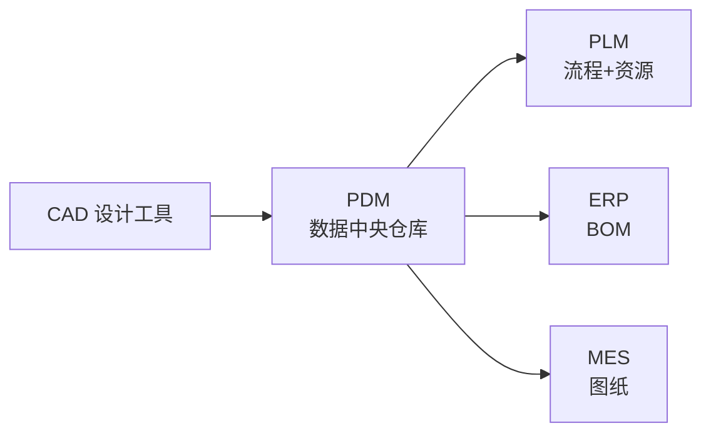
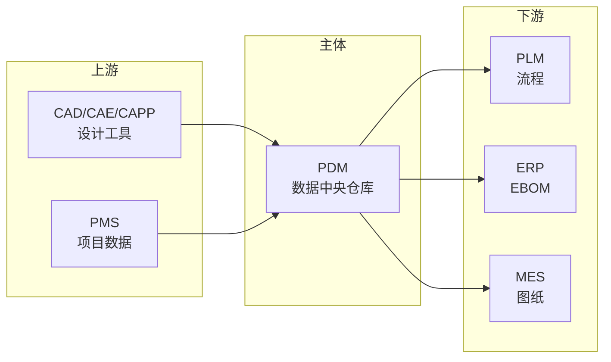

# PDM（Product Data Management 产品数据管理）

> 一句话定位：PLM 的核心子集，专注于产品数据本身（文档、图纸、零部件）的管理与组织。

## 📌 全景图

## 📖 定义

PDM（Product Data Management 产品数据管理）是 PLM 的**核心子集**，专注于产品数据本身（文档、图纸、零部件）的管理与组织，是 PLM 早期阶段的形态。

**与 PLM 的关系**：PDM ⊂ PLM。PDM 管「数据」，PLM 管「数据 + 流程 + 资源」。中小企业在不需要完整 PLM 流程的情况下，可以单独部署 PDM 解决数据管理痛点。

**与文档管理系统的区别**：DMS 管通用文档（合同、报告）；PDM 管结构化产品数据（BOM 层级、零部件关系、CAD 关联）。

**PDM 管什么**：文档版本、零部件库、CAD 图纸、BOM 结构、权限审批。

**在企业 IT 架构中的位置**：PDM 是 PLM 的数据底层，也是 PLM 早期形态；现代 PLM 部署通常把 PDM 作为子模块（Teamcenter 的 TcE、ENOVIA 的 VPM、Windchill 的 PDMLink）。但中小企业受预算/复杂度限制常单独部署 PDM，作为向 PLM 演进的过渡阶段。

**典型数据量级**：PDM 系统的数据量通常在 **10GB-1TB** 区间（量级参考，取决于 CAD 规模与历史积累）。CAD 图纸与版本历史是主要占用项；活跃用户从十人到数百人（典型中小企业 30-500）。与 PLM 相比，PDM 缺流程数据/项目数据/配置管理数据，整体体量约为成熟 PLM 的 1/10-1/3。

**行业标准与合规背景**：PDM 实施在受监管行业需关注：
- **ISO 10303 (STEP)**：产品数据交换标准，是 PDM 与 CAD/CAM 互操作的基础
- **AS9100 / ISO 9001**：质量管理体系对设计历史文件归档的要求
- **FDA 21 CFR Part 11**：医疗器械电子签名与电子记录的合规要求
- **REACH / RoHS**：材料声明数据存储与追溯要求

## 🔧 核心能力

- **文档与图纸版本管理**：检出/检入、版本号自动递增、修订历史；避免「最新版到底是哪个」的协作痛点
- **零部件库与结构管理**：EBOM（工程 BOM）层级维护、Part Master 数据；建立企业级零部件主数据
- **CAD 集成**：与 SolidWorks/CATIA/UG/ProE 的双向文件挂载、属性映射；从 CAD 直接检入到 PDM 避免手动上传
- **检索与权限**：按属性/全文检索、按部门/角色/项目的细粒度权限；权限模型是 PDM 与云盘的核心区别
- **变更管理**：零部件变更通知、受影响文档清单；为 ECN/ECR 流程提供数据基础
- **生命周期状态**：Draft → In Review → Released → Obsolete 的状态机；约束设计师「未发布不能用于生产」

- **签审工作流**：多人会签、电子签名、审批超时升级；轻量化的工作流，复杂 ECN 流程通常交给 PLM
- **零部件分类与重用**：按类型/规格/供应商分类；相似件推荐减少「一物多码」，降本增效
- **可视化与标注**：3D/2D 预览（无需原始 CAD 软件）、红圈标注、审阅意见挂载；解决「别人没装 CAD 看不到图」
- **数据导出与交换**：STEP/IGES 中性格式导出、PDF 图纸批量出图；对外（供应商/客户）数据交换基础
- **审计日志**：谁/何时/改了什么 全留痕；满足 ISO 9001 / AS9100 / FDA 21 CFR Part 11 的合规要求

- **多组织/多工厂数据隔离**：跨地域研发团队的数据隔离与权限模型；支持「中央 PDM + 多工厂分库」或「中央 + 镜像」部署
- **移动端查阅**：手机/平板访问图纸（预览/批注），解决车间/出差场景「找图难」问题
- **API 与二次开发**：REST API、WebService、SDK；支持企业内部系统集成（如 MES 工单拉图）与定制化开发
- **数据备份与容灾**：全量备份 + 增量备份 + 异地容灾；典型 RPO 1 小时、RTO 4 小时
- **与仿真/CAE 集成**：与 ANSYS/Nastran/Abaqus 等仿真工具集成，仿真结果与设计模型双向追溯；解决「设计改了，仿真结果忘记重新跑」问题
- **版本对比与差异分析**：两个版本的图纸/BOM 自动对比，差异点高亮；审计变更影响范围的关键工具

**能力成熟度分级**（参考行业咨询框架）：
- **L1 基础**：电子仓库、版本控制、权限模型
- **L2 标准**：CAD 集成、BOM 管理、检索、签审
- **L3 高级**：变更管理、零部件重用、可视化标注
- **L4 卓越**：与 PLM/ERP 深度集成、跨企业协同
- **L5 生态**：与设计仿真一体化、衍生式设计数据管理

按企业关注度排序，PDM 最常被列为「核心采购理由」的前 5 项是：版本管理、CAD 集成、零部件库、检索、权限。

## 🏭 典型场景

- **纯研发数据管理需求**：暂时不需要完整 PLM 流程，但已经有 CAD 文件散落、版本混乱、找不到最新版等问题
- **企业 PDM 起步阶段**：先上 PDM 解决 80% 痛点，再逐步扩到 PLM 的流程/资源/协同
- **制造业中小企业**：500 人以下研发团队，CAD 文件 10 万量级，PDM 即可覆盖
- **设计院/科研院所**：文档管理 + 协同设计的轻量需求
- **教育/培训单位**：教学模型管理、毕业设计归档，PDM 的轻量化部署即可
- **机械加工/钣金小作坊**：图纸版本混乱、报价找图慢，PDM 的检索 + 版本控制就能解决

**典型场景详解**：

- **离散装备制造（机床/工程机械）长生命周期追溯**：**痛点**：一台机床售出 15 年后客户报修，售后工程师需快速定位出该机型的具体配置版本、对应图纸、当时使用的物料批次。**方案**：PDM 建立「销售配置快照」与「售后备件 BOM」反向追溯链，物料停产提前 2 年预警替换件。**效果**：售后响应时间从 72 小时缩短到 4 小时，备件齐套率提升 30%+。

- **消费电子多代迭代**：**痛点**：智能手机年度迭代，外观/结构/BOM 同步演进，工程师常因「找到的是老款图」导致打样返工。**方案**：PDM 与 CAD 深度集成，CAD 检入自动生成版本快照；按项目-机型-版本号三维索引。**效果**：打样返工率从 15% 降到 3% 以内。

- **医疗器械受监管设计历史（DHF）**：**痛点**：受 FDA 21 CFR Part 11 合规要求，每个设计变更需完整留痕（谁/何时/改了什么/为什么）。**方案**：PDM 电子签名 + 审计日志 + 文档不可篡改；签审流强制多级会签。**效果**：FDA 审计准备时间从 2 周缩短到 1 天，零数据补录。

- **装配式建筑 PC 构件协同**：**痛点**：设计院完成深化设计后，工厂生产与工地吊装分属不同单位，图纸版本不一致导致构件到场后无法安装。**方案**：PDM 作为统一数据源，构件二维码绑定图纸版本、生产时间、安装位置。**效果**：装配率 90%+ 的项目工地返工率从 8% 降到 1% 以内。

- **汽车零部件 Tier1 多平台复用**：**痛点**：主机厂多车型平台并行，零部件库需支持跨平台检索与相似件推荐。**方案**：PDM 维护统一 Part Master + 相似件检测规则（尺寸/规格/材质相似度阈值 > 80% 提示重用）。**效果**：新车型零部件复用率从 30% 提升到 60%+。

- **教育/培训机构毕业设计归档**：**痛点**：高校/培训机构每年数百份毕业设计图纸散落在学生个人电脑与共享盘，答辩后难以归档与检索。**方案**：PDM 轻量化部署（学生/教师两级权限），按年份/专业/学生姓名三维索引。**效果**：答辩后图纸归档率从 40% 提升到 95%+，后续教学复用率显著提升。

**不适合的场景**：需要完整 PLM 流程（变更评审/项目管理/跨企业协同）的大型组织；这类需求应直接选 PLM（如 Teamcenter/ENOVIA/Windchill）。

**场景共性规律**：以上 6 个典型场景虽形态不同，但呈现三个共性：
1. **CAD 文件是核心资产**：所有场景的痛点都围绕「图纸散落、版本混乱、检索困难」— PDM 解决的就是这个底层问题
2. **规模与复杂度匹配**：PDM 适合 10 万级 CAD 文件、500 人以下团队；超过则需要 PLM
3. **演进路径明确**：PDM 是 PLM 的数据底层，先 PDM 后 PLM 是行业推荐的渐进式路径

**「先 PDM 后 PLM」的演进策略**：行业数据显示，约 60% 的中小企业采用「先 PDM 后 PLM」的渐进式路径。具体演进节奏：
- **0-12 个月**：PDM 上线，解决「图纸散落、版本混乱」痛点（解决 80% 协作问题）
- **12-24 个月**：在 PDM 基础上增加工作流/变更管理，演化为轻量 PLM
- **24-36 个月**：评估升级到完整 PLM（Teamcenter/ENOVIA/Windchill），或扩展 PLM 模块（项目管理/质量/成本）
- 这种路径相比「一步到位上 PLM」，初期投入降低 50-70%，失败风险显著降低。

## 🔗 上下游关系

- **上游**：CAD/CAE/CAPP（设计工具，PDM 拉取文件）、项目管理系统（任务数据来源）
- **下游**：ERP（接收 EBOM）、MES（接收工艺图纸）、PLM（PDM 是 PLM 的数据底层）
- **横向**：DMS（通用文档，部分企业 PDM/DMS 集成）、QMS（质量文档双向）

**集成要点**：PDM 通常是「单向输出」给 ERP（只读 BOM），MES 从 ERP 拉 BOM 而非从 PDM 直拉，避免双源不一致。

**集成模式选择**：
- **紧耦合集成**：PDM 与 ERP/MES 深度双向同步（中间表/触发器）— 适合数据一致性要求极高的强合规行业
- **松耦合集成**：PDM 定时推送 BOM/图纸到中间库，ERP/MES 拉取 — 适合大多数中小企业，运维简单
- **单向输出**：PDM → ERP 单向 BOM 输出，PDM 变更时主动通知 — 行业最常见模式，避免双维护成本
- **PLM 中介模式**：PDM 数据先到 PLM，PLM 统一对外（ERP/MES）— 适合未来要扩 PLM 的演进路径

## ⚖️ 关键考量

- **CAD 兼容性是首要门槛**：PDM 与企业主流 CAD 工具的集成深度（属性映射/版本同步）直接决定成败
- **零部件编码规则**：没有统一的 Part Number 编码规则，PDM 就是个高级网盘。编码规则应在 PDM 上线前 3 个月确定
- **权限模型设计**：按项目/角色/部门/文档类型四维度，权限过严设计师抵触，过松数据泄露
- **历史 CAD 数据清理**：迁移前必须做 CAD 文件整理（去重/标准化），否则 PDM 一上线就「脏库」
- **是否真的需要 PDM**：若 CAD 文件少于 1 万个、设计师少于 30 人，先上云盘+命名规范可能更划算

- **CAD 版本与 BOM 一致性**：**现象**：CAD 改了但 PDM 里的 BOM 没更新，生产按老 BOM 投料导致物料错配。**根因**：CAD 检入时未强制同步结构树，设计师「先 CAD 后 BOM」顺序无系统约束。**规避**：PDM 强制 CAD 检入时同步提取 BOM 结构；BOM 发布前必须与 CAD 版本号强校验。

- **「一物多码」治理**：**现象**：半年后发现 5 万件物料里 30% 是同物异码，库存重复、报表失真。**根因**：缺乏相似件检测与合并流程，工程师新建零件时图省事不复用。**规避**：建立相似件检测规则（尺寸/规格/材质相似度阈值 > 80% 提示重用），新建物料必须填写分类与规格。

- **云盘替代风险**：中小企业实施 PDM 前需评估「云盘 + 命名规范」是否够用。**经验阈值**：CAD 文件 < 1 万 + 设计师 < 30 人 + 简单检索需求，云盘方案成本 1/10 即可满足。PDM 的真正价值在「权限 + 流程 + CAD 集成」，若需求不到这一层，先上云盘更划算。

- **大文件（装配体）性能**：**现象**：100MB+ 装配体图纸打开缓慢（30 秒+），设计师体验差、绕道本地存储。**根因**：PDM 默认全量下载未做轻量化处理。**规避**：采用轻量化预览（JT 格式/3D PDF）替代原始 CAD；客户端缓存常用装配体；网络层面考虑 CDN 或专线。

- **PDM vs 云盘成本对比**：中小企业常在「PDM 还是云盘」之间纠结。**决策框架**：
  - **数据量 < 1 万 + 设计师 < 30 人 + 简单检索**：云盘（坚果云/企业网盘）+ 命名规范 + Git 风格版本管理即可，成本 1/10
  - **数据量 1 万-10 万 + 设计师 30-500 人 + 需要权限/审批**：国产 PDM 起步（华天/数码大方/艾克斯特），年成本 5-30 万
  - **数据量 > 10 万 + 设计师 > 500 人 + 强合规/集成**：国际头部 PDM（Teamcenter/ENOVIA/Windchill），年成本 100 万+

- **编码规则设计常见误区**：**误区 1**：用「流水号」编码（001、002...），看似简单但完全丢失分类信息。**正解**：分类码 + 流水码 + 版本号（如 `MEC-GR-001-A` 表示机械-齿轮-第 1 个-A 版本）。**误区 2**：编码规则上线后立刻冻结。**正解**：保留 1-2 个备用位（如第 8 位为「预留扩展位」），应对未来组织变化。

- **权限模型设计要点**：权限过严设计师抵触（每个文件都要审批 → 回到本地 Excel），过松数据泄露。**四维权限模型**：
  - **项目维度**：A 项目数据对 B 项目不可见
  - **角色维度**：设计师/工艺师/质量师/管理员按角色分配
  - **部门维度**：研发部/工艺部/质量部数据隔离
  - **文档类型维度**：通用件/标准件/关键件/保密件分级
  **推荐策略**：通用件免审、关键件严审、外发件水印 + 时效访问。

**考量决策清单**：选型/实施 PDM 前，建议在项目立项阶段就以下问题形成正式决议：
- **战略层**：PDM 是过渡方案还是长期形态？3 年内是否扩到 PLM？（决定选型方向）
- **组织层**：谁担任 PDM Owner？数据治理归 IT 还是研发？（决定实施推动力）
- **数据层**：现有 CAD 文件量级？历史版本数？相似件比例？
- **集成层**：与哪些系统集成（ERP/MES）？每个接口的 Owner？
- **预算层**：License + 实施 + 3 年运维的 TCO？是否考虑 SaaS PDM 降低初期投入？

## 🎯 选型指南

| 企业类型 | 推荐 | 理由 |
|---------|------|------|
| 中小制造业（CAD 文件 1 万-10 万） | 国产 PDM | 华天 PDM/数码大方/艾克斯特，性价比高 |
| 中大型研发（CAD 文件 10 万+） | 国际头部 | Teamcenter / ENOVIA / Windchill 的 PDM 模块 |
| 设计院/纯文档 | 轻量 PDM 或 DMS | 部分 PDM 模块即可，无需完整 BOM 管理 |
| 单一 CAD 工具环境 | CAD 厂商自带 | SolidWorks EPDM / CATIA SmarTeam 等 |
| 云端/分布式团队 | SaaS PDM | Onshape/GrabCAD Workbench，零基础设施投入 |
| 教学/培训单位 | 轻量免费 | 部分开源或教育版（SolidWorks EPDM 教育版） |

**自检维度**：
1. 与企业 CAD 工具的集成清单？
2. 现有 CAD 文件量级与历史版本数？
3. 是否未来要扩展到 PLM？
4. 实施周期与预算？
5. 多组织/多工厂的权限与数据隔离需求？

**决策树（文字版）**：建议按以下顺序逐层过滤候选：
1. **先看 CAD 工具**：现有主流 CAD 是什么？（SolidWorks/CATIA/UG/ProE/Autodesk）— 决定 PDM 候选范围（与 CAD 同生态或深度集成）
2. **再看文件量级**：< 1 万 → 云盘即可；1-10 万 → 国产 PDM；> 10 万 → 国际头部 PDM
3. **再看未来路径**：3 年内是否要扩到 PLM？是 → 直接选 PLM 厂商的 PDM 模块（Teamcenter/ENOVIA/Windchill）
4. **再看部署形态**：私有化 vs SaaS — 数据合规要求高的选私有化；分布式团队/初创公司可选 SaaS
5. **最后看预算与 TCO**：5 年总拥有成本（TCO）是否在 ROI 测算范围内？国产 vs 国际差距通常 5-10 倍

**TCO 估算要点**（以 100 人研发团队为基准）：
- **License 许可 30%**：永久许可 + 年维护费，或 SaaS 订阅
- **实施服务 40%**：数据迁移 + 编码规则 + 培训（最大头）
- **运维 20%**：内部运维 + 二次开发 + 集成维护
- **升级迁移 10%**：3-5 年一次大版本升级

**POC 关键场景**：建议要求候选厂商做 2-3 个 PoC 场景：
1. **CAD 集成**：从指定 CAD 创建零件 → 检入 PDM → 修改 → 检出版本对比 → 反向同步到 CAD
2. **BOM 管理**：在 PDM 中维护多级 EBOM → 变更某个子件 → 检查受影响父件 → 生成变更通知
3. **检索性能**：1 万+ 零部件库中按属性/全文检索的响应时间（用户体验阈值 < 3 秒）

## 📜 历史脉络

- **1980s**：CAD/CAM 普及后，工程师把图纸存在磁带/共享盘，「找不到最新版」成为痛点
- **1986**：EDS（后被 Siemens 收购）推出业界第一个 PDM 产品 IMAN
- **1990s**：PDM 厂商涌现（Sherpa、Metaphase、Windchill），与 CAD 集成成为标配
- **1995-2000**：从「文档管理」扩展到「流程管理」（工作流/变更），开始被称为 PLM 的核心
- **2000s**：PDM 与 ERP 集成标准化（EBOM→PBOM 转换）
- **2010s**：云 PDM（Onshape、GrabCAD Workbench）出现，但本地 PDM 仍是主流
- **2020s**：PDM 内嵌 AI 辅助（智能分类/相似度检索/自动填属性）

注：PDM 的「独立」形态在 2010 年后逐步被 PLM 吸收，新企业部署通常直接选 PLM；但中小企业仍可单独部署 PDM 解决核心痛点。

**行业演进逻辑**：
- **1980s-1990s 中期**：PDM 是独立的「数据中央仓库」，与 CAD 集成解决版本问题
- **1990s 末-2000s**：PDM 被 PLM 吸收为子模块，PLM = PDM + 流程 + 项目 + 协同
- **2010s**：云 PDM 出现，但企业级本地 PDM 仍占主流（数据合规 + 大文件性能）
- **2020s**：AI 辅助 PDM 涌现（智能分类、相似件检索、自动填属性），但行业渗透率仍低

**关键里程碑事件**：
- **1986 IMAN 推出**：业界第一个商用 PDM 产品，开启 PDM 时代
- **1998 CIMdata 提出 PLM**：从行业咨询角度正式定义 PLM 概念，PDM 演化为 PLM 的数据子集
- **2000s 三足鼎立**：Siemens（UGS）/Dassault/PTC 通过收购/自研建立 PDM 头部生态
- **2010s 云 PDM 兴起**：Onshape（2015 年）、GrabCAD Workbench（2014 年）开创 SaaS PDM 新形态
- **2020s AI 赋能 PDM**：主流厂商开始集成 GenAI 能力（智能分类、相似件检索），但仍处于早期

## 📚 代表案例

- **某装备制造企业**：1 万+ CAD 文件散落，部署华天 PDM 后图纸查找时间从「几小时」降到「几分钟」
- **某医疗器械研发**：受 FDA 追溯要求，使用 SolidWorks EPDM 管理设计历史，所有签审留痕
- **某汽车零部件 Tier1**：5 万+ 零部件，使用 ENOVIA 的 PDM 模块作为 PLM 数据层
- **某精密机械加工厂**：3 万张历史图纸，国产数码大方 PDM 上线后实现「编码 + 版本 + 检索」标准化，库存物料去重率 15%

- **某风电整机厂**：使用 Windchill PDMLink 管理 5MW 风机整机设计，覆盖 10 万+ 零部件。**痛点**：零部件库分散在 5 个设计部门的本地服务器，「一物多码」严重，新机型设计复用率不足 30%。**方案**：PDM 建立统一 Part Master + 相似件检测规则 + 跨部门权限模型。**效果**：新机型设计周期从 18 个月缩短到 12 个月，物料复用率从 30% 提升到 70%+。（PTC 公开案例引用）

- **某消费电子 OEM**：使用 SolidWorks EPDM 管理外观/结构/BOM 版本。**痛点**：手机机型每年迭代，结构设计文件 2 万+ 散落在工程师本地，「昨晚改的图不知道传哪了」成为口头禅。**方案**：EPDM 与 SolidWorks 深度集成，CAD 检入自动同步 PDM；强制版本号与 BOM 关联。**效果**：图纸查找时间从 1 小时降到 5 分钟，版本错乱导致的设计返工下降 80%。（SolidWorks 公开案例引用）

- **某装配式建筑 PC 构件厂**：使用华天 InforCenter PDM 模块管理深化设计图纸。**痛点**：设计师本地存储图纸，工厂生产与工地吊装常因「图纸版本不一致」导致构件到场后无法安装，返工率 8%。**方案**：PDM 作为深化设计数据源，强制图纸检入与发布流程，构件二维码绑定图纸版本。**效果**：工地返工率从 8% 降到 1% 以内。（华天公开案例引用）

- **某高校机械工程学院**：使用 SolidWorks EPDM 教育版管理 4 个年级 × 8 个专业 × 50 名学生/年级 的毕业设计图纸。**痛点**：学生图纸散落在个人电脑，答辩后丢失率 40%+，教学复用率几乎为零。**方案**：PDM 轻量化部署 + 学生/教师两级权限 + 按年份/专业/学生姓名三维索引。**效果**：答辩后图纸归档率从 40% 提升到 95%+，后续课程毕业设计复用率显著提升，每年节省教师图册准备时间约 200 小时。（SolidWorks 公开案例引用）

- **某航空发动机零部件厂**：使用 Teamcenter 的 PDM 模块管理 30 万+ 零部件的版本与变更。**痛点**：AS9100 质量体系要求设计历史完整留痕，原 Excel + 共享盘方案无法满足审计要求。**方案**：Teamcenter PDM + 签审流 + 电子签名 + 不可篡改审计日志。**效果**：AS9100 审计准备时间从 2 周缩短到 1 天，零数据补录；变更追溯时间从 4 小时降到 10 分钟。（Siemens 公开案例引用）

注：以上为公开演讲/行业报告引用的脱敏案例，具体客户名以厂商公开资料为准。

**案例选型启示**：上述 9 个案例覆盖 6 个典型场景（装备制造/医疗器械/汽车/消费电子/装配式建筑/教育/航空），可归纳三个选型规律：
1. **国产 PDM（华天/数码大方）**：中小企业、本土场景（机械加工/装配式建筑）主流选择，本地化服务响应快
2. **CAD 厂商自带 PDM（SolidWorks EPDM / CATIA SmarTeam）**：单一 CAD 工具环境的最佳匹配，集成深度最高
3. **国际头部 PDM 模块（Teamcenter TcE / ENOVIA VPM / Windchill PDMLink）**：中大型研发/强合规行业（航空/医疗器械/汽车 Tier1）主流，与未来 PLM 演进路径一致

**案例对比表**（按企业规模 / 行业 / PDM 选型 / 关键收益）：

| 案例 | 行业 | 规模 | PDM 选型 | 关键收益 |
|------|------|------|----------|---------|
| 装备制造企业 | 装备 | 中小 | 国产华天 PDM | 图纸查找从小时级到分钟级 |
| 医疗器械研发 | 医疗 | 中型 | SolidWorks EPDM | FDA 合规，审计时间从 2 周到 1 天 |
| 汽车 Tier1 | 汽车 | 大型 | ENOVIA PDM | 5 万+ 零部件作为 PLM 数据层 |
| 精密机械加工厂 | 机械 | 中小 | 数码大方 PDM | 物料去重率 15% |
| 风电整机厂 | 风电 | 大型 | Windchill PDMLink | 物料复用率 30% → 70% |
| 消费电子 OEM | 电子 | 中型 | SolidWorks EPDM | 返工率 15% → 3% |
| 装配式建筑 PC 厂 | 建筑 | 中小 | 华天 InforCenter | 工地返工率 8% → 1% |
| 高校机械学院 | 教育 | 小型 | SolidWorks EPDM 教育版 | 归档率 40% → 95% |
| 航空发动机零部件 | 航空 | 大型 | Teamcenter PDM | AS9100 审计准备 2 周 → 1 天 |

**关键观察**：
- **国产 vs 国际选择与规模强相关**：500 人以下团队多选国产（成本敏感），1000+ 人团队多选国际（功能/合规优先）
- **单一 CAD 环境的 EPDM 优势**：消费电子/机械行业选 SolidWorks EPDM 比国际头部 PDM 集成度更高、上线更快
- **教育版是高校/培训机构的最优解**：每年成本不足正式版 1/5，功能满足 80% 教学需求

## 🔗 关联链接

- 返回 [01 研发创新](../README.md#01-研发创新) 章节
- 关联系统深读：[PLM 深读](../plm/README.md)
