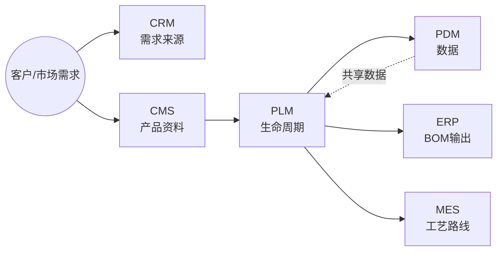
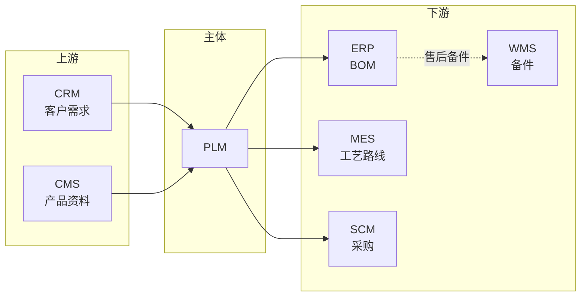
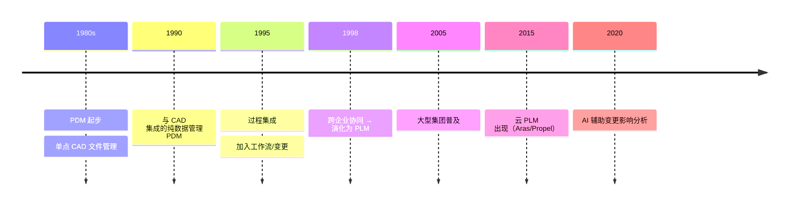

# PLM（Product Lifecycle Management 产品生命周期管理）

> 一句话定位：管理产品从概念、设计、工艺、生产、销售到退役的全生命周期数据与流程的系统，是企业研发数字化的主干。

## 📌 全景图

## 📖 定义

PLM（Product Lifecycle Management 产品生命周期管理）是管理产品从概念、设计、工艺、生产、销售到退役的**全生命周期数据与流程**的系统。它起源于 1980 年代 PDM 的演进，1990 年代末随着跨企业协同需求正式成型。

**与 PDM 的边界**：PLM 是 PDM 的超集。PDM 管「数据」，PLM 管「数据 + 流程 + 资源 + 协同」。简单说，PDM 是档案室，PLM 是带档案室的项目指挥部。

**与 ERP/MES 的边界**：PLM 关注「研发阶段」，输出给 ERP 的 BOM 和 MES 的工艺路线；ERP/MES 关注「生产与运营阶段」，从 PLM 拉取基础数据但不再追溯设计变更。

**PLM 不管的**：客户关系（CRM 管）、仓库作业（WMS 管）、车间执行（MES 管）、财务（ERP 管）。

**在企业 IT 架构中的位置**：PLM 与 ERP、MES、CRM 并列，是制造企业 IT 主干系统之一。从价值链看，PLM 处于「研发创新」环节，是 ERP/MES/SCM/CRM 等系统的源头数据供应者（SoR, System of Record for Engineering Master Data）。

**典型数据量级**：成熟 PLM 系统存储的数据量通常在 **100GB-10TB** 区间（量级参考，取决于产品复杂度与历史积累）。CAD 图纸、BOM、变更记录、技术文档是主要占用项；活跃用户规模从百人到万人不等（典型企业 100-10000+）。

**行业标准与合规背景**：PLM 在受监管行业的实施需要遵循一系列标准：
- **ISO 10303 (STEP)**：产品数据交换的国际标准，是 PLM 与外部 CAD/CAM/CAE 互操作的基石
- **AS9100**：航空航天质量管理体系，对设计历史文件（DHF）有严格要求
- **ISO 9001**：通用质量管理体系，要求文档化、可追溯
- **FDA 21 CFR Part 11**：美国 FDA 对医疗器械电子记录与电子签名的合规要求，PLM 签审流需满足
- **REACH / RoHS / 冲突矿产**：环保与伦理法规要求，PLM 需支持材料声明与追溯

## 🔧 核心能力

- **产品数据中央仓库**：BOM（物料清单）、CAD 图纸、技术文档的版本化存储；支持检入/检出、版本快照、版本对比
- **工程变更管理（ECN/ECO）**：工程变更通知 → 评审 → 实施的完整流程追溯；自动计算下游影响范围（物料/工艺/采购/库存/售后）
- **工作流与审批**：签审流程（设计/工艺/质量多级会签）、电子签名、审批超时升级与代理人机制
- **项目管理**：项目计划（WBS）、里程碑、资源分配、跨部门协作；与产品主数据关联形成「项目-交付物」穿透视图
- **CAD/CAE/CAPP 集成**：与 SolidWorks/CATIA/UG/NX/ProE 等设计工具的双向数据交换；属性映射、版本自动同步、结构树提取
- **配置管理**：基线管理、产品族/变型管理、Option/Choice 规则；支持「按订单配置」（CTO）与「按库存配置」（CTB）场景
- **文档与知识产权**：技术资料的权限管理、归档、检索、合规留痕；支持密级分级（公开/内部/秘密/机密）

- **质量数据管理（QDM）**：与 QMS（质量管理系统）双向数据流；承载 APQP（先期产品质量策划）与 PPAP（生产件批准程序）的全过程文档（控制计划、FMEA、检验报告）
- **产品成本管理**：target costing（目标成本法）、should-cost 分析；与 ERP 成本核算接口，为设计阶段的成本优化提供决策依据
- **法规与合规**：REACH / RoHS / 冲突矿产等环保与伦理法规的材料声明与追溯；汽车行业的 ELV 指令、医疗的 UDI 标识
- **供应商协同门户**：与外部供应商的设计数据交换（受控的 VPM/VPD, Virtual Product Model/Data）；支持 NDA 签署、时效访问、水印与下载审计
- **数字主线（Digital Thread）**：与 IoT/数字孪生的接口；现场运行数据回流到 PLM 形成「设计-制造-服役-反馈」闭环
- **移动端**：现场工程师的图纸/SOP 移动查阅、签审、扫码追溯；解决「车间或工地无 PC 工位」场景
- **AI 辅助**：GenAI 生成设计文档初稿、AI 检索相似零部件（视觉/语义双模态）、BOM 智能校验、变更影响预测

按企业关注度排序，最常被列为「核心采购理由」的前 5 项是：BOM 中央仓库、ECN/变更管理、CAD 集成、工作流审批、配置管理。其余能力（QDM/成本/法规/协同/AI）是成熟企业 PLM 的延伸价值，初级部署通常以可选项形式引入。

**能力成熟度分级**（参考行业咨询框架）：
- **L1 基础**：文档管理、BOM 管理、版本控制
- **L2 标准**：变更管理、工作流、CAD 集成
- **L3 高级**：项目管理、配置管理、多组织协同
- **L4 卓越**：供应商协同门户、数字主线、AI 辅助
- **L5 生态**：跨企业联邦、与 IoT/数字孪生的实时数据回流

## 🏭 典型场景

- **汽车新车型研发**：3-5 年项目周期，数千个零部件跨部门协作，PLM 是协同主干
- **电子产品多代演进**：智能手机年度迭代，PLM 管理外观/结构/BOM 的版本演进
- **工程变更（ECN）全流程追溯**：当某个零部件需要变更时，从设计 → 评审 → 通知生产 → 库存处理 → 售后追溯
- **跨企业协同**：主机厂与 Tier1/Tier2 供应商共享设计数据（受控的外部访问）
- **行业合规**：医疗器械 FDA 510(k)、航空 AS9100 的设计历史文件（DHF）管理

- **离散装备制造（机床/工程机械）**：长生命周期（10+ 年）备件追溯。**痛点**：一台机床售出 15 年后客户报修，售后工程师需快速定位出该机型的具体配置版本、对应图纸、当时使用的物料批次，否则只能现场测绘延误维修。**方案**：PLM 建立「销售配置快照」与「售后备件 BOM」反向追溯链，物料停产提前 2 年预警替换件。**效果**：售后响应时间从 72 小时缩短到 4 小时，备件齐套率提升 30%+。

- **建筑工业化（PC 构件/装配式建筑）**：设计-工厂-工地协同。**痛点**：预制构件（PC 构件）在设计院完成深化设计后，工厂生产与工地吊装分属不同单位，常因图纸版本不一致导致构件到场后无法安装。**方案**：PLM 作为深化设计-工厂生产-工地施工的统一数据源，构件二维码承载图纸版本、生产时间、安装位置。**效果**：装配率 90%+ 的项目工地返工率从 8% 降到 1% 以内。

- **船舶/海洋工程**：超大型项目（5+ 年）跨设计院/船厂/船东协同。**痛点**：一艘大型 LNG 船设计涉及 10+ 设计院分段设计、3 家船厂建造、船东 100+ 次审图意见，靠邮件与共享盘协同极容易版本错乱。**方案**：PLM 提供分段级权限隔离、跨企业受控访问、变更意见-图纸-再发布闭环。**效果**：单船设计变更周期从平均 14 天缩短到 5 天，图纸错误率下降 60%。

- **新能源（风电/光伏）**：产品迭代快 + 售后备件 20 年追溯。**痛点**：风机机型每 2-3 年迭代一代，但早期机型的备件需保障 20 年服务期，老型号物料停产时若无追溯，新机型兼容件无法快速确定。**方案**：PLM 维护「机型-物料-供应商-停产-替代件」全链视图，预警 5 年滚动替换计划。**效果**：风电整机厂平均备件可用率 95%+，售后收入贡献率从 8% 提升到 18%。

**场景共性规律**：以上 9 个场景虽行业不同，但都呈现三个共性：
1. **数据是协作瓶颈**：跨部门/跨企业/跨生命周期的协同本质上都是「数据流转」问题
2. **变更可追溯是底线**：每个场景对「为什么这样设计」「当时为什么这样改」都有合规或追溯诉求
3. **PLM 是「工程主数据」载体**：PLM 不直接创造业务价值，但承载所有工程数据；选错 PLM 等于「数字底座打歪」，后续修代价巨大

## 🔗 上下游关系

- **上游**：CRM（市场需求输入）、CMS（产品资料/技术文档输入）
- **下游**：ERP（PBOM/MBOM 输出）、MES（工艺路线输出）、SCM（采购物料）、WMS（售后备件）
- **横向**：PDM（数据子集）、QMS（质量数据双向同步）、CAD/CAE/CAPP（设计工具）

**集成要点**：PLM 是研发主数据源，ERP/MES 通常以 PLM 为 BOM 唯一来源（避免双维护）。

## ⚖️ 关键考量

- **CAD 兼容性**：选型时优先验证与现有 CAD（SolidWorks/CATIA/UG/ProE）的集成深度，PDM 模块的能力直接决定 PLM 价值
- **数据治理是难点**：版本、权限、签审、归档四件套是实施最大挑战，需要专门的「数据治理经理」角色
- **EBOM → PBOM → MBOM 的转换**：研发 BOM 与生产 BOM 不一致，需要 PLM 提供转换规则（设计部门视角 vs 生产部门视角）
- **变更影响分析**：ECN 触达的下游（ERP 物料、MES 工艺、SCM 在途、WMS 库存）必须自动计算并通知
- **历史数据迁移**：从旧 PDM/Excel 迁移数据是项目最耗时阶段，预算应占项目 30%+
- **组织适配**：PLM 不是工具落地，是研发流程再造，需要 CEO/CTO 级别推动

- **集成接口数量与治理**：典型 PLM 项目需对接 **30-80 个外部接口**（ERP/MES/SCM/QMS/CAD/PDM/HR/BI...），接口治理（IDoc/REST/WebService 选型、字段映射、异常处理、版本兼容）是项目最大成本来源之一。建议建立「接口目录表 + 接口治理委员会」，每个接口指定 Owner 与 SLA。

- **数据所有权归属（RACI）**：PLM vs ERP 谁维护物料主数据？行业没有标准答案，常见做法是「PLM 管工程属性、ERP 管商务属性」，但需要明确 RACI：谁创建、谁修改、谁冻结、谁删除。RACI 缺位时，两边各维护一份物料，半年后对账差异可达 30%。

- **多语言/多币种**：跨国 PLM 部署需支持 **10+ 语言**（UI/文档/搜索），**50+ 币种**（成本核算）。建议选型时验证「翻译工作流」「多语种搜索」是否原生支持，而非依赖二次开发。

- **性能与并发**：千人在线时图纸打开速度需控制在 3 秒内（用户体验阈值）。需要 CDN 加速 + 客户端缓存 + 轻量化预览（JT/3D PDF）策略；同时关注 ECN 审批高峰期的并发签审性能。

- **退役与归档**：产品停产 10 年后数据如何处理？合规留存（医疗器械 DHF 通常保留设备寿命 + 2 年）与成本控制（存储成本/查询性能）矛盾。建议提前设计「冷热分层」：热数据保留完整 BOM 与变更历史，冷数据保留文档快照与索引摘要。

**考量决策清单**：选型/实施 PLM 前，建议在项目立项阶段就以下问题形成正式决议：
- **战略层**：PLM 是研发工具还是数字化转型底座？（决定投入级别）
- **组织层**：谁担任 PLM Sponsor？（CEO/CTO 还是 IT 总监？）谁担任产品数据 Owner？
- **架构层**：私有化部署还是云？数据主权归属？多工厂/多组织的部署模型？
- **流程层**：EBOM→PBOM→MBOM 转换规则的责任人？变更分级策略？
- **合规层**：是否需要 AS9100 / FDA / ITAR 等特定合规？电子签名的法律效力？
- **集成层**：与哪些系统集成？每个接口的 Owner 与 SLA？

## 🎯 选型指南

按企业规模与行业选择：

| 企业类型 | 推荐方向 | 典型组合 |
|---------|---------|---------|
| 大型集团（万人+） | 国际头部 | Siemens Teamcenter / Dassault ENOVIA / PTC Windchill |
| 中型制造（千人+） | 国产/性价比 | 华天软件 InforCenter / 数码大方 CAXA / 艾克斯特 |
| 小型研发（百人） | 轻量 PLM | 部分场景用 PDM + 项目管理工具替代 |
| 电子/高科技 | 强调 EC/CAD 集成 | Agile/PTC + Windchill |
| 汽车/装备 | 强调 BOM/变更 | Teamcenter / ENOVIA |

**自检维度**：
1. 与现有 CAD/CAE/CAPP 是否能深度集成？
2. EBOM→PBOM→MBOM 转换规则是否灵活？
3. ECN 影响分析能否自动触达下游（ERP/MES/SCM）？
4. 多组织/多工厂的权限与数据隔离能力？
5. 历史数据迁移工具的成熟度？

**决策树（文字版）**：建议按以下顺序逐层过滤候选：
1. **先看 CAD 工具**：现有主流 CAD 是什么？（SolidWorks/CATIA/UG/ProE/Autodesk）— 决定 PLM 候选范围（与 CAD 同生态或深度集成）
2. **再看 BOM 复杂度**：单层 vs 多层 vs 变型？是否有配置管理（Option/Choice）需求？
3. **再看行业合规**：是否需要 AS9100 / FDA 21 CFR Part 11 / ITAR / 国军标？— 部分合规需要特定模块或部署形态
4. **再看集成生态**：与现有 ERP/MES/SCM 的集成难度？是否需要供应商协同门户？
5. **最后看预算与 TCO**：5 年总拥有成本（TCO）是否在 ROI 测算范围内？国产 vs 国际成本差距通常 5-10 倍

**RFP 模板要点**：建议 RFP（Request For Proposal）覆盖 **5 大类 30+ 评分项**：
- **功能类（30%）**：BOM 管理、变更管理、CAD 集成、配置管理、项目管理、文档管理、质量管理、成本管理、合规与法规
- **性能类（15%）**：并发用户数、图纸打开响应、ECN 审批吞吐量、大文件（GB 级 CAD 装配体）支持
- **集成类（25%）**：ERP/MES/SCM/QMS 标准接口、REST API 能力、WebService、IDoc/JDE/EDI 支持、集成实施伙伴生态
- **合规类（15%）**：AS9100 / FDA 21 CFR Part 11 / ITAR / ISO 9001 等证书、电子签名、合规审计报告
- **服务类（15%）**：实施方法论、行业最佳实践参考、客户案例、升级策略、SLA 承诺

**POC（Proof of Concept）关键场景**：建议要求候选厂商做 3 个 PoC 场景，验证实际能力而非 PPT：
1. **CAD 集成**：从指定 CAD 创建装配 → 检入 PLM → 修改 → 检出版本对比 → 反向同步到 CAD 全流程
2. **ECN 影响分析**：发起一个变更 → 自动计算触达的下游（ERP 物料、MES 工艺、SCM 在途、WMS 库存、售后文档）→ 通知相关方 → 关闭
3. **BOM 转换**：从 EBOM 通过规则自动生成 PBOM/MBOM → 配置变更 → 重新生成 → 与 ERP 物料对账

**TCO（Total Cost of Ownership）5 年模型**：典型 PLM 项目的 5 年总成本结构：
- **License 许可 30%**：永久许可 + 年维护费，或 SaaS 订阅
- **实施服务 40%**：咨询顾问 + 定制开发 + 数据迁移 + 培训（最大头）
- **运维 20%**：内部运维团队 + 二次开发 + 集成维护
- **升级迁移 10%**：版本升级与硬件扩容（按 5 年 1 次大版本估）

行业经验：License 与实施的比例约 1:1.3，国产 PLM 的实施占比可能更高（行业模板不成熟），SaaS PLM 把 License 与运维合并为订阅费，TCO 测算需重新建模。

## 📜 历史脉络

- **1980s**：CAD/CAM 单点工具 → 信息孤岛
- **1990s**：与 CAD 集成的纯数据管理 PDM（管文档、管图纸）
- **1990s 中期**：加入工作流/变更/项目的过程集成 PDM
- **1990s 末**：跨企业协同 → 正式演化为 PLM 概念（CIMdata 提出）
- **2000s**：Siemens（UGS）、Dassault、PTC 三足鼎立；汽车/航空普及
- **2010s**：SaaS 化（Windchill Cloud、Aras、Propel）；国产崛起（华天/数码大方）
- **2020s**：AI 辅助 ECN 影响分析、BOM 智能校验、GenAI 生成设计文档

## ⚠️ 常见陷阱

- **「买了 PLM 就万事大吉」**：工具落地≠研发流程变革。失败案例 70% 源于组织阻力（设计师不愿把数据搬到系统），需要 CEO/CTO 强推
- **CAD 集成走过场**：很多 PLM 项目在「能否打开 CAD 文件」就结束了，没做属性双向映射、版本自动同步。后果是设计师在 CAD 改完忘记更新 PLM
- **BOM 三态混乱**：EBOM（设计）、PBOM（工艺）、MBOM（生产）三态谁负责维护、转换规则怎么定，没有 rfc 就上线一定乱
- **权限过严导致设计师抵触**：每个文件都要审批 → 设计师回到本地 Excel。需要分级：通用件免审 / 关键件严审
- **ECN 影响分析只算「直接」**：一个电阻变更会影响 BOM/工艺/采购/库存/售后文档，PLM 必须自动算下游影响而不是手动通知
- **历史数据迁完就丢**：迁移工具只导入文件没导入版本历史，几年后没人知道某个老型号的设计意图

- **PLM vs ERP 物料主数据冲突**：**现象**：上线半年后物料对账发现 PLM 与 ERP 物料号 30% 不一致，采购订单经常错发。**根因**：两边各维护一份物料主数据，PLM 工程师认为「我创建后 ERP 应该自动同步」，ERP 维护员认为「PLM 数据不靠谱，我要在 ERP 重做」。**规避**：建立明确 RACI + 唯一数据源原则（One Source of Truth）；PLM 是工程属性 SoR，ERP 是商务属性 SoR，集成接口单向同步（PLM → ERP）。

- **变更频繁触发审批疲劳**：**现象**：日均 50+ ECN 发起，签审人麻木，关键变更漏审。**根因**：变更分级策略缺位，关键变更与微小变更走同一流程。**规避**：建立变更分级（紧急/重要/一般/微小），不同级别不同审批路径；引入「签审 SLA」与「超时升级」机制；关键变更强制多级会签。

- **图纸版本与 BOM 版本不一致**：**现象**：CAD 改了但 BOM 没改，生产按老 BOM 投料，物料不匹配导致停产。**根因**：CAD 检入时未强制同步结构树，设计师「先 CAD 后 BOM」顺序无系统约束。**规避**：PLM 强制 CAD 检入时同步提取 BOM 结构；BOM 发布前必须与 CAD 版本号强校验。

- **跨工厂权限过度集中**：**现象**：A 厂员工能看到 B 厂的保密设计数据，引发数据泄露事件。**根因**：项目初期权限模型设计粗糙，按组织架构粗粒度授权，没有按「项目-数据密级-工厂」三维隔离。**规避**：选型/实施阶段建立「数据所有权矩阵」；权限模型支持「按项目 + 数据密级 + 工厂」三维过滤；定期进行权限审计。

- **云 PLM 数据合规问题**：**现象**：选了 Aras/Propel 等云 PLM 部署在境外，国企/军工客户合同审批时被合规部否决。**根因**：选型时未考虑数据出境与行业合规要求。**规避**：金融/军工/能源/政府等强合规行业优先考虑私有化部署；云 PLM 选型时确认是否有「中国数据中心」选项（AWS 北京/宁夏、阿里云华东等）。

**陷阱共性规律**：行业研究统计 PLM 项目失败率约 **40-60%**，失败原因中：
- 约 **30%** 源自「需求不清」（买了用不起来）
- 约 **25%** 源自「集成不畅」（PLM 与 ERP/MES 数据不通）
- 约 **20%** 源自「组织阻力」（设计师不愿用）
- 约 **15%** 源自「历史数据丢失」（迁移期没保护好）
- 约 **10%** 源自「厂商能力不足」（实施伙伴经验不够）

规避核心：「需求清晰 + 集成优先 + 高层推动 + 数据先行 + 厂商评估」是 5 大前置条件。

## 📚 代表案例

- **某主机厂新车研发**：3 年项目周期，5000+ 零部件，使用 Teamcenter 管理 EBOM/MBOM 转换、ECN 流程、与 MES 的工艺路线下发
- **某消费电子 OEM**：年度迭代产品，使用 Windchill 管理外观/结构/BOM 版本，与 ERP 集成实现「BOM 变更即触发采购变更」
- **某医疗器械公司**：受 FDA 21 CFR Part 11 合规要求，使用 Agile/ENOVIA 管理设计历史文件（DHF），所有签审留痕可追溯
- **某航空装备集团**：AS9100 合规 + 跨企业协同，使用 ENOVIA 与 200+ 供应商共享受控设计数据

- **某风电整机厂**：使用 Windchill 管理 5MW 风机整机设计，覆盖 10 万+ 零部件与 30 年备件追溯。PLM 与 ERP/SCM/售后系统深度集成，实现「物料停产预警 → 替代件推荐 → 售后备件 BOM 自动维护」闭环；机型迭代时复用率 70%+，新机型设计周期从 18 个月缩短到 12 个月。（PTC 公开案例引用）

- **某飞机制造商**：使用 ENOVIA 联邦架构与 50+ 全球供应商共享受控设计数据。供应商通过受控 VPM 访问设计模型，NDA + 时效访问 + 水印审计齐全；变更意见-图纸-再发布闭环覆盖 100+ 并发项目，单架飞机设计协同规模 3000+ 工程师。（达索公开演讲引用）

- **某 PC 构件厂（装配式建筑）**：使用华天 InforCenter 实现「设计 → 工厂 → 工地」三端协同，深化设计图纸直接驱动工厂生产排程与工地吊装计划；每个 PC 构件绑定二维码，扫码可追溯到设计版本、生产批次、安装位置；装配率 90%+ 的项目工地返工率从 8% 降到 1% 以内。（华天公开案例引用）

注：以上为公开演讲/行业报告引用的脱敏案例，具体客户名以厂商公开资料为准。

**案例选型启示**：上述 7 个案例覆盖了 6 个典型行业（汽车/消费电子/医疗器械/航空/风电/PC 构件），从中可归纳三个选型规律：
1. **国际头部 PLM（Teamcenter/ENOVIA/Windchill）**：汽车、航空、医疗等强合规/强协同行业主流选择，案例多见于工业 500 强
2. **国产 PLM（华天/数码大方等）**：装配式建筑、PC 构件、机床等本土场景更接地气，本地化服务响应快
3. **行业垂直 SaaS**：新兴行业（新能源、消费电子）开始出现 SaaS PLM，特点是快速上线、按订阅付费、行业模板丰富

## 🔗 关联链接

- 返回 [01 研发创新](../README.md#01-研发创新) 章节
- 关联系统深读：[PDM 深读](../pdm/README.md)
