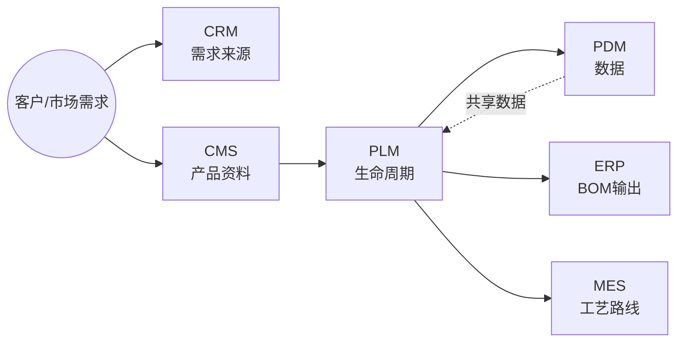
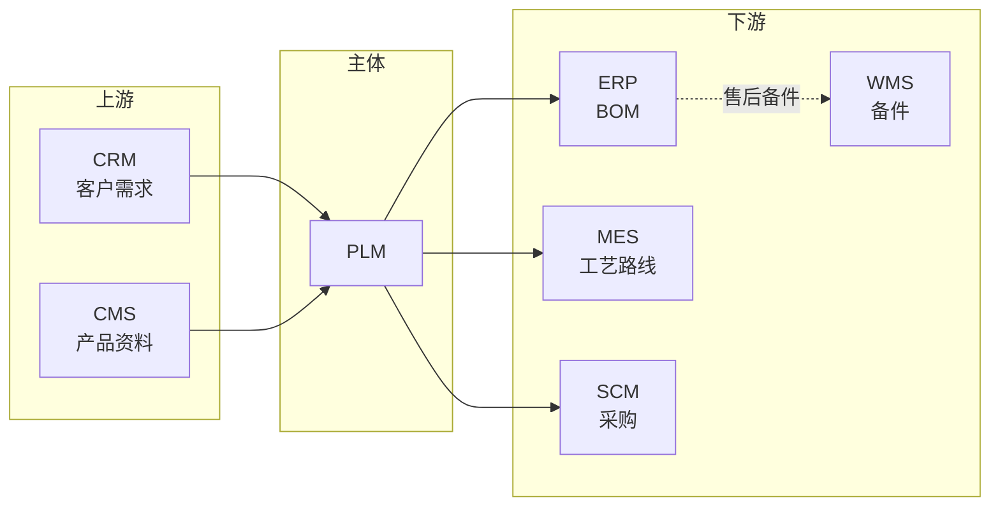
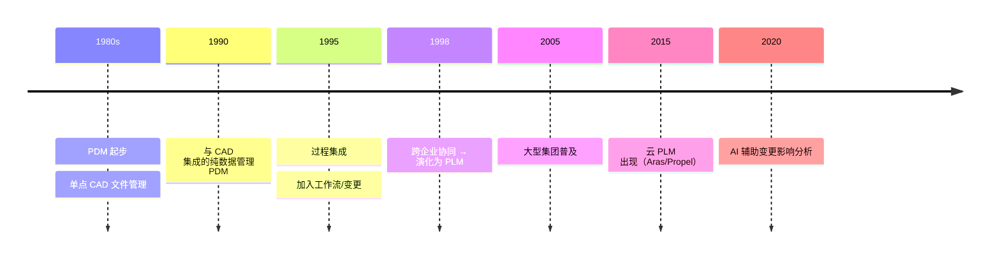

# PLM（Product Lifecycle Management 产品生命周期管理）

> 一句话定位：管理产品从概念、设计、工艺、生产、销售到退役的全生命周期数据与流程的系统，是企业研发数字化的主干。

## 📌 全景图

## 📖 定义

PLM（Product Lifecycle Management 产品生命周期管理）是管理产品从概念、设计、工艺、生产、销售到退役的**全生命周期数据与流程**的系统。它起源于 1980 年代 PDM 的演进，1990 年代末随着跨企业协同需求正式成型。

**与 PDM 的边界**：PLM 是 PDM 的超集。PDM 管「数据」，PLM 管「数据 + 流程 + 资源 + 协同」。简单说，PDM 是档案室，PLM 是带档案室的项目指挥部。

**与 ERP/MES 的边界**：PLM 关注「研发阶段」，输出给 ERP 的 BOM 和 MES 的工艺路线；ERP/MES 关注「生产与运营阶段」，从 PLM 拉取基础数据但不再追溯设计变更。

**PLM 不管的**：客户关系（CRM 管）、仓库作业（WMS 管）、车间执行（MES 管）、财务（ERP 管）。

## 🔧 核心能力

- **产品数据中央仓库**：BOM（物料清单）、CAD 图纸、技术文档的版本化存储
- **工程变更管理（ECN/ECO）**：工程变更通知 → 评审 → 实施的完整流程追溯
- **工作流与审批**：签审流程（设计/工艺/质量多级会签）、电子签名
- **项目管理**：项目计划（WBS）、里程碑、资源分配、跨部门协作
- **CAD/CAE/CAPP 集成**：与 SolidWorks/CATIA/UG/NX 等设计工具的双向数据交换
- **配置管理**：基线管理、产品族/变型管理、Option/Choice 规则
- **文档与知识产权**：技术资料的权限管理、归档、检索、合规留痕

## 🏭 典型场景

- **汽车新车型研发**：3-5 年项目周期，数千个零部件跨部门协作，PLM 是协同主干
- **电子产品多代演进**：智能手机年度迭代，PLM 管理外观/结构/BOM 的版本演进
- **工程变更（ECN）全流程追溯**：当某个零部件需要变更时，从设计 → 评审 → 通知生产 → 库存处理 → 售后追溯
- **跨企业协同**：主机厂与 Tier1/Tier2 供应商共享设计数据（受控的外部访问）
- **行业合规**：医疗器械 FDA 510(k)、航空 AS9100 的设计历史文件（DHF）管理

## 🔗 上下游关系

- **上游**：CRM（市场需求输入）、CMS（产品资料/技术文档输入）
- **下游**：ERP（PBOM/MBOM 输出）、MES（工艺路线输出）、SCM（采购物料）、WMS（售后备件）
- **横向**：PDM（数据子集）、QMS（质量数据双向同步）、CAD/CAE/CAPP（设计工具）

**集成要点**：PLM 是研发主数据源，ERP/MES 通常以 PLM 为 BOM 唯一来源（避免双维护）。

## ⚖️ 关键考量

- **CAD 兼容性**：选型时优先验证与现有 CAD（SolidWorks/CATIA/UG/ProE）的集成深度，PDM 模块的能力直接决定 PLM 价值
- **数据治理是难点**：版本、权限、签审、归档四件套是实施最大挑战，需要专门的「数据治理经理」角色
- **EBOM → PBOM → MBOM 的转换**：研发 BOM 与生产 BOM 不一致，需要 PLM 提供转换规则（设计部门视角 vs 生产部门视角）
- **变更影响分析**：ECN 触达的下游（ERP 物料、MES 工艺、SCM 在途、WMS 库存）必须自动计算并通知
- **历史数据迁移**：从旧 PDM/Excel 迁移数据是项目最耗时阶段，预算应占项目 30%+
- **组织适配**：PLM 不是工具落地，是研发流程再造，需要 CEO/CTO 级别推动

## 🎯 选型指南

按企业规模与行业选择：

| 企业类型 | 推荐方向 | 典型组合 |
|---------|---------|---------|
| 大型集团（万人+） | 国际头部 | Siemens Teamcenter / Dassault ENOVIA / PTC Windchill |
| 中型制造（千人+） | 国产/性价比 | 华天软件 InforCenter / 数码大方 CAXA / 艾克斯特 |
| 小型研发（百人） | 轻量 PLM | 部分场景用 PDM + 项目管理工具替代 |
| 电子/高科技 | 强调 EC/CAD 集成 | Agile/PTC + Windchill |
| 汽车/装备 | 强调 BOM/变更 | Teamcenter / ENOVIA |

**自检维度**：
1. 与现有 CAD/CAE/CAPP 是否能深度集成？
2. EBOM→PBOM→MBOM 转换规则是否灵活？
3. ECN 影响分析能否自动触达下游（ERP/MES/SCM）？
4. 多组织/多工厂的权限与数据隔离能力？
5. 历史数据迁移工具的成熟度？

## 📜 历史脉络

- **1980s**：CAD/CAM 单点工具 → 信息孤岛
- **1990s**：与 CAD 集成的纯数据管理 PDM（管文档、管图纸）
- **1990s 中期**：加入工作流/变更/项目的过程集成 PDM
- **1990s 末**：跨企业协同 → 正式演化为 PLM 概念（CIMdata 提出）
- **2000s**：Siemens（UGS）、Dassault、PTC 三足鼎立；汽车/航空普及
- **2010s**：SaaS 化（Windchill Cloud、Aras、Propel）；国产崛起（华天/数码大方）
- **2020s**：AI 辅助 ECN 影响分析、BOM 智能校验、GenAI 生成设计文档

## ⚠️ 常见陷阱

- **「买了 PLM 就万事大吉」**：工具落地≠研发流程变革。失败案例 70% 源于组织阻力（设计师不愿把数据搬到系统），需要 CEO/CTO 强推
- **CAD 集成走过场**：很多 PLM 项目在「能否打开 CAD 文件」就结束了，没做属性双向映射、版本自动同步。后果是设计师在 CAD 改完忘记更新 PLM
- **BOM 三态混乱**：EBOM（设计）、PBOM（工艺）、MBOM（生产）三态谁负责维护、转换规则怎么定，没有 rfc 就上线一定乱
- **权限过严导致设计师抵触**：每个文件都要审批 → 设计师回到本地 Excel。需要分级：通用件免审 / 关键件严审
- **ECN 影响分析只算「直接」**：一个电阻变更会影响 BOM/工艺/采购/库存/售后文档，PLM 必须自动算下游影响而不是手动通知
- **历史数据迁完就丢**：迁移工具只导入文件没导入版本历史，几年后没人知道某个老型号的设计意图

## 📚 代表案例

- **某主机厂新车研发**：3 年项目周期，5000+ 零部件，使用 Teamcenter 管理 EBOM/MBOM 转换、ECN 流程、与 MES 的工艺路线下发
- **某消费电子 OEM**：年度迭代产品，使用 Windchill 管理外观/结构/BOM 版本，与 ERP 集成实现「BOM 变更即触发采购变更」
- **某医疗器械公司**：受 FDA 21 CFR Part 11 合规要求，使用 Agile/ENOVIA 管理设计历史文件（DHF），所有签审留痕可追溯
- **某航空装备集团**：AS9100 合规 + 跨企业协同，使用 ENOVIA 与 200+ 供应商共享受控设计数据

注：以上为公开演讲/行业报告引用的脱敏案例，具体客户名以厂商公开资料为准。

## 🔗 关联链接

- 返回 [01 研发创新](../README.md#01-研发创新) 章节
- 关联系统深读：[PDM 深读](../pdm/README.md)
