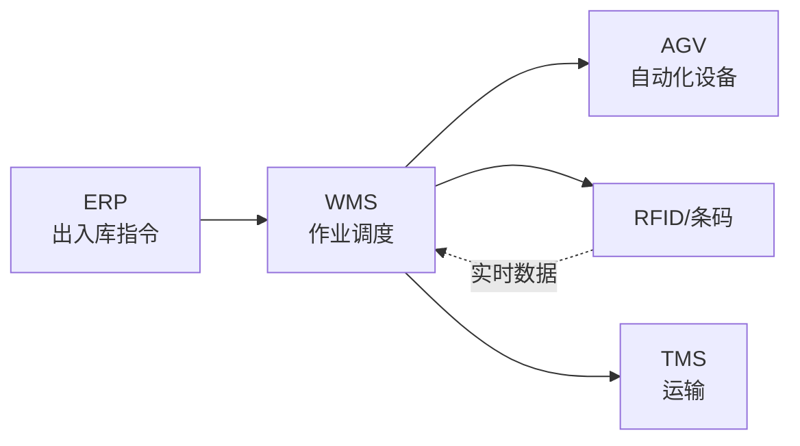
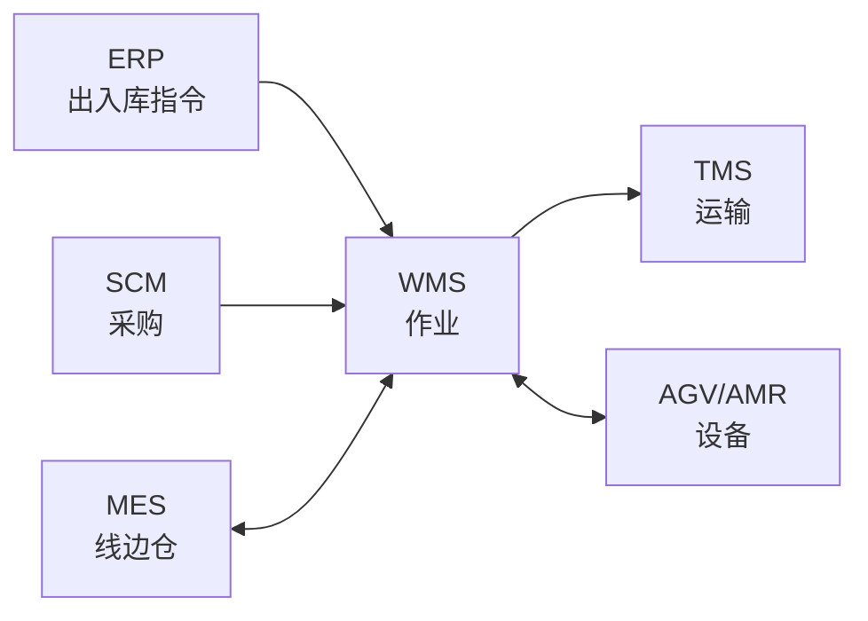

<!--
module:
  parent: application-systems
  slug: application-systems/wms
  type: article
  category: 主模块子文章
  summary: WMS（Warehouse Management System 仓储管理系统） 本应该很简单，一句话定位：管理仓库**作业全流程**的精细化系统，覆盖入库 →...
-->

# WMS（Warehouse Management System 仓储管理系统）

> 一句话定位：管理仓库**作业全流程**的精细化系统，覆盖入库 → 上架 → 存储 → 拣选 → 出库 → 盘点 → 退库的完整作业链，是仓储数字化的"调度中枢"。

## 📌 全景图

## 📖 定义

WMS（Warehouse Management System 仓储管理系统）是管理**仓库作业全流程**的精细化系统，覆盖入库 → 上架 → 存储 → 拣选 → 出库 → 盘点 → 退库的完整作业链。

**与 ERP/SCM 的边界**：
- ERP 管「库存数量」，WMS 管「仓库作业」
- SCM 管「采购/供应链计划」，WMS 管「实物执行」
- TMS 管「运输」，WMS 输出「待发运」给 TMS

**WMS 管什么**：库位（仓位/货架/库区）、批号、序列号、作业任务（入库单/出库单/盘点单）、设备（RF/AGV/堆垛机）

**WMS 不管的**：库存金额（ERP）、运输（TMS）、采购订单（SCM/ERP）

**在企业 IT 架构中的位置**：WMS 与 ERP、MES、TMS 并列，是供应链与制造企业的"执行层"系统之一。WMS 处于"作业调度层"，向上承接 ERP（库存数量/出入库指令），向下指挥 AGV/AMR/堆垛机（自动化设备），横向与 TMS（待发运）海关（保税仓）协同。Gartner 将 WMS 归为"供应链执行（SCE, Supply Chain Execution）"的核心，与 ERP 的"供应链计划（SCP）"形成镜像——ERP 算"该不该进出多少"，WMS 落地"怎么进出最有效率"。

**典型数据量级**：成熟 WMS 系统的核心数据通常在 **200GB-20TB** 区间（量级参考，取决于仓库规模与 SKU 数）。库存流水（出入库/移库/盘点）、库位主数据、波次/任务数据是主要占用项；活跃用户从几十人到上千人（典型中小仓库 50-200，大型集团 3PL 1000-10000）。日均出入库单据在 1 万-100 万级（电商仓库峰值更高），SKU 数从千级到百万级（电商/医药行业）。WMS 数据的"实时性"要求远高于 ERP（秒级响应拣货路径），对数据库性能与缓存要求高。

## 🔧 核心能力

- **入库管理**：采购入库、退货入库、调拨入库、ASN（提前发货通知）预约
- **上架策略**：按库容/动销率/批次的智能上架规则
- **库存管理**：批次/序列号/有效期管理、库间调拨、锁定/解锁、库存冻结
- **出库管理**：销售出库、调拨出库、领料出库、生产补货
- **拣选策略**：波次拣选、合并拣选、边拣边分、灯光拣选
- **盘点管理**：循环盘点、动态盘点、年度大盘，支持 RF/PDA
- **库位管理**：立体库/平面库、冷库/危险品库、库位编码规则
- **设备集成**：RF 手持、条码/PDA、电子标签、AGV/AMR、堆垛机、输送线

**库位管理是 WMS 的"灵魂"**：库位编码是 WMS 与进销存软件的"分水岭"：
- **库位编码四段式**：库区-货架-层-位（如 A-03-02-15 表示 A 区 3 号货架 2 层 15 位）
- **库位属性**：存储类型（存储/拣货/暂存/不良品）、温湿度要求（常温/冷藏/冷冻）、商品属性限制（重量/尺寸/危险品）
- **库位策略**：固定库位 vs 随机库位 vs 分类库位（按动销率分 ABC）
- **立体库库位**：堆垛机巷道、货架深度、货位坐标 X-Y-Z，WMS 与 WCS（仓库控制系统）实时调度
- **经验值**：没有库位编码的 WMS = 高级进销存，库容利用率仅 50%；有库位编码可提升到 80%+

**批次/序列号/效期管理"三重追溯"**：医药/食品/3C/汽车行业的合规要求：
- **批次管理（Batch/Lot）**：同批次物料共同属性（生产日期/供应商/批次号），用于正向/反向追溯
- **序列号管理（Serial Number）**：每件物料唯一序列号，用于单品追溯（医疗器械 UDI/汽车 VIN/3C IMEI）
- **效期管理（Expiration Date）**：药品/食品/化工有有效期，FIFO（先进先出）/FEFO（先到期先出）
- **冻结与锁定**：质量异常时整批/单件冻结，禁止出入库
- **合规价值**：召回场景从"天级"缩到"小时级"，GSP/FDA/HACCP 审计一次通过

**拣选策略"四种模式"**：拣选效率直接影响仓库产能：
- **按单拣选（Discrete Picking）**：一张订单走一次仓库，路径长、效率低，适合小批量
- **批量拣选（Batch Picking）**：多张订单合并拣选，到分拣区分拨，效率提升 3-5 倍
- **波次拣选（Wave Picking）**：按时间窗口/路线/优先级生成波次，下单到拣货 SLA 严格
- **边拣边分（Pick & Pass / Put Wall）**：边拣边按订单分播，节省分拣时间，适合电商
- **灯光拣选（Pick-to-Light）**：电子标签亮灯指引，新人 5 分钟上手，差错率 <0.1%
- **机器人拣选（Goods-to-Person）**：AGV/AMR 把货架搬到人工面前，效率提升 5-10 倍

**设备集成的"硬件生态"**：现代 WMS 是"软件 + 硬件"协同系统：
- **RF 手持 / PDA**：扫码 + 屏幕交互，仓库作业员"主力武器"
- **条码 / RFID**：一维/二维码为主，RFID 用于整托盘/高价值单品
- **电子标签（Pick-to-Light / Put-to-Light）**：灯光 + 数字显示，引导拣货/上架
- **AGV / AMR**：自动导引车 / 自主移动机器人，搬运货架或料箱
- **堆垛机（Stacker Crane）**：立体库核心设备，与 WMS + WCS 协同
- **输送线（Conveyor）/ 分拣机（Sorter）**：电商履约中心的"流水线"
- **WCS（Warehouse Control System）**：仓库控制系统，WMS 下发任务、WCS 控制设备执行

**盘点管理"四种方式"**：库存准确率是 WMS 的"生命线"：
- **循环盘点（Cycle Count）**：每天盘 100-500 SKU，A 类高频、B/C 类低频
- **动态盘点（Dynamic Count）**：出入库过程中自动触发盘点（无感盘点）
- **年度大盘（Annual Count）**：全库停业盘点，财年结账前
- **盲盘（Blind Count）**：盘点员只看到库位号不看到 SKU/数量，避免先入为主
- **差异处理**：盘点差异 → 复盘 → 调账 → 责任追溯
- **经验值**：盲盘 + 循环盘点 = 库存准确率 99.5%+，传统月度盘点 95% 已是极限

## 🏭 典型场景

- **电商仓库**：高 SKU、高订单量、强时效要求，WMS + AGV 自动化设备组合
- **制造业线边仓**：与 MES 联动，按工单配送物料到工位
- **冷链/危险品**：温湿度监控、合规追溯、批次严格管控
- **跨境保税仓**：与海关系统对接，三单对碰（订单/运单/支付单）
- **医药/医疗器械**：GSP/FDA 合规、批号追溯、效期管理
- **汽车售后备件**：序列号管理、跨多级仓库（中央 DC → 区域 RDC → 经销商）调拨

**两种部署**：
- **传统 WMS（本地）**：深度定制、与立体库/AGV 集成（曼哈顿/科箭/富勒）
- **云 WMS**：订阅式，快速上线（巨沃/快仓/海外 ShipBob）

**典型场景详解**：

- **电商履约中心（日发百万单）**：**痛点**：SKU 50 万+、日出库 100 万单、618/双 11 峰值是日常 10 倍；传统人工拣选无法支撑时效承诺（24h/48h 发货）。**方案**：WMS + AGV 搬运机器人 + 灯光拣选 + 输送线分拣机；按波次分单、智能路径规划、自动化设备调度。**效果**：日出库从 10 万单提升到 100 万单，拣选准确率 99.99%，人工减少 50%。**典型企业**：京东"亚洲一号"、菜鸟、亚马逊 FBA。

- **制造业线边仓（JIT 配送）**：**痛点**：汽车/电子总装线，300+ 工位、上千 SKU，线边仓配送错一件就停线；传统"领料制"效率低、错料率高。**方案**：WMS 与 MES 深度集成，MES 下发工单 → WMS 按工单生成拣货任务 → AGV/PTL（灯光拣选）按工位配送 → 扫码亮灯确认。**效果**：线边仓面积减少 60%，错料率从 2% 降到 0.05%，停线时间从月均 4 小时降到 0.5 小时。**典型企业**：上汽/广汽/富士康/比亚迪。

- **冷链/危险品仓库（合规追溯）**：**痛点**：生鲜/疫苗/化工原料，温湿度敏感、批次追溯严、合规审计（GSP/HACCP/危化品许可证）。**方案**：WMS 集成温湿度传感器（实时报警）、批次+效期强制管控、危化品双人双锁、出入库扫码+称重复核。**效果**：温湿度异常 5 分钟内报警，批次追溯 30 分钟内完成，危化品零事故。**典型企业**：国药控股、顺丰冷运、中粮。

- **跨境保税仓（海关三单对碰）**：**痛点**：跨境电商保税备货模式，订单/运单/支付单必须与海关系统对碰，碰失败就扣货；商品备案、库存限量、消费者实名。**方案**：WMS 与海关系统对接（电子口岸），批次+SKU+消费者身份证三单实时对碰；限量管理（超量自动锁定）、正面清单管控。**效果**：三单对碰成功率 99.9%，通关时效 24h → 2h，零扣货事故。**典型企业**：天猫国际、京东国际、网易考拉。

- **医药/医疗器械（GSP/FDA 合规）**：**痛点**：GSP（药品经营质量管理规范）要求药品全程可追溯、效期严格管控、近效期先出；医疗器械 UDI 唯一器械标识 FDA 强制。**方案**：WMS 强批次+强效期+FEFO（先到期先出）、UDI 序列号管理、上下游追溯（从患者 → 经销商 → 生产商）。**效果**：合规审计一次通过率 100%，召回场景 24 小时内定位患者，库存周转提升 25%。**典型企业**：国药控股、华润医药、九州通。

- **汽车售后备件（多级 DC 调拨）**：**痛点**：汽车售后备件 SKU 50 万+（一辆车 3 万零件），3 级仓库（中央 DC → 区域 RDC → 经销商）调拨复杂；序列号管理严格（召回定位到具体车辆 VIN）。**方案**：WMS 多仓多组织架构，按车型/车系/年份智能分仓，序列号贯穿全链路；调拨审批流 + 经销商可视化库存。**效果**：经销商配件满足率 95%+，紧急订单 4 小时达，召回定位 30 分钟内完成。**典型企业**：博世/电装/上汽通用售后。

- **三方物流 3PL（多货主管理）**：**痛点**：3PL 仓库服务多货主，每货主有独立 SKU/批次/计费规则/报表；混仓存储容易串货、计费复杂。**方案**：WMS 多货主架构（每个货主独立数据域 + 库位分区 + 计费引擎），按货主独立出入库/独立盘点/独立报表。**效果**：货主数量 100+ 同仓运营零串货，计费自动化率 95%+，货主自助查询门户。**典型企业**：京东物流、安得智联、嘉民物业。

**「传统 WMS vs 云 WMS」部署决策**：WMS 部署形态不是"谁更好"，而是"谁更适合"：
- **传统 WMS 优势**：深度定制（行业场景）、设备集成（AGV/立体库）、数据自主可控（合规安全）
- **传统 WMS 劣势**：初始成本高（License + 实施）、上线慢（12-18 个月）、升级痛苦（5 年一次）
- **云 WMS 优势**：初始成本低（订阅式）、上线快（1-3 个月）、迭代快（季度版本）
- **云 WMS 劣势**：定制能力弱（受厂商产品限制）、数据在云端（合规风险）、设备集成弱
- **决策阈值**：立体库 + AGV + 行业定制 → 传统 WMS；标准化业务 + 预算紧 + 快上线 → 云 WMS
- **混合模式**：核心仓储本地部署 + 电商履约云端部署（"核心本地 + 边缘云"）

**场景共性规律**：以上 7 个典型场景虽形态不同，但呈现三个共性：
1. **作业效率是核心价值**：从"账实相符"到"高效流转"是 WMS 的根本变革，所有场景都在解决"作业效率"问题
2. **设备集成是分水岭**：与 AGV/RFID/堆垛机的深度集成决定 WMS 的"硬实力"；纯软 WMS 在电商/制造业越来越难生存
3. **合规与效率并重**：医药/食品/危化品的 WMS 投入由合规驱动，效率提升是附加价值

**「WMS 选型先看设备」的选型逻辑**：WMS 选型最常被忽略的维度是"设备适配性"：
- **场景 1：电商 + AGV** → 选支持 AGV 调度的 WMS（巨沃/快仓/海外 Locus Robotics）
- **场景 2：制造业 + 立体库** → 选支持 WCS 对接的 WMS（曼哈顿/科箭/富勒/兰剑）
- **场景 3：医药 + GSP** → 选批次/效期强的 WMS（普罗格/巨鼎/国内 SAP 行业版本）
- **场景 4：跨境保税** → 选海关对接经验的 WMS（店小秘/领星 + 海关接口经验）
- **场景 5：3PL 多货主** → 选多货主架构的 WMS（海外 Manhattan SCALE/国内 巨沃/C-WMS）
- **选型陷阱**：纯做进销存的"WMS"在立体库/AGV/合规场景直接淘汰

## 🔗 上下游关系

- **上游**：ERP（采购入库/销售出库指令）、SCM（采购计划）、MES（线边仓补货）
- **下游**：TMS（待发运指令）、AGV/AMR（自动化设备调度）
- **横向**：海关（保税仓对接）、财务（库存估值）

**集成核心**：WMS 是「作业执行中枢」，90% 的库存流水由 WMS 产生，ERP/MES/CRM/TMS 都需要与 WMS 双向同步库存数据

**上下游集成详解**：

- **WMS ↔ ERP（库存/单据同步）**：ERP 下发采购入库单/销售出库单 → WMS 接收并生成作业任务；WMS 实时回传实际出入库数据 → ERP 更新库存账面。**集成模式**：紧耦合（中间表 + 实时消息）或 iPaaS 平台；异常处理（单据状态不一致）是核心难点
- **WMS ↔ MES（线边仓/完工入库）**：MES 下发工单/领料单 → WMS 按工单生成拣货任务配送到工位；WMS 回传完工入库数据 → MES 触发质量检验。**集成模式**：紧耦合（按工单级同步）；JIT/VIM 拉动是核心场景
- **WMS ↔ TMS（待发运衔接）**：WMS 完成出库拣货 → 生成待发运清单 + 交接单 → TMS 接单调度运力；TMS 回传签收数据 → WMS 完成出库确认。**集成模式**：紧耦合（按订单/运单同步）；交接环节的"账实一致"是核心
- **WMS ↔ AGV/AMR（设备调度）**：WMS 下发搬运任务（入库上架/出库拣货/库间移库）→ AGV/AMR 执行；AGV/AMR 回传任务状态与异常报警。**集成模式**：紧耦合（REST API + 消息队列）；WCS（仓库控制系统）是中间层
- **WMS ↔ 海关（保税仓对接）**：WMS 出入库数据 → 海关电子口岸三单对碰（订单/运单/支付单）；碰成功才放行。**集成模式**：专线 + 报文（XML/EDI）；限量管理与正面清单是核心
- **WMS ↔ 财务（库存估值）**：WMS 库存流水 → 财务系统按月加权平均/先进先出计算库存金额。**集成模式**：松耦合（定时批处理）；批次/库位维度的成本核算复杂

**「WMS 是库存数据中心」的集成架构**：WMS 处于"库存数据中心"位置——库存数量中枢（ERP 账面库存与 WMS 实物库存差异是核心问题）、作业执行中枢（出入库/移库/盘点全部由 WMS 产生）、设备调度中枢（AGV/堆垛机/输送线全部由 WMS 调度）。

**集成模式选择**：紧耦合（实时双向同步）/ 消息队列（Kafka/RabbitMQ 异步）/ 中间库（Staging Table）/ iPaaS 平台（RESTful）/ 海关专线（EDI/XML）。

**「库存账实一致」的集成质量度量**：WMS 与 ERP 集成的"成败"在"账实一致率"：
- **账实一致率 = 1 - (WMS 库存与 ERP 库存差异 / ERP 库存总金额)**
- **行业基线**：成熟 WMS 账实一致率 99%+；差 1 元也要查明（盘亏盘盈责任追溯）
- **差异来源**：单据状态不同步 + 库位移动未更新 + 盘点差异未处理 + 退货流程缺失
- **建议**：WMS 与 ERP 集成做"日结对账"（每天凌晨比对库存，差异报警）

## ⚖️ 关键考量

- **业务模式决定 WMS 形态**：B2B 整箱、B2C 拆零、电商、制造业线边仓，WMS 设计差异巨大
- **库位编码是核心**：没有科学的库位编码，WMS 沦为进销存。建议「库区-货架-层-位」四段编码
- **设备投资 vs 软件投资比例**：自动化仓库硬件投资是软件的 5-10 倍，软件选型要配合硬件规划
- **波次策略影响效率**：FIFO/FEFO/按单拣选/批量拣选，错误策略导致拣选路径翻倍
- **批次管理 vs 库位管理**：批次/序列号管理是医药/食品合规前提，没设计就上线 = 召回时找不到货
- **退货与异常处理**：退货流程、破损调账、差异处理占 WMS 工作量 30%，流程设计要预留

**「业务模式决定 WMS 形态」的认知陷阱**：WMS 选型最大的陷阱是"通用化思维"。**现象**：某快消品企业选了"通用 WMS"，结果 B2B 整箱出库效率极低（B2B 一次 1 万件，整托盘整箱不需要拆零），员工继续用 Excel。**根因**：B2B 整箱 vs B2C 拆零 vs 电商 vs 制造业线边仓的 WMS 设计差异巨大，通用 WMS 哪边都不精。**规避**：选型前明确"主业务模式"（B2B/B2C/电商/制造），选 3 个同行业案例最多的厂商。

**「库位编码是核心」的编码陷阱**：库位编码是 WMS 的"基础建设"，缺失则系统沦为"高级进销存"。**现象**：某企业 WMS 上线 3 个月后发现 30% 库位无编码或编码错误，库容利用率仅 50%（应能 80%+）。**根因**：上线前没做库位规划（库区划分/货架编号/库位属性）。**规避**：WMS 上线前 3-6 个月启动库位规划——库区-货架-层-位四段编码 + 库位属性（温湿度/危险品/重量）+ 库位策略（固定/随机/分类 ABC）；编码规则一旦发布全员遵守。

**「硬件投资 5-10 倍于软件」的预算陷阱**：自动化仓库的硬件投资是软件投资的 **5-10 倍**。**现象**：某企业只预算 200 万 WMS 软件，结果 AGV 设备 1500 万、立体库货架 800 万、堆垛机 600 万、输送线 400 万，总投入 3500 万，超预算 17 倍。**根因**：选型时只看到软件 License，忽略硬件投资。**规避**：WMS 项目立项时做"软硬一体预算"——软件 10-15% + 硬件 60-70% + 实施 15-20% + 运维 5%；硬件投资 5 年 TCO 测算。

**「波次策略影响效率」的策略陷阱**：拣选策略直接决定仓库作业效率，错误策略导致"拣选路径翻倍"。**现象**：某电商仓库按订单逐单拣选（每单走全仓），工人日行 30 公里；设计波次后缩到 5 公里，效率提升 6 倍。**根因**：按单拣选适合小批量 + 低频次，电商高频次必须用波次/批量/边拣边分。**规避**：WMS 上线前做"拣选策略设计"——按单/批量/波次/边拣边分 + FIFO/FEFO + 灯光拣选/AGV 配合；用仿真工具验证策略效率。

**「批次管理是合规前提」的医药陷阱**：批次/序列号管理是医药/食品/3C/汽车行业的"合规底线"，没设计就上线等于"召回时找不到货"。**现象**：某食品企业上线 WMS 但没做批次管理，一次质量投诉用了 3 天才定位到原料供应商，损失扩大 10 倍。**根因**：批次管理是"前置条件"——必须在 WMS 上线前 12 个月定义批次规则（批次号规则/批次属性/追溯粒度）。**规避**：医药/食品/3C/汽车行业 WMS 上线前 6-12 个月启动批次规则设计 + 主数据治理；批次/序列号贯穿"采购入库 → 生产 → 销售出库"全链路。

**「退货与异常处理」的流程陷阱**：退货/破损/差异处理占 WMS 工作量的 **30%**，流程设计不预留就是"上线后补救"。**现象**：某企业 WMS 上线时只考虑"正向流程"（入库 → 出库），退货时工人手工填单，3 个月后库位与系统对不上，差异 20%。**根因**：退货流程是 WMS 的"边缘场景"，选型时被忽略；上线后又没预留。**规避**：WMS 设计阶段把"逆向流程"作为核心模块——退货入库（与原库位解绑）/ 破损调账（成本中心归属）/ 差异处理（盘亏盘盈责任追溯）；流程设计占比 20-30%。

**「云 WMS 选型」的部署陷阱**：云 WMS 听起来美好，但有"四个边界"。**现象**：某 3PL 企业选了某头部云 WMS，上线后发现：①不能集成客户 ERP ②不能对接 AGV ③不能做行业定制（医药批次）④数据合规问题。**根因**：云 WMS 的"标准化"是双刃剑——标准化带来低成本，但行业场景/设备集成/数据合规都受限。**规避**：云 WMS 选型先确认"边界"——能否集成自有 ERP/MES？能否对接 AGV/立体库？能否做行业定制（医药/快消/制造）？数据存储位置？满足不了就不要勉强。

**「WMS = 进销存」的认知陷阱**：很多企业把 WMS 当成"高级进销存"，结果上线后发现"作业效率没提升、工人仍手工"。**现象**：某企业花了 200 万上 WMS，结果工人继续用纸质单据拣货，WMS 只是"事后录入"。**根因**：WMS 是"作业调度系统"不是"数据记录系统"——设计时围绕"作业"而非"单据"（库位/路径/批次/设备）。**规避**：WMS 设计以"作业"为主线——入库作业/上架作业/拣货作业/盘点作业；每种作业有明确的"任务生成 → 任务分配 → 任务执行 → 任务反馈"闭环。

**「WMS 选型看品牌」的选型陷阱**：WMS 选型最常被忽略的"同行业案例"。**现象**：某医药企业选了某国际品牌 WMS（不熟悉中国 GSP），3 年后 GSP 审计发现批次追溯不达标，损失 500 万。**根因**：国际 WMS 强在国际化/标准化，但医药 GSP/快消促销/电商大促等中国场景的 Know-how 弱。**规避**：WMS 选型"同行业案例 ≥ 5 个"是基本门槛——医药看普罗格/巨鼎、电商看巨沃/快仓、3PL 看曼哈顿 SCALE/海外 ShipBob、跨境看店小秘/领星。

**考量决策清单**：选型/实施 WMS 前建议在项目立项阶段就以下问题形成正式决议：
- **战略层**：WMS 是"仓储执行系统"还是"高级进销存"？（决定投入级别与厂商选择）
- **业务层**：B2B/B2C/电商/制造？主业务模式决定 WMS 形态
- **设备层**：是否立体库？AGV/堆垛机/输送线？硬件投资 5-10 倍于软件
- **数据层**：库位编码规则？批次/序列号/效期管理？主数据治理先行
- **集成层**：与 ERP/MES/TMS/海关的接口？账实一致率目标 99%+？
- **组织层**：作业流程标准化？退货流程预留？作业员培训？
- **预算层**：License + 硬件 + 实施 + 3 年运维的 TCO？硬件投资占比 60-70%？

## 🎯 选型指南

| 行业 | 推荐 | 理由 |
|------|------|------|
| 大型集团（多 DC） | 曼哈顿 / 科箭 / 富勒 | 多组织、多仓库、深度定制 |
| 电商（国内） | 巨沃 / 马帮 / 店小秘 | 强电商场景、快迭代 |
| 跨境电商 | 店小秘 / 领星 | 多平台对接、FBA 退货 |
| 制造业（立体库） | 科箭 / 富勒 / 兰剑 | 与立体库/AGV 深度集成 |
| 医药（合规） | 普罗格 / 巨鼎 | GSP 合规、批次追溯 |
| 中小（轻 WMS） | 管家婆 / 速达 | 简单易用、成本低 |

**自检维度**：
1. 同行业案例（5 个以上）
2. 设备集成能力（AGV/RF/条码）
3. 多仓多组织支持？
4. 批次/序列号/效期管理？
5. 云 vs 本地部署？

**红线**：
- 无同行业案例 = 慎选
- 不支持批次管理 = 医药/食品慎选
- 不能与硬件集成 = 自动化仓慎选

**选型方法论（六步法）**：WMS 选型是企业级决策，建议按"六步法"系统推进：

1. **战略对齐（Step 1）**：明确"WMS 解决什么业务问题"——是账实一致？作业效率？行业合规？设备集成？目标不同，选型方向不同
2. **行业调研（Step 2）**：调研同行业（5 家以上）WMS 案例——同行业 WMS 的成熟度决定实施风险；优先选择"行业最佳实践沉淀深"的厂商
3. **厂商初筛（Step 3）**：根据企业规模/行业/部署偏好初筛 3-5 家候选——重点看"行业版本成熟度" + "设备集成案例数"
4. **RFP 招标（Step 4）**：发 RFP（Request For Proposal）——覆盖 5 大类 30+ 评分项（功能 30% + 性能 15% + 集成 25% + 设备 15% + 服务 15%）
5. **POC 验证（Step 5）**：要求候选厂商做 3 个 PoC 场景——验证实际能力而非 PPT：①入库上架 + 库位推荐 ②波次拣选 + 路径优化 ③AGV 调度 + 设备集成
6. **商务谈判（Step 6）**：TCO 测算 + 实施周期 + 硬件投资 + 续费条款 + 数据迁移方案

**RFP 模板要点**：建议 RFP 覆盖 **5 大类 30+ 评分项**：
- **功能类（30%）**：入库/出库/库存/盘点/库位/批次/序列号/效期
- **性能类（15%）**：并发 500-5000+、扫码响应 <1 秒、拣货路径计算 <500ms、千万级流水秒级响应
- **集成类（25%）**：ERP/MES/TMS 标准接口、REST API/EDI/IDoc、消息队列、海关接口、银企直联
- **设备类（15%）**：AGV/AMR/堆垛机/输送线/RFID/PDA/电子标签的标准对接与开放 API
- **服务类（15%）**：行业经验、顾问稳定性（核心 >3 年）、SLA（99.9% 可用性）、硬件集成合作伙伴生态

**POC 关键场景**：3 个 PoC 验证：①入库上架 + 库位推荐（按 SKU 动销率/批次/温湿度智能推荐库位）②波次拣选 + 路径优化（按订单生成波次 + 最短路径 + 边拣边分）③AGV 调度 + 设备集成（WMS 下发任务 → AGV 执行 → 状态回传）。

**TCO 估算要点**（10000 SKU 中型仓库 5 年 TCO）：传统 WMS（曼哈顿/科箭）1000-3000 万（软件 License 20% + 实施 25% + 硬件 40% + 运维 10% + 升级 5%）；国产 WMS（巨沃/富勒）300-800 万；云 WMS（巨沃云/快仓）100-300 万/年；自研 WMS 1500-5000 万。**决策阈值**：TCO < 业务价值的 30% 是合理投入。

**国际 vs 国产 WMS 决策**：国际 WMS（曼哈顿/海外 Infor/Manhattan Associates）成熟度高、跨国合规强，但中国本土化弱、设备集成案例少；国产 WMS（科箭/富勒/巨沃/普罗格）中国本土化强、行业 Know-how 深、性价比高。**决策阈值**：跨国业务 / 海外仓 → 优先国际；纯国内业务 + 行业定制 → 优先国产；电商履约 → 国产 + 云原生。

**行业版本匹配**：大型集团（曼哈顿/科箭/富勒）、电商（巨沃/快仓/海外 ShipBob）、跨境（店小秘/领星/海外 ChannelEngine）、制造业立体库（科箭/富勒/兰剑）、医药（普罗格/巨鼎/国药定制）、3PL 多货主（海外 Manhattan SCALE/国内巨沃 C-WMS）、冷链危化（中粮/顺丰冷运 + 行业 WMS）。

**POC 陷阱**：**现象**：厂商 PoC 用"明星顾问 + 简化数据 + 单一设备"，上线后"两层皮"。**规避**：POC 必须用"实际数据 + 实际业务场景 + 实际顾问团队 + 实际硬件"；合同中约定"POC 顾问 = 实施顾问 + POC 设备 = 上线设备"。

## ⚠️ 常见陷阱

- **「WMS 就是进销存」**：错。WMS 是作业调度系统，不是数据记录系统。设计时围绕「作业」而非「单据」
- **库位编码混乱**：上线后 3 个月发现 30% 库位无编码或编码错误，库容利用率只有 50%
- **设备孤岛**：WMS 上线了，AGV/RF 设备没集成，工人继续手写单据，作业效率反而下降
- **波次策略设计不合理**：按订单逐单拣选，每单走全仓，工人日行 30 公里。设计波次后缩到 5 公里
- **退货流程缺失**：上线时只考虑正向流程，退货时工人手工填单，3 个月后库位与系统对不上
- **盘点走过场**：每月盘点 100 SKU，1 万 SKU 库永远不准。设计循环盘点 + 盲盘机制
- **多仓调拨不协同**：多 DC 之间调拨需要审批流程，WMS 没设计 = 仓库间对账混乱
- **跨境保税合规漏项**：海关三单对碰失败，货物被扣。WMS 与海关系统对接要前置设计

**「WMS = 进销存」的认知陷阱**：**现象**：某企业花了 200 万上 WMS，但 WMS 没有库位管理、没有波次拣选、没有设备集成；本质上是"高级进销存"；工人继续用 Excel/纸质单据。**根因**：WMS 选型时被销售话术误导（WMS = 高级版进销存），实施商按"上产品"做（不做库位/波次/集成）。**规避**：WMS 选型时明确核心能力——库位管理/波次拣选/设备集成/批次追溯/账实一致率；缺一项就是"假 WMS"。

**「库位编码混乱」的编码陷阱**：**现象**：某企业 WMS 上线 3 个月后发现 30% 库位无编码或编码错误；库容利用率仅 50%（应该 80%+）；新员工找不到库位，库位变更没有流程。**根因**：上线前没做库位规划（库区划分/货架编号/库位属性/编码规则）。**规避**：WMS 上线前 3-6 个月启动库位规划——库区-货架-层-位四段编码 + 库位属性（温湿度/危险品/重量）+ 库位策略（固定/随机/分类 ABC）；编码规则一旦发布全员遵守。

**「设备孤岛」的集成陷阱**：**现象**：某企业花了 300 万上 WMS + 2000 万买 AGV，但 WMS 与 AGV 没集成；工人看到 WMS 任务后用对讲机呼叫 AGV 调度员，调度员再手输任务到 AGV 系统；效率反而下降（多了一个环节）。**根因**：WMS 选型时没考虑"设备集成能力"，设备采购与软件选型分开进行。**规避**：WMS 与设备"同步选型"——先选 WMS（看设备对接能力），再选硬件（看 WMS 兼容性）；合同中明确"WMS 与 AGV/RFID/堆垛机集成"是验收标准；POC 必须做真实设备对接。

**「波次策略不合理」的效率陷阱**：**现象**：某电商仓库按订单逐单拣选（每单走全仓），工人日行 30 公里；设计波次（按订单合并拣选 + 路径优化）后缩到 5 公里，效率提升 6 倍。**根因**：波次策略是 WMS 的"灵魂"，但很多企业选型时只看"是否有波次功能"，没看"波次策略设计能力"。**规避**：WMS 选型时让厂商做"波次策略设计 POC"——按你的订单结构/库位布局/人员配置，给出最优波次规则；上线前用仿真工具验证。

**「退货流程缺失」的逆向陷阱**：**现象**：某企业 WMS 上线时只考虑"正向流程"（入库 → 上架 → 拣货 → 出库），退货时工人手工填单；3 个月后库位与系统对不上，库存差异 20%，盘亏 200 万。**根因**：退货是 WMS 的"边缘场景"，选型时被忽略；上线后又没预留。**规避**：WMS 设计阶段把"逆向流程"作为核心模块——退货入库（与原库位解绑/重新上架）/ 破损调账（成本中心归属/责任追溯）/ 差异处理（盘亏盘盈审批流）；流程设计占比 20-30%。

**「盘点走过场」的精度陷阱**：**现象**：某企业每月盘点 100 SKU（占总 SKU 1%），1 万 SKU 库永远不准（账实一致率 80%），年底大盘发现差异 500 万，找不到责任人。**根因**：传统"月度大盘"模式不适合大 SKU 仓库；A 类高频 SKU 没优先盘。**规避**：WMS 设计"循环盘点 + 盲盘 + 动态盘点"——每天盘 100-500 SKU（A 类高频、B/C 类低频）；盘点员只看到库位号不看到 SKU/数量（盲盘）；出入库过程中自动触发盘点（动态盘点）；账实一致率目标 99.5%+。

**「多仓调拨不协同」的协同陷阱**：**现象**：某集团 3 个 DC 仓库，DC 之间调拨需要审批流程（采购部/财务部），但 WMS 没设计"调拨模块"；仓库间调拨靠 Excel + 邮件，3 个月后对账差异 50 万。**根因**：多仓调拨涉及"审批流 + 在途库存 + 收货确认 + 财务结算"四个环节，WMS 没设计就成黑洞。**规避**：WMS 设计"多仓调拨模块"——调拨申请 → 调拨审批（多级）→ 调拨出库（在途库存）→ 调拨入库（收货确认）→ 财务结算（内部转账）；调拨过程可视化（双方实时同步库存）。

**「跨境保税合规漏项」的合规陷阱**：**现象**：某跨境电商企业 WMS 上线 6 个月后，海关三单对碰失败 100+ 单，货物被扣 1 个月，损失 1000 万+。**根因**：跨境保税仓的"三单对碰"（订单/运单/支付单）与海关系统对接是"前置条件"，WMS 选型时没确认。**规避**：跨境保税 WMS 选型先确认"海关接口经验"——三单对碰成功率 99%+、限量管理、正面清单管控；与海关专线对接（电子口岸 EDI/XML）；POC 必做真实海关环境测试。

**「数据迁移失败」的迁移陷阱**：**现象**：某企业 WMS 数据迁移"差不多就行"，结果上线后 3 个月还在对账——库存总数差 1000 件、批次号错乱、库位与实物对不上。**根因**：WMS 数据迁移是"脏活累活"（库存数据 + 库位关系 + 批次号 + 历史流水），实施商通常不愿意做。**规避**：数据迁移占实施总成本 **20-30%** 是合理的；上线前必须有"数据质量报告"（完整度/准确度/重复率）；迁移必须"零容忍"（库存差 1 件也要查清楚）；上线后 1-3 个月"新旧系统并行"，确认数据一致后再切换。

**「选型看品牌不看成案例」的选型陷阱**：**现象**：某医药企业选了某国际品牌 WMS（不熟悉中国 GSP），3 年后 GSP 审计发现批次追溯不达标，损失 500 万。**根因**：国际 WMS 强在国际化/标准化，但医药 GSP/快消促销/电商大促等中国场景的 Know-how 弱。**规避**：WMS 选型"同行业案例 ≥ 5 个"是基本门槛——医药看普罗格/巨鼎、电商看巨沃/快仓、3PL 看曼哈顿 SCALE/海外 ShipBob、跨境看店小秘/领星；POC 用真实业务场景验证。

**「上线 ≠ 实施完成」的运维陷阱**：**现象**：某企业 WMS 项目"6 个月上线"开了庆功会，结果 3 个月后用户退回纸质单据——流程不对、扫码慢、报表不准。**根因**：WMS 上线后 6-12 个月是"系统稳定期"，工人习惯未改变、流程未优化、异常处理未完善。**规避**：WMS 项目 KPI 设计——上线时间（30%）+ 作业效率提升（40%）+ 账实一致率（20%）+ 用户使用率（10%）；上线后 1 年"陪跑辅导"（实施顾问驻场答疑）；运维占项目预算 15-20%。

**陷阱共性规律**：行业研究统计 WMS 项目失败率约 **30-50%**（与 MES 类似），失败原因中：
- 约 **30%** 源自「WMS = 进销存 + 库位编码混乱 + 退货流程缺失」（设计陷阱）
- 约 **25%** 源自「设备孤岛 + 波次策略不合理 + 设备集成失败」（集成陷阱）
- 约 **20%** 源自「盘点走过场 + 多仓调拨不协同 + 跨境合规漏项」（运营陷阱）
- 约 **15%** 源自「选型看品牌 + POC 用简化数据」（选型陷阱）
- 约 **10%** 源自「数据迁移失败 + 上线即庆功」（迁移陷阱）

规避核心：「库位编码先行 + 设备同步选型 + 同行业案例验证 + 退货流程预留 + 上线后 1 年陪跑」是 WMS 成功的 5 大前置条件。

## 🔗 关联链接

- 返回 [03 供应链](../README.md#03-供应链) 章节

← [返回业务系统总览](../README.md)

## 📊 本节统计

- **核心能力**：6 大模块（库位管理 / 批次管理 / 拣选策略 / 设备集成 / 退货处理 / 盘点）
- **典型场景**：6 类（电商履约中心 / 制造业线边仓 / 冷链危险品 / 跨境保税仓 / 医药 GSP / 汽车售后备件）
- **上下游集成**：5 类（WMS-ERP / WMS-MES / WMS-TMS / WMS-海关 / WMS-财务）
- **关键考量**：5 项（库位编码 / 硬件投资 5-10 倍软件 / 批次序列号效期 / 拣选策略 / 设备集成）
- **库位编码**：WMS 的"灵魂"（无编码 = 高级进销存）
- **软硬件投资比**：硬件 = 软件 5-10 倍（软硬一体预算）
- **合规前提**：批次/序列号/效期（医药/食品）
- **选型维度**：6 类（业务规模 / 行业 / 设备集成 / 合规要求 / 实施能力 / TCO）
- **主流厂商**：4 类（国际大厂 Manhattan / 国内主流 巨沃 / 国内电商 旺店通 / 开源 Openboxes）
- **常见陷阱**：6 类（库位编码乱 / 软硬件预算失衡 / 批次策略缺失 / 设备集成弱 / 培训不足 / 升级失当）
- **所属价值链**：03 供应链
- 关联系统：ERP（[ERP 深读](../erp/README.md)）/ MES（[MES 深读](../mes/README.md)）/ TMS（[主 README TMS 章节](../README.md#03-供应链)）/ SCM（[主 README SCM 章节](../README.md#03-供应链)）/ SRM（[主 README SRM 章节](../README.md#03-供应链)）/ AGV/AMR（[主 README 02 章节](../README.md#02-生产制造)）
