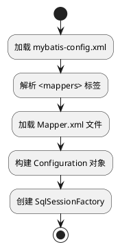
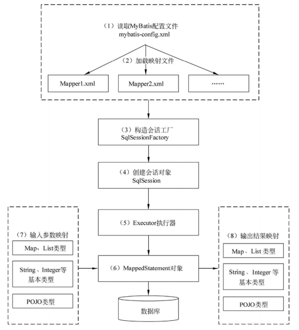
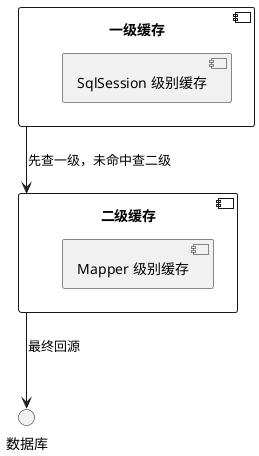
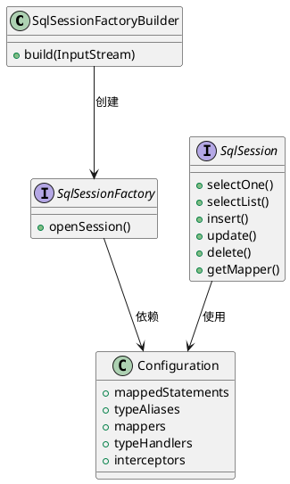

以下是添加了【七、扩展能力开发】和【八、如何处理存储过程】后的完整笔记：

---

# MyBatis 深度学习笔记

## 一、MyBatis 核心定位与架构设计
### 1.1 框架本质
MyBatis 是基于 **ORM（对象关系映射）** 思想的半自动持久层框架，其核心价值在于：
- **SQL 定制化**：允许开发者直接编写原生 SQL，支持存储过程、动态 SQL 生成
- **JDBC 封装**：自动管理 Connection/Statement/ResultSet 生命周期，消除样板代码
- **映射引擎**：通过 XML/注解实现 Java 对象与数据库表的双向映射

### 1.2 三层架构
- **Controller**：接收 HTTP 请求，调用 Service 层
- **Service**：实现业务逻辑，协调多个 Dao 操作
- **Dao**：定义数据访问接口，由 MyBatis 动态实现

## 二、核心工作原理
### 2.1 初始化流程

- **配置解析**：通过 DOM4J 解析 XML 文件，构建全局配置对象
- **映射注册**：将每个 SQL 语句封装为 `MappedStatement` 对象，存储在 `Configuration` 中
- **工厂创建**：使用建造者模式生成 `SqlSessionFactory` 实例

### 2.2 执行流程（以查询为例）



1. 读取 MyBatis 配置文件: mybatis-config.xml为MyBatis 的全局配置文件，配置了MyBatis的运行环境等信息，例如数据库连接信息。 
2. 加载映射文件。映射文件即SQL映射文件，该文件中配置了操作数据库的SQL语句，需要在MyBatis 配置文件mybatis-config.xml中加载。mybatis-config.xml文件可以加载多个映射文件，每个文件对应数据库中的一张表。 
3. 构造会话工厂:通过MyBatis的环境等配置信息构建会话工厂SqlSessionFactory. 
4. 创建会话对象:由会话工厂创建SqlSession对象，该对象中包含了执行SQL语句的所有方法。
5. Executor执行器: MyBatis 底层定义了一个Executor接口来操作数据库，它将根据SqlSession传递的参数动态地生成需要执行的SQL语句，同时负责查询缓存的维护。 
6. MappedStatement对象:在Executor接口的执行方法中有一个MappedStatement类型的参数，该参数是对映射信息的封装，用于存储要映射的SQL语句的id、参数等信息。 
7. 输入参数映射:输入参数类型可以是Map、List等集合类型，也可以是基本数据类型和POJO类型。输入参数映射过程类似于JDBC对 preparedStatement对象设置参数的过程。 
8. 输出结果映射:输出结果类型可以是Map、List等集合类型，也可以是基本数据类型和POJO类型。输出结果映射过程类似于JDBC对结果集的解析过程。

## 三、关键组件详解
### 3.1 SqlSessionFactory
```java
// 典型创建方式
String resource = "mybatis-config.xml";
InputStream inputStream = Resources.getResourceAsStream(resource);
SqlSessionFactory sqlSessionFactory = new SqlSessionFactoryBuilder().build(inputStream);
```
- **线程安全**：全局单例模式，所有数据库操作共享同一个工厂
- **核心职责**：创建 `SqlSession` 实例，管理事务边界

### 3.2 Executor 执行器
| 类型              | 特点                        | 适用场景  |
|-----------------|---------------------------|-------|
| SimpleExecutor  | 每次执行创建新 PreparedStatement | 简单查询  |
| ReuseExecutor   | 复用 PreparedStatement      | 批量操作  |
| BatchExecutor   | 批量执行更新语句                  | 高并发写入 |
| CachingExecutor | 二级缓存实现                    | 读多写少  |

### 3.3 MappedStatement
```xml
<!-- 示例配置 -->
<select id="selectUser" resultType="User">
    SELECT * FROM user WHERE id = #{id}
</select>
```
- **SQL 封装**：包含 SQL 语句、参数类型、结果映射等元数据
- **ID 唯一性**：由 `namespace.id` 组合构成，如 `com.example.UserMapper.selectUser`

## 四、高级特性实现
### 4.1 动态 SQL
```xml
<!-- 条件查询示例 -->
<select id="findActiveUsers" resultType="User">
    SELECT * FROM user
    <where>
        <if test="name != null">
            AND name = #{name}
        </if>
        <choose>
            <when test="status == 'ACTIVE'">
                AND status = 'ACTIVE'
            </when>
            <otherwise>
                AND status != 'DELETED'
            </otherwise>
        </choose>
    </where>
    ORDER BY create_time DESC
</select>
```
- **标签体系**：`<if>`、`<where>`、`<foreach>` 等标签实现逻辑分支
- **OGNL 表达式**：通过 `test` 属性进行条件判断

### 4.2 关联映射
#### 4.2.1 一对一关联
```xml
<!-- 用户与详细信息 -->
<resultMap id="userWithDetail" type="User">
    <id property="id" column="user_id"/>
    <association property="detail" javaType="UserDetail">
        <id property="id" column="detail_id"/>
        <result property="address" column="address"/>
    </association>
</resultMap>
```

#### 4.2.2 一对多关联
```xml
<!-- 用户与订单 -->
<resultMap id="userWithOrders" type="User">
    <id property="id" column="user_id"/>
    <collection property="orders" ofType="Order">
        <id property="id" column="order_id"/>
        <result property="amount" column="amount"/>
    </collection>
</resultMap>
```

### 4.3 缓存机制

- **一级缓存**：默认开启，基于 `SqlSession` 生命周期
- **二级缓存**：需手动配置，基于 `Mapper` 命名空间
- **缓存失效**：执行增删改操作后自动清空

## 五、最佳实践建议
### 5.1 XML 与注解选择
| 场景 | 推荐方式 |
|------|----------|
| 简单 CRUD | `@Select`/`@Insert` 注解 |
| 复杂 SQL | XML 映射文件 |
| 动态 SQL | XML `<where>`/`<foreach>` 标签 |

### 5.2 性能优化
1. **批量操作**：使用 `BatchExecutor` 减少网络往返
2. **结果集映射**：避免 `SELECT *`，只查询必要字段
3. **连接池配置**：推荐使用 HikariCP 替代默认连接池

### 5.3 调试技巧
```java
// 开启 MyBatis 日志
Configuration config = new Configuration();
config.setLogImpl(StdOutImpl.class); // 输出 SQL 到控制台

// SQL 执行时间监控
long start = System.currentTimeMillis();
List<User> users = sqlSession.selectList("com.example.UserMapper.findAll");
long duration = System.currentTimeMillis() - start;
System.out.println("SQL 执行耗时: " + duration + "ms");
```

## 六、常见问题解决方案
### 6.1 参数绑定失败
**错误现象**：`There is no getter for property named 'xxx' in 'class java.lang.String'`

**解决方案**：
1. 检查参数命名是否与实体类属性一致
2. 使用 `@Param` 注解显式指定参数名
```java
// 错误写法
User getUser(@Param("userName") String name);

// 正确写法
User getUser(@Param("name") String userName);
```

### 6.2 缓存穿透问题
**解决方案**：
1. **布隆过滤器**：预过滤不存在的 ID 请求
2. **空值缓存**：将查询结果为 null 的记录缓存为特定标记
```xml
<cache eviction="LRU" flushInterval="60000" size="1024" readOnly="true">
    <!-- 自定义缓存实现 -->
</cache>
```

## 七、扩展能力开发
### 7.1 自定义类型处理器（TypeHandler）
```java
public class DateTypeHandler extends BaseTypeHandler<Date> {
    @Override
    public void setNonNullParameter(PreparedStatement ps, int i, Date parameter, JdbcType jdbcType) throws SQLException {
        ps.setTimestamp(i, new Timestamp(parameter.getTime()));
    }

    @Override
    public Date getNullableResult(ResultSet rs, String columnName) throws SQLException {
        Timestamp timestamp = rs.getTimestamp(columnName);
        return timestamp != null ? new Date(timestamp.getTime()) : null;
    }
    // 其他重载方法...
}
```
**配置方式**：
```xml
<typeHandlers>
    <typeHandler handler="com.example.DateTypeHandler" javaType="java.util.Date"/>
</typeHandlers>
```

### 7.2 插件开发（Interceptor）
```java
@Intercepts({
    @Signature(type= Executor.class, method="update", args={MappedStatement.class, Object.class})
})
public class SqlCostInterceptor implements Interceptor {
    @Override
    public Object intercept(Invocation invocation) throws Throwable {
        long start = System.currentTimeMillis();
        Object result = invocation.proceed();
        long cost = System.currentTimeMillis() - start;
        System.out.println("SQL执行耗时：" + cost + "ms");
        return result;
    }
}
```
**注册插件**：
```xml
<plugins>
    <plugin interceptor="com.example.SqlCostInterceptor"/>
</plugins>
```

### 7.3 数据库厂商扩展
```xml
<databaseIdProvider type="DB_VENDOR">
    <property name="MySQL" value="mysql"/>
    <property name="Oracle" value="oracle"/>
</databaseIdProvider>
```
**使用方式**：
```xml
<select id="selectUser" resultType="User" databaseId="mysql">
    SELECT * FROM user WHERE id = #{id}
</select>
```

## 八、如何处理存储过程
### 8.1 基本调用方式
```xml
<!-- 调用无返回值的存储过程 -->
<select id="callProcedure" statementType="CALLABLE">
    {call update_user_status(#{userId,mode=IN,jdbcType=INTEGER}, 
                           #{status,mode=IN,jdbcType=VARCHAR})}
</select>

<!-- 调用有返回结果的存储过程 -->
<select id="callFunction" statementType="CALLABLE" resultType="int">
    {#{result,mode=OUT,jdbcType=INTEGER} = call get_user_count()}
</select>
```

### 8.2 参数模式说明
| 模式 | 说明 | 示例 |
|------|------|------|
| IN | 输入参数 | `#{param,mode=IN}` |
| OUT | 输出参数 | `#{param,mode=OUT}` |
| INOUT | 输入输出参数 | `#{param,mode=INOUT}` |

### 8.3 复杂存储过程处理
```xml
<!-- 调用带游标的存储过程 -->
<select id="callCursorProcedure" statementType="CALLABLE" resultMap="userResultMap">
    {call get_users_by_role(
        #{roleId,mode=IN,jdbcType=INTEGER},
        #{userCursor,mode=OUT,jdbcType=CURSOR,javaType=ResultSet,resultMap=userResultMap}
    )}
</select>

<resultMap id="userResultMap" type="User">
    <id property="id" column="id"/>
    <result property="name" column="name"/>
</resultMap>
```

### 8.4 Java代码调用示例
```java
// 无返回值调用
SqlSession sqlSession = sqlSessionFactory.openSession();
try {
    sqlSession.selectOne("com.example.UserMapper.callProcedure", 
        Map.of("userId", 1, "status", "ACTIVE"));
} finally {
    sqlSession.close();
}

// 带输出参数调用
Map<String, Object> params = new HashMap<>();
params.put("result", null); // 初始化OUT参数
sqlSession.selectOne("com.example.UserMapper.callFunction", params);
Integer count = (Integer) params.get("result");
```

## 附录：核心类关系图


# MyBatis 核心机制详解笔记

## 九、Executor 执行器

### 1. 执行器概述
Executor 是 MyBatis 的核心执行器，负责 SQL 语句的生成和查询缓存的维护，是 MyBatis 调度的核心，负责 SQL 执行流程中的关键操作。

### 2. 执行器类型
MyBatis 提供三种执行器实现：

- **SimpleExecutor** (默认)
    - 每次执行 update 或 select 都开启一个新 Statement 对象
    - 用完立即关闭
    - 简单但性能较差

- **ReuseExecutor**
    - 执行 update 或 select 时以 SQL 作为 key 查找 Statement 对象
    - 存在则使用，不存在则创建
    - 用完后不关闭，放入缓存
    - 适合批量操作

- **BatchExecutor**
    - 执行 update 时批量操作所有 Statement
    - 需手动调用 `flushStatements()` 提交批量
    - 适合批量更新场景

### 3. 执行器创建流程
```java
// 配置解析阶段创建执行器
Executor executor = 
    new ExecutorFactory().createExecutor(transaction, execType);

// execType 来源于配置：
// <settings>
//   <setting name="defaultExecutorType" value="SIMPLE"/>
// </settings>
```

### 4. 执行器核心方法
```java
public interface Executor {
    // 查询操作
    <E> List<E> query(MappedStatement ms, Object parameter, 
                     RowBounds rowBounds, ResultHandler handler) throws SQLException;
    
    // 更新操作
    int update(MappedStatement ms, Object parameter) throws SQLException;
    
    // 批量操作
    void batch() throws SQLException;
    
    // 事务相关
    Transaction getTransaction();
    void commit(boolean required) throws SQLException;
    void rollback(boolean required) throws SQLException;
    
    // 缓存操作
    void clearLocalCache();
    void deferLoad(MappedStatement ms, MetaObject resultObject, 
                  String property, CacheKey key, Class<?> targetType);
}
```

### 5. 执行器工作流程
1. 参数处理
2. SQL 构建
3. 结果集映射
4. 缓存处理
5. 事务管理

本笔记系统梳理了 MyBatis 的核心原理、高级特性及工程实践，新增的扩展能力开发章节详细介绍了类型处理器、插件机制等高级功能，存储过程处理章节提供了完整的调用方案。建议开发者结合官方文档与实际项目进行深入实践，逐步掌握这一持久层框架的精髓。