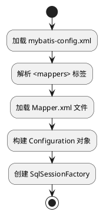
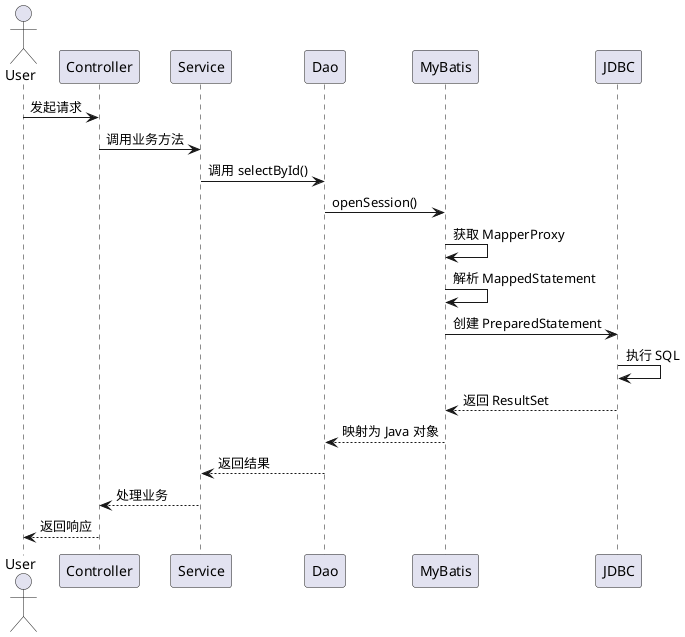
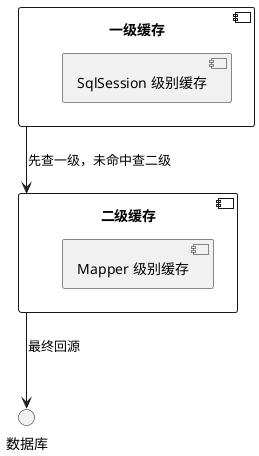
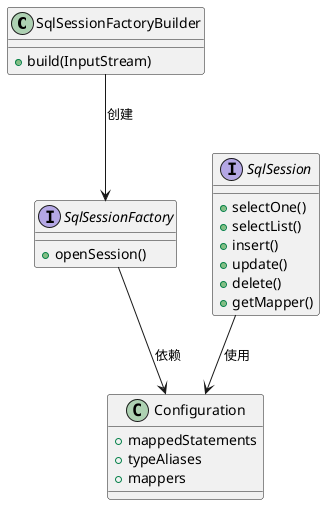

# MyBatis 深度学习笔记

## 一、MyBatis 核心定位与架构设计
### 1.1 框架本质
MyBatis 是基于 **ORM（对象关系映射）** 思想的半自动持久层框架，其核心价值在于：
- **SQL 定制化**：允许开发者直接编写原生 SQL，支持存储过程、动态 SQL 生成
- **JDBC 封装**：自动管理 Connection/Statement/ResultSet 生命周期，消除样板代码
- **映射引擎**：通过 XML/注解实现 Java 对象与数据库表的双向映射

### 1.2 三层架构
- **Controller**：接收 HTTP 请求，调用 Service 层
- **Service**：实现业务逻辑，协调多个 Dao 操作
- **Dao**：定义数据访问接口，由 MyBatis 动态实现

## 二、核心工作原理
### 2.1 初始化流程

- **配置解析**：通过 DOM4J 解析 XML 文件，构建全局配置对象
- **映射注册**：将每个 SQL 语句封装为 `MappedStatement` 对象，存储在 `Configuration` 中
- **工厂创建**：使用建造者模式生成 `SqlSessionFactory` 实例

### 2.2 执行流程（以查询为例）

- **动态代理**：通过 JDK 动态代理生成 Mapper 接口实现类
- **参数映射**：将 Java 对象属性值填充到 SQL 占位符
- **结果映射**：将 ResultSet 列值转换为 Java 对象属性

## 三、关键组件详解
### 3.1 SqlSessionFactory
```java
// 典型创建方式
String resource = "mybatis-config.xml";
InputStream inputStream = Resources.getResourceAsStream(resource);
SqlSessionFactory sqlSessionFactory = new SqlSessionFactoryBuilder().build(inputStream);
```
- **线程安全**：全局单例模式，所有数据库操作共享同一个工厂
- **核心职责**：创建 `SqlSession` 实例，管理事务边界

### 3.2 Executor 执行器
| 类型 | 特点 | 适用场景 |
|------|------|----------|
| SimpleExecutor | 每次执行创建新 PreparedStatement | 简单查询 |
| ReuseExecutor | 复用 PreparedStatement | 批量操作 |
| BatchExecutor | 批量执行更新语句 | 高并发写入 |
| CachingExecutor | 二级缓存实现 | 读多写少 |

### 3.3 MappedStatement
```xml
<!-- 示例配置 -->
<select id="selectUser" resultType="User">
    SELECT * FROM user WHERE id = #{id}
</select>
```
- **SQL 封装**：包含 SQL 语句、参数类型、结果映射等元数据
- **ID 唯一性**：由 `namespace.id` 组合构成，如 `com.example.UserMapper.selectUser`

## 四、高级特性实现
### 4.1 动态 SQL
```xml
<!-- 条件查询示例 -->
<select id="findActiveUsers" resultType="User">
    SELECT * FROM user
    <where>
        <if test="name != null">
            AND name = #{name}
        </if>
        <choose>
            <when test="status == 'ACTIVE'">
                AND status = 'ACTIVE'
            </when>
            <otherwise>
                AND status != 'DELETED'
            </otherwise>
        </choose>
    </where>
    ORDER BY create_time DESC
</select>
```
- **标签体系**：`<if>`、`<where>`、`<foreach>` 等标签实现逻辑分支
- **OGNL 表达式**：通过 `test` 属性进行条件判断

### 4.2 关联映射
#### 4.2.1 一对一关联
```xml
<!-- 用户与详细信息 -->
<resultMap id="userWithDetail" type="User">
    <id property="id" column="user_id"/>
    <association property="detail" javaType="UserDetail">
        <id property="id" column="detail_id"/>
        <result property="address" column="address"/>
    </association>
</resultMap>
```

#### 4.2.2 一对多关联
```xml
<!-- 用户与订单 -->
<resultMap id="userWithOrders" type="User">
    <id property="id" column="user_id"/>
    <collection property="orders" ofType="Order">
        <id property="id" column="order_id"/>
        <result property="amount" column="amount"/>
    </collection>
</resultMap>
```

### 4.3 缓存机制

- **一级缓存**：默认开启，基于 `SqlSession` 生命周期
- **二级缓存**：需手动配置，基于 `Mapper` 命名空间
- **缓存失效**：执行增删改操作后自动清空

## 五、最佳实践建议
### 5.1 XML 与注解选择
| 场景 | 推荐方式 |
|------|----------|
| 简单 CRUD | `@Select`/`@Insert` 注解 |
| 复杂 SQL | XML 映射文件 |
| 动态 SQL | XML `<where>`/`<foreach>` 标签 |

### 5.2 性能优化
1. **批量操作**：使用 `BatchExecutor` 减少网络往返
2. **结果集映射**：避免 `SELECT *`，只查询必要字段
3. **连接池配置**：推荐使用 HikariCP 替代默认连接池

### 5.3 调试技巧
```java
// 开启 MyBatis 日志
Configuration config = new Configuration();
config.setLogImpl(StdOutImpl.class); // 输出 SQL 到控制台

// SQL 执行时间监控
long start = System.currentTimeMillis();
List<User> users = sqlSession.selectList("com.example.UserMapper.findAll");
long duration = System.currentTimeMillis() - start;
System.out.println("SQL 执行耗时: " + duration + "ms");
```

## 六、常见问题解决方案
### 6.1 参数绑定失败
**错误现象**：`There is no getter for property named 'xxx' in 'class java.lang.String'`

**解决方案**：
1. 检查参数命名是否与实体类属性一致
2. 使用 `@Param` 注解显式指定参数名
```java
// 错误写法
User getUser(@Param("userName") String name);

// 正确写法
User getUser(@Param("name") String userName);
```

### 6.2 缓存穿透问题
**解决方案**：
1. **布隆过滤器**：预过滤不存在的 ID 请求
2. **空值缓存**：将查询结果为 null 的记录缓存为特定标记
```xml
<cache eviction="LRU" flushInterval="60000" size="1024" readOnly="true">
    <!-- 自定义缓存实现 -->
</cache>
```

## 附录：核心类关系图


本笔记系统梳理了 MyBatis 的核心原理、高级特性及工程实践，结合 PlantUML 示意图直观展示关键流程。建议开发者结合官方文档与实际项目进行深入实践，逐步掌握这一持久层框架的精髓。