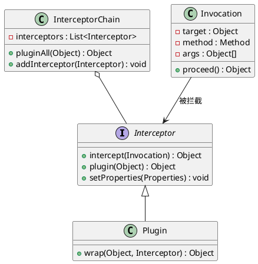
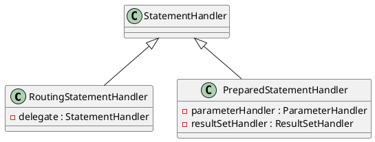
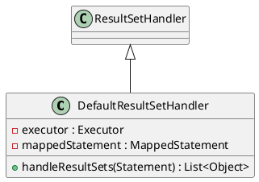
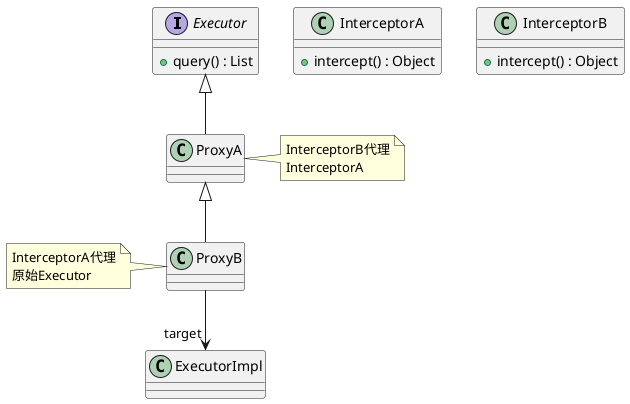
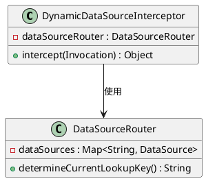

# MyBatis拦截器

## 一、拦截器核心机制
MyBatis拦截器通过JDK动态代理实现，基于`org.apache.ibatis.plugin.Interceptor`接口构建，采用责任链模式组织多个拦截器。其核心组件包括：
- **Invocation对象**：封装目标方法（Method）、参数（args）和目标对象（target）
- **Plugin工具类**：通过`wrap()`方法生成代理对象
- **InterceptorChain**：维护拦截器链，按配置顺序执行`pluginAll()`方法



## 二、四大拦截目标
MyBatis支持拦截四大核心组件，每个组件对应不同的处理时机：

### 1. Executor（执行器）
- **拦截时机**：SQL执行前后
- **典型场景**：
    - 缓存控制（如`CachingExecutor`）
    - 动态数据源切换
    - 执行时间统计
```java
@Intercepts({
  @Signature(type=Executor.class, method="query", 
            args={MappedStatement.class, Object.class, 
                  RowBounds.class, ResultHandler.class})
})
public class ExecutionTimeInterceptor implements Interceptor {
    @Override
    public Object intercept(Invocation invocation) throws Throwable {
        long start = System.currentTimeMillis();
        Object result = invocation.proceed();
        System.out.println("SQL耗时：" + (System.currentTimeMillis()-start) + "ms");
        return result;
    }
}
```

### 2. StatementHandler（语句处理器）
- **拦截时机**：SQL编译阶段
- **典型场景**：
    - SQL重写（如分页插件）
    - 动态表名替换
    - 防SQL注入


### 3. ParameterHandler（参数处理器）
- **拦截时机**：参数绑定前
- **典型场景**：
    - 敏感字段加密（如AES加密）
    - 参数类型转换
    - 空值处理
```java
@Intercepts({
  @Signature(type=ParameterHandler.class, method="setParameters", 
            args={PreparedStatement.class})
})
public class EncryptInterceptor implements Interceptor {
    @Override
    public Object intercept(Invocation invocation) throws Throwable {
        ParameterHandler handler = (ParameterHandler) invocation.getTarget();
        Field parameterField = handler.getClass().getDeclaredField("parameterObject");
        parameterField.setAccessible(true);
        Object param = parameterField.get(handler);
        if(param instanceof User){
            ((User)param).setPhone(AESUtil.encrypt(phone));
        }
        return invocation.proceed();
    }
}
```

### 4. ResultSetHandler（结果集处理器）
- **拦截时机**：结果映射阶段
- **典型场景**：
    - 数据脱敏（如身份证号脱敏）
    - 嵌套结果处理
    - 空值转换


## 三、拦截器配置实践

### 1. XML配置方式
```xml
<configuration>
  <plugins>
    <plugin interceptor="com.example.interceptor.PageInterceptor">
      <property name="dialect" value="mysql"/>
    </plugin>
    <plugin interceptor="com.example.interceptor.EncryptInterceptor"/>
  </plugins>
</configuration>
```

### 2. Spring Boot配置
```java
@Configuration
public class MyBatisConfig {
    @Bean
    public PageInterceptor pageInterceptor() {
        return new PageInterceptor();
    }

    @Bean
    public ConfigurationCustomizer configurationCustomizer() {
        return configuration -> {
            configuration.addInterceptor(pageInterceptor());
            configuration.addInterceptor(new EncryptInterceptor());
        };
    }
}
```

## 四、高级应用技巧

### 1. 拦截顺序控制
- **执行顺序规则**：
    1. 不同类型拦截器：Executor → StatementHandler → ParameterHandler → ResultSetHandler
    2. 同类型拦截器：按配置顺序执行（后配置的在外层）



### 2. 与PageHelper整合
```java
// 解决分页失效问题
@Bean
public SqlSessionFactory sqlSessionFactory(DataSource dataSource) throws Exception {
    SqlSessionFactoryBean factory = new SqlSessionFactoryBean();
    factory.setDataSource(dataSource);
    
    // 确保PageHelper最后配置
    List<Interceptor> interceptors = new ArrayList<>();
    interceptors.add(new EncryptInterceptor());
    interceptors.add(new PageInterceptor()); // 必须最后添加
    
    factory.setPlugins(interceptors.toArray(new Interceptor[0]));
    return factory.getObject();
}
```

### 3. 性能优化建议
- **避免重复代理**：在`plugin()`方法中判断是否需要代理
```java
@Override
public Object plugin(Object target) {
    if (target instanceof ParameterHandler) {
        return Plugin.wrap(target, this);
    }
    return target; // 非目标对象不代理
}
```
- **缓存反射字段**：使用`@PostConstruct`初始化反射字段
- **异步日志记录**：采用异步方式记录执行日志

## 五、典型应用场景

### 1. 数据脱敏系统
```java
public class DesensitizationInterceptor implements Interceptor {
    private static final Map<String, Desensitizer> STRATEGIES = Map.of(
        "phone", s -> s.replaceAll("(\\d{3})\\d{4}(\\d{4})", "$1****$2"),
        "idCard", s -> s.replaceAll("(\\d{4})\\d{10}(\\w{4})", "$1**********$2")
    );

    @Override
    public Object intercept(Invocation invocation) throws Throwable {
        ResultSetHandler handler = (ResultSetHandler) invocation.getTarget();
        Field resultMapsField = handler.getClass().getDeclaredField("mappedStatement.resultMaps");
        // 实现结果集脱敏逻辑...
    }
}
```

### 2. 动态数据源路由


### 3. SQL审计系统
```java
@Intercepts({
    @Signature(type= StatementHandler.class, method="prepare", 
              args={Connection.class, Integer.class})
})
public class SqlAuditInterceptor implements Interceptor {
    @Override
    public Object intercept(Invocation invocation) throws Throwable {
        StatementHandler handler = (StatementHandler) invocation.getTarget();
        BoundSql boundSql = handler.getBoundSql();
        String sql = boundSql.getSql().toLowerCase();
        
        if(sql.contains("delete") || sql.contains("drop")){
            throw new SecurityException("非法SQL操作");
        }
        
        // 记录审计日志
        AuditLog log = new AuditLog();
        log.setSql(sql);
        log.setUser(SecurityContext.getCurrentUser());
        auditLogRepository.save(log);
        
        return invocation.proceed();
    }
}
```

## 六、调试与问题排查

### 1. 常见问题
- **拦截失效**：检查`@Intercepts`注解配置是否正确
- **顺序问题**：使用`@Order`注解或调整配置顺序
- **代理冲突**：避免重复配置相同类型的拦截器

### 2. 调试技巧
```java
// 在intercept方法中添加调试日志
public Object intercept(Invocation invocation) throws Throwable {
    System.out.println("拦截方法: " + invocation.getMethod().getName());
    System.out.println("目标类: " + invocation.getTarget().getClass().getName());
    Arrays.stream(invocation.getArgs()).forEach(System.out::println);
    return invocation.proceed();
}
```

通过系统掌握MyBatis拦截器的核心机制、配置方法和高级技巧，开发者可以构建出高效、灵活的数据访问层扩展方案。在实际项目中，建议结合具体业务场景设计分层拦截策略，例如将安全审计、日志记录等横切关注点与业务逻辑解耦，实现代码的清晰架构和可维护性。