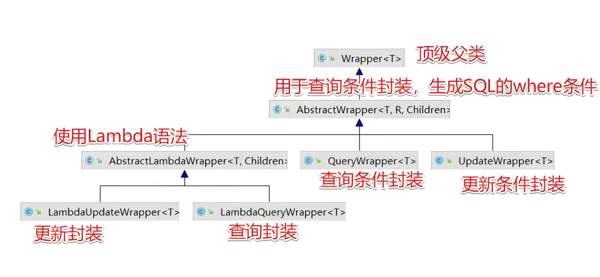

# 条件构造器Wrapper

MyBatisPlus 的构造器 wrapper 体系构建得十分精妙，它们均以 AbstractWrapper 作为核心父类，由此衍生出多个功能各异的子类。


可以按照*用途维度*和*使用方式维度*进行划分。

## 两大维度
### 一、用途维度

1. 查询构造器（如 QueryWrapper、LambdaQueryWrapper）：  
专注于构建查询条件，以精准地从数据库中筛选出符合要求的数据。它们提供了如 eq（等于）、ne（不等于）、gt（大于）、lt（小于）、between（介于…… 之间）、like（模糊查询）等丰富的方法，可灵活组合出各种复杂的查询逻辑。• \
2. 更新构造器（如 UpdateWrapper、LambdaUpdateWrapper）：  
主要用于构建更新条件和更新内容。除了具备基本的条件构造功能外，还支持指定要更新的字段及其值，实现对数据库中数据的高效更新操作。

### 二、使用方式维度

1. 普通构造器（如 QueryWrapper、UpdateWrapper）：  
以字符串形式指定字段名，在撰写查询或更新条件时，需要手动输入表的字段名称。这种方式较为直观，但在字段名变更时，易出现字符串不匹配的错误，且在编码阶段难以及时察觉。
2. lambda 构造器（如 LambdaQueryWrapper、LambdaUpdateWrapper）：  
借助 lambda 表达式，通过实体类的字段引用作为参数，极大地提升了代码的可读性和安全性。

普通构造器与 lambda 构造器在查询场景下的代码对比示例：
```java
// 普通构造器
QueryWrapper<User> wrapper = new QueryWrapper<>();
wrapper.eq("is_delete", 0).orderByDesc("user_weight");
List<User> users = userMapper.selectList(wrapper);

// lambda 构造器
LambdaQueryWrapper<User> lambdaWrapper = new LambdaQueryWrapper<>();
lambdaWrapper.eq(User::getIsDelete, 0).orderByDesc(User::getUserWeight);
List<User> users = userMapper.selectList(lambdaWrapper);
```

## 应用
