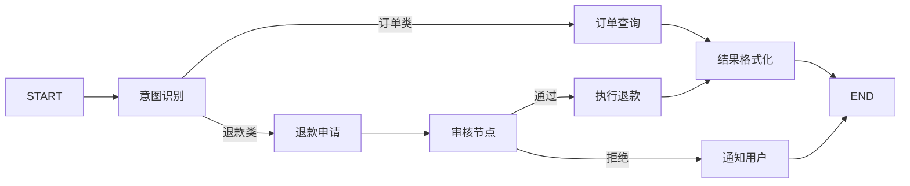
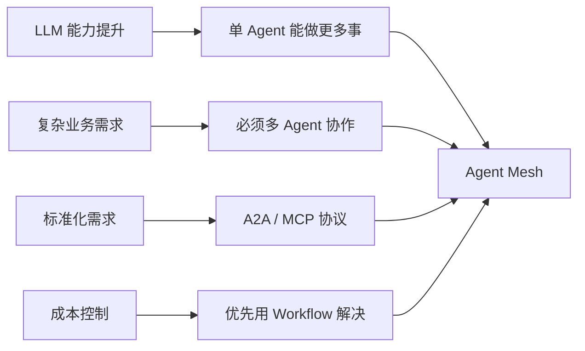
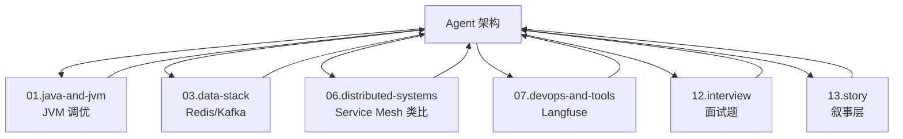
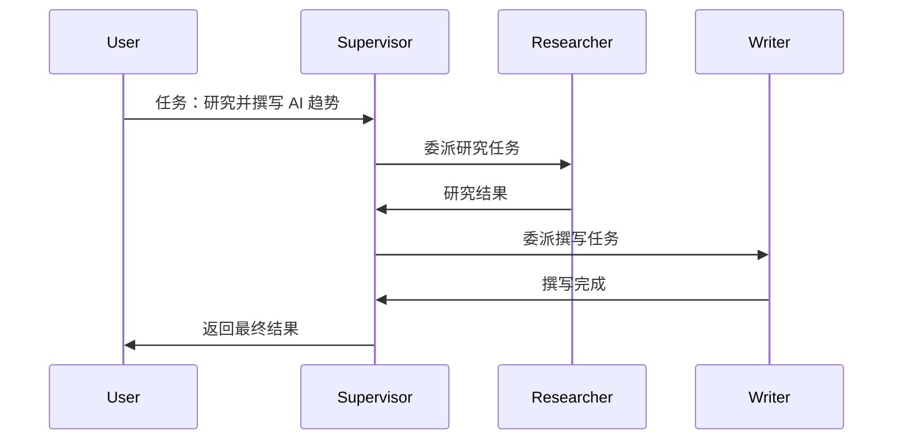
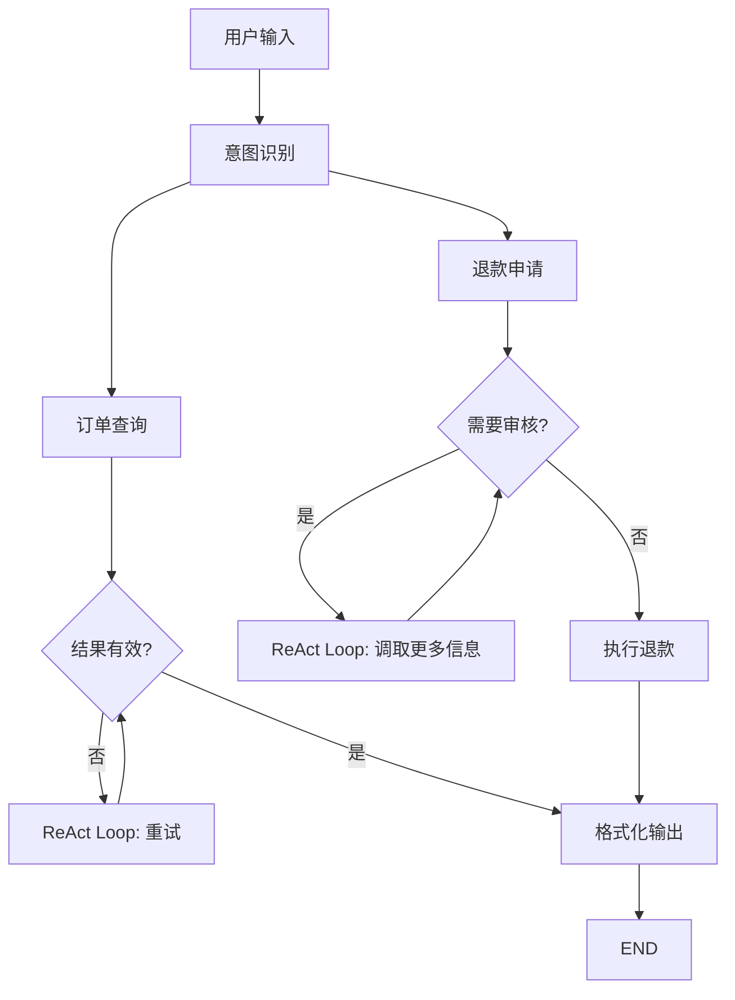
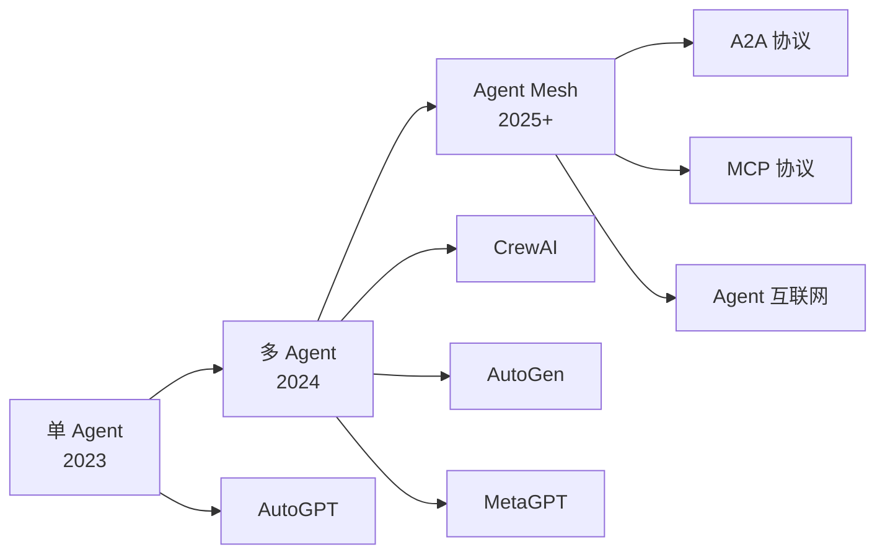

<!--
module:
  parent: ai
  slug: ai/agent-architecture
  type: article
  category: 主模块子文章
  summary: Agent 架构全景：DAG vs ReAct vs Plan-and-Execute + 多 Agent 6 大模式 + 4 类通信协议 + 6 大框架源码对比 + 演进史 + 反直觉点。
  depth: ⭐⭐⭐⭐⭐
-->

# Agent 架构全景：从单 Agent 到 Agent Mesh

← 返回 [架构设计](../README.md)

> 复杂 Agent 为什么越来越多采用 DAG？ReAct 循环与 DAG Workflow 是两大主流架构 —— 它们是互补关系（探索 vs 执行），而非替代关系。生产环境通常是 DAG + Loop 混合。

---
---

## 一、核心结论（TL;DR）

| 架构 | 模式 | 适用场景 |
|------|------|---------|
| **ReAct 循环** | 思考 → 行动 → 观察 → 循环 | 探索性任务 |
| **DAG Workflow** | 有向无环图，节点 + 边 | 确定性流程 |
| **Plan-and-Execute** | 先规划再执行 | 复杂任务 |
| **Multi-Agent** | 多个 Agent 协作 | 复杂业务 |

> 一句话：**ReAct 用于"探索"，DAG 用于"执行"；生产级 Agent 通常是 DAG + Loop 混合**。

---

## 二、ReAct 循环的本质

ReAct（Reasoning + Acting）是最经典的 Agent 循环模式：

```text
Thought: 我需要先查询订单
Action: getOrder(order_id="20260628")
Observation: 订单状态：已支付

Thought: 订单已支付，我应该给用户返回结果
Action: 返回订单信息给用户
Observation: 完成
```

**代码示例**：

```python
while not task_completed:
    thought = llm.think(context)        # 思考下一步
    action = llm.choose_tool(thought)   # 选择工具
    observation = execute(action)       # 执行工具
    context.add(thought, action, observation)  # 更新上下文
```

**优点**：
- 灵活：Agent 自己决定下一步
- 适合开放性问题
- 实现简单

**缺点**：
- 不可预测：每次执行路径可能不同
- 调试困难：循环路径不固定
- 容易"迷路"：Context 越长越混乱
- Token 消耗大：每次都要重新"思考"

---

## 三、DAG Workflow 的本质

DAG（Directed Acyclic Graph）是把任务拆成节点，用有向无环图组织：

```text
[用户输入]
    ↓
[意图识别] ─→ [订单查询] ─→ [结果格式化] ─→ [返回]
    ↓
[退款申请] ─→ [审核] ─→ [执行退款] ─→ [通知]
```

**代码示例（LangGraph）**：

```python
from langgraph.graph import StateGraph

workflow = StateGraph(State)

# 定义节点
workflow.add_node("intent_classify", classify_intent)
workflow.add_node("query_order", query_order)
workflow.add_node("request_refund", request_refund)
workflow.add_node("format_response", format_response)

# 定义边（流程）
workflow.add_edge("intent_classify", "query_order")
workflow.add_edge("intent_classify", "request_refund")
workflow.add_edge("query_order", "format_response")
workflow.add_edge("request_refund", "format_response")

workflow.set_entry_point("intent_classify")
```

**优点**：
- 可预测：每次执行路径固定
- 易调试：节点 + 边可视化
- 易优化：可以并行执行独立节点
- Token 友好：每个节点只处理自己的子任务

**缺点**：
- 不灵活：固定流程，无法应对未知情况
- 开发成本：需要预先设计节点和边
- 难以处理"未定义流程"

---

## 四、4 大主流 Agent 架构对比

| 架构 | 代表项目 | 优势 | 劣势 |
|------|---------|------|------|
| **ReAct** | BabyAGI, AutoGPT | 灵活、探索 | 不可预测、Token 消耗大 |
| **DAG** | LangGraph, Temporal | 稳定、高效 | 不灵活 |
| **Plan-and-Execute** | Plan-and-Execute Agent | 规划清晰 | 规划可能错误 |
| **Multi-Agent** | CrewAI, AutoGen | 协作能力强 | 通信开销大 |

---

## 五、为什么复杂 Agent 越来越多采用 DAG？

### 1. 稳定性需求

生产环境要求 99.9% 可用，DAG 流程固定、行为可预测。

### 2. 成本控制

ReAct 循环每次调用 LLM，Token 成本不可控；DAG 每个节点只调用一次。

### 3. 调试可观测性

DAG 的执行路径可以用 Trace 工具完整记录，ReAct 循环的路径难以复现。

### 4. 合规需求

金融、医疗等行业要求 Agent 行为可审计，DAG 满足需求。

### 5. 大模型能力提升

2026 年的 LLM 足够强，DAG 的"灵活性不足"问题被 Context Engineering 和 Harness Engineering 弥补。

---

## 六、真实案例

| 产品 | Agent 架构 | 选择理由 |
|------|-----------|---------|
| **Cursor** | DAG（Composer） | 代码生成是确定性流程 |
| **Claude Code** | DAG + Loop | 主流程 DAG + 错误重试 Loop |
| **Devin** | Plan-and-Execute + DAG | 先规划再执行 |
| **ChatGPT Agent** | DAG | 产品化需求 |
| **AutoGPT** | ReAct | 探索性研究 |

---

## 七、何时选 DAG vs ReAct？

```text
Q1: 任务流程是否明确？
├── 是 → DAG Workflow
└── 否 → Q2

Q2: 是否需要探索未知信息？
├── 是 → ReAct Loop
└── 否 → DAG Workflow

Q3: 是否有合规/审计要求？
├── 是 → DAG Workflow
└── 否 → Q4

Q4: 是否需要灵活性 > 稳定性？
├── 是 → ReAct Loop
└── 否 → DAG Workflow
```

**推荐**：生产环境用 DAG + Loop 混合（确定性节点用 DAG，探索性节点用 Loop）。

---

## 八、面试陷阱速览

> 完整陷阱 + 反直觉 + 30 秒话术见 13.split-hairs Agent 架构（⚠️ 待 Phase 1+ 迁入）

---

## 相关章节

- 上游：智能系统分层（⚠️ 待 Phase 1+ 迁入；占位 `../architecture/intelligent-system-layers/`） — Agent 在分层架构中的位置
- 关联：[Agent Memory 架构](../agent-memory/README.md) — Memory × Agent 执行架构（DAG/ReAct/Plan 的 Memory 特殊要求）
- 关联：Loop Engineering — ⚠️ 待 Phase 1+ 迁入（占位 `../agent-execution-patterns/loop-engineering/`） — DAG 的兜底机制
- 关联：Harness Engineering — ⚠️ 待 Phase 1+ 迁入（占位 `../agent-execution-patterns/harness-engineering/`） — DAG 是 Harness 的强约束
- 关联：[LLM 驾驭演进史](llm-control-evolution/README.md) — Prompt → Context → Harness → Loop 4 阶段演进叙事
- 实战：[生产级 Agent](../production-agent/README.md) — DAG 在生产环境的落地

← [返回 Agent MOC](../README.md)

---

## 深度扩展

🆕 **4 模式 6 维深度对比**：[agent-execution-patterns 专题](../agent-execution-patterns/README.md) —— ReAct Thought/Action/Observation 5 硬伤 + Plan-and-Execute 3 大重规划机制（RePlan / Adaptive / Plan Repair）+ 6 维完整打分 + 5 分钟决策树 + 7 道面试题。

🆕 **Agent 评测专题**：[../agent-evaluation/](../agent-evaluation/README.md) —— Agent 评测 6 维（任务 40% / 步骤 20% / 工具 10% / 成本 10% / 满意 15% / 稳定 5%）+ 5 种方法 + 4 阶段 Pipeline 1511 行。面试精选 [13.split-hairs Agent 性能评估](../../../12.interview/11.ai/agent-performance-evaluation/README.md)（⚠️ 待 Phase 1+ 迁入）。

---

## 九、多 Agent 架构 6 大模式（深度）

> 单 Agent 解决不了复杂业务时，必然走向多 Agent。**不同的协作模式适合不同的业务场景**——选错模式通信开销可能浪费 2-3 倍 Token（见 §14 反直觉点 1）。

### 9.1 Supervisor 模式（监督者模式）

**核心思想**：1 个 Supervisor Agent 管理多个 Worker Agent，Supervisor 负责任务分发、结果汇总、错误处理。

**典型代表**：AutoGen GroupChat、CrewAI Hierarchical、LangGraph Supervisor

```python
# LangGraph Supervisor 完整示例
from langgraph_supervisor import create_supervisor
from langgraph.prebuilt import create_react_agent
from langchain_anthropic import ChatAnthropic

llm = ChatAnthropic(model="claude-sonnet-4-5")

# Worker 1: 研究员
research_agent = create_react_agent(
    llm,
    tools=[search_tool, wikipedia_tool],
    name="researcher",
    prompt="你是一名研究员，专注于网络检索和事实核实。"
)

# Worker 2: 撰写员
writer_agent = create_react_agent(
    llm,
    tools=[],
    name="writer",
    prompt="你是一名内容撰写员，擅长将研究结果组织成结构化文档。"
)

# Supervisor 协调
workflow = create_supervisor(
    [research_agent, writer_agent],
    model=llm,
    prompt=(
            "你是团队协调者：根据当前对话决定下一个 Worker。"
            "可用 worker：researcher（需要事实时调用）、writer（需要成文时调用）。"
            "任务完成后回复 FINISH。"
        )
)

app = workflow.compile()
result = app.invoke({
    "messages": [{"role": "user", "content": "调研 AI Agent 架构并写一篇综述"}]
})
```

**优点**：
- 角色清晰，决策单点
- 易于实现和调试
- 错误处理集中

**缺点**：
- Supervisor 是单点瓶颈
- Supervisor 上下文窗口压力大（所有 Worker 的对话都会汇总到它）
- 任务分配可能不合理（Supervisor 误判）

**真实案例**：Anthropic Research 多 Agent 系统、Cursor Composer（代码生成 + 测试 Supervisor）

### 9.2 Swarm 模式（群体模式）

**核心思想**：多个 Agent 之间**点对点通信**，没有中心节点，根据动态场景自主协商。

**典型代表**：AutoGen Swarm、OpenAI Swarm（2024 实验项目）

```python
from swarms import Agent, Swarm

# 定义去中心化 Agent
researcher = Agent(
    agent_name="Researcher",
    system_prompt="负责网络检索，输出原始事实。",
    llm=llm
)
analyst = Agent(
    agent_name="Analyst",
    system_prompt="负责分析数据，输出结构化结论。",
    llm=llm
)
writer = Agent(
    agent_name="Writer",
    system_prompt="负责撰写最终内容。",
    llm=llm
)

# Swarm 协作
swarm = Swarm(
    agents=[researcher, analyst, writer],
    max_loops=5,           # 最大循环次数（防死循环）
    termination_threshold=0.8  # 达成共识阈值
)
result = swarm.run("分析 AI 行业趋势并撰写报告")
```

**优点**：
- 无中心瓶颈，水平扩展性好
- 灵活，能应对动态任务
- 适合去中心化场景

**缺点**：
- **难以调试**（执行路径不可预测）
- 容易陷入循环（必须严格限制 max_loops）
- 需要 consensus 机制防止 Agent 之间互锁

**真实案例**：OpenAI Swarm（实验性项目，已停止维护但设计思想影响深远）

### 9.3 Graph 模式（基于 DAG）

**核心思想**：用有向图（不一定是 DAG，可有循环）显式定义 Agent 之间的转移关系。

**典型代表**：LangGraph、LlamaIndex Workflow、Vertex AI Reasoning Engine



**优点**：
- 流程可视化（LangGraph Studio 可视化调试）
- 支持条件边（conditional edge）实现分支
- 支持并行节点（fan-out/fan-in）
- **可观测性强**（Trace 完整记录每个节点）

**缺点**：
- 开发成本高（需要预先设计图）
- 不够灵活（图结构改起来麻烦）

**真实案例**：LangGraph Studio 可视化调试工具、生产 Agent 系统

### 9.4 Pipeline 模式（流水线模式）

**核心思想**：每个 Agent 处理一个固定步骤，类似工厂流水线。

**典型代表**：MetaGPT、ChatDev

```python
# MetaGPT 软件开发流水线（简化）
class SoftwareCompany:
    def __init__(self):
        self.architect = Architect()      # 架构师
        self.pm = ProjectManager()         # 产品经理
        self.engineer = Engineer()          # 工程师
        self.qa = QAEngineer()              # 测试
    
    def run(self, requirement: str) -> str:
        design = self.architect.design(requirement)   # 1. 设计
        plan = self.pm.plan(design)                    # 2. 规划
        code = self.engineer.code(plan)                # 3. 编码
        tests = self.qa.test(code)                     # 4. 测试
        return tests

# ChatDev 多 Phase 串联（伪代码）
chat_chain = ChatChain([
    DesignPhase(),    # 设计
    CodingPhase(),    # 编码
    TestingPhase(),   # 测试
    DocumentationPhase()  # 文档
])
result = chat_chain.run("开发一个贪吃蛇游戏")
```

**优点**：
- 角色分工明确（模拟真实公司）
- 输出标准化
- 适合流程化业务

**缺点**：
- 步骤固定，不够灵活
- 单步错误会导致整条流水线失败（需要重试机制）
- 上下文传递有损失（每步只看上游输出）

**真实案例**：MetaGPT 软件开发、ChatDev 协作开发、阿里通义晓蜜客服流水线

### 9.5 Hierarchical 模式（分层模式）

**核心思想**：多个 Supervisor 层级嵌套，上层 Supervisor 管理下层 Supervisor。

**典型代表**：CrewAI Hierarchical、AutoGen NestedChat

```text
顶层 Supervisor（战略层，CEO）
    ├── Supervisor A（领域 A，CTO）
    │   ├── Worker A1（架构师）
    │   └── Worker A2（工程师）
    └── Supervisor B（领域 B，CFO）
        ├── Worker B1（财务分析师）
        └── Worker B2（审计员）
```

**优点**：
- 大规模任务可分解为多层子任务
- 责任清晰，支持权限分层
- 可对应现实组织结构（CEO/CTO/CFO）

**缺点**：
- 层级深时延迟高（多层 LLM 调用）
- 跨层级通信复杂
- Supervisor 链上的错误会向下扩散

**真实案例**：复杂电商客服（顶层意图分流 → 子领域 Supervisor → 具体 Worker）

### 9.6 Blackboard 模式（黑板模式）

**核心思想**：所有 Agent 共享一个"黑板"（数据结构），Agent 监听黑板变化并响应。

**典型代表**：传统 AI 系统（HEARSAY-II 语音识别系统，1980 年代），现代 LLM 多 Agent 框架的部分实现

```python
class Blackboard:
    """共享状态空间"""
    def __init__(self):
        self.data = {}
        self.subscribers = []
    
    def post(self, key: str, value: any):
        self.data[key] = value
        for sub in self.subscribers:
            sub.notify(key, value)
    
    def subscribe(self, agent):
        self.subscribers.append(agent)

class BaseAgent:
    def __init__(self, blackboard: Blackboard, name: str):
        self.bb = blackboard
        self.bb.subscribe(self)
        self.name = name
    
    def notify(self, key, value):
        """黑板变化时触发"""
        if self.should_respond(key, value):
            result = self.process(value)
            self.bb.post(f"{self.name}_result", result)
    
    def should_respond(self, key, value) -> bool:
        raise NotImplementedError
    
    def process(self, value) -> any:
        raise NotImplementedError

# 多 Agent 监听 Blackboard
bb = Blackboard()
ResearchAgent(bb)   # 监听"query" → 输出"raw_data"
AnalysisAgent(bb)   # 监听"raw_data" → 输出"analysis"
WritingAgent(bb)    # 监听"analysis" → 输出"final_article"

# 启动
bb.post("query", "AI agent architectures")
```

**优点**：
- 高度解耦（Agent 之间不直接调用）
- 易于扩展（加 Agent 不改其他 Agent）
- 天然事件驱动

**缺点**：
- 黑板竞争问题（多个 Agent 同时改同一字段）
- 调试困难（事件链难追溯）
- 需要 Schema 治理

**真实案例**：HEARSAY-II 语音识别、部分 RAG 系统的回调机制

### 9.7 6 大模式对比表

| 模式 | 中心化 | 灵活性 | 调试性 | 适用场景 | 代表项目 |
|------|--------|--------|--------|---------|---------|
| **Supervisor** | 强 | 中 | 高 | 中等复杂、需要清晰决策 | AutoGen GroupChat |
| **Swarm** | 无 | 高 | 低 | 去中心化、探索性 | OpenAI Swarm |
| **Graph（DAG）** | 弱 | 中 | 高 | 生产业务、确定性 | LangGraph |
| **Pipeline** | 弱 | 低 | 中 | 流程化任务 | MetaGPT |
| **Hierarchical** | 强（多层） | 中 | 中 | 大规模、多领域 | CrewAI Hierarchical |
| **Blackboard** | 无 | 高 | 低 | 事件驱动、解耦 | 传统专家系统 |

---

## 十、Agent 通信协议（4 种方式）

### 10.1 消息队列（Message Queue）

**原理**：Agent 通过消息队列（Kafka / RabbitMQ / Redis Streams）异步通信。

```python
# Producer Agent 发送任务
from kafka import KafkaProducer
producer = KafkaProducer(bootstrap_servers='localhost:9092')
producer.send('agent_tasks', key=b'researcher', value=b'research AI trends')

# Consumer Agent 接收任务
from kafka import KafkaConsumer
consumer = KafkaConsumer('agent_tasks', group_id='researcher_group')
for msg in consumer:
    task = msg.value.decode()
    result = process(task)
    producer.send('agent_results', value=result)
```

**优点**：
- 完全解耦（生产者和消费者无依赖）
- 可靠（持久化 + 重试）
- 可扩展（水平扩展 Consumer）

**缺点**：
- 延迟高（毫秒到秒级）
- 需要基础设施（Kafka 集群）
- 不适合紧密协作场景

**适用场景**：大规模分布式 Agent 集群、跨服务异步任务

### 10.2 共享内存（Shared Memory）

**原理**：所有 Agent 访问同一块内存（Redis / Memcached / 进程内 dict）。

```python
import redis
r = redis.Redis()

# Agent A 写入
r.set("task:001:result", json.dumps({"status": "done", "data": data}))

# Agent B 读取
result = json.loads(r.get("task:001:result"))
```

**优点**：
- 低延迟（微秒级）
- 简单（API 直观）
- 适合紧密协作

**缺点**：
- 竞争问题（需要锁 / 乐观锁）
- 扩展性差（单机内存有限）
- 不适合跨数据中心

**适用场景**：单机多 Agent、紧密协作、低延迟场景

### 10.3 黑板（Blackboard）

**原理**：见 §9.6，是一种**事件驱动**的共享状态机制。

**对比共享内存**：黑板是 push 模式（Agent 被通知），共享内存是 pull 模式（Agent 主动查询）。

### 10.4 A2A 协议（Agent-to-Agent Protocol）

**原理**：Google 在 2025 年提出的 Agent 通信协议，基于 HTTP/JSON-RPC，**解决跨厂商 Agent 互通**。

```json
// A2A 协议消息示例
{
  "jsonrpc": "2.0",
  "method": "agent.send_task",
  "params": {
    "agent_card": "https://research-agent.example.com/.well-known/agent.json",
    "task_id": "research-001",
    "skill": "web_research",
    "input": { "query": "AI agent architectures" },
    "caller": "agent://planner-001",
    "callback_url": "https://planner.example.com/agent-callback"
  },
  "id": "req-001"
}
```

**A2A 协议 4 大关键能力**：

1. **Agent Card**（类似 OpenAPI Spec）：每个 Agent 暴露 `.well-known/agent.json` 描述自身能力
2. **Task Lifecycle**：任务状态机（`submitted` → `working` → `input-required` → `completed` / `failed` / `canceled`）
3. **Streaming**：流式响应（SSE / WebSocket）
4. **Push Notifications**：异步通知（Webhooks）

**Agent Card 示例**：

```json
{
  "name": "Research Agent",
  "description": "Performs web research and fact-checking",
  "url": "https://research-agent.example.com",
  "skills": [
    {
      "id": "web_research",
      "name": "Web Research",
      "description": "Search the web for a query",
      "input_schema": {
        "type": "object",
        "properties": {
          "query": { "type": "string" }
        }
      },
      "output_schema": {
        "type": "object",
        "properties": {
          "sources": { "type": "array" },
          "summary": { "type": "string" }
        }
      }
    }
  ],
  "authentication": {
    "type": "bearer",
    "scopes": ["research:read"]
  }
}
```

**优点**：
- 标准化（跨厂商 Agent 互通）
- 类比 HTTP（Agent 互联网的基础协议）
- 与 MCP 协议互补（MCP 暴露工具，A2A 通信）

**缺点**：
- 协议刚起步（2025 年提出）
- 生态不成熟
- 实现复杂度高

**未来趋势**：A2A 可能是 **Agent 互联网的 HTTP**——未来 Agent 之间像 Web 服务一样互联。

**真实案例**：Google A2A 开源实现（github.com/google/A2A）、阿里云百炼、Anthropic 实验性支持

---

## 十一、核心源码对比（6 大框架）

### 11.1 LangGraph（LangChain 团队）

**核心抽象**：`StateGraph` + `Node` + `Edge` + `State` + `Checkpointer`

**架构特点**：
- 基于 DAG（可扩展为循环）
- 强类型 State（TypedDict / Pydantic）
- **Checkpointer 持久化**（PostgreSQL / Redis / SQLite）
- Human-in-the-loop 原生支持（`interrupt_before` / `interrupt_after`）
- Time Travel 调试（重放历史状态）

**核心源码简化**（`langgraph/graph/state.py`）：

```python
class StateGraph:
    def __init__(self, state_schema):
        self.nodes = {}
        self.edges = {}
        self.state_schema = state_schema
        self.branches = {}  # 条件边
    
    def add_node(self, name, func):
        self.nodes[name] = func
    
    def add_edge(self, from_node, to_node):
        self.edges[(from_node, to_node)] = to_node
    
    def add_conditional_edges(self, from_node, router, path_map):
        """条件边：根据 router 函数的返回值决定下一个节点"""
        self.branches[from_node] = (router, path_map)
    
    def compile(self, checkpointer=None, interrupt_before=None):
        return CompiledGraph(
            self.nodes,
            self.edges,
            self.branches,
            self.state_schema,
            checkpointer=checkpointer,
            interrupt_before=interrupt_before
        )

class CompiledGraph:
    def invoke(self, input, config=None):
        thread_id = config["configurable"]["thread_id"]
        
        # 从 Checkpointer 恢复状态
        if self.checkpointer:
            state = self.checkpointer.load(thread_id) or input
        else:
            state = input
        
        current_node = "__start__"
        while current_node != "__end__":
            # Human-in-the-loop 检查
            if self.interrupt_before and current_node in self.interrupt_before:
                state["__interrupt__"] = True
                return state
            
            # 执行节点
            func = self.nodes[current_node]
            state = func(state)
            
            # Checkpoint
            if self.checkpointer:
                self.checkpointer.save(thread_id, state)
            
            # 路由
            if current_node in self.branches:
                router, path_map = self.branches[current_node]
                current_node = path_map[router(state)]
            else:
                current_node = self.edges.get((current_node, "__end__"), "__end__")
        
        return state
```

**适用场景**：生产级、复杂业务、需要审计、Human-in-the-loop

### 11.2 AutoGPT

**核心抽象**：`Agent` 循环 + `Tool` 集合 + `Memory`（向量数据库）

**架构特点**：
- 经典 ReAct 循环（无显式图）
- 长期记忆（Pinecone / Milvus）
- 自我反思（Self-Criticism）

**核心循环简化**：

```python
class AutoGPTAgent:
    def __init__(self, llm, tools, memory):
        self.llm = llm
        self.tools = tools
        self.memory = memory
        self.max_iterations = 50
    
    def run(self, goal: str) -> str:
        context = [{"role": "system", "content": f"Goal: {goal}"}]
        
        for i in range(self.max_iterations):
            # 思考
            thought = self.llm.think(context)
            context.append({"role": "assistant", "content": thought})
            
            # 解析行动
            action, args = self.llm.parse_action(thought)
            
            # 终止检查
            if action == "finish":
                return args["result"]
            
            # 执行工具
            observation = self.tools[action].execute(**args)
            context.append({"role": "user", "content": f"Observation: {observation}"})
            
            # 长期记忆
            self.memory.store(thought + observation)
        
        raise MaxIterationError()
```

**适用场景**：研究探索、个人助理、长期任务

### 11.3 MetaGPT

**核心抽象**：`Role` + `Action` + `Environment` + `SOP`（Standard Operating Procedures）

**架构特点**：
- 模拟软件公司（SOP 流程）
- 角色分工明确（Architect / PM / Engineer / QA）
- Message 机制（Agent 之间通过 Message 通信）

**核心源码简化**：

```python
class Role:
    def __init__(self, name: str, profile: str, actions: List[Action]):
        self.name = name
        self.profile = profile
        self.actions = actions
        self.env: Environment = None
        self.rc = RoleContext()  # 角色记忆
    
    def put_message(self, msg: Message):
        self.env.publish(msg)
    
    def react(self) -> Message:
        """主循环：从环境拉消息 → 执行动作 → 发布消息"""
        while True:
            msg = self.env.poll_message(self.name)
            if msg is None:
                break
            
            # 选择动作
            action = self.choose_action(msg)
            
            # 执行
            result = action.run(msg)
            
            # 发布结果
            self.put_message(result)
    
    def choose_action(self, msg: Message) -> Action:
        prompt = f"Profile: {self.profile}\nMessage: {msg.content}\nChoose action:"
        action_name = self.llm.choose(prompt)
        return next(a for a in self.actions if a.name == action_name)
```

**适用场景**：软件开发、流程化任务、模拟组织

### 11.4 ChatDev

**核心抽象**：`Chat Chain` + `Role`（多个 Phase 串联）

**架构特点**：
- 模拟软件开发公司（CEO / CTO / Programmer / Reviewer / Tester）
- 多个 Phase（Design → Coding → CodeComplete → Testing）
- Chat Chain 串联每个 Phase 的多 Agent 对话

**适用场景**：中小型软件开发、教学场景

### 11.5 CrewAI

**核心抽象**：`Crew` + `Agent` + `Task` + `Process`

**架构特点**：
- 强调角色协作（简单直观）
- Process：Sequential / Hierarchical
- 工具通过 Tool 抽象

**完整示例**：

```python
from crewai import Agent, Task, Crew, Process
from crewai_tools import SerperDevTool, WebsiteSearchTool

# 1. 定义 Agent
researcher = Agent(
    role="Senior Research Analyst",
    goal="Uncover cutting-edge developments in AI",
    backstory="You are an expert at finding relevant information online.",
    tools=[SerperDevTool(), WebsiteSearchTool()],
    verbose=True,
    allow_delegation=False
)

writer = Agent(
    role="Tech Content Writer",
    goal="Write compelling content about AI advancements",
    backstory="You transform complex research into accessible articles.",
    tools=[],
    verbose=True
)

# 2. 定义 Task
research_task = Task(
    description="Research the latest AI agent architectures in 2026",
    expected_output="A structured summary of 3-5 key trends with sources",
    agent=researcher
)

writing_task = Task(
    description="Write a 1000-word article based on the research",
    expected_output="An engaging article with clear sections and citations",
    agent=writer,
    output_file="article.md"   # 直接输出到文件
)

# 3. 定义 Crew
crew = Crew(
    agents=[researcher, writer],
    tasks=[research_task, writing_task],
    process=Process.sequential,
    verbose=2
)

# 4. 启动
result = crew.kickoff(inputs={"topic": "AI Agent Architectures"})
```

**适用场景**：内容创作、研究分析、营销文案

### 11.6 AutoGen（Microsoft）

**核心抽象**：`AssistantAgent` + `UserProxyAgent` + `GroupChat` + `GroupChatManager`

**架构特点**：
- 双 Agent 对话（Assistant + User Proxy）
- GroupChat 支持多 Agent 协作（自动选下一个发言者）
- **代码执行原生支持**（UserProxy 可执行 Python / Shell）

**完整示例**：

```python
from autogen import AssistantAgent, UserProxyAgent, GroupChat, GroupChatManager

# 1. 定义 Assistant（LLM Agent）
assistant = AssistantAgent(
    name="assistant",
    llm_config={
        "model": "gpt-4o",
        "temperature": 0
    },
    system_message="You are a helpful AI assistant."
)

# 2. 定义 User Proxy（可执行代码）
user_proxy = UserProxyAgent(
    name="user_proxy",
    code_execution_config={
        "work_dir": "coding",
        "use_docker": True   # Docker 沙箱执行
    },
    human_input_mode="TERMINATE"  # 关键决策点请求人工
)

# 3. 双 Agent 对话
user_proxy.initiate_chat(
    assistant,
    message="Write a Python script to analyze AAPL stock prices and plot it"
)
# Assistant 生成代码 → UserProxy 执行 → 返回结果 → 循环直到满意
```

**GroupChat 多 Agent 模式**：

```python
# 多个 Assistant + 一个 GroupChat Manager
planner = AssistantAgent("planner", llm_config=...)
coder = AssistantAgent("coder", llm_config=...)
reviewer = AssistantAgent("reviewer", llm_config=...)

groupchat = GroupChat(
    agents=[user_proxy, planner, coder, reviewer],
    messages=[],
    max_round=20
)
manager = GroupChatManager(groupchat=groupchat, llm_config=...)

user_proxy.initiate_chat(
    manager,
    message="Build a web scraper for news articles"
)
```

**适用场景**：代码生成、需要 Human-in-the-loop、多 Agent 协作

### 11.7 6 大框架对比表

| 框架 | 抽象 | 多 Agent | 代码执行 | 可观测 | 学习曲线 | 适用场景 |
|------|------|---------|---------|--------|---------|---------|
| **LangGraph** | Graph + State | 中（需手写） | 弱 | 强（Studio） | 陡 | 生产级、复杂业务 |
| **AutoGPT** | Loop + Memory | 弱 | 中 | 弱 | 平 | 研究探索 |
| **MetaGPT** | Role + SOP | 强（Pseudo-org） | 中 | 中 | 中 | 软件开发 |
| **ChatDev** | Chat Chain | 中（Phase 内） | 弱 | 弱 | 平 | 中小软件、教学 |
| **CrewAI** | Crew + Process | 强（声明式） | 弱 | 中 | 平 | 内容创作、营销 |
| **AutoGen** | Assistant + Proxy | 强（GroupChat） | 强 | 中 | 中 | 代码生成、HITL |

---

## 十二、生产案例深度

### 12.1 案例 1：Anthropic "Building Effective Agents"（2024-12）

Anthropic 在 2024 年 12 月发布的 Agent 设计哲学博客，**成为业界生产 Agent 的设计指南**。

**核心观点 1：Workflow vs Agent 的本质区别**：

| 维度 | Workflow | Agent |
|------|----------|-------|
| 决策者 | 预定义代码路径 | LLM 自主决定 |
| 行为可预测 | 高 | 低 |
| 成本 | 低 | 高（多次 LLM 调用） |
| 适用 | 流程明确 | 开放复杂 |

**核心观点 2：5 大 Workflow 模式**：

1. **Prompt Chaining**（提示链）：线性链路，每步处理前一输出
   ```
   输入 → [LLM 1] → 验证 → [LLM 2] → 输出
   ```
   *用例*：先写大纲 → 验证大纲 → 基于大纲写正文

2. **Routing**（路由）：分类后路由到不同处理路径
   ```
   输入 → [分类 LLM] → 路径 1 / 路径 2 / 路径 3
   ```
   *用例*：客服意图分流（订单/退款/咨询）

3. **Parallelization**（并行）：并行执行（Sectioning / Voting）
   ```
   输入 → [LLM 1] + [LLM 2] + [LLM 3] → 聚合
   ```
   *用例*：多视角评估、投票决策

4. **Orchestrator-Workers**（编排-工作器）：中央 LLM 拆分任务，分发给 Worker
   ```
   输入 → [Orchestrator] → [Worker 1] + [Worker 2] → 汇总
   ```
   *用例*：复杂研究任务拆分

5. **Evaluator-Optimizer**（评估-优化）：生成 → 评估 → 优化循环
   ```
   [生成] → [评估] → 不达标 → [优化] → [生成] → ...
   ```
   *用例*：翻译质量优化、代码生成优化

**核心观点 3：何时用 Agent vs Workflow**

> "**能用 Workflow 解决的不用 Agent**" —— Anthropic 原话

**Anthropic 的 3 条生产建议**：

1. **保持简单**：Agent 设计要透明（步骤清晰）
2. **优先透明而非智能**：清晰的 5 步 Workflow 优于混乱的 1 步 Agent
3. **失败兜底**：Agent 必然失败，设计降级方案（如人工接管）

### 12.2 案例 2：CrewAI 多 Agent 内容创作

**架构**：Sequential Process + Researcher + Writer + Editor

**生产数据**（CrewAI 官方）：
- 单篇文章生成时间：~5 分钟
- Token 成本：~$0.10/篇（GPT-4o）
- 准确率：~85%（人工评估 Top-1 命中率）

**关键设计**：
- Researcher：使用 SerperDevTool + WebsiteSearchTool
- Writer：纯 LLM，无工具（专注内容生成）
- Editor：负责最终校对和格式调整

**教训**：
- Sequential Process 比 Hierarchical 更稳定（Hierarchical 的 Supervisor 容易误判）
- 角色 backstory 要具体（"Expert at finding..." 而非 "Helpful assistant"）
- expected_output 字段很重要（强制 LLM 输出结构化）

### 12.3 案例 3：AutoGen 多 Agent 协作（Microsoft）

**架构**：UserProxy + 多个 Assistant + GroupChat Manager

**真实案例**：股票分析系统（Assistant 生成代码，UserProxy 执行并返回结果）

**关键能力**：
- 代码执行原生支持（Docker 沙箱）
- Human-in-the-loop 自然集成（`human_input_mode="TERMINATE"`）
- 多轮对话支持（GroupChat 自动选下一个发言者）

**生产教训**：
- GroupChat 的发言顺序由 LLM 决定，可能陷入循环（必须限制 `max_round`）
- Docker 沙箱是生产必备（防止 LLM 生成恶意代码）
- UserProxy 的 `human_input_mode` 要谨慎选择：
  - `ALWAYS`：每次都问（成本高）
  - `NEVER`：从不问（危险）
  - `TERMINATE`：仅终止时问（推荐）

---

## 十三、演进史：从单 Agent 到 Agent Mesh

### 13.1 阶段 1：单 Agent 时代（2023-2024）

**代表项目**：AutoGPT（2023-03）、BabyAGI（2023-04）、ChatGPT Plugins（2023-11）

**典型架构**：
- 单 Agent 循环 + 工具调用
- 长期记忆（Pinecone / Milvus）
- 自我反思（Self-Criticism）

**局限**：
- Context 窗口有限（GPT-4 仅 8K → 128K）
- 任务复杂时容易"迷路"（Context 越长越混乱）
- 无法处理需要多领域知识的任务

**标志性事件**：
- 2023-03：AutoGPT GitHub Stars 突破 10 万（最快达成）
- 2023-11：ChatGPT Plugins 开放（Agent 商业化起点）

### 13.2 阶段 2：多 Agent 时代（2024-2025）

**代表项目**：CrewAI（2024-01）、AutoGen v0.4（2024-12）、MetaGPT（2023-07）、LangGraph（2024-06）

**典型架构**：
- 角色分工（模拟组织）
- 协作流程（Sequential / Hierarchical / GroupChat）
- 共享状态（Memory / Blackboard）

**优势**：
- 解决复杂任务（多领域知识）
- 模块化清晰（每个 Agent 单一职责）
- 可观测性提升（Trace 工具）

**问题**：
- 通信开销（多 Agent Token 消耗 2-3 倍单 Agent）
- 调试困难（多 Agent 执行路径不可预测）
- 协议不统一（每个框架私有协议）

**标志性事件**：
- 2024-01：CrewAI 发布，简化多 Agent 编程
- 2024-06：LangGraph 发布，主打生产级 Graph
- 2024-12：AutoGen v0.4 重写，支持分布式多 Agent

### 13.3 阶段 3：Agent Mesh 时代（2025-2026+）

**代表项目**：Google A2A Protocol（2025-04）、Anthropic MCP（2024-11）、LangGraph Platform（2025）

**典型架构**：
- 跨厂商互通（A2A 协议）
- 工具标准化（MCP 协议）
- Agent 服务化（Agent as a Service）

**趋势**：
- **Agent 之间通过 A2A 协议通信**（像 HTTP 一样）
- **工具通过 MCP 协议暴露**（像 OpenAPI 一样）
- **形成"Agent 互联网"**（Agent 之间可发现、可调用、可组合）

**标志性事件**：
- 2024-11：Anthropic 发布 MCP（Model Context Protocol）
- 2025-04：Google 发布 A2A（Agent-to-Agent Protocol）
- 2025-Q3：阿里云百炼、Anthropic、OpenAI 宣布 A2A 兼容

**演进驱动力**：



---

## 十四、反直觉点 + 误区（深度版）

### 14.1 反直觉 1：多 Agent 不一定更好

**误区**：以为多 Agent 一定比单 Agent 强（"人多力量大"）。

**真相**：
- 多 Agent 引入了通信开销（可能浪费 2-3 倍 Token）
- 简单任务用多 Agent 反而效率低
- 通信失败会导致整个任务失败

**实验数据**（Anthropic 内部）：
- 单 Agent 处理客服任务：平均 4 次 LLM 调用
- 3 Agent 协作处理同样任务：平均 11 次 LLM 调用（2.75x）
- 准确率提升仅 5%（不值得 2.75x 成本）

**建议**：
- **单 Agent 能解决的不要上多 Agent**（Anthropic 第一原则）
- 多 Agent 必须有清晰的角色分工（不能职责重叠）
- 监控通信开销（>30% Token 占比 → 优化信号）

### 14.2 反直觉 2：A2A 协议 ≠ HTTP 网络协议

**误区**：以为 A2A 协议是 HTTP 那种**基础设施协议**。

**真相**：
- A2A 是 Agent 之间的**应用层协议**
- 底层仍依赖 HTTP/gRPC（基础设施）
- A2A 解决的是 **"Agent 发现 + 任务委托 + 状态同步"**

**类比**：
- A2A 之于 Agent ≈ **SMTP 之于邮件**（应用层协议）
- MCP 之于工具 ≈ **OpenAPI 之于 API**（接口描述）

### 14.3 反直觉 3：Plan-and-Execute 不一定比 ReAct 慢

**误区**：以为 Plan-and-Execute 多了规划步骤，比 ReAct 慢。

**真相**：
- Plan-and-Execute 规划后是**确定性 DAG 执行**
- ReAct 每步都要重新"思考"（每步都是 LLM 调用）
- 复杂任务 Plan-and-Execute 反而更快（少 60% 的 LLM 调用）

**数据**（MetaGPT 论文）：
- 8 步任务：Plan-and-Execute 比 ReAct 快 **2x**
- 20 步任务：Plan-and-Execute 比 ReAct 快 **3.5x**
- 短任务（<3 步）：ReAct 更快（规划开销不值得）

**建议**：
- 任务步骤 ≥ 5：优先 Plan-and-Execute
- 任务步骤 < 3：用 ReAct 更灵活

### 14.4 反直觉 4：DAG ≠ 传统 Workflow Engine

**误区**：以为 DAG Workflow 就是传统 Workflow Engine（Airflow、Temporal）。

**真相**：

| 维度 | 传统 Workflow（Airflow） | Agent DAG（LangGraph） |
|------|--------------------------|------------------------|
| 节点执行 | 确定性 Python/SQL | LLM 调用（**不确定**） |
| State | 简单（变量） | 复杂（Context + Memory） |
| 调试 | 日志 + 重跑 | Trace + Token 分析 |
| 失败恢复 | 重试节点 | **重新规划**（Re-Plan） |
| 监控 | DAG Run 状态 | Token 消耗 + Latency |

**关键差异**：
- 传统 Workflow 节点是**确定性代码**（结果可预测）
- Agent DAG 节点是**LLM 调用**（结果不确定）
- Agent DAG 必须有 **Checkpointer**（崩溃恢复）
- Agent DAG 需要 **Trace 工具**（调试 LLM 决策）

### 14.5 反直觉 5：Supervisor 不一定是单点故障

**误区**：以为 Supervisor 模式的 Supervisor 是**单点故障**（SPOF）。

**真相**：
- Supervisor 失败可由**另一个 Supervisor 接管**（Multi-Master）
- Supervisor 状态可**持久化**（崩溃后恢复）
- Supervisor 可**水平扩展**（多 Supervisor 轮询）

**实践方案**：
1. **持久化 Supervisor 状态**（Redis Checkpointer）
2. **Supervisor 心跳监控**（30 秒无响应告警）
3. **备用 Supervisor 接管**（Consul / ZooKeeper 选主）
4. **任务级幂等性**（重做不产生副作用）

### 14.6 反直觉 6：Blackboard 模式不是过时设计

**误区**：以为 Blackboard 是 1980 年代的过时 AI 设计模式。

**真相**：
- Blackboard 模式在现代 LLM 多 Agent 系统中**重新焕发活力**
- 事件驱动 + 共享状态 = **高度解耦**
- 适合**大规模、动态场景**（Agent 数量 > 10）

**现代应用**：
- **实时协作系统**（多 Agent 监听同一黑板）
- **流式处理**（Agent 监听流式事件）
- **事件溯源系统**（Agent 触发 Event Sourcing）

---

## 十五、跨模块反向链（深度联动）

> 本节列出与本文强相关的其他模块文章，**形成跨模块知识网络**。

### 15.1 → 01.java-and-jvm

- [01.java-and-jvm/02-jvm/05-gc-tuning/README.md](../../01.java-and-jvm/02-jvm/05-gc-tuning/README.md) — Agent 系统 GC 调优（**长生命周期的 Agent 实例容易触发 Full GC**，G1/ZGC 选择）
- [01.java-and-jvm/02-jvm/06-hotspot-jvm-runtime/README.md](../../01.java-and-jvm/02-jvm/06-hotspot-jvm-runtime/README.md) — JIT 优化对 Agent 延迟的影响（C2 编译器对 LLM 调用延迟的优化）

### 15.2 → 03.data-stack

- [03.data-stack/02.cache/01.redis-persistence/README.md](../../03.data-stack/02.cache/01.redis-persistence/README.md) — **Agent 状态持久化**（Redis Checkpointer，RDB vs AOF 选择）
- [03.data-stack/03.big-data/06.kafka/README.md](../../03.data-stack/03.big-data/06.kafka/README.md) — **多 Agent 消息队列**（Kafka 异步通信 Exactly-Once 语义）

### 15.3 → 06.distributed-systems（核心反向链）

- [06.distributed-systems/01.microservices/03-service-mesh/README.md](../../06.distributed-systems/01.microservices/03-service-mesh/README.md) — **Agent Mesh 与 Service Mesh 类比**（核心反向链）
  - Service Mesh：服务间通信基础设施
  - Agent Mesh：Agent 间通信基础设施（A2A 协议 + MCP 协议）
- [06.distributed-systems/01.microservices/04-circuit-breaker/README.md](../../06.distributed-systems/01.microservices/04-circuit-breaker/README.md) — **Agent 熔断机制**（Agent 失败时的兜底）
- [06.distributed-systems/02.event-driven/01-event-sourcing/README.md](../../06.distributed-systems/02.event-driven/01-event-sourcing/README.md) — **Agent Event Sourcing**（完整重放 Agent 执行）
- [06.distributed-systems/02.event-driven/02-cqrs/README.md](../../06.distributed-systems/02.event-driven/02-cqrs/README.md) — **Agent CQRS**（读写分离的 Agent 设计）

### 15.4 → 07.devops-and-tools

- [07.devops-and-tools/04-monitoring/01-langfuse/README.md](../../07.devops-and-tools/04-monitoring/01-langfuse/README.md) — **Langfuse**（Agent Trace 监控工具，类比 APM）
- [07.devops-and-tools/04-monitoring/02-prometheus-grafana/README.md](../../07.devops-and-tools/04-monitoring/02-prometheus-grafana/README.md) — Agent 监控指标（Token QPS / Latency / Cost）

### 15.5 → 12.interview（面试精选）

- [12.interview/11.ai/agent-architecture-interview/README.md](../../12.interview/11.ai/agent-architecture-interview/README.md) — **Agent 架构面试题精选**（⚠️ 待 Phase 1+ 迁入）
- [12.interview/11.ai/multi-agent-patterns/README.md](../../12.interview/11.ai/multi-agent-patterns/README.md) — **多 Agent 模式面试题**（⚠️ 待 Phase 1+ 迁入）
- [12.interview/11.ai/a2a-protocol-interview/README.md](../../12.interview/11.ai/a2a-protocol-interview/README.md) — **A2A 协议面试题**（⚠️ 待 Phase 1+ 迁入）

### 15.6 → 13.story（叙事层联动）

- [13.story/30-餐厅 Agent 网关.md](../../13.story/30-餐厅 Agent 网关.md) — **阿明餐厅的"Agent 调度"叙事**（用餐厅类比多 Agent 协作；⚠️ 待 Phase 1+ 迁入）
- [13.story/45-A2A 协议由来.md](../../13.story/45-A2A 协议由来.md) — **A2A 协议的诞生故事**（⚠️ 待 Phase 1+ 迁入）
- [13.story/47-Agent Mesh 诞生.md](../../13.story/47-Agent Mesh 诞生.md) — **Agent Mesh 从 Service Mesh 演化**（⚠️ 待 Phase 1+ 迁入）

### 15.7 反向链全景图



---

## 十六、决策树：选哪种架构？（深度版）

```text
Q1: 任务是否能用 Workflow 描述？
├── 是 → 用 Workflow（Prompt Chaining / Routing / Parallel）
│        - 路由式选 Routing
│        - 线性式选 Prompt Chaining
│        - 并行式选 Parallelization
└── 否 → Q2

Q2: 任务是否需要探索未知？
├── 是 → ReAct Loop（AutoGPT / BabyAGI 风格）
└── 否 → Q3

Q3: 任务步骤是否可预测？
├── 是 → DAG Workflow（LangGraph / LlamaIndex）
│        - 单一职责 → DAG
│        - 需要审计 → LangGraph（Checkpointer）
│        - 需要人工介入 → LangGraph（Human-in-the-loop）
└── 否 → Q4

Q4: 是否需要角色分工？
├── 是 → Multi-Agent（选择 Supervisor / Swarm / Pipeline）
│        - 角色清晰 + 中等复杂 → Supervisor
│        - 去中心化 + 探索 → Swarm
│        - 流程化任务 → Pipeline
│        - 多层级领域 → Hierarchical
│        - 高度解耦 + 动态 → Blackboard
└── 否 → ReAct + 工具（单 Agent）

Q5: 是否跨组织 / 跨厂商？
├── 是 → A2A 协议（Google A2A / MCP）
└── 否 → 内部多 Agent

Q6: 是否需要长期记忆？
├── 是 → 加 Memory（向量数据库）
└── 否 → 无状态 Agent
```

**推荐组合（生产环境）**：

- **简单任务**：Routing + Prompt Chaining（纯 Workflow）
- **中等任务**：DAG + 1 个 Supervisor（混合）
- **复杂任务**：Hierarchical Supervisor + Worker + A2A
- **探索任务**：Swarm + ReAct Loop

---

## 十七、面试题精选（5 道）

### Q1：ReAct vs Plan-and-Execute 的本质区别？

**参考答案**：
- **ReAct**：边思考边行动，每步都要 LLM 决策（**动态**）
- **Plan-and-Execute**：先规划再执行，规划后是确定性执行（**静态**）
- 复杂任务 Plan-and-Execute 更快（少 60% LLM 调用）
- 探索任务 ReAct 更灵活

**30 秒话术**：
> "ReAct 像'边走边看地图'，每步决定下一步；Plan-and-Execute 像'先看完整地图再走'，规划后是确定性路径。"

### Q2：多 Agent 通信方式有哪些？各自适用场景？

**参考答案**：
- **消息队列**：大规模分布式、异步（Kafka / RabbitMQ）
- **共享内存**：单机、紧密协作（Redis）
- **黑板**：事件驱动、解耦（Blackboard 模式）
- **A2A 协议**：跨厂商、标准化（HTTP/JSON-RPC）

### Q3：A2A 协议解决了什么问题？

**参考答案**：
- **Agent 发现**（Agent Card，类似 OpenAPI Spec）
- **任务委托**（Task Lifecycle 状态机）
- **流式响应**（Streaming，SSE / WebSocket）
- **异步通知**（Push Notifications，Webhooks）

### Q4：Supervisor 模式有什么缺点？如何优化？

**参考答案**：
- **缺点**：单点瓶颈、上下文窗口压力大、误判风险
- **优化**：
  1. 多 Supervisor 备份（Multi-Master）
  2. 状态持久化（Redis Checkpointer）
  3. 限制 Supervisor 职责（单一领域）
  4. 监控 Supervisor Token 消耗

### Q5：为什么生产环境越来越多采用 DAG？

**参考答案**：
1. **稳定性**（99.9% 可用，DAG 流程固定）
2. **成本**（Token 可控，每节点 1 次 LLM 调用）
3. **可观测**（Trace 完整记录，LangGraph Studio）
4. **合规**（可审计，金融、医疗刚需）
5. **LLM 能力提升**（2026 年 LLM 足够强，DAG 灵活性不足被 Context/Harness 弥补）

---

## 十八、Python 完整示例：LangGraph Supervisor

```python
from typing import TypedDict, Annotated, Literal
from langgraph.graph import StateGraph, START, END
from langgraph.checkpoint.memory import MemorySaver
from langgraph.prebuilt import create_react_agent
from langchain_anthropic import ChatAnthropic
from langchain_core.messages import HumanMessage, AIMessage

# 1. 定义 State（强类型）
class AgentState(TypedDict):
    messages: Annotated[list, "对话历史"]
    next_agent: str
    task_completed: bool

# 2. 定义 Worker Agents
def create_researcher():
    llm = ChatAnthropic(model="claude-sonnet-4-5")
    return create_react_agent(
        llm,
        tools=[search_tool, wikipedia_tool],
        prompt="你是一名研究员，专注于网络检索和事实核实。"
    )

def create_writer():
    llm = ChatAnthropic(model="claude-sonnet-4-5")
    return create_react_agent(
        llm,
        tools=[],
        prompt="你是一名内容撰写员，擅长将研究结果组织成结构化文档。"
    )

# 3. 定义 Supervisor
def supervisor(state: AgentState) -> AgentState:
    """Supervisor 决策下一个 Agent"""
    prompt = f"""根据当前对话决定下一个 Agent：
    - researcher：当需要事实检索时调用
    - writer：当需要撰写内容时调用
    - FINISH：当任务完成时调用
    
    对话历史：
    {state['messages']}
    
    决策（researcher / writer / FINISH）："""
    
    llm = ChatAnthropic(model="claude-sonnet-4-5")
    decision = llm.invoke(prompt).content.strip().lower()
    
    if "finish" in decision:
        return {**state, "next_agent": "FINISH", "task_completed": True}
    
    return {**state, "next_agent": decision}

# 4. 定义路由
def route(state: AgentState) -> Literal["researcher", "writer", "__end__"]:
    if state["task_completed"]:
        return "__end__"
    return state["next_agent"]

# 5. 构建 Graph
workflow = StateGraph(AgentState)

# 添加节点
workflow.add_node("supervisor", supervisor)
workflow.add_node("researcher", create_researcher())
workflow.add_node("writer", create_writer())

# 添加边
workflow.add_edge(START, "supervisor")

# Supervisor → 条件路由
workflow.add_conditional_edges(
    "supervisor",
    route,
    {
        "researcher": "researcher",
        "writer": "writer",
        "__end__": END
    }
)

# Worker → 回到 Supervisor
workflow.add_edge("researcher", "supervisor")
workflow.add_edge("writer", "supervisor")

# 6. 编译（带 Checkpointer + Human-in-the-loop）
memory = MemorySaver()
app = workflow.compile(
    checkpointer=memory,
    interrupt_before=["writer"]   # Writer 前暂停（关键决策人工确认）
)

# 7. 运行
config = {"configurable": {"thread_id": "1"}}
result = app.invoke(
    {"messages": [HumanMessage(content="研究 AI 趋势并撰写综述")]},
    config=config
)
print(result["messages"][-1].content)

# 8. Time Travel（重放历史状态）
history = app.get_state_history(config)
for state in history:
    print(f"Step: {state.values}")
```

---

## 十九、Mermaid 图示集

### 19.1 Supervisor 协作时序图



### 19.2 DAG + Loop 混合架构



### 19.3 Agent Mesh 演进



---

## 二十、生产建议清单

| 建议 | 优先级 | 说明 |
|------|--------|------|
| **能用 Workflow 不用 Agent** | P0 | 成本可预测、稳定 |
| **多 Agent 必须有清晰角色** | P0 | 避免通信混乱 |
| **Checkpointer 必须启用** | P0 | 状态可恢复、Time Travel |
| **监控 Token 消耗** | P1 | 成本控制（>30% 多 Agent 占比要警惕） |
| **Trace 工具完整** | P1 | 调试能力（Langfuse / LangSmith） |
| **熔断机制** | P1 | Agent 失败时的兜底（类比 Circuit Breaker） |
| **Supervisor 备份** | P1 | 避免单点故障（Multi-Master） |
| **A2A 协议探索** | P2 | 未来趋势（2026+ 主流） |
| **Container 沙箱** | P2 | 代码执行安全（Docker 隔离） |
| **Human Review 点** | P2 | 关键决策人工确认（interrupt_before） |

---

## 二十一、参考资源

### 21.1 论文

- **ReAct**：Yao et al., 2022, "ReAct: Synergizing Reasoning and Acting in Language Models"
- **Plan-and-Solve**：Wang et al., 2023, "Plan-and-Solve Prompting"
- **MetaGPT**：Hong et al., 2023, "MetaGPT: Meta Programming for A Multi-Agent Collaborative Framework"
- **AutoGen**：Wu et al., 2023, "AutoGen: Enabling Next-Gen LLM Applications via Multi-Agent Conversation"
- **Reflexion**：Shinn et al., 2023, "Reflexion: Language Agents with Verbal Reinforcement Learning"

### 21.2 框架文档

- **LangGraph**：https://langchain-ai.github.io/langgraph/
- **CrewAI**：https://docs.crewai.com/
- **AutoGen**：https://microsoft.github.io/autogen/
- **MetaGPT**：https://docs.deepwisdom.ai/
- **A2A Protocol**：https://github.com/google/A2A
- **MCP Protocol**：https://modelcontextprotocol.io/

### 21.3 博客与指南

- **Anthropic "Building Effective Agents"**：https://www.anthropic.com/research/building-effective-agents
- **LangChain Blog**：https://blog.langchain.dev/
- **Google A2A Whitepaper**：https://google.github.io/A2A/

---

## 二十二、面试 30 秒话术（速查表）

| 问题 | 30 秒话术 |
|------|-----------|
| ReAct vs Plan-and-Execute？ | "ReAct 边走边看，Plan-and-Execute 先看完整地图再走。复杂任务后者快 2-3x。" |
| 多 Agent 通信方式？ | "消息队列、共享内存、黑板、A2A 协议四种，分别适合大规模/单机/解耦/跨厂商场景。" |
| 为什么生产用 DAG？ | "稳定、成本可控、可观测、可审计、LLM 能力提升弥补灵活性。" |
| A2A 协议核心？ | "Agent Card 发现 + Task Lifecycle 状态机 + Streaming + Push Notifications。" |
| Supervisor 缺点？ | "单点瓶颈 + 上下文压力 + 误判。优化：多 Master + 持久化 + 限职责。" |
| 多 Agent 一定好？ | "不一定。通信开销 2-3x Token，简单任务用多 Agent 反而效率低。" |

---

← 返回 [架构设计](../README.md)
