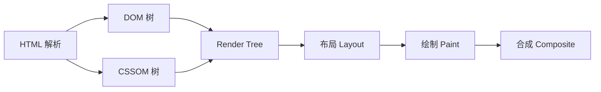
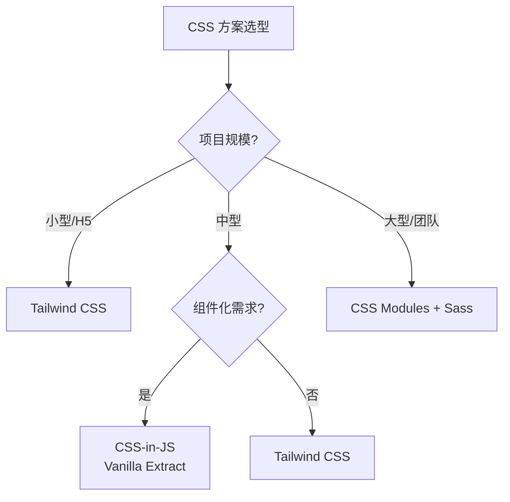

<!--
module:
  parent: note
  slug: 09.front-end/foundation
  type: article
  category: 主模块子文章
  summary: 前端 01 基础
-->

# 01 基础

> 一句话定位：**一切前端运行的基石——浏览器、HTML、CSS 与 Web 标准**

本模块聚焦「浏览器到底做了什么」与「Web 标准的演化逻辑」，是理解后续所有框架 / 工程化 / 性能优化的根基。

---

## 1. 模块导航

| 主题 | 状态 | 说明 |
|------|------|------|
| 浏览器渲染原理 | ✓ 已有 | [browser-rendering/](browser-rendering/) — 进程模型 / 渲染流水线 / 事件循环 / V8 引擎 |
| CSS 工程化 | ✓ 已有 | [css-engineering/](css-engineering/) — 盒模型 / Flex / Grid / Tailwind / CSS Modules |
| HTML 语义化 | 📝 速查 | 顶层覆盖，详见顶层模块 |
| Web 标准 | 📝 速查 | W3C / TC39 / WHATWG 流程，详见顶层模块 |

### 1.1 学习路径

- **入门**：先理解「**浏览器做了什么**」(渲染流水线 / 事件循环)，再学 CSS 方案
- **路径**：[browser-rendering](browser-rendering/) → [css-engineering](css-engineering/)
- **资源**：MDN Web Docs / web.dev / Chrome DevTools 文档

---

## 2. 知识脉络

---

## 3. 速查要点

- **渲染流水线顺序**:DOM → CSSOM → Render Tree → Layout → Paint → Composite(理解这 6 步是性能优化前提)
- **JS 单线程事件循环**:宏任务 + 微任务,理解 await / Promise 的执行时机
- **CSS 布局演进**:Float → Flex(2009)→ Grid(2017)→ Container Queries(2023),新项目直接 Flex / Grid
- **BFC 形成条件**:`overflow: hidden`、`display: flow-root`、`position: absolute` 等,BFC 内元素不影响外部

---

## 4. 选型建议

---

## 5. 最佳实践

- 任何性能问题先回到浏览器渲染流水线找根因(白屏 / 卡顿 / 掉帧)
- CSS 新特性优先 Flex / Grid,避免 Float 布局
- 第三方 UI 库的 CSS 体积用 PurgeCSS / UnoCSS 裁剪
- 使用 Chrome DevTools 的 Performance / Coverage / Lighthouse 三件套做持续监控

---

## 6. 常见面试题

- 从输入 URL 到页面渲染,经历了哪些阶段?每个阶段的优化空间在哪里?
- 重排(reflow)与重绘(repaint)的区别?如何最小化触发?
- CSS 盒模型的 box-sizing 三个取值与适用场景
- BFC 的形成条件与用途,为什么能清浮动 / 阻止边距合并?
- 浏览器进程结构:浏览器进程 / 渲染进程 / GPU 进程 / 网络进程的分工

---

## 7. 与其他模块的关系

- **上游**:无(基础层)
- **下游**:被 [02-language](../02-language/) / [03-frameworks](../03-frameworks/) / [05-architecture](../05-architecture/) / [06-performance](../06-performance/) 复用
- **横向**:[06-performance](../06-performance/) 关注运行时性能,[01 基础] 关注浏览器原理

---

## 📊 本节统计

- **主题数**:4(浏览器渲染 / CSS 工程化 / HTML 语义化 / Web 标准)
- **子 README 数**:2 + 1 顶层 = 3
- **模块导航行数**:4(2 已有 + 2 速查占位)
- **学习路径主题数**:2(入门 / 进阶)
- **面试题数**:5
- **数据快照**:2026-06

---

← [返回前端工程总览](../README.md)
