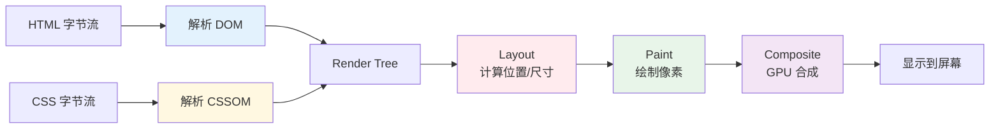

# 01 基础

> 一句话定位：**一切前端运行的基石——浏览器、HTML、CSS 与 Web 标准**

前端工程师写下的每一行 HTML / CSS / JS，最终都要由浏览器解析、布局、渲染、响应用户交互。
本模块聚焦「浏览器到底做了什么」与「Web 标准的演化逻辑」，这是理解后续所有框架 / 工程化 / 性能优化的根基。

---

## 1. 四大主题

| 主题 | 核心内容 | 学习价值 |
|------|---------|---------|
| **浏览器工作原理** | 进程 / 线程模型、Chrome 多进程架构、JS 单线程事件循环、渲染流水线（DOM → CSSOM → Layout → Paint → Composite） | 性能优化、卡顿分析的"根因地图" |
| **HTML 语义化与可访问性** | 语义标签（header/main/article/footer）、ARIA 属性、Landmark、WAI-ARIA 角色、SEO 基础 | 无障碍 / SEO / 团队协作可读性 |
| **CSS 工程化** | 盒模型 / BFC / IFC / 居中方案、Flex / Grid 布局、Sass / Less / PostCSS、CSS Modules / Tailwind / CSS-in-JS | 复杂 UI 可维护性的核心 |
| **Web 标准与 W3C 流程** | 提案 → Working Draft → CR → Recommendation 的演化、CSS WG / TC39 / WHATWG 协作模式 | 预判新技术成熟度，避免选型踩坑 |

---

## 2. 浏览器渲染流水线速查

**关键洞察**：
- Layout / Paint 占用主线程，重排重绘是性能杀手
- Composite 由 GPU 处理，transform / opacity 走合成层，最廉价
- 重排（reflow）一定伴随重绘（repaint），反之不一定

---

## 3. CSS 布局方案决策

| 场景 | 推荐方案 | 原因 |
|------|---------|------|
| **一维布局（导航 / 列表）** | Flexbox | 天然一维、API 简洁 |
| **二维布局（仪表盘 / 卡片网格）** | CSS Grid | 二维控制力、区域定义清晰 |
| **整页布局** | Grid + Flex 嵌套 | Grid 定骨架，Flex 填内容 |
| **居中（水平 + 垂直）** | Flex / Grid `place-items: center` | 一行代码，跨浏览器稳定 |
| **响应式** | `clamp()` + Container Queries + Grid `auto-fit` | 告别多断点 media query |
| **流式文本环绕** | Float / `shape-outside` | 排版需求，布局主力仍是 Grid/Flex |

---

## 4. Web 标准成熟度判断

| 阶段 | 浏览器支持 | 生产可用？ |
|------|----------|----------|
| **Recommendation** | 所有主流浏览器已实现 | ✅ 放心用 |
| **Candidate Recommendation** | 大部分浏览器已实现 | ⚠️ 加 polyfill |
| **Working Draft / Draft** | 仅有部分浏览器实验支持 | ❌ 仅实验性项目 |
| **提案 Stage 3（TC39）** | 需 Babel / TypeScript 转译 | ⚠️ 工具链转译即可用 |
| **提案 Stage 0-2** | 无浏览器实现 | ❌ 仅学习关注 |

**推荐资源**：[Can I Use](https://caniuse.com/)、[MDN](https://developer.mozilla.org/)、[W3C TR](https://www.w3.org/TR/)

---

## 5. 学习路径建议

1. **入门**（1 周）：浏览器渲染流程 + 语义化 HTML + Flex/Grid 基础
2. **进阶**（2 周）：BFC / 盒模型深挖 + CSS 预处理器 + PostCSS 插件链
3. **高级**（1 个月）：W3C 流程理解 + Container Queries / Cascade Layers 新特性 + 浏览器源码阅读（Chromium / WebKit）

## 6. 本模块覆盖

| 主题 | 状态 | 说明 |
|------|------|------|
| 浏览器渲染原理 | ✓ 已有 | [browser-rendering/](browser-rendering/) — 渲染流水线 6 阶段 |
| CSS 工程化 | ✓ 已有 | [css-engineering/](css-engineering/) — Flex / Grid / Tailwind / CSS Modules |
| HTML 语义化 | 速查 | 见第 1 节 |
| Web 标准 | 速查 | 见第 4 节 |

### 面试题深入

- [CSS 优先级](../../13.split-hairs/09.front-end/css-specificity/) — 咬文嚼字
- [从 URL 输入到页面展示](../../13.split-hairs/09.front-end/from-url-to-page/) — 综合题
- [事件循环](../../13.split-hairs/09.front-end/event-loop/) — 宏任务 / 微任务

---

## 7. 交叉引用

- [`02-language/`](../02-language/) — JavaScript 是浏览器唯一原生支持的脚本语言
- [`02.computer-basics/01-network/`](../../../02.computer-basics/01-network/) — HTTP/HTTPS 协议族（与浏览器网络栈配合）
- [`12.story/13-frontend-renovation.md`](../../../12.story/13-frontend-renovation.md) — 阿明餐厅前端翻修故事，第一章讲了加载原理

---

## 8. 与其他模块的关系

- **上游**：无（基础中的基础）
- **下游**：被 `02-language` / `03-frameworks` / `04-engineering` / `05-architecture` / `06-performance` 等所有模块依赖
