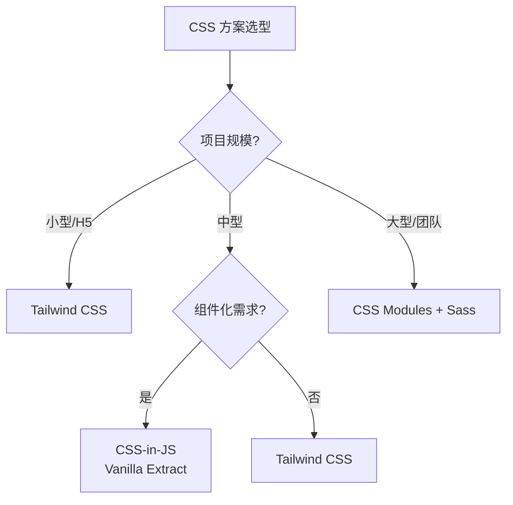

# 01 基础

> 一句话定位：**一切前端运行的基石——浏览器、HTML、CSS 与 Web 标准**

本模块聚焦「浏览器到底做了什么」与「Web 标准的演化逻辑」，是理解后续所有框架 / 工程化 / 性能优化的根基。

---
## 引言：反直觉代码

01 基础 的关键不是语法——是**看起来对**的代码背后那些'踩坑点'。

本篇用 3 个反直觉片段切入，把面试/生产中常被问起、但一深入就漏馅的点摆出来。

---

## 1. 本模块覆盖

| 主题 | 状态 | 说明 |
|------|------|------|
| 浏览器渲染原理 | ✓ 已有 | [browser-rendering/](browser-rendering/) — 进程模型 / 渲染流水线 / 事件循环 / V8 引擎 |
| CSS 工程化 | ✓ 已有 | [css-engineering/](css-engineering/) — 盒模型 / Flex / Grid / Tailwind / CSS Modules |
| HTML 语义化 | 📝 速查 | 顶层覆盖，详见 [📖 章节 1.1](README.md#1-1) |
| Web 标准 | 📝 速查 | W3C / TC39 / WHATWG 流程，详见 [📖 章节 1.2](README.md#1-2) |

---

## 2. 速查要点

- **渲染流水线顺序**：DOM → CSSOM → Render Tree → Layout → Paint → Composite（理解这 6 步是性能优化前提）
- **JS 单线程事件循环**：宏任务 + 微任务，理解 await/Promise 的执行时机
- **CSS 布局演进**：Float → Flex（2009）→ Grid（2017）→ Container Queries（2023），新项目直接 Flex/Grid
- **BFC 形成条件**：`overflow: hidden`、`display: flow-root`、`position: absolute` 等，BFC 内元素不影响外部

---

## 3. 选型建议

---

## 4. 与其他模块的关系

- **上游**：无（基础层）
- **下游**：被 [02-language](../02-language/) / [03-frameworks](../03-frameworks/) / [05-architecture](../05-architecture/) / [06-performance](../06-performance/) 复用
- **横向**：[06-performance](../06-performance/) 关注运行时性能，[01 基础] 关注浏览器原理

---

## 5. 学习建议

- 先理解「**浏览器做了什么**」（渲染流水线、事件循环），再学 CSS 方案
- 推荐阅读顺序：[browser-rendering](browser-rendering/) → [css-engineering](css-engineering/)
- 关键资源：MDN Web Docs / web.dev / Chrome DevTools 文档

---

## 6. 数据时效性

- 浏览器版本相关数据每 6 个月更新（Chrome/Firefox/Safari 每年 4 月/9 月发版）
- Web 标准状态（提案 → CR → REC）每季度更新，参考 [W3C / TC39 官方](https://github.com/tc39/proposals)

---

## 7. 关键术语

| 术语 | 解释 |
|------|------|
| DOM | Document Object Model，文档对象模型 |
| CSSOM | CSS Object Model，CSS 对象模型 |
| BFC | Block Formatting Context，块级格式化上下文 |
| V8 | Chrome / Node.js 使用的 JavaScript 引擎 |
| TC39 | ECMAScript 标准制定委员会 |
| WHATWG | Web Hypertext Application Technology Working Group |