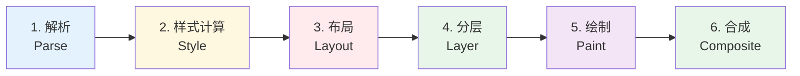
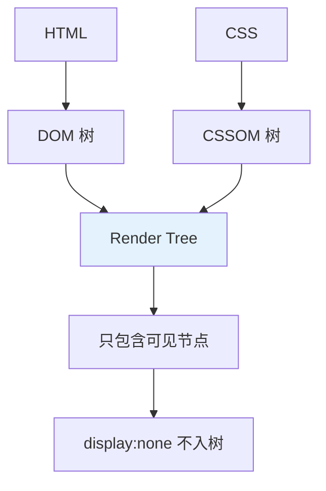
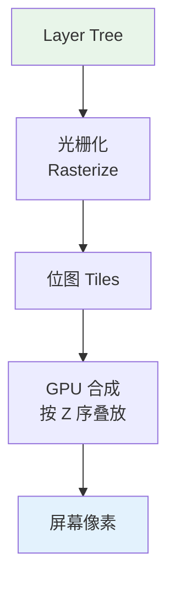
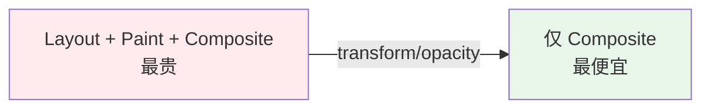

<!--
module:
  parent: front-end
  slug: front-end/browser-rendering
  type: article
  category: 主模块子文章
  summary: 浏览器渲染原理
-->

# 浏览器渲染原理

> 一句话定位：**从 HTML 字节流到屏幕像素 —— 浏览器渲染流水线的 6 个阶段**

浏览器渲染是"前端性能优化"的根因地图。每一个卡顿、每一次重排重绘，都是渲染流水线某个阶段出了问题。

---
---

## 1. 渲染流水线 6 阶段



| 阶段 | 输入 | 输出 | 线程 |
|------|------|------|------|
| **1. 解析** | HTML / CSS 字节流 | DOM 树 + CSSOM 树 | 主线程 |
| **2. 样式计算** | DOM + CSSOM | 计算样式（Computed Style） | 主线程 |
| **3. 布局** | 计算样式 | 几何信息（位置 / 尺寸） | 主线程 |
| **4. 分层** | 布局树 | 渲染层树（Layer Tree） | 主线程 |
| **5. 绘制** | 渲染层树 | 绘制指令（Paint Records） | 主线程 / 光栅化线程 |
| **6. 合成** | 绘制指令 | 屏幕像素 | GPU 合成线程 |

---

## 2. DOM + CSSOM → Render Tree



**关键区别**：
- `display: none` → **不进入** Render Tree（无布局无绘制）
- `visibility: hidden` → **进入** Render Tree（有布局，无绘制）
- `opacity: 0` → 进入 Render Tree，参与布局

---

## 3. 布局（Layout）= 重排（Reflow）

布局阶段计算每个节点的**几何信息**（x, y, width, height）。

**触发布局的操作**：
- 读取几何属性：`offsetWidth` / `offsetHeight` / `getBoundingClientRect()`
- 修改几何属性：`width` / `height` / `top` / `margin`
- 添加 / 删除 DOM 节点
- 修改字体大小
- 窗口 resize

**强制同步布局（Layout Thrashing）**：
```javascript
// ❌ 反模式：循环中交替读写
for (let i = 0; i < 100; i++) {
  const width = el.offsetWidth  // 强制布局
  el.style.width = width + 10 + 'px'  // 失效布局
}

// ✅ 正确：批量读 → 批量写
const widths = Array.from({length: 100}, () => el.offsetWidth)
widths.forEach((w, i) => {
  el.style.width = w + 10 + 'px'
})
```

---

## 4. 绘制与合成

**绘制（Paint）**：生成绘制指令列表（Draw List）。

**合成（Composite）**：
- 把不同 Layer 的内容光栅化（Rasterize）为位图
- GPU 合成线程按 Z 序叠放
- **transform / opacity 修改走合成层，不触发 Layout / Paint**



---

## 5. 性能优化：把操作下推到合成层



| 属性 | 阶段 | 成本 |
|------|------|------|
| `width` / `height` / `top` | Layout + Paint + Composite | ⭐⭐⭐⭐⭐ 最贵 |
| `color` / `background` | Paint + Composite | ⭐⭐⭐ 中 |
| `transform` / `opacity` | 仅 Composite | ⭐ 最便宜 |

**黄金法则**：动画只改 `transform` / `opacity`。

```css
/* ❌ 触发 Layout */
.box { transition: left 0.3s; }
.box.active { left: 100px; }

/* ✅ 走合成层 */
.box { transition: transform 0.3s; }
.box.active { transform: translateX(100px); }
```

---

## 6. Chrome 多进程架构

| 进程 | 作用 | 崩溃影响 |
|------|------|---------|
| **Browser Process** | 地址栏、书签、前后退、网络 | 整个浏览器退出 |
| **Renderer Process** | 每个 Tab 一个，解析 HTML / JS / CSS | 仅该 Tab 崩溃 |
| **GPU Process** | 绘制、合成、视频解码 | 短暂花屏 |
| **Extension Process** | 扩展独立运行 | 仅扩展崩溃 |
| **Service Worker Process** | 后台脚本 | 仅影响相关站点 |

**Site Isolation**：Chrome 8+ 为每个站点（而非每个 Tab）分配独立进程，防止 Spectre 类攻击。

---

## 7. 关键渲染路径（Critical Rendering Path）

**首屏速度的决定因素**：
- HTML 解析遇到 `<script>` → 阻塞 DOM 解析（除非 `defer` / `async`）
- CSS 阻塞渲染（必须构建 CSSOM 才能 Render Tree）
- 关键 CSS 内联 + 异步加载非关键 CSS
- 字体阻塞文本渲染（`font-display: swap` 缓解）

```html
<!-- 最佳实践 -->
<head>
  <!-- 关键 CSS 内联 -->
  <style>/* 首屏关键样式 */</style>
  <!-- 非关键 CSS 异步加载 -->
  <link rel="preload" href="full.css" as="style" onload="this.rel='stylesheet'">
  <!-- JS defer -->
  <script src="app.js" defer></script>
</head>
```

---

## 8. 调试工具

| 工具 | 用途 |
|------|------|
| **DevTools Performance** | 录制主线程活动，分析 Long Task |
| **Rendering 面板 → Paint Flashing** | 高亮重绘区域 |
| **Rendering → Layer Borders** | 显示合成层边界 |
| **Lighthouse** | 综合评分（Performance / Accessibility / SEO） |
| **WebPageTest** | 真实环境渲染测试 |

---

## 9. 学习路径

1. **入门**（3 天）：理解渲染流水线 6 阶段，能在 DevTools Performance 面板识别 Layout / Paint 时间
2. **进阶**（1 周）：强制同步布局识别与修复，动画性能优化
3. **高级**（持续）：Chrome 渲染源码阅读（Blink / V8 / CC）

## 10. 交叉引用

- [`06-performance/`](../../06-performance/) — 性能优化的基础
- [`06-performance/core-web-vitals/`](../../06-performance/core-web-vitals/) — CLS / LCP 与渲染直接相关
- [`01-foundation/`](../) — 浏览器基础

---

← [返回 前端基础](../README.md)
