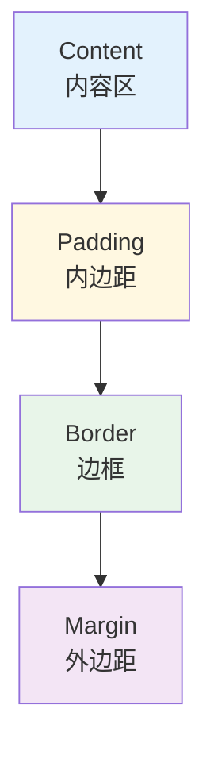
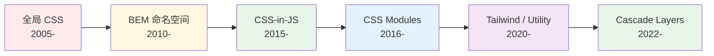

<!--
module:
  parent: front-end
  slug: front-end/css-engineering
  type: article
  category: 主模块子文章
  summary: CSS 工程化
-->

# CSS 工程化

> 一句话定位：**盒模型 / Flex / Grid / Sass / Tailwind / CSS Modules —— 让 CSS 从"样式"变成"可维护的工程资产"**

CSS 是前端最"反直觉"的工程语言：声明式、级联、继承、无作用域。2026 年的 CSS 工程化，核心是把 CSS 从"全局污染"变成"可预测、可复用、可类型化"的工程体系。

---
## 引言：反直觉代码

CSS 工程化 的关键不是语法——是**看起来对**的代码背后那些'踩坑点'。

本篇用 3 个反直觉片段切入，把面试/生产中常被问起、但一深入就漏馅的点摆出来。

---

## 1. CSS 工程化的四大支柱

| 支柱 | 核心问题 | 解决方案 |
|------|---------|---------|
| **布局** | 元素怎么放 | Flexbox / Grid / Container Queries |
| **作用域** | 样式冲突 | CSS Modules / Tailwind / CSS-in-JS |
| **复用** | 样式复用 | Sass/Less / CSS Variables / 组件化 |
| **可维护** | 样式演化 | Design Token / BEM / 主题系统 |

---

## 2. 盒模型与 BFC

### 盒模型（Box Model）



| 盒模型 | width 包含 | 适用 |
|--------|----------|------|
| **content-box**（默认） | 仅内容 | 旧项目 |
| **border-box** | 内容 + padding + border | **所有现代项目默认** |

```css
/* 全局重置（必做） */
*, *::before, *::after {
  box-sizing: border-box;
}
```

### BFC（Block Formatting Context）

**触发条件**：`overflow: hidden`、`display: flow-root`、`float`、`position: absolute/fixed` 等。

**作用**：
- 内部元素不影响外部布局
- 包含浮动元素（清除浮动）
- 阻止 margin 重叠

```css
/* 清除浮动最简方式 */
.parent { display: flow-root; }
```

---

## 3. Flexbox 与 Grid

### Flexbox（一维布局）

```css
/* 经典居中 */
.container {
  display: flex;
  justify-content: center;  /* 主轴 */
  align-items: center;      /* 交叉轴 */
}

/* 经典圣杯布局 */
.page {
  display: flex;
  flex-direction: column;
  min-height: 100vh;
}
.header { flex: 0 0 60px; }
.main { flex: 1; }
.footer { flex: 0 0 60px; }
```

### Grid（二维布局）

```css
/* 响应式卡片网格（无需 media query） */
.grid {
  display: grid;
  grid-template-columns: repeat(auto-fit, minmax(250px, 1fr));
  gap: 16px;
}

/* 圣杯布局（更语义化） */
.page {
  display: grid;
  grid-template-areas:
    "header header"
    "nav    main"
    "footer footer";
  grid-template-columns: 200px 1fr;
  grid-template-rows: auto 1fr auto;
}
```

### 选型决策

| 场景 | 推荐 | 理由 |
|------|------|------|
| 一维布局（导航、列表） | Flex | API 简洁 |
| 二维布局（仪表盘、卡片网格） | Grid | 二维控制力强 |
| 居中 | Flex / Grid `place-items: center` | 一行代码 |
| 响应式 | Grid `auto-fit` + `clamp()` | 无 media query |
| 整页骨架 | Grid + Flex 嵌套 | Grid 定骨架，Flex 填内容 |

---

## 4. CSS 作用域方案演进



| 方案 | 作用域 | 适用 |
|------|--------|------|
| **BEM** | 命名约定 `.block__element--modifier` | 老项目、无构建 |
| **CSS Modules** | 编译时 hash | Vite / CRA 默认 |
| **CSS-in-JS**（styled-components） | 运行时生成 hash | 动态主题需求 |
| **Tailwind** | 原子类组合 | 现代项目首选 |
| **Cascade Layers**（`@layer`） | 样式优先级分层 | CSS 原生方案 |

### CSS Modules 示例

```css
/* Button.module.css */
.button { padding: 8px 16px; }
.primary { background: blue; }
```

```tsx
// Button.tsx
import styles from './Button.module.css'
<button className={`${styles.button} ${styles.primary}`}>Click</button>
// → <button class="Button_button_a1b2c Button_primary_d3e4f">
```

---

## 5. Tailwind CSS（2026 主流方案）

**理念**：原子类（Utility Classes）直接写在 HTML，无需写 CSS 文件。

```html
<button class="px-4 py-2 bg-blue-600 text-white rounded hover:bg-blue-700">
  Click
</button>
```

**优势**：
- ✅ 无作用域问题（类名全局唯一）
- ✅ 产物体积极小（只打包用到的类）
- ✅ 响应式设计简单（`md:` / `lg:` 前缀）
- ✅ 暗色模式简单（`dark:` 前缀）
- ✅ 与设计系统完美契合（Theme 配置 Token）

**劣势**：
- ❌ 类名冗长
- ❌ 需要学习成本
- ❌ HTML 与样式强耦合

### Tailwind v4（2025-2026）

- ✅ 基于 Rust 重写（`@tailwindcss/postcss`），性能提升 10x+
- ✅ 零配置，自动内容检测
- ✅ CSS-first 配置（无需 `tailwind.config.js`）

```css
/* app.css */
@import "tailwindcss";

@theme {
  --color-primary: #1976d2;
  --font-display: "Inter", sans-serif;
}
```

---

## 6. CSS 预处理器（Sass / Less）

| 特性 | Sass | Less |
|------|------|------|
| 语法 | SCSS（CSS 超集）/ SASS（缩进） | CSS 超集 |
| 变量 | `$var` | `@var` |
| 嵌套 | ✅ | ✅ |
| Mixin | `@mixin` / `@include` | `.mixin()` |
| 函数 | `@function` | 内置函数 |
| 2026 定位 | 仍在使用但被 Tailwind 挤压 | 老项目维护 |

**Sass 现代用法**：
```scss
// _variables.scss
$primary: #1976d2;

// _mixins.scss
@mixin respond-to($breakpoint) {
  @media (min-width: map-get($breakpoints, $breakpoint)) {
    @content;
  }
}

// Button.scss
.button {
  background: $primary;
  @include respond-to('md') { padding: 12px 24px; }
}
```

---

## 7. CSS 新特性（2024-2026）

| 特性 | 作用 | 浏览器支持 |
|------|------|----------|
| **Container Queries** | 基于父容器宽度响应式 | ✅ 所有主流 |
| **Cascade Layers**（`@layer`） | 样式优先级分层 | ✅ 所有主流 |
| **`:has()` 选择器** | "父选择器"，终于可用 | ✅ 所有主流 |
| **`color-mix()`** | 颜色混合 | ✅ 所有主流 |
| **Subgrid** | 子网格继承父网格 | ✅ 所有主流 |
| **`@scope`** | 样式作用域（实验性） | Chrome 118+ |
| **`@property`** | 自定义属性的类型化 | ✅ Chrome/Safari |
| **View Transitions** | 页面过渡动画 | ⚠️ Chrome 111+ |

### Container Queries 示例

```css
.card-container { container-type: inline-size; }

@container (min-width: 400px) {
  .card { flex-direction: row; }
}
```

---

## 8. Design Token 与主题

```css
/* tokens.css */
:root {
  --color-primary: #1976d2;
  --color-bg: #ffffff;
  --spacing-md: 16px;
  --font-size-md: 16px;
}

[data-theme="dark"] {
  --color-primary: #90caf9;
  --color-bg: #121212;
}
```

```tsx
// Button.tsx
<button style={{ 
  background: 'var(--color-primary)', 
  padding: 'var(--spacing-md)' 
}}>
  Click
</button>
```

详见 → [../../05-architecture/design-system/](../../05-architecture/design-system/)

---

## 9. 学习路径

1. **入门**（1 周）：盒模型 + Flex + Grid 三大基础
2. **进阶**（2 周）：BFC + CSS Modules + Tailwind 实战
3. **高级**（持续）：Container Queries + Cascade Layers + Design Token 体系

## 10. 交叉引用

- [`05-architecture/design-system/`](../../05-architecture/design-system/) — Design Token 与主题系统
- [`06-performance/`](../../06-performance/) — CSS 对性能的影响
- [`01-foundation/browser-rendering/`](../browser-rendering/) — CSS 解析与渲染流水线
