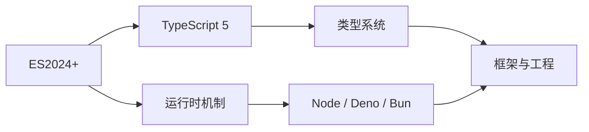
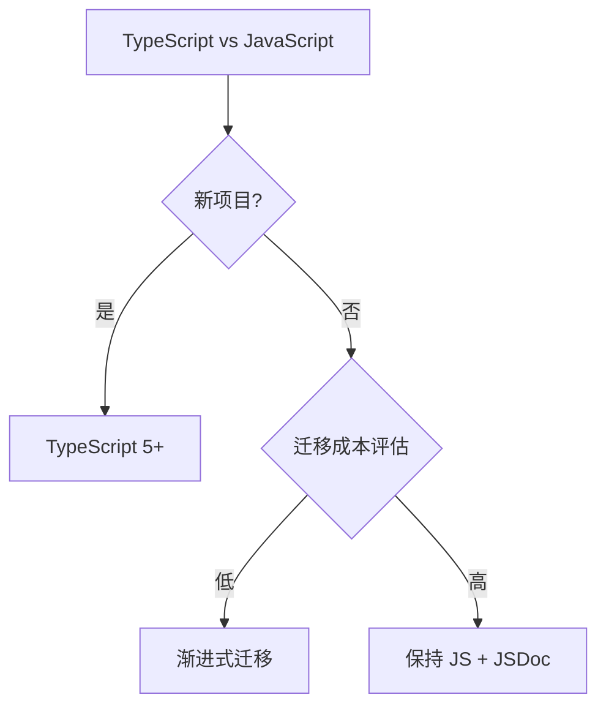

<!--
module:
  parent: note
  slug: 09.front-end/language
  type: article
  category: 主模块子文章
  summary: 前端 02 语言
-->

# 02 语言

> 一句话定位：**JavaScript / TypeScript / 运行时——前端工程师的「母语」**

本模块覆盖现代 JavaScript(ES2024-2026)、TypeScript 5 工程实践、Node.js / 浏览器运行时机制,是前端开发的语言层基础。

---

## 1. 模块导航

| 主题 | 状态 | 说明 |
|------|------|------|
| TypeScript 5 | ✓ 已有 | [typescript/](typescript/) — 类型体操 / 泛型 / 装饰器 / 工程配置 |
| 运行时机制 | ✓ 已有 | [runtime/](runtime/) — V8 / 事件循环 / Node.js 进阶 |

### 1.1 学习路径

- **入门**:先掌握 ES2024+ 新特性,再学 TypeScript 5
- **TypeScript 路径**:`typescript/` 子 README 入门 + 高级类型实战
- **运行时路径**:`runtime/` 子 README 事件循环 → Node.js 进阶

---

## 2. 知识脉络

---

## 3. 速查要点

- **ES2024-2026 新特性**:Array.groupBy、Array.toSorted、Promise.withResolvers、Iterator helpers、Records & Tuples(Stage 2)
- **TypeScript 类型体操边界**:超过 3 层嵌套的 Conditional Type 应拆分;类型不必要时用 `unknown` 替代 `any`
- **Node.js 异步演进**:Callback → Promise → async/await → Worker Threads → 模块联邦
- **模块化方案**:CJS(Node 默认)vs ESM(浏览器标准)vs Dynamic Import(按需加载)

---

## 4. 选型建议

---

## 5. 最佳实践

- 新项目直接 TypeScript 5 strict 模式,而不是 JS + JSDoc
- 类型不必要时优先 `unknown` + 类型守卫,而非 `any` 静默吞错
- Node.js 异步演进路线:Callback → Promise → async/await → Worker Threads
- CJS 与 ESM 互操作用 `import()` 动态加载,避免打包器兼容性问题

---

## 6. 常见面试题

- ES Module 与 CommonJS 的循环依赖处理差异
- Promise A+ 规范:thenable / 微任务队列 / 错误冒泡
- TypeScript `unknown` 与 `any` 的本质区别,何时用判别联合?
- 类型守卫(type guard)与类型断言的区别
- Node.js 事件循环的阶段划分:timers / pending callbacks / poll / check / close callbacks

---

## 7. 与其他模块的关系

- **上游**:[01-foundation](../01-foundation/)(浏览器原理)
- **下游**:被 [03-frameworks](../03-frameworks/) / [04-engineering](../04-engineering/) / [09-frontend-and-ai](../09-frontend-and-ai/) 依赖
- **横向**:[05-architecture](../05-architecture/) 关注架构选型,[02 语言] 关注语言本身

---

## 📊 本节统计

- **主题数**:2(TypeScript 5 / 运行时机制)
- **子 README 数**:2 + 1 顶层 = 3
- **模块导航行数**:2(全已有)
- **学习路径主题数**:2(TS 路径 / 运行时路径)
- **面试题数**:5
- **数据快照**:2026-06

---

← [返回前端工程总览](../README.md)
