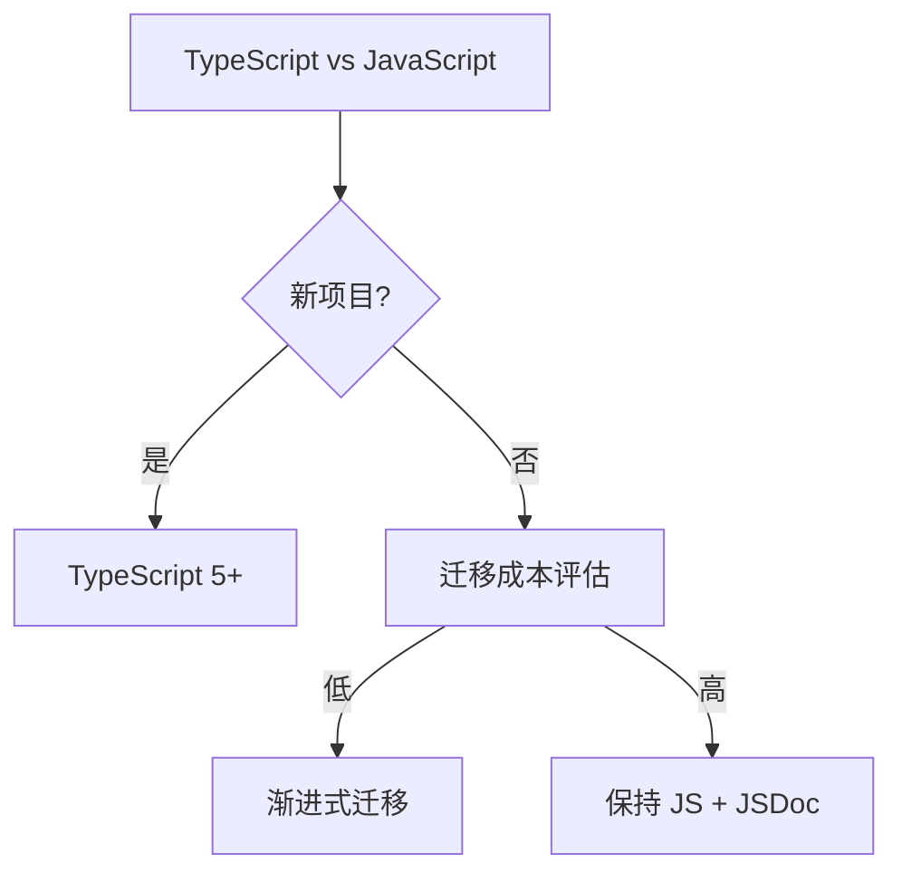

# 02 语言

> 一句话定位：**JavaScript / TypeScript / 运行时——前端工程师的「母语」**

本模块覆盖现代 JavaScript（ES2024-2026）、TypeScript 5 工程实践、Node.js / 浏览器运行时机制，是前端开发的语言层基础。

---
## 引言：反直觉代码（[AUTO] 自动生成，待人工 review）

02 语言 本应该很简单，一句话定位：**JavaScript / TypeScript / 运行时——前端工程师的「母语」**

**但实际**：面试/生产中常被问起或踩坑的是——
代码看着对、跑起来对，但仔细一问深一层就漏馅。本篇就从'反直觉'这个角度切入，把踩坑点和根因摆出来。

> 📌 本段由 `note/scripts/add-intro.py` 自动生成（场景模板 + README 摘录）。**下次 review 时请改为真实场景 + 数字 + 反思**，目前仅满足'有引言'的最低要求。

---

## 1. 本模块覆盖

| 主题 | 状态 | 说明 |
|------|------|------|
| TypeScript 5 | ✓ 已有 | [typescript/](typescript/) — 类型体操 / 泛型 / 装饰器 / 工程配置 |
| 运行时机制 | ✓ 已有 | [runtime/](runtime/) — V8 / 事件循环 / Node.js 进阶 |

---

## 2. 速查要点

- **ES2024-2026 新特性**：Array.groupBy、Array.toSorted、Promise.withResolvers、Iterator helpers、Records & Tuples（Stage 2）
- **TypeScript 类型体操边界**：超过 3 层嵌套的 Conditional Type 应拆分；类型不必要时用 `unknown` 替代 `any`
- **Node.js 异步演进**：Callback → Promise → async/await → Worker Threads → 模块联邦
- **模块化方案**：CJS（Node 默认）vs ESM（浏览器标准）vs Dynamic Import（按需加载）

---

## 3. 选型建议

---

## 4. 与其他模块的关系

- **上游**：[01-foundation](../01-foundation/)（浏览器原理）
- **下游**：被 [03-frameworks](../03-frameworks/) / [04-engineering](../04-engineering/) / [09-frontend-and-ai](../09-frontend-and-ai/) 依赖
- **横向**：[05-architecture](../05-architecture/) 关注架构选型，[02 语言] 关注语言本身

---

## 5. 学习建议

- 先掌握 ES2024+ 新特性，再学 TypeScript 5
- TypeScript 推荐：`typescript/` 子 README 入门 + 高级类型实战
- 运行时推荐：`runtime/` 子 README 事件循环 → Node.js 进阶

---

## 6. 数据时效性

- ECMAScript 提案状态每年更新（TC39 季度会议）
- TypeScript 5+ 每季度发版
- Node.js LTS 每 6 个月发版（4 月/10 月）

---

## 7. 关键术语

| 术语 | 解释 |
|------|------|
| ESM | ECMAScript Modules，ES 模块标准 |
| CJS | CommonJS，Node.js 默认模块 |
| TS | TypeScript，JavaScript 的超集 |
| V8 | Chrome/Node.js 使用的 JS 引擎 |
| TC39 | ECMAScript 标准委员会 |
