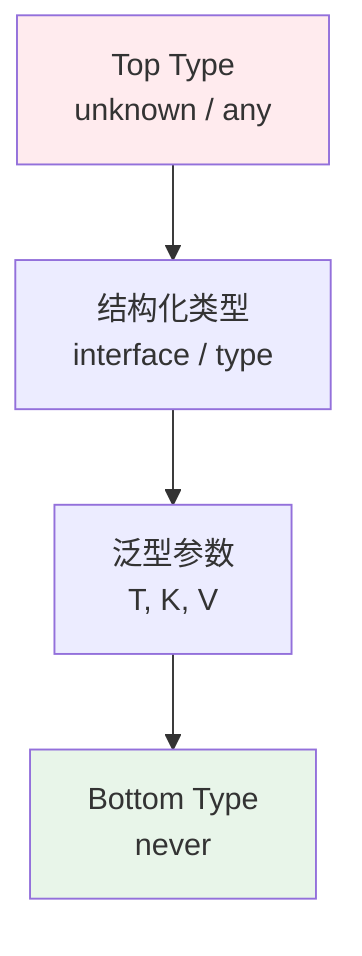

# TypeScript 工程实践

> 一句话定位：**从"any 逃生舱"到"类型即文档" —— TypeScript 5 的工程化最佳实践**

TypeScript 在 2026 年已经是 85%+ 新项目的默认选择。但"会用 TS"和"用好 TS"之间有巨大鸿沟 —— 后者意味着掌握泛型、条件类型、类型守卫、tsconfig 工程配置。

---
## 引言：反直觉代码

TypeScript 工程实践 的关键不是语法——是**看起来对**的代码背后那些'踩坑点'。

本篇用 3 个反直觉片段切入，把面试/生产中常被问起、但一深入就漏馅的点摆出来。

---

## 1. TypeScript 类型层级



| 类型 | 行为 | 适用 |
|------|------|------|
| `any` | 关闭类型检查 | **禁用**，仅临时逃生 |
| `unknown` | 安全顶层，必须 narrowing | 输入校验前置 |
| `never` | 底层类型，不可达 | 穷举检查、错误抛出 |
| `interface` | 可声明合并，命名清晰 | 业务模型 |
| `type` | 灵活，支持联合/交叉 | 复杂类型运算 |

---

## 2. 类型体操：实用工具

### 2.1 内置工具类型

```typescript
// Partial<T>：所有属性可选
type PartialUser = Partial<User>

// Required<T>：所有属性必选
type RequiredUser = Required<User>

// Pick<T, K>：挑选属性
type UserPreview = Pick<User, 'id' | 'name'>

// Omit<T, K>：排除属性
type UserWithoutPassword = Omit<User, 'password'>

// Record<K, V>：键值对
type UserMap = Record<string, User>

// Exclude / Extract
type Status = 'active' | 'inactive' | 'pending'
type ActiveStatus = Exclude<Status, 'inactive'>  // 'active' | 'pending'
```

### 2.2 自定义工具类型

```typescript
// DeepReadonly：递归只读
type DeepReadonly<T> = {
  readonly [K in keyof T]: T[K] extends object ? DeepReadonly<T[K]> : T[K]
}

// DeepPartial：递归可选
type DeepPartial<T> = {
  [K in keyof T]?: T[K] extends object ? DeepPartial<T[K]> : T[K]
}

// 路径类型：获取对象的所有路径
type Paths<T, D = 10> = [D] extends [never]
  ? never
  : T extends object
    ? { [K in keyof T]: K extends string ? `${K}` | `${K}.${Paths<T[K], Prev[D]>}` : never }[keyof T]
    : never
```

---

## 3. 泛型模式

### 3.1 基础泛型

```typescript
function identity<T>(value: T): T {
  return value
}

const x = identity<number>(42)  // 显式指定
const y = identity(42)          // 自动推导
```

### 3.2 泛型约束

```typescript
// 约束 T 必须有 length
function logLength<T extends { length: number }>(value: T): void {
  console.log(value.length)
}

logLength('hello')     // ✅
logLength([1, 2, 3])   // ✅
logLength(42)          // ❌
```

### 3.3 泛型工具函数

```typescript
// 类型安全的 Object.keys
function typedKeys<T extends object>(obj: T): Array<keyof T> {
  return Object.keys(obj) as Array<keyof T>
}

// 类型安全的 Array.groupBy
function groupBy<T, K extends string>(
  arr: T[],
  keyFn: (item: T) => K
): Record<K, T[]> {
  return arr.reduce((acc, item) => {
    const key = keyFn(item)
    ;(acc[key] ??= []).push(item)
    return acc
  }, {} as Record<K, T[]>)
}
```

---

## 4. 条件类型与 `infer`

```typescript
// 条件类型
type IsString<T> = T extends string ? true : false

type A = IsString<'hello'>  // true
type B = IsString<42>       // false

// infer：从类型中"提取"
type ReturnType2<T> = T extends (...args: any[]) => infer R ? R : never

type Fn = (x: number) => string
type R = ReturnType2<Fn>  // string

// 提取 Promise 内部的类型
type UnwrapPromise<T> = T extends Promise<infer U> ? U : T

type A = UnwrapPromise<Promise<string>>  // string
type B = UnwrapPromise<number>           // number
```

---

## 5. 模板字面量类型

```typescript
// 字符串拼接类型
type EventName = `on${Capitalize<'click' | 'hover' | 'focus'>}`
// 'onClick' | 'onHover' | 'onFocus'

// API 路径类型
type ApiPath = `/api/${'users' | 'posts'}/${string}`
// '/api/users/...' | '/api/posts/...'

// 提取路径参数
type ExtractRouteParams<T extends string> =
  T extends `${string}:${infer Param}/${infer Rest}`
    ? Param | ExtractRouteParams<Rest>
    : T extends `${string}:${infer Param}`
      ? Param
      : never

type P = ExtractRouteParams<'/users/:id/posts/:postId'>
// 'id' | 'postId'
```

---

## 6. 类型守卫（Type Guards）

```typescript
// is 关键字（类型谓词）
function isUser(obj: unknown): obj is User {
  return (
    typeof obj === 'object' &&
    obj !== null &&
    'id' in obj &&
    'name' in obj
  )
}

// 使用
const data: unknown = fetchData()
if (isUser(data)) {
  console.log(data.name)  // ✅ 类型已收窄为 User
}
```

```typescript
// 判别联合类型
type Result<T> = 
  | { ok: true; data: T }
  | { ok: false; error: Error }

function handle(result: Result<User>) {
  if (result.ok) {
    console.log(result.data.name)  // ✅ 类型已收窄
  } else {
    console.error(result.error)
  }
}
```

---

## 7. tsconfig 工程配置

```json
{
  "compilerOptions": {
    // 严格模式（必开）
    "strict": true,
    "noImplicitAny": true,
    "strictNullChecks": true,
    "noUnusedLocals": true,
    "noUnusedParameters": true,
    
    // 模块解析
    "module": "ESNext",
    "moduleResolution": "Bundler",
    "target": "ES2022",
    "lib": ["ES2022", "DOM", "DOM.Iterable"],
    
    // 类型
    "types": ["vitest/globals"],
    
    // 路径别名
    "baseUrl": ".",
    "paths": {
      "@/*": ["src/*"]
    },
    
    // 输出
    "declaration": true,
    "declarationMap": true,
    "sourceMap": true,
    "outDir": "./dist",
    
    // 互操作
    "esModuleInterop": true,
    "allowSyntheticDefaultImports": true,
    "resolveJsonModule": true,
    "isolatedModules": true,
    
    // 跳过库检查（加速）
    "skipLibCheck": true
  },
  "include": ["src/**/*"],
  "exclude": ["node_modules", "dist"]
}
```

---

## 8. 类型与运行时：Zod 验证

**类型是编译时的，运行时输入必须校验**：

```typescript
import { z } from 'zod'

// 定义 schema
const UserSchema = z.object({
  id: z.string().uuid(),
  name: z.string().min(1),
  email: z.string().email(),
  age: z.number().int().positive().optional(),
})

// 推导类型
type User = z.infer<typeof UserSchema>

// 运行时校验
function parseUser(data: unknown): User {
  return UserSchema.parse(data)  // 失败抛错
}

// 或安全解析
const result = UserSchema.safeParse(data)
if (result.success) {
  console.log(result.data)
} else {
  console.error(result.error)
}
```

---

## 9. 常见反模式

| 反模式 | 症状 | 正确做法 |
|--------|------|---------|
| **any 泛滥** | 失去类型保护 | 用 `unknown` + 类型守卫 |
| **类型断言滥用** | `as any` / `as User` | 用 Zod 校验 |
| **过度泛型** | 类型难懂 | 适度泛型，优先具体类型 |
| **enum 滥用** | 运行时开销 + 类型不友好 | 用 `as const` 联合 |
| **命名空间** | ES modules 已取代 | 用 ES modules |

```typescript
// ❌ enum
enum Status { Active, Inactive }

// ✅ as const 联合
const STATUS = {
  ACTIVE: 'active',
  INACTIVE: 'inactive',
} as const
type Status = typeof STATUS[keyof typeof STATUS]
```

---

## 10. 学习路径

1. **入门**（1 周）：基础类型 + interface + 函数类型
2. **进阶**（2 周）：泛型 + 类型守卫 + tsconfig 工程配置
3. **高级**（持续）：条件类型 + `infer` + Zod 运行时校验

## 11. 交叉引用

- [`02-language/`](../) — 语言总览
- [`04-engineering/`](../../04-engineering/) — TS 与构建工具集成
- [`05-architecture/`](../../05-architecture/) — TS 在架构选型中的角色
