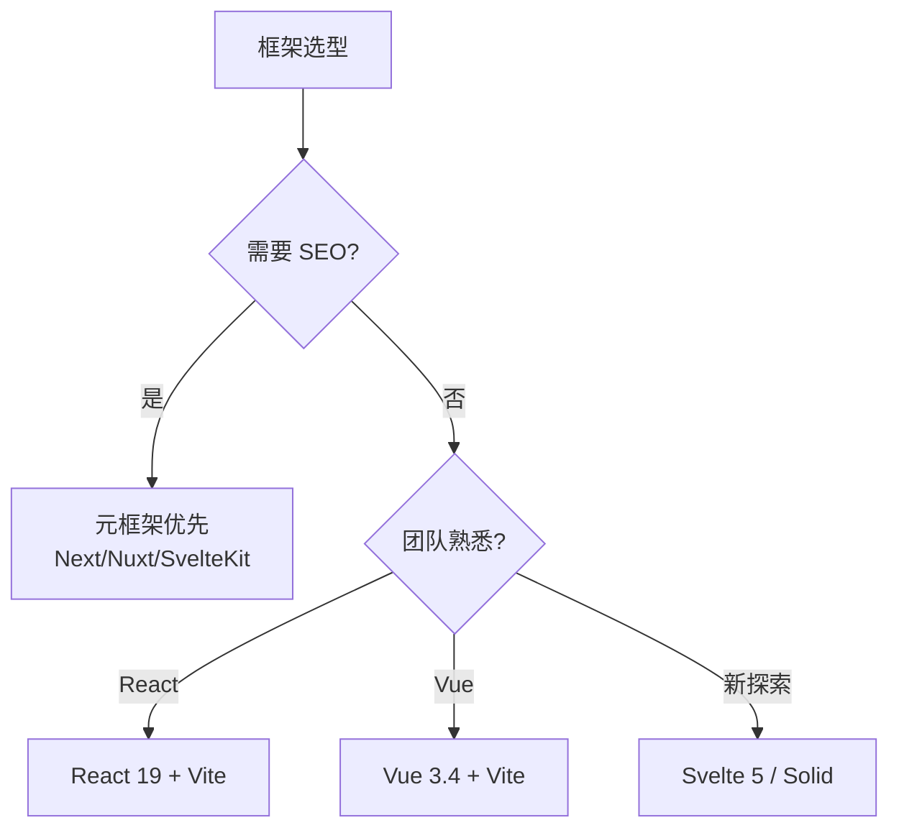

<!--
module:
  parent: note
  slug: 09.front-end/frameworks
  type: article
  category: 主模块子文章
  summary: 前端 03 框架
-->

# 03 框架

> 一句话定位：**UI 框架——声明式 UI / 组件化 / 响应式更新的现代范式**

本模块覆盖 React 19 / Vue 3.4+ / Svelte 5 / Solid / Astro / htmx 等主流前端框架,对比范式、渲染策略、生态成熟度。

---

## 1. 模块导航

| 主题 | 状态 | 说明 |
|------|------|------|
| React 19 | ✓ 已有 | [react/](react/) — Hooks / RSC / Server Actions / Compiler |
| Vue 3.4+ | ✓ 已有 | [vue/](vue/) — Composition API / Pinia / Vapor |
| Svelte 5 | 📝 速查 | runes 模式 / 编译时优化,详见顶层速查 |
| Solid | 📝 速查 | 细粒度响应式 / 性能优先,详见顶层速查 |
| Astro 4 | 📝 速查 | Islands 架构 / 内容型站点,详见顶层速查 |
| htmx | 📝 速查 | HTML over the wire / 服务端增强,详见顶层速查 |

### 1.1 学习路径

- **入门**:选 1 个框架深入(React 或 Vue),不要同时学多个
- **路径**:[02-language](../02-language/) → [react](react/) 或 [vue](vue/) → [05-architecture](../05-architecture/)
- **资源**:官方文档 + 实战项目(不要只读教程)

---

## 2. 知识脉络

---

## 3. 速查要点

- **选框架先看 SEO**:需要 SEO 选 Next / Nuxt / SvelteKit;不需要选 Vite + React / Vue
- **看团队熟悉度**:React 团队学 Vue 上手 1-2 周;Vue 团队学 React 同样 1-2 周
- **看应用规模**:10 万行代码以上 → React(生态)/ Vue 3.4(DX);5 万行以下 → Svelte(DX + 性能)
- **看状态管理**:React 配 Zustand / Jotai;Vue 配 Pinia;Svelte 用内置 store

---

## 4. 核心框架

| 框架 | 范式 | 渲染策略 | 状态管理 | 学习曲线 | 适用场景 |
|------|------|---------|---------|---------|---------|
| React 19 | 声明式/函数式 | 客户端 + RSC | 外部库 | 中 | 大型应用 / 生态丰富 |
| Vue 3.4 | 声明式/响应式 | 客户端 + SSR | Pinia | 低-中 | 中小型 / 团队上手快 |
| Svelte 5 | 编译时 | 客户端 | 内置 store | 低 | 高性能小应用 |
| Solid | 细粒度响应 | 客户端 | 内置 signal | 中 | 高性能 / 类 React 语法 |
| Astro | 多框架 + Islands | 静态 + 局部注水 | 框架自带 | 低 | 内容型站点 |
| htmx | HTML over the wire | 服务端 | 弱 | 低 | 服务端渲染增强 |

---

## 5. 最佳实践

- 选框架以「团队规模 × 渲染策略 × 生态适配」三维决策,避免单纯技术崇拜
- React 项目坚持「RSC 优先」,数据密集型场景用 Server Components
- Vue 3.4+ 项目首选 `<script setup>` + Pinia,避免 Options API 残留
- Svelte 5 runes 替代 reactive 声明式,响应式更显式

---

## 6. 常见面试题

- React Fiber 架构解决了什么问题?为什么需要可中断渲染?
- Vue 3 的 Proxy 响应式相比 Vue 2 的 defineProperty 解决了哪些局限?
- RSC(Server Components)与 SSR 的本质区别?什么时候必须用 Client Component?
- 编译时框架(Svelte / Solid)与运行时框架(React / Vue)的核心权衡
- htmx / Astro Islands 适用什么场景?与 SPA 思路的根本差异

---

## 7. 与其他模块的关系

- **上游**:[01-foundation](../01-foundation/) / [02-language](../02-language/)
- **下游**:被 [04-engineering](../04-engineering/) / [05-architecture](../05-architecture/) / [06-performance](../06-performance/) / [08-cross-platform](../08-cross-platform/) 依赖
- **横向**:[05-architecture](../05-architecture/) 关注架构选型([03] 框架 + [05] 架构 + [04] 工程化共同决定)

---

## 📊 本节统计

- **主题数**:6(React 19 / Vue 3.4+ / Svelte 5 / Solid / Astro / htmx)
- **子 README 数**:2 + 1 顶层 = 3
- **模块导航行数**:6(2 已有 + 4 速查占位)
- **学习路径主题数**:2(单框架深入 / 主链延伸)
- **面试题数**:5
- **数据快照**:2026-06

## 📝 可访问性（a11y）最佳实践

| 框架 | a11y 支持 | 推荐工具 | 关键实践 |
|------|----------|---------|---------|
| **React 19** | 原生支持 `aria-*` props | `eslint-plugin-jsx-a11y` / `react-aria` | 组件库优先选 WAI-ARIA 合规的（如 Radix UI / Reach UI） |
| **Vue 3.4+** | 内置 a11y 规则 | `eslint-plugin-vue` + `vue-axe` | 使用 `<button>` / `<nav>` 等语义化标签；避免 `div` 模拟按钮 |
| **Svelte 5** | 编译器内置 a11y 警告 | `svelte-a11y` | 运行时自动检测缺失的 `alt` / `aria-label` |
| **Solid** | 原生支持 | `solid-aria` | 类似 React，但更轻量 |
| **Astro** | 静态 HTML 天然友好 | `astro-aria` |  islands 架构需确保动态部分有 `aria-live` |
| **htmx** | 服务端渲染友好 | 无 | 需手动添加 ARIA；htmx 请求后需更新 `aria-live` 区域 |

**通用建议**：
- 键盘导航：所有交互元素可通过 Tab / Enter / Esc 操作
- 颜色对比：文本与背景对比度 ≥ 4.5:1（WCAG AA）
- 屏幕阅读器：测试 VoiceOver / NVDA / JAWS
- 自动化检测：Lighthouse a11y 审计 ≥ 90 分

---

← [返回前端工程总览](../README.md)
