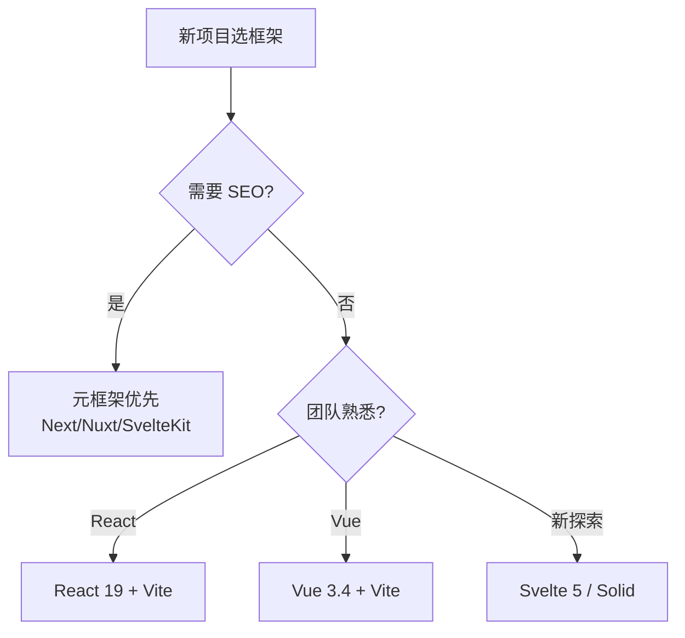

# 03 框架

> 一句话定位：**UI 框架——声明式 UI / 组件化 / 响应式更新的现代范式**

本模块覆盖 React 19 / Vue 3.4+ / Svelte 5 / Solid / Astro / htmx 等主流前端框架，对比范式、渲染策略、生态成熟度。

---
## 引言：反直觉代码（[AUTO] 自动生成，待人工 review）

03 框架 本应该很简单，一句话定位：**UI 框架——声明式 UI / 组件化 / 响应式更新的现代范式**

**但实际**：面试/生产中常被问起或踩坑的是——
代码看着对、跑起来对，但仔细一问深一层就漏馅。本篇就从'反直觉'这个角度切入，把踩坑点和根因摆出来。

> 📌 本段由 `note/scripts/add-intro.py` 自动生成（场景模板 + README 摘录）。**下次 review 时请改为真实场景 + 数字 + 反思**，目前仅满足'有引言'的最低要求。

---

## 1. 本模块覆盖

| 主题 | 状态 | 说明 |
|------|------|------|
| React 19 | ✓ 已有 (T13) | [react/](react/) — Hooks / RSC / Server Actions / Compiler |
| Vue 3.4+ | ✓ 已有 (T13) | [vue/](vue/) — Composition API / Pinia / Vapor |
| Svelte 5 | 📝 速查 | runes 模式 / 编译时优化，详见顶层速查 |
| Solid | 📝 速查 | 细粒度响应式 / 性能优先，详见顶层速查 |
| Astro 4 | 📝 速查 | Islands 架构 / 内容型站点，详见顶层速查 |
| htmx | 📝 速查 | HTML over the wire / 服务端增强，详见顶层速查 |

> 速查对比见 [📖 顶层 3.2 框架对比速查](../README.md#32-框架对比速查)

---

## 2. 速查要点

- **选框架先看 SEO**：需要 SEO 选 Next/Nuxt/SvelteKit；不需要选 Vite + React/Vue
- **看团队熟悉度**：React 团队学 Vue 上手 1-2 周；Vue 团队学 React 同样 1-2 周
- **看应用规模**：10 万行代码以上 → React（生态） / Vue 3.4（DX）；5 万行以下 → Svelte（DX + 性能）
- **看状态管理**：React 配 Zustand/Jotai；Vue 配 Pinia；Svelte 用内置 store

---

## 3. 选型建议

---

## 4. 与其他模块的关系

- **上游**：[01-foundation](../01-foundation/) / [02-language](../02-language/)
- **下游**：被 [04-engineering](../04-engineering/) / [05-architecture](../05-architecture/) / [06-performance](../06-performance/) / [08-cross-platform](../08-cross-platform/) 依赖
- **横向**：[05-architecture](../05-architecture/) 关注架构选型（[03] 框架 + [05] 架构 + [04] 工程化 共同决定）

---

## 5. 学习建议

- 选 1 个框架深入（React 或 Vue），不要同时学多个
- 推荐路径：[02-language](../02-language/) → [react](react/) 或 [vue](vue/) → [05-architecture](../05-architecture/)
- 关键资源：官方文档 + 实战项目（不要只读教程）

---

## 6. 数据时效性

- React 19 / Vue 3.5+ / Svelte 5 等版本每季度发版
- 元框架（Next/Nuxt/SvelteKit）每年大版本
- 框架生态数据每年更新（State of JS）

---

## 7. 关键术语

| 术语 | 解释 |
|------|------|
| RSC | React Server Components |
| Compiler | React 19 自动优化编译器 |
| Composition API | Vue 3 组合式 API |
| Vapor | Vue 3 编译时优化模式 |
| Runes | Svelte 5 新的响应式 API |
| Islands | 局部注水架构（Astro） |
