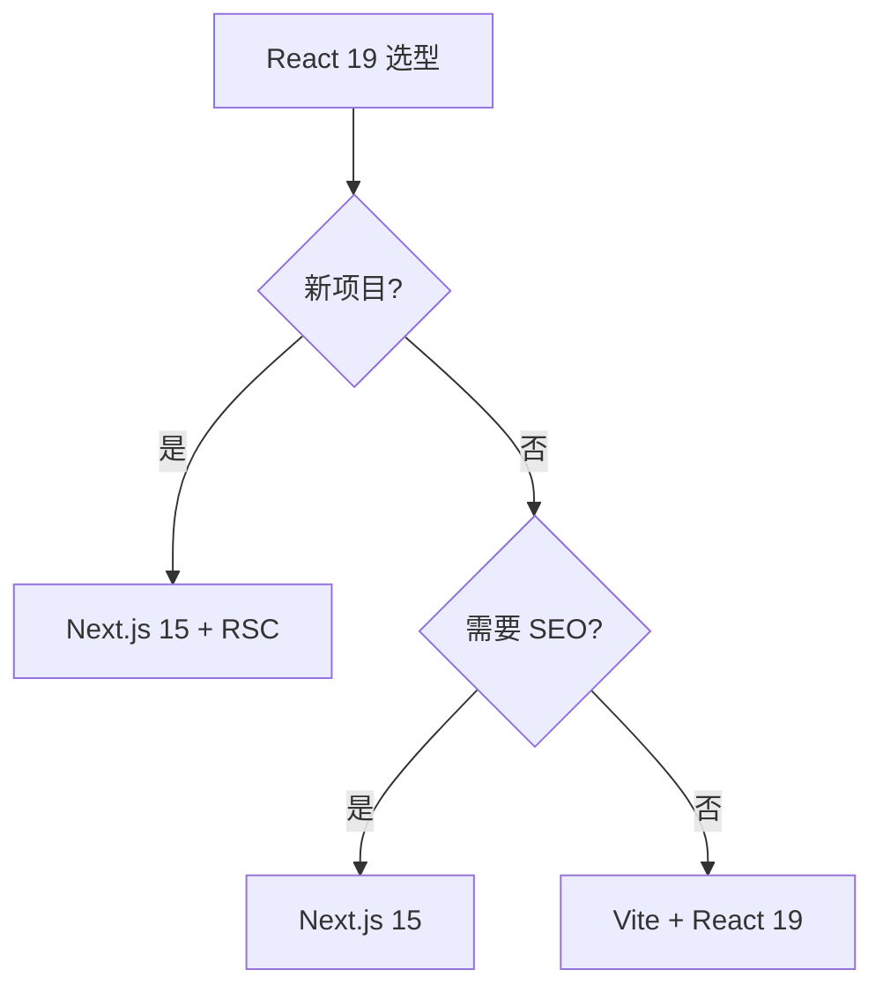

# React 19

> 一句话定位：**React 19 — Hooks + RSC + Compiler 的现代 React 全景**

## 1. 一句话定位

React 是 Facebook 2013 年开源的 UI 库，2024 年发布 React 19，带来 Server Components、Actions、Compiler 等新特性。本文档聚焦 React 19 生态与工程实践。

## 2. 核心能力

- **Hooks 体系**：useState / useEffect / useMemo / useCallback / useRef / useContext
- **Concurrent Rendering**：useTransition / useDeferredValue / 自动批处理
- **Server Components (RSC)**：服务端组件，零客户端 JS
- **Server Actions**：服务端函数，直接在客户端调用
- **Compiler (React 19)**：自动 useMemo / useCallback 优化
- **Suspense**：异步加载占位

## 3. 生态速查

| 类别 | 推荐 | 备选 |
|------|------|------|
| 路由 | React Router 7 | TanStack Router |
| 状态 | Zustand | Jotai / Redux Toolkit |
| 数据 | TanStack Query | SWR |
| 表单 | React Hook Form | Formik |
| UI 库 | shadcn/ui | Material UI / Ant Design |
| 动画 | Framer Motion | React Spring |
| 测试 | Vitest + RTL | Jest + RTL |
| 元框架 | Next.js 15 | Remix |

## 4. 选型建议

## 5. 性能优化

- **避免不必要 re-render**：React.memo / useMemo / useCallback
- **Compiler 自动优化**：React 19 编译器自动处理大部分 memo
- **列表虚拟化**：react-window / react-virtuoso
- **代码分割**：React.lazy + Suspense
- **Server Components 减包**：默认服务端组件，零客户端 JS

## 6. 反模式

- **prop drilling**：超过 3 层用 Context 或状态管理
- **useEffect 滥用**：能用事件处理就不用 useEffect；能用 useMemo 就不用 useEffect
- **Context 滥用**：Context 会导致所有 consumer re-render，高频更新用 Zustand
- **key 缺失或不正确**：列表必须用稳定 key（不要用 index）
- **不清理副作用**：useEffect 必须 return cleanup（事件监听/定时器/订阅）

## 7. 学习资源

- 官方文档：https://react.dev/
- Next.js 文档：https://nextjs.org/docs
- React Server Components RFC：https://github.com/reactjs/rfcs/blob/main/text/0188-server-components.md
- 实战：Todo List → 博客 → 电商 → SaaS

## 8. 关键术语

| 术语 | 解释 |
|------|------|
| RSC | React Server Components |
| Suspense | 异步加载占位 |
| Concurrent | 并发渲染 |
| Compiler | React 19 自动优化编译器 |
| Server Action | 服务端函数 |
| Hydration | 注水，SSR → CSR 转换 |
