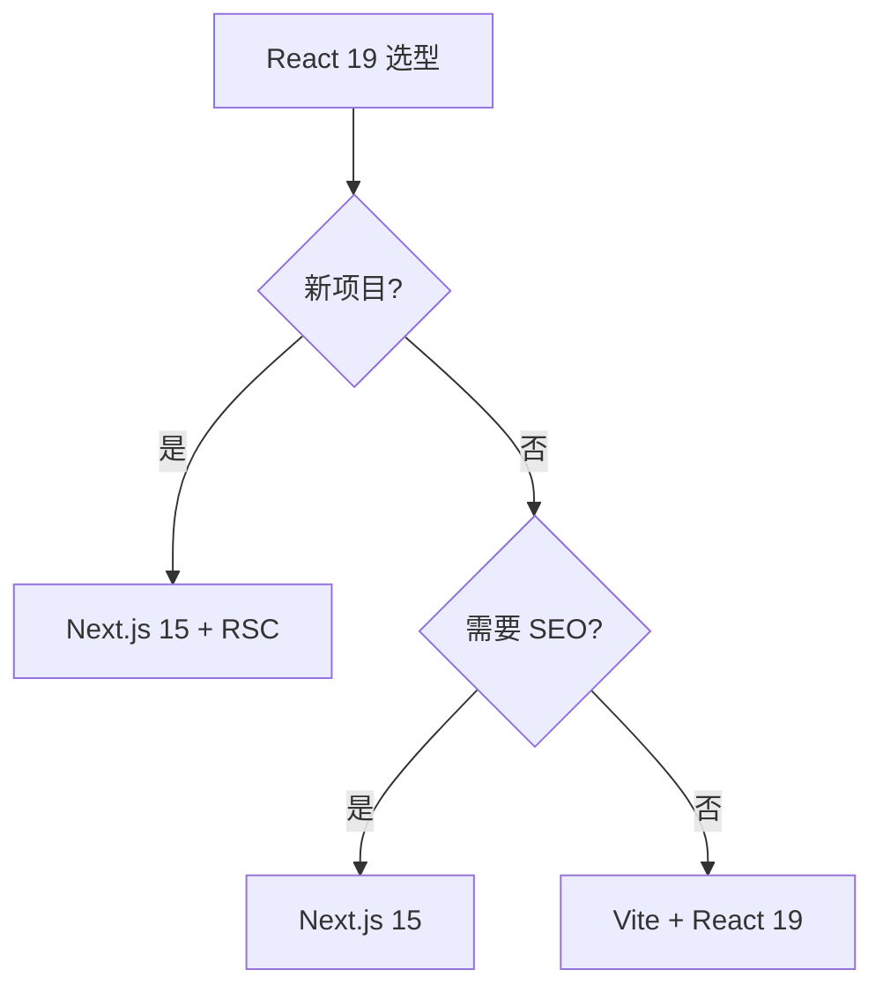
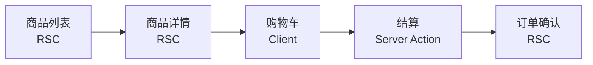

# React 19

## 引言：反直觉代码

React 19 的关键不是语法——是**看起来对**的代码背后那些'踩坑点'。

本篇用 3 个反直觉片段切入，把面试/生产中常被问起、但一深入就漏馅的点摆出来。

---

> 一句话定位：**React 19 — Hooks + RSC + Compiler 的现代 React 全景**

## 1. 一句话定位

React 是 Facebook 2013 年开源的 UI 库，2024 年发布 React 19，带来 Server Components、Actions、Compiler 等新特性。本文档聚焦 React 19 生态与工程实践。

## 2. 核心能力

- **Hooks 体系**：useState / useEffect / useMemo / useCallback / useRef / useContext
- **Concurrent Rendering**：useTransition / useDeferredValue / 自动批处理
- **Server Components (RSC)**：服务端组件，零客户端 JS
- **Server Actions**：服务端函数，直接在客户端调用
- **Compiler (React 19)**：自动 useMemo / useCallback 优化
- **Suspense**：异步加载占位

## 3. 生态速查

| 类别 | 推荐 | 备选 |
|------|------|------|
| 路由 | React Router 7 | TanStack Router |
| 状态 | Zustand | Jotai / Redux Toolkit |
| 数据 | TanStack Query | SWR |
| 表单 | React Hook Form | Formik |
| UI 库 | shadcn/ui | Material UI / Ant Design |
| 动画 | Framer Motion | React Spring |
| 测试 | Vitest + RTL | Jest + RTL |
| 元框架 | Next.js 15 | Remix |

## 4. 选型建议



## 5. 性能优化

- **避免不必要 re-render**：React.memo / useMemo / useCallback
- **Compiler 自动优化**：React 19 编译器自动处理大部分 memo
- **列表虚拟化**：react-window / react-virtuoso
- **代码分割**：React.lazy + Suspense
- **Server Components 减包**：默认服务端组件，零客户端 JS

## 6. 反模式

- **prop drilling**：超过 3 层用 Context 或状态管理
- **useEffect 滥用**：能用事件处理就不用 useEffect；能用 useMemo 就不用 useEffect
- **Context 滥用**：Context 会导致所有 consumer re-render，高频更新用 Zustand
- **key 缺失或不正确**：列表必须用稳定 key（不要用 index）
- **不清理副作用**：useEffect 必须 return cleanup（事件监听/定时器/订阅）

## 7. 学习资源

- 官方文档：https://react.dev/
- Next.js 文档：https://nextjs.org/docs
- React Server Components RFC：https://github.com/reactjs/rfcs/blob/main/text/0188-server-components.md
- 实战：Todo List → 博客 → 电商 → SaaS

## 8. 关键术语

| 术语 | 解释 |
|------|------|
| RSC | React Server Components |
| Suspense | 异步加载占位 |
| Concurrent | 并发渲染 |
| Compiler | React 19 自动优化编译器 |
| Server Action | 服务端函数 |
| Hydration | 注水，SSR → CSR 转换 |

## 9. 代码示例

### 9.1 Server Component vs Client Component

```javascript
// app/products/page.tsx — Server Component（默认）
// 不带 "use client"，在服务端执行，零客户端 JS
import { db } from '@/lib/db'

export default async function ProductsPage() {
  const products = await db.product.findMany()
  return (
    <ul>
      {products.map(p => (
        <li key={p.id}>{p.name}</li>
      ))}
    </ul>
  )
}

// app/products/CartButton.tsx — Client Component
'use client'  // 标记为客户端组件
import { useState } from 'react'

export default function CartButton({ productId }) {
  const [loading, setLoading] = useState(false)
  const addToCart = async () => {
    setLoading(true)
    await fetch(`/api/cart/${productId}`, { method: 'POST' })
    setLoading(false)
  }
  return <button onClick={addToCart} disabled={loading}>
    {loading ? '添加中...' : '加入购物车'}
  </button>
}
```

### 9.2 React 19 Actions

```javascript
// Server Action — 直接在客户端调用服务端函数
'use server'

export async function createUser(formData) {
  const name = formData.get('name')
  const email = formData.get('email')
  await db.user.create({ data: { name, email } })
  revalidatePath('/users')  // 自动失效缓存
}

// Client Component 使用 Server Action
'use client'
import { useActionState } from 'react'
import { createUser } from './actions'

export function UserForm() {
  const [state, formAction, isPending] = useActionState(createUser, null)
  return (
    <form action={formAction}>
      <input name="name" />
      <input name="email" />
      <button disabled={isPending}>{isPending ? '提交中' : '提交'}</button>
    </form>
  )
}
```

### 9.3 Compiler 工作原理

```javascript
// 编译前：手动 memo
function ProductList({ items, onSelect }) {
  const sorted = useMemo(() => items.sort((a, b) => a.price - b.price), [items])
  const handleClick = useCallback((id) => onSelect(id), [onSelect])
  return sorted.map(item => <Card key={item.id} item={item} onClick={handleClick} />)
}

// React 19 Compiler 后：无需手动 memo
// 编译器自动分析依赖、自动 memo
function ProductList({ items, onSelect }) {
  const sorted = items.sort((a, b) => a.price - b.price)
  return sorted.map(item => <Card key={item.id} item={item} onClick={() => onSelect(item.id)} />)
}
```

## 10. 迁移指南

### 10.1 React 17 → 18 → 19 主要 Breaking Changes

| 版本 | 关键变更 | 迁移注意 |
|------|---------|---------|
| 18.0 | Concurrent Rendering | createRoot 替代 ReactDOM.render |
| 18.0 | Automatic Batching | 异步回调中的 setState 自动批处理 |
| 18.0 | Suspense on Server | SSR 支持 Suspense 流式渲染 |
| 18.3 | useTransition | 标记非紧急更新 |
| 19.0 | Compiler (RC) | 移除大部分 useMemo/useCallback |
| 19.0 | Actions | useFormStatus / useActionState |
| 19.0 | use(promise) | 组件内 unwrap Promise |
| 19.0 | ref as prop | ref 不再需要 forwardRef |

```javascript
// 17 → 18：createRoot 替代
// 旧
import { render } from 'react-dom'
render(<App />, document.getElementById('root'))
// 新
import { createRoot } from 'react-dom/client'
createRoot(document.getElementById('root')).render(<App />)

// 18 → 19：ref as prop
// 旧：forwardRef
const Input = forwardRef((props, ref) => <input ref={ref} {...props} />)
// 新：ref 作为普通 prop
function Input({ ref, ...props }) {
  return <input ref={ref} {...props} />
}
```

## 11. 实战案例

### 11.1 电商场景



- 商品列表/详情用 RSC 减少 JS 体积 60%+
- 购物车交互用 Client Component（高频更新）
- 结算用 Server Action 减少 API 层

### 11.2 SaaS 仪表盘

- 大量数据表格 + 图表 → TanStack Query + 虚拟列表
- 表单密集 → React Hook Form + Zod 校验
- 实时数据 → WebSocket + useSyncExternalStore

### 11.3 博客 / 内容站

- Markdown → MDX（Server Component 中渲染）
- 评论系统 → Server Action + 乐观更新
- SEO → Next.js Metadata API + sitemap

### 11.4 实时协作

- CRDT 库（Yjs / Automerge）封装进 React
- 多人光标 → presence 通道
- 离线编辑 → IndexedDB + 后台同步

### 11.5 移动端

- React Native 0.74+ 支持新架构（Fabric/TurboModules）
- Expo Router 文件式路由
- EAS Build 云端构建

## 12. 高级反模式

### 12.1 useEffect 中 setState 引发循环

```javascript
// 反模式：Effect 中直接 setState 引发无限循环
function Bad({ data }) {
  const [items, setItems] = useState([])
  useEffect(() => {
    setItems(data)  // 每次 data 变就 setItems → 触发 re-render
  }, [data])
  return <List items={items} />
}

// 正确：用 useMemo 或派生值
function Good({ data }) {
  const items = useMemo(() => data.filter(Boolean), [data])
  return <List items={items} />
}
```

### 12.2 Server Action 中调用 client API

```javascript
// 反模式：Server Action 中访问 window/localStorage
'use server'
export async function bad() {
  const token = localStorage.getItem('token')  // 报错：服务端没有 window
  return await fetch(url, { headers: { token } })
}

// 正确：客户端传参
'use client'
export function GoodButton() {
  const onClick = async () => {
    const token = localStorage.getItem('token')
    await fetch('/api/data', { headers: { token } })
  }
}
```

### 12.3 Hydration Mismatch

```javascript
// 反模式：服务端/客户端渲染不一致
function Bad() {
  return <div>{new Date().toLocaleString()}</div>  // SSR 和 CSR 时间不同
}

// 正确 1：用 useEffect 客户端渲染
function Good() {
  const [time, setTime] = useState('')
  useEffect(() => setTime(new Date().toLocaleString()), [])
  return <div>{time || '加载中...'}</div>
}

// 正确 2：用 suppressHydrationWarning
function Good2() {
  return <div suppressHydrationWarning>{new Date().toLocaleString()}</div>
}
```
