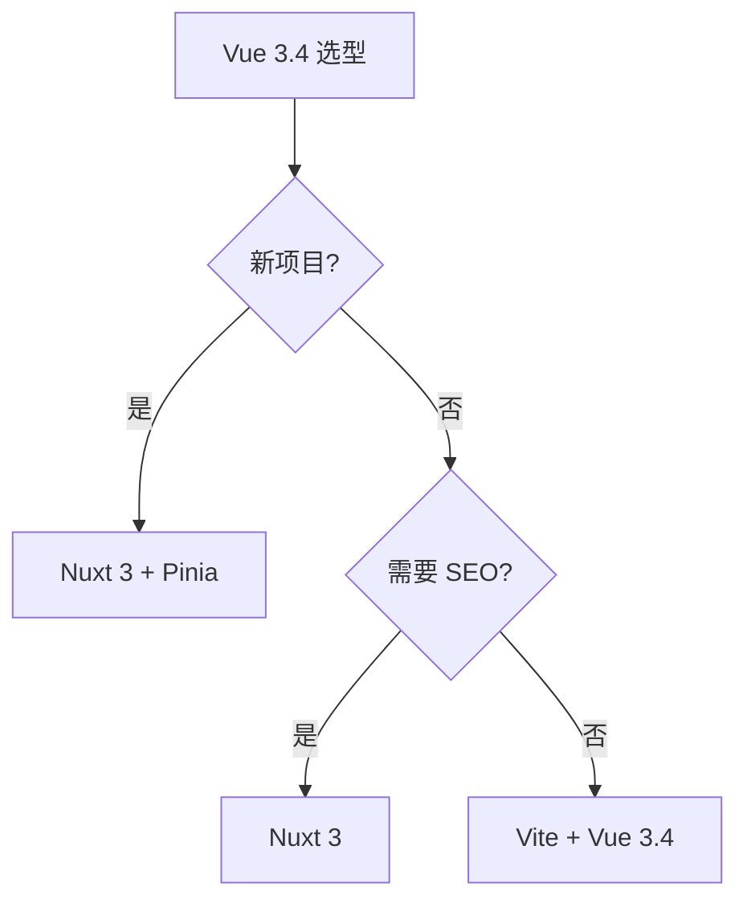

# Vue 3.4+

> 一句话定位：**Vue 3.4 — Composition API + Pinia + Vapor 的现代 Vue 全景**

## 1. 一句话定位

Vue 是尤雨溪 2014 年开源的渐进式 UI 框架，2023 年发布 Vue 3.4 稳定版，2024 年推出 Vapor 编译时优化。本文档聚焦 Vue 3.4+ 生态。

## 2. 核心能力

- **Composition API**：setup() / ref / reactive / computed / watch
- **响应式系统**：Proxy-based，比 Vue 2 的 Object.defineProperty 更强大
- **Teleport / Suspense**：传送门 + 异步占位
- **Pinia**：Vue 官方状态管理（替代 Vuex）
- **Vapor 模式**（2024）：编译时优化，无虚拟 DOM
- **单文件组件 SFC**：`<template> <script> <style>`

## 3. 生态速查

| 类别 | 推荐 | 备选 |
|------|------|------|
| 路由 | Vue Router 4 | - |
| 状态 | Pinia 2 | - |
| UI 库 | Element Plus / Naive UI / Vant | Ant Design Vue |
| 元框架 | Nuxt 3 | - |
| 数据 | VueUse | - |
| 表单 | VeeValidate | - |
| 测试 | Vitest + Vue Test Utils | - |
| 动画 | Vue Transition / @vueuse/motion | GSAP |

## 4. 选型建议

## 5. 性能优化

- **shallowRef / shallowReactive**：大对象用浅响应
- **markRaw**：标记永远不需要响应的对象（如第三方库实例）
- **v-once / v-memo**：静态内容 / 条件缓存
- **defineAsyncComponent**：异步组件
- **Vapor 模式**：Vue 3.5+ 编译时优化（无虚拟 DOM）

## 6. 反模式

- **Options API + Composition API 混用**：项目内统一
- **reactive() 包装整个对象**：大对象用 shallowReactive
- **过度解构**：解构会丢失响应式，要么用 toRefs 要么直接访问
- **watch 滥用**：能用 computed 就不用 watch
- **provide/inject 滥用**：跟 Context 一样，高频更新用 Pinia

## 7. 学习资源

- 官方文档：https://cn.vuejs.org/
- Pinia 文档：https://pinia.vuejs.org/
- Nuxt 文档：https://nuxt.com/
- VueUse 工具集：https://vueuse.org/

## 8. 关键术语

| 术语 | 解释 |
|------|------|
| Composition API | Vue 3 组合式 API |
| Pinia | Vue 官方状态管理 |
| Vapor | Vue 3 编译时优化模式 |
| SFC | Single File Component |
| Teleport | 传送门（组件渲染到 DOM 任意位置） |
| Suspense | 异步加载占位 |
