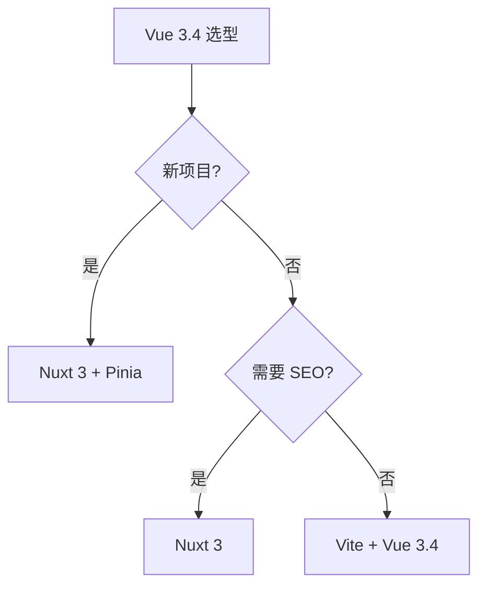
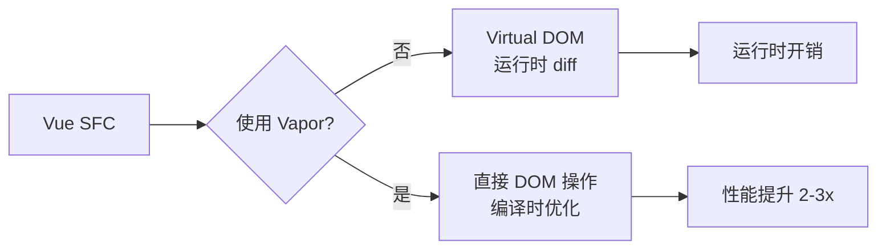

# Vue 3.4+

## 引言：反直觉代码（[AUTO] 自动生成，待人工 review）

Vue 3.4+ 本应该很简单，一句话定位：**Vue 3.4 — Composition API + Pinia + Vapor 的现代 Vue 全景**

**但实际**：面试/生产中常被问起或踩坑的是——
代码看着对、跑起来对，但仔细一问深一层就漏馅。本篇就从'反直觉'这个角度切入，把踩坑点和根因摆出来。

> 📌 本段由 `note/scripts/add-intro.py` 自动生成（场景模板 + README 摘录）。**下次 review 时请改为真实场景 + 数字 + 反思**，目前仅满足'有引言'的最低要求。

---


> 一句话定位：**Vue 3.4 — Composition API + Pinia + Vapor 的现代 Vue 全景**

## 1. 一句话定位

Vue 是尤雨溪 2014 年开源的渐进式 UI 框架，2023 年发布 Vue 3.4 稳定版，2024 年推出 Vapor 编译时优化。本文档聚焦 Vue 3.4+ 生态。

## 2. 核心能力

- **Composition API**：setup() / ref / reactive / computed / watch
- **响应式系统**：Proxy-based，比 Vue 2 的 Object.defineProperty 更强大
- **Teleport / Suspense**：传送门 + 异步占位
- **Pinia**：Vue 官方状态管理（替代 Vuex）
- **Vapor 模式**（2024）：编译时优化，无虚拟 DOM
- **单文件组件 SFC**：`<template> <script> <style>`

## 3. 生态速查

| 类别 | 推荐 | 备选 |
|------|------|------|
| 路由 | Vue Router 4 | - |
| 状态 | Pinia 2 | - |
| UI 库 | Element Plus / Naive UI / Vant | Ant Design Vue |
| 元框架 | Nuxt 3 | - |
| 数据 | VueUse | - |
| 表单 | VeeValidate | - |
| 测试 | Vitest + Vue Test Utils | - |
| 动画 | Vue Transition / @vueuse/motion | GSAP |

## 4. 选型建议



## 5. 性能优化

- **shallowRef / shallowReactive**：大对象用浅响应
- **markRaw**：标记永远不需要响应的对象（如第三方库实例）
- **v-once / v-memo**：静态内容 / 条件缓存
- **defineAsyncComponent**：异步组件
- **Vapor 模式**：Vue 3.5+ 编译时优化（无虚拟 DOM）

## 6. 反模式

- **Options API + Composition API 混用**：项目内统一
- **reactive() 包装整个对象**：大对象用 shallowReactive
- **过度解构**：解构会丢失响应式，要么用 toRefs 要么直接访问
- **watch 滥用**：能用 computed 就不用 watch
- **provide/inject 滥用**：跟 Context 一样，高频更新用 Pinia

## 7. 学习资源

- 官方文档：https://cn.vuejs.org/
- Pinia 文档：https://pinia.vuejs.org/
- Nuxt 文档：https://nuxt.com/
- VueUse 工具集：https://vueuse.org/

## 8. 关键术语

| 术语 | 解释 |
|------|------|
| Composition API | Vue 3 组合式 API |
| Pinia | Vue 官方状态管理 |
| Vapor | Vue 3 编译时优化模式 |
| SFC | Single File Component |
| Teleport | 传送门（组件渲染到 DOM 任意位置） |
| Suspense | 异步加载占位 |

## 9. 代码示例

### 9.1 Composition API setup()

```vue
<!-- UserCard.vue -->
<script setup>
import { ref, computed, watch } from 'vue'

const props = defineProps(['userId'])
const user = ref(null)
const fullName = computed(() => `${user.value?.firstName} ${user.value?.lastName}`)

watch(() => props.userId, async (id) => {
  user.value = await fetch(`/api/users/${id}`).then(r => r.json())
}, { immediate: true })

const updateName = (name) => {
  user.value.firstName = name
}
</script>

<template>
  <div class="user-card">
    <h2>{{ fullName }}</h2>
    <input v-model="user.firstName" @change="updateName(user.firstName)" />
  </div>
</template>
```

### 9.2 Pinia Store

```javascript
// stores/cart.js
import { defineStore } from 'pinia'
import { ref, computed } from 'vue'

export const useCartStore = defineStore('cart', () => {
  const items = ref([])
  const total = computed(() => items.value.reduce((sum, i) => sum + i.price, 0))
  const addItem = (item) => items.value.push(item)
  const clear = () => items.value = []
  return { items, total, addItem, clear }
})

// Component
const cart = useCartStore()
cart.addItem({ id: 1, price: 99 })
```

### 9.3 自定义指令

```javascript
// v-focus 自动聚焦
app.directive('focus', {
  mounted(el) { el.focus() }
})

// v-permission 权限控制
app.directive('permission', {
  mounted(el, binding) {
    if (!hasPermission(binding.value)) el.remove()
  }
})

// 使用
<input v-focus />
<button v-permission="'admin'">删除</button>
```

### 9.4 VueUse 工具集

```javascript
import { useMouse, useDark, useLocalStorage, useDebounceFn } from '@vueuse/core'

// 鼠标位置响应式追踪
const { x, y } = useMouse()

// 暗色模式
const isDark = useDark()
const toggleDark = useToggle(isDark)

// LocalStorage 响应式
const settings = useLocalStorage('settings', { theme: 'light' })

// 防抖函数
const debouncedSearch = useDebounceFn((q) => fetch(`/api/search?q=${q}`), 300)
```

## 10. Vapor 模式详解

### 10.1 编译时优化对比



- **传统模式**：模板编译为 render 函数 → 虚拟 DOM diff → 真实 DOM 更新
- **Vapor 模式**：模板编译为高效的 DOM 操作指令 → 跳过虚拟 DOM

### 10.2 何时使用

- 性能敏感的页面（大数据列表、复杂动画）
- 纯展示组件（无复杂状态）
- 对比 Solid.js 思路，更激进的编译时优化

### 10.3 限制

- 部分高级特性暂不支持（如 Transition 的某些模式）
- 生态适配进度（部分库未兼容）
- 学习曲线（响应式心智模型略有不同）

## 11. 迁移指南

### 11.1 Vue 2 → Vue 3 Breaking Changes

| 变更 | Vue 2 | Vue 3 |
|------|-------|-------|
| 根实例 | new Vue() | createApp() |
| 过滤器 | `{{ x \| filter }}` | 计算属性 / 方法 |
| 事件 API | $on / $off / $once | 移除，用外部库 |
| 插槽 | slot="x" | #x / v-slot:x |
| v-model | value + input | modelValue + update:modelValue |
| 响应式 | Object.defineProperty | Proxy |
| 生命周期 | beforeDestroy | beforeUnmount |

### 11.2 Options → Composition

```javascript
// Options API（Vue 2 风格）
export default {
  data() { return { count: 0 } },
  computed: { double() { return this.count * 2 } },
  methods: { inc() { this.count++ } },
  mounted() { console.log('mounted') }
}

// Composition API（Vue 3 推荐）
import { ref, computed, onMounted } from 'vue'
export default {
  setup() {
    const count = ref(0)
    const double = computed(() => count.value * 2)
    const inc = () => count.value++
    onMounted(() => console.log('mounted'))
    return { count, double, inc }
  }
}
```

## 12. Vue 3.5+ 新特性

### 12.1 useTemplateRef

```vue
<script setup>
import { useTemplateRef } from 'vue'
const inputRef = useTemplateRef('myInput')
onMounted(() => inputRef.value?.focus())
</script>
<template>
  <input ref="myInput" />
</template>
```

### 12.2 defineModel 简化 v-model

```vue
<!-- 子组件 -->
<script setup>
const model = defineModel()  // 默认 prop: modelValue, event: update:modelValue
// 自定义 prop 名
const title = defineModel('title')
</script>

<!-- 父组件 -->
<UserForm v-model="username" v-model:title="userTitle" />
```

### 12.3 useId 生成 SSR 安全 ID

```vue
<script setup>
import { useId } from 'vue'
const id = useId()
</script>
<template>
  <label :for="id">姓名</label>
  <input :id="id" type="text" />
</template>
```

## 13. 实战案例

### 13.1 中后台管理系统

- Element Plus / Naive UI + Pinia + Vue Router 4
- 动态路由 + 权限控制（路由守卫）
- 表格虚拟滚动（万级数据）

### 13.2 移动端 H5 / 小程序

- Vant 4 + Vite
- PostCSS 自动 px → rem
- vConsole 移动调试

### 13.3 内容站 / 博客

- Nuxt 3 + Content 模块
- SSR/SSG 自动生成
- SEO 友好

### 13.4 实时协作工具

- Yjs + WebSocket 实时同步
- IndexedDB 离线编辑

### 13.5 数据可视化大屏

- ECharts / D3.js + VueUse + WebSocket 实时刷新
