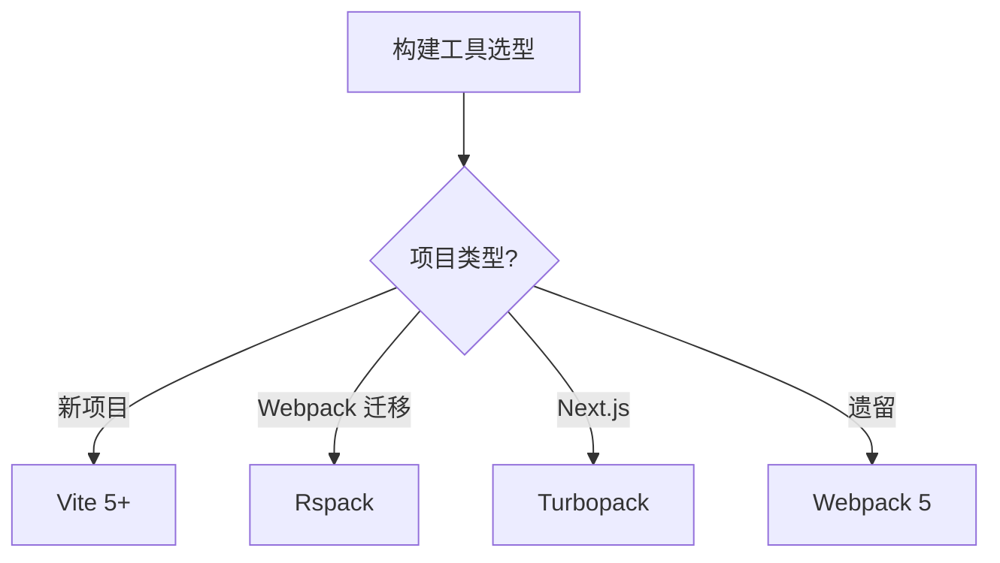

# 04 工程化

> 一句话定位：**从「写代码」到「发布上线」的全链路工具链与流程**

本模块覆盖构建工具、包管理、Monorepo、测试、Lint、CI/CD 等工程化基础设施，是团队协作和持续交付的基石。

---
## 引言：反直觉代码

04 工程化 的关键不是语法——是**看起来对**的代码背后那些'踩坑点'。

本篇用 3 个反直觉片段切入，把面试/生产中常被问起、但一深入就漏馅的点摆出来。

---

## 1. 本模块覆盖

| 主题 | 状态 | 说明 |
|------|------|------|
| Vite 5+ | ✓ 已有 | [vite/](vite/) — 构建工具首选 / HMR / 插件体系 |
| Monorepo 实践 | ✓ 已有 | [monorepo-practice/](monorepo-practice/) — pnpm workspace / Turborepo / Nx |
| 包管理 | 📝 速查 | npm / pnpm / yarn 选型见 [📖 顶层 3.1 构建工具速查](../README.md#31-构建工具速查) |
| 测试体系 | 📝 速查 | Vitest / Jest / Playwright 见 [📖 顶层 3.9 测试速查](../README.md#39-测试速查) |
| Lint / Format | 📝 速查 | ESLint / Prettier / Biome 详见顶层速查 |

---

## 2. 速查要点

- **构建工具选型**：新项目直接 Vite；Webpack 5 迁移用 Rspack；Next.js 15+ 用 Turbopack
- **包管理选型**：monorepo 首选 pnpm（硬链接 + 工作区）；单仓 npm 即可
- **Monorepo 工具**：轻量用 pnpm workspace；中量用 Turborepo；复杂用 Nx
- **测试金字塔**：单元测试 70% / 集成测试 20% / E2E 测试 10%

---

## 3. 选型建议

---

## 4. 与其他模块的关系

- **上游**：[02-language](../02-language/) / [03-frameworks](../03-frameworks/)
- **下游**：支撑所有前端项目的构建/测试/CI
- **横向**：[05-architecture](../05-architecture/) 关注应用层架构，[04 工程化] 关注工程基础设施

---

## 5. 学习建议

- 重点掌握 Vite 插件机制
- 推荐路径：[vite](vite/) → [monorepo-practice](monorepo-practice/) → 测试/Lint 速查

---

## 6. 数据时效性

- Vite / Rspack / Turbopack 每年大版本
- pnpm / yarn 每年发版
- Vitest / Playwright 每季度发版

---

## 7. 关键术语

| 术语 | 解释 |
|------|------|
| HMR | Hot Module Replacement，热模块替换 |
| ESM | ECMAScript Modules |
| CJS | CommonJS |
| CI | Continuous Integration，持续集成 |
| CD | Continuous Deployment，持续部署 |
| SCA | Software Composition Analysis，依赖成分分析 |
