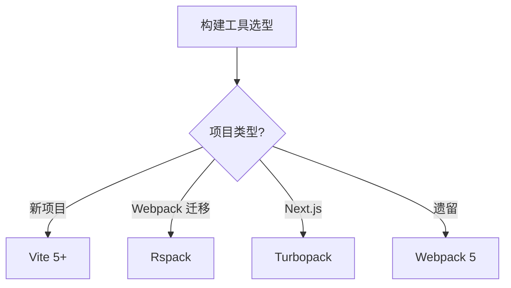

<!--
module:
  parent: note
  slug: 09.front-end/engineering
  type: article
  category: 主模块子文章
  summary: 前端 04 工程化
-->

# 04 工程化

> 一句话定位：**从「写代码」到「发布上线」的全链路工具链与流程**

本模块覆盖构建工具、包管理、Monorepo、测试、Lint、CI/CD 等工程化基础设施,是团队协作和持续交付的基石。

---

## 1. 模块导航

| 主题 | 状态 | 说明 |
|------|------|------|
| Vite 5+ | ✓ 已有 | [vite/](vite/) — 构建工具首选 / HMR / 插件体系 |
| Monorepo 实践 | ✓ 已有 | [monorepo-practice/](monorepo-practice/) — pnpm workspace / Turborepo / Nx |
| 包管理 | 📝 速查 | npm / pnpm / yarn 选型,详见顶层速查 |
| 测试体系 | 📝 速查 | Vitest / Jest / Playwright,详见顶层速查 |
| Lint / Format | 📝 速查 | ESLint / Prettier / Biome,详见顶层速查 |

### 1.1 学习路径

- **入门**:重点掌握 Vite 插件机制,理解 ESM 原生 dev server
- **路径**:[vite](vite/) → [monorepo-practice](monorepo-practice/) → 测试 / Lint 速查
- **大型项目**:从 Monorepo 入手,搭配 Turborepo / Nx 做增量构建

---

## 2. 知识脉络

---

## 3. 速查要点

- **构建工具选型**:新项目直接 Vite;Webpack 5 迁移用 Rspack;Next.js 15+ 用 Turbopack
- **包管理选型**:monorepo 首选 pnpm(硬链接 + 工作区);单仓 npm 即可
- **Monorepo 工具**:轻量用 pnpm workspace;中量用 Turborepo;复杂用 Nx
- **测试金字塔**:单元测试 70% / 集成测试 20% / E2E 测试 10%

---

## 4. 选型建议

---

## 5. 最佳实践

- 构建工具新项目直接 Vite,Webpack 迁移用 Rspack 平滑过渡
- Monorepo 首选 pnpm workspaces + Turborepo,避免 npm workspaces 的兼容陷阱
- Lint 用 ESLint 9 flat config + Prettier + lint-staged,提交前自动格式化
- 测试金字塔落地:Vitest(单测)+ Testing Library(组件)+ Playwright(E2E)
- CI 用 GitHub Actions 跑测试、Lighthouse 阈值卡构建,失败阻断合并

---

## 6. 常见面试题

- Vite 为什么比 Webpack 快?ESM + esbuild 预构建的原理
- pnpm workspace 与 npm / yarn workspace 的关键差异(硬链接 / 幽灵依赖)
- Turborepo 的增量构建与远端缓存如何加速 CI?
- ESLint 9 flat config 与传统 `.eslintrc` 的迁移要点
- Vitest 与 Jest 的 API 兼容度,在 Vite 项目中的具体集成方式

---

## 7. 与其他模块的关系

- **上游**:[02-language](../02-language/) / [03-frameworks](../03-frameworks/)
- **下游**:支撑所有前端项目的构建 / 测试 / CI
- **横向**:[05-architecture](../05-architecture/) 关注应用层架构,[04 工程化] 关注工程基础设施

---

## 📊 本节统计

- **主题数**:5(Vite 5+ / Monorepo 实践 / 包管理 / 测试体系 / Lint-Format)
- **子 README 数**:2 + 1 顶层 = 3
- **模块导航行数**:5(2 已有 + 3 速查占位)
- **学习路径主题数**:2(入门 / 大型项目)
- **面试题数**:5
- **数据快照**:2026-06

---

← [返回前端工程总览](../README.md)
