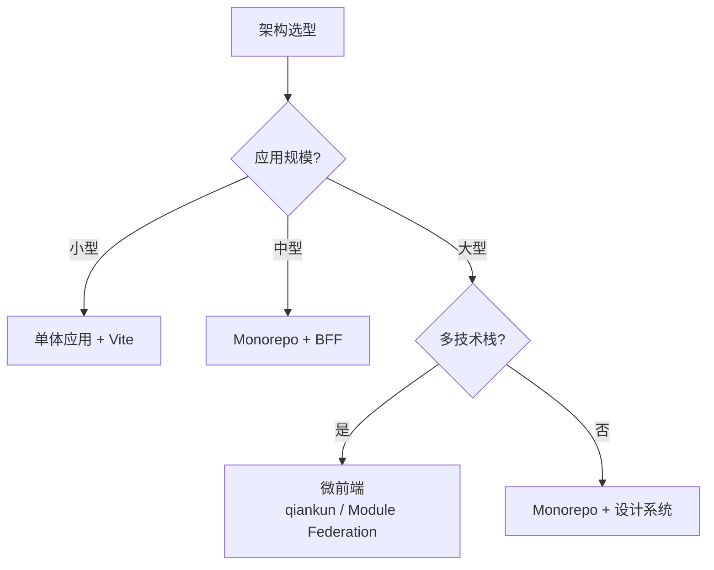

# 05 架构

> 一句话定位：**前端架构——把"应用"拆成"模块"，把"模块"拆成"组件"，并组织它们之间的协作**

本模块覆盖 7 大前端架构主题：渲染模式 / 状态管理 / 路由 / 微前端 / Web Components / BFF / 设计系统，是大型应用可维护性的核心。

---
## 引言：架构困境

05 架构 的关键不是'选型'——是**选完之后怎么在 5 个 trade-off 里活下来**。

本篇用'决策困境'切入，比较几种主流路径并讲清取舍。

---

## 1. 本模块覆盖

| 主题 | 状态 | 说明 |
|------|------|------|
| 渲染模式 | ✓ 已有 | [rendering-modes/](rendering-modes/) — CSR / SSR / SSG / ISR / RSC / Islands 全景 |
| 状态管理 | ✓ 已有 | [state-management/](state-management/) — Redux / Zustand / Jotai / Pinia / Valtio / Nano Stores |
| 路由 | ✓ 已有 | [routing/](routing/) — React Router / Vue Router / TanStack Router |
| 微前端 | ✓ 已有 | [micro-frontend/](micro-frontend/) — qiankun / single-spa / Module Federation |
| Web Components | ✓ 已有 | [web-components/](web-components/) — 浏览器原生组件化 / Lit / Stencil |
| BFF | ✓ 已有 | [bff/](bff/) — Backend For Frontend / GraphQL BFF / tRPC |
| 设计系统 | ✓ 已有 | [design-system/](design-system/) — 组件库 / Token / 主题 / Storybook |

> 速查对比见 [📖 顶层 3.4 状态管理速查](../README.md#34-状态管理速查)、[3.5 路由速查](../README.md#35-路由速查)、[3.6 渲染模式速查](../README.md#36-渲染模式速查)

---

## 2. 速查要点

- **微前端不是银弹**：只在 50+ 团队 / 多技术栈场景下用；小团队用 Monorepo 即可
- **BFF 边界**：BFF 是为前端优化的后端，不替代主后端；典型场景是聚合多服务 + 适配前端数据结构
- **设计系统先于组件库**：先定 Token（颜色/字体/间距），再开发组件库；shadcn/ui / Ant Design 都是这个模式
- **状态管理分层**：服务端状态（TanStack Query / SWR）+ 客户端状态（Zustand / Pinia）+ URL 状态（路由参数）

---

## 3. 选型建议

---

## 4. 与其他模块的关系

- **上游**：[03-frameworks](../03-frameworks/) / [04-engineering](../04-engineering/)
- **下游**：被 [06-performance](../06-performance/) / [07-security](../07-security/) / [08-cross-platform](../08-cross-platform/) 复用
- **横向**：[03-frameworks](../03-frameworks/) 关注 UI 层，[05 架构] 关注应用层

---

## 5. 学习建议

- 架构选型与项目规模强相关：单体应用不需要微前端，营销页不需要 SSR
- 推荐先理解「为什么需要」再决定「用哪个」
- 关键资源：[rendering-modes](rendering-modes/) / [state-management](state-management/) 是必读

---

## 6. 数据时效性

- 状态管理库每年更新
- 微前端方案稳定（qiankun / Module Federation）
- 设计系统每年新增

---

## 7. 关键术语

| 术语 | 解释 |
|------|------|
| RSC | React Server Components |
| SSR | Server-Side Rendering |
| BFF | Backend For Frontend |
| Module Federation | Webpack 5 / Rspack 微前端方案 |
| Token | 设计系统中的设计变量 |
| qiankun | 国内主流微前端框架 |
