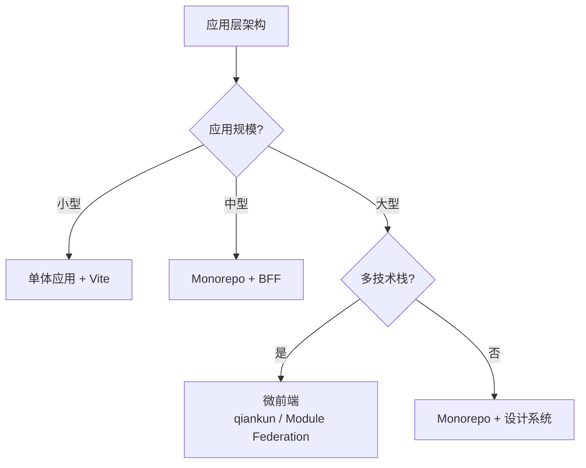

<!--
module:
  parent: note
  slug: 09.front-end/architecture
  type: article
  category: 主模块子文章
  summary: 前端 05 架构
-->

# 05 架构

> 一句话定位：**前端架构——把"应用"拆成"模块",把"模块"拆成"组件",并组织它们之间的协作**

本模块覆盖 7 大前端架构主题:渲染模式 / 状态管理 / 路由 / 微前端 / Web Components / BFF / 设计系统,是大型应用可维护性的核心。

---

## 1. 模块导航

| 主题 | 状态 | 说明 |
|------|------|------|
| 渲染模式 | ✓ 已有 | [rendering-modes/](rendering-modes/) — CSR / SSR / SSG / ISR / RSC / Islands 全景 |
| 状态管理 | ✓ 已有 | [state-management/](state-management/) — Redux / Zustand / Jotai / Pinia / Valtio / Nano Stores |
| 路由 | ✓ 已有 | [routing/](routing/) — React Router / Vue Router / TanStack Router |
| 微前端 | ✓ 已有 | [micro-frontend/](micro-frontend/) — qiankun / single-spa / Module Federation |
| Web Components | ✓ 已有 | [web-components/](web-components/) — 浏览器原生组件化 / Lit / Stencil |
| BFF | ✓ 已有 | [bff/](bff/) — Backend For Frontend / GraphQL BFF / tRPC |
| 设计系统 | ✓ 已有 | [design-system/](design-system/) — 组件库 / Token / 主题 / Storybook |

### 1.1 学习路径

- **入门**:架构选型与项目规模强相关,单体应用不需要微前端,营销页不需要 SSR
- **路径**:先理解「为什么需要」再决定「用哪个」
- **必读**:`[rendering-modes](rendering-modes/)` / `[state-management](state-management/)` 是大型项目设计起点

---

## 2. 知识脉络

---

## 3. 速查要点

- **微前端不是银弹**:只在 50+ 团队 / 多技术栈场景下用;小团队用 Monorepo 即可
- **BFF 边界**:BFF 是为前端优化的后端,不替代主后端;典型场景是聚合多服务 + 适配前端数据结构
- **设计系统先于组件库**:先定 Token(颜色 / 字体 / 间距),再开发组件库;shadcn/ui / Ant Design 都是这个模式
- **状态管理分层**:服务端状态(TanStack Query / SWR)+ 客户端状态(Zustand / Pinia)+ URL 状态(路由参数)

---

## 4. 选型建议

| 规模 | 推荐架构 | 关键工具 |
|------|---------|---------|
| 小型 (< 5 万行) | Vite 单体 + 组件库 | Vite + React / Vue + 状态管理 |
| 中型 (5-20 万行) | Monorepo + BFF + 设计系统 | pnpm workspaces + Turborepo + Storybook |
| 大型 (> 20 万行 / 多团队) | 微前端 + 设计系统 + 独立 BFF | Module Federation + 独立部署 |
| 内容型 (博客 / 文档) | SSG / Astro Islands | Astro / Next.js SSG |

---

## 5. 最佳实践

- 渲染模式按 SEO + 首屏 + 数据实时性三维决策,不要单一押注
- 状态管理分层:服务端(TanStack Query / SWR)/ 客户端(Zustand / Pinia)/ URL(路由参数),各司其职
- 微前端仅在多团队 / 多技术栈的巨型应用中使用,中型团队 Monorepo 已足够
- 设计系统先定 Token(颜色 / 字体 / 间距),再开发组件库;shadcn/ui / Ant Design 都是这个思路
- BFF 只做「为前端优化的胶水」,不替代主后端,不写入业务核心规则

---

## 6. 常见面试题

- CSR / SSR / SSG / ISR / RSC 五种渲染模式的 SEO 与首屏权衡
- 微前端三种实现:qiankun / single-spa / Module Federation 的隔离粒度差异
- 状态管理分层:服务端状态为什么优先 TanStack Query 而非 Redux?
- BFF 的定位与 GraphQL / tRPC 的关系,BFF 与 API Gateway 区别
- 设计系统 Token 三层:primitive / semantic / component 的设计要点

---

## 7. 与其他模块的关系

- **上游**:[03-frameworks](../03-frameworks/) / [04-engineering](../04-engineering/)
- **下游**:被 [06-performance](../06-performance/) / [07-security](../07-security/) / [08-cross-platform](../08-cross-platform/) 复用
- **横向**:[03-frameworks](../03-frameworks/) 关注 UI 层,[05 架构] 关注应用层

---

## 📊 本节统计

- **主题数**:7(渲染模式 / 状态管理 / 路由 / 微前端 / Web Components / BFF / 设计系统)
- **子 README 数**:7 + 1 顶层 = 8
- **模块导航行数**:7(全已有)
- **学习路径主题数**:2(入门 / 主线必读)
- **面试题数**:5
- **数据快照**:2026-06

---

← [返回前端工程总览](../README.md)
