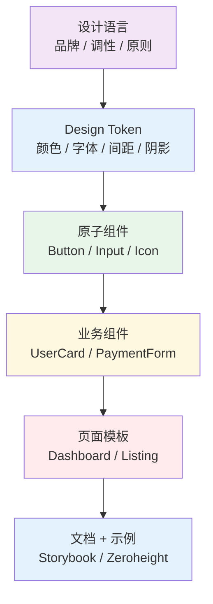
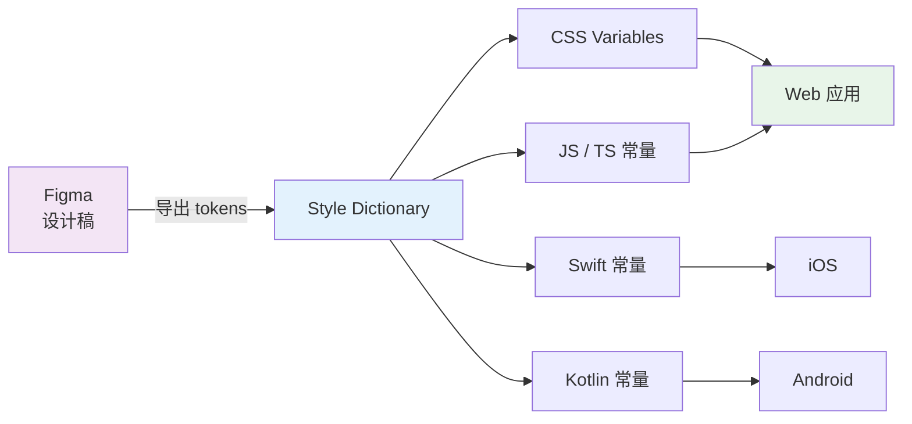
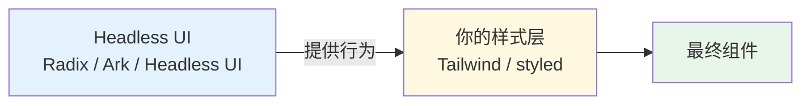
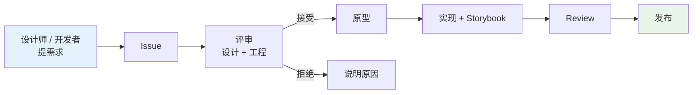

# 设计系统

> 一句话定位：**Token / 组件库 / 主题 / Storybook —— 让"设计"从灵感变成可复用的工程资产**

设计系统（Design System）不是"一套 UI 组件"。它是**设计语言 + Token + 组件库 + 文档 + 治理流程**的总和，是品牌在数字产品中的"唯一真相源"（Single Source of Truth）。

---
## 引言：反直觉代码

设计系统 的关键不是语法——是**看起来对**的代码背后那些'踩坑点'。

本篇用 3 个反直觉片段切入，把面试/生产中常被问起、但一深入就漏馅的点摆出来。

---

## 1. 设计系统的层次



| 层次 | 代表 | 复用度 | 稳定性 |
|------|------|--------|--------|
| **设计语言** | Material Design / Apple HIG / Ant Design Language | 极高 | 极稳定 |
| **Design Token** | 颜色变量、间距系统、字体阶梯 | 高 | 稳定 |
| **原子组件** | Button、Input、Icon、Badge | 高 | 稳定 |
| **业务组件** | UserCard、PaymentForm、FilterBar | 中 | 较稳定 |
| **页面模板** | Dashboard 模板、列表页模板 | 低 | 较易变 |

---

## 2. Design Token —— 设计系统的基石

### Token 是什么？

Token 是**设计决策的抽象化命名**，把"色号 #1976d2"变成 `color-primary`，把"16px"变成 `spacing-md`。

```json
// tokens.json
{
  "color": {
    "primary": { "value": "#1976d2" },
    "secondary": { "value": "#f50057" },
    "text": {
      "primary": { "value": "#212121" },
      "secondary": { "value": "#757575" }
    }
  },
  "spacing": {
    "xs": { "value": "4px" },
    "sm": { "value": "8px" },
    "md": { "value": "16px" },
    "lg": { "value": "24px" }
  },
  "font": {
    "size": {
      "sm": { "value": "14px" },
      "md": { "value": "16px" },
      "lg": { "value": "20px" }
    }
  }
}
```

### Token 工具链

| 工具 | 作用 | 适用 |
|------|------|------|
| **Style Dictionary**（Amazon） | Token → 多平台代码（CSS/JS/Swift/Kotlin） | **首选**，开源 |
| **Tokens Studio** | Figma 插件 + Git 同步 | 设计师主导 |
| **Figma Variables** | Figma 原生 Token 管理 | Figma 用户 |
| **Theo**（Salesforce） | Token 转换 | 老牌 |



---

## 3. 主题系统

### 主题 = Token 的"多套实现"

```css
/* tokens.css */
:root, [data-theme="light"] {
  --color-primary: #1976d2;
  --color-bg: #ffffff;
  --color-text: #212121;
}

[data-theme="dark"] {
  --color-primary: #90caf9;
  --color-bg: #121212;
  --color-text: #e0e0e0;
}
```

### 主题切换方案

| 方案 | 实现 | 优缺点 |
|------|------|--------|
| **CSS Variables** | `:root` / `[data-theme]` + `prefers-color-scheme` | ✅ 无 JS 切换，性能最佳 |
| **Styled Components** | `ThemeProvider` + props | ⚠️ 仅 styled-components 生态 |
| **Tailwind CSS** | `dark:` 前缀 + `darkMode: 'class'` | ✅ Tailwind 项目首选 |

```tsx
// React - 主题切换
function ThemeToggle() {
  const [theme, setTheme] = useState<'light' | 'dark'>(
    () => localStorage.getItem('theme') || 'light'
  )
  
  useEffect(() => {
    document.documentElement.dataset.theme = theme
    localStorage.setItem('theme', theme)
  }, [theme])
  
  return <button onClick={() => setTheme(t => t === 'light' ? 'dark' : 'light')}>
    Toggle
  </button>
}
```

---

## 4. 主流 UI 组件库（2026）

### 4.1 React 生态

| 库 | 风格 | 2026 定位 | 适用 |
|----|------|----------|------|
| **shadcn/ui** | 复制代码到你的项目，无 npm 依赖 | ⭐⭐⭐⭐⭐ 最火 | Tailwind 项目首选 |
| **Ant Design** | 企业级，功能最全 | ⭐⭐⭐⭐⭐ 国内主流 | B 端 / 中后台 |
| **Material UI (MUI)** | Google Material 风格 | ⭐⭐⭐⭐ 稳定 | 国际化项目 |
| **Radix UI** | Headless，无样式 | ⭐⭐⭐⭐ 上升 | 自建设计系统 |
| **Chakra UI** | 可访问性优先 | ⭐⭐⭐ 稳定 | 可访问性敏感项目 |
| **Ark UI** | Headless，新晋 | ⭐⭐⭐⭐ 上升 | Radix 替代 |

### 4.2 Vue 生态

| 库 | 风格 | 2026 定位 | 适用 |
|----|------|----------|------|
| **Element Plus** | 中后台 | ⭐⭐⭐⭐⭐ 国内主流 | B 端 |
| **Naive UI** | TypeScript + 主题化 | ⭐⭐⭐⭐ | 现代 Vue 项目 |
| **Vuetify** | Material Design | ⭐⭐⭐⭐ | 国际化项目 |
| **PrimeVue** | 组件数量最多 | ⭐⭐⭐ | 复杂业务 |

### shadcn/ui 的"反模式"革命

传统 UI 库（AntD / MUI）：`npm install`，版本升级痛苦。
shadcn/ui：**复制代码到你的项目**，你拥有组件，随便改。

```bash
npx shadcn@latest add button
# → 复制 button.tsx 到你的 src/components/ui/
# → 你拥有它，可任意定制
```

**为什么 2026 年爆火**：
- ✅ 零依赖，无版本升级冲突
- ✅ 完全可控，定制零成本
- ✅ 与 Tailwind 深度集成
- ✅ 社区贡献活跃

---

## 5. Headless UI —— 行为与样式分离

**Headless UI** = 只负责**行为 + 可访问性**，不写任何样式。



| 库 | 框架 | 组件 |
|----|------|------|
| **Radix UI** | React | Dialog、Dropdown、Tabs、Popover |
| **Ark UI** | React / Vue / Solid | 同上 + 更多 |
| **Headless UI**（Tailwind 官方） | React / Vue | Menu、Listbox、Switch |
| **React Aria**（Adobe） | React | 最全面的 ARIA 实现 |

**典型用法**（Radix Dialog）：
```tsx
import * as Dialog from '@radix-ui/react-dialog'

function MyDialog() {
  return (
    <Dialog.Root>
      <Dialog.Trigger className="btn">Open</Dialog.Trigger>
      <Dialog.Portal>
        <Dialog.Overlay className="overlay" />
        <Dialog.Content className="content">
          <Dialog.Title>标题</Dialog.Title>
          <Dialog.Close>×</Dialog.Close>
        </Dialog.Content>
      </Dialog.Portal>
    </Dialog.Root>
  )
}
// Radix 处理了：焦点陷阱、Esc 关闭、点击外部关闭、ARIA 属性
// 你只负责样式
```

---

## 6. 文档与可视化

| 工具 | 作用 | 适用 |
|------|------|------|
| **Storybook** | 组件隔离开发 + 可视化文档 | **首选**，开源 |
| **Zeroheight** | 设计系统文档平台（连接 Figma） | 设计主导 |
| **Backpack**（Figma + 代码同步） | Figma ↔ 代码 | 大型团队 |
| **Supernova** | 设计系统文档自动化 | 新兴 |

### Storybook 最佳实践

```typescript
// Button.stories.ts
import type { Meta, StoryObj } from '@storybook/react'
import { Button } from './Button'

const meta = {
  title: 'Atoms/Button',
  component: Button,
  tags: ['autodocs'],
  argTypes: {
    variant: { control: 'select', options: ['primary', 'secondary', 'ghost'] }
  }
} satisfies Meta<typeof Button>

export default meta
type Story = StoryObj<typeof meta>

export const Primary: Story = {
  args: { variant: 'primary', children: 'Click me' }
}

export const Secondary: Story = {
  args: { variant: 'secondary', children: 'Cancel' }
}
```

**Storybook 的价值**：
- ✅ 组件隔离开发（无需跑整个应用）
- ✅ 视觉回归测试（Chromatic 集成）
- ✅ 设计师审阅的入口
- ✅ 组件 API 文档自动生成

---

## 7. 设计系统的治理

### 贡献流程



### 版本管理

| 策略 | 工具 | 适用 |
|------|------|------|
| **语义化版本** | Changesets | **首选**，清晰 |
| **自动发布** | Semantic Release | 自动 changelog + 版本号 |
| **Canary 版本** | Changesets canary | 预发布测试 |

---

## 8. 设计系统 vs 组件库

| 维度 | 组件库 | 设计系统 |
|------|--------|---------|
| **范围** | 代码组件 | 设计语言 + Token + 组件 + 文档 + 治理 |
| **使用者** | 开发者 | 设计师 + 开发者 + PM |
| **维护** | 个人 / 团队 | 专职团队 + 治理流程 |
| **例子** | AntD / MUI | Material Design / Shopify Polaris |

> **心法**：**组件库是设计系统的一个产出物，不是设计系统本身。**

---

## 9. 2026 趋势

1. **shadcn/ui 引领"代码即组件库"**：npm 依赖模式式微，代码复制模式兴起
2. **Design Token 标准化**：W3C Design Token Community Group 推进标准
3. **Headless + Tailwind 成默认组合**：行为与样式彻底分离
4. **AI 辅助组件生成**：Cursor + shadcn/ui = 快速拼装页面
5. **多品牌主题**：SaaS 平台需要租户级别主题定制

---

## 10. 选型决策表

| 场景 | 推荐方案 |
|------|---------|
| **新项目 React + Tailwind** | shadcn/ui + Radix UI |
| **B 端 / 中后台** | Ant Design / Element Plus |
| **自建设计系统** | Design Token (Style Dictionary) + Headless UI + Storybook |
| **多框架 monorepo** | Nano Stores + Design Token + Storybook |
| **国际化项目** | MUI / Vuetify |
| **可访问性敏感** | Chakra UI / React Aria |

---

## 11. 学习路径建议

1. **入门**（1 周）：跑通 shadcn/ui + Tailwind，理解 Headless UI 理念
2. **进阶**（2 周）：搭建 Storybook + Chromatic 视觉回归；设计 Token 体系
3. **高级**（持续）：多品牌主题；Design Token 工作流；治理流程设计

## 12. 交叉引用

- [`01-foundation/`](../../01-foundation/) — CSS 工程化（CSS Variables / Sass）
- [`05-architecture/`](../) — 组件架构与复用
- [`08-cross-platform/`](../../08-cross-platform/) — 跨端设计系统（React Native / Flutter）
- [`12.story/`](../../../12.story/README.md/) — 阿明餐厅设计系统演进

---

## 13. 与其他模块的关系

- **上游**：[`01-foundation/`](../../01-foundation/) / [`03-frameworks/`](../../03-frameworks/)
- **下游**：被所有应用层复用；[`08-cross-platform/`](../../08-cross-platform/) 复用设计系统
