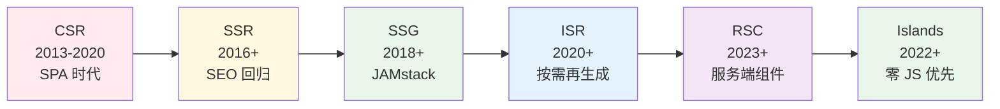
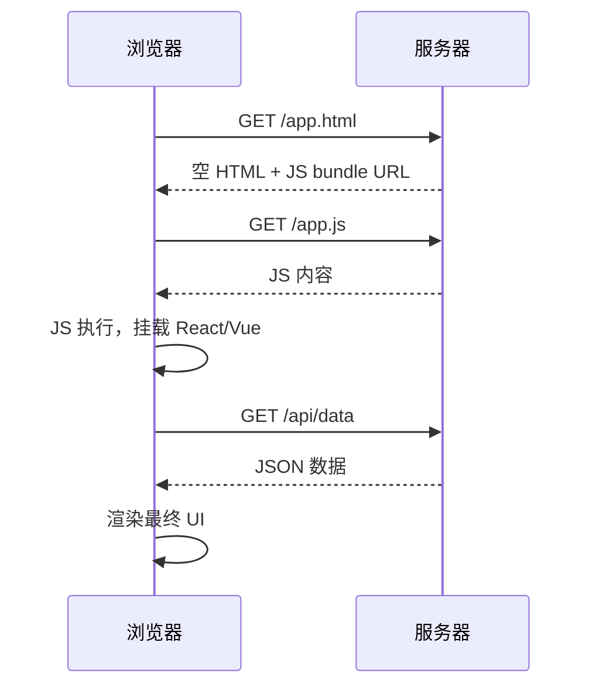
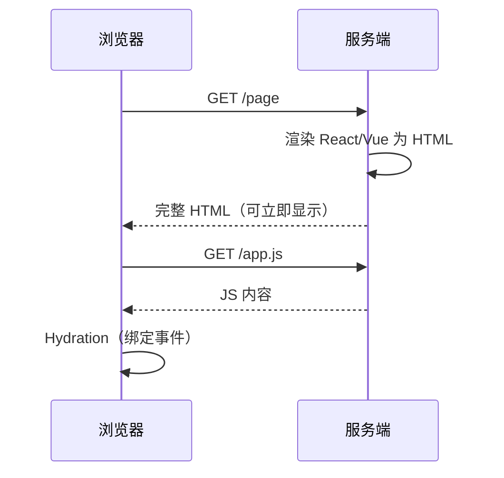
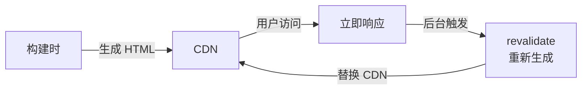
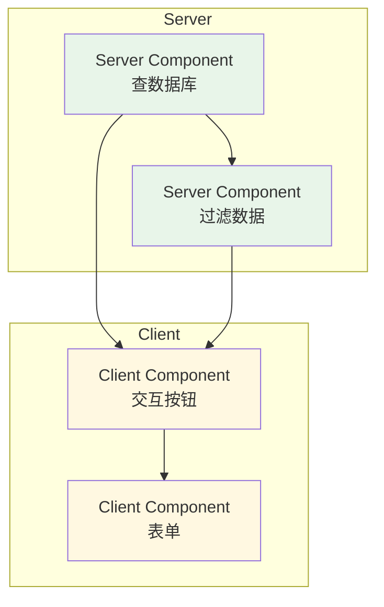
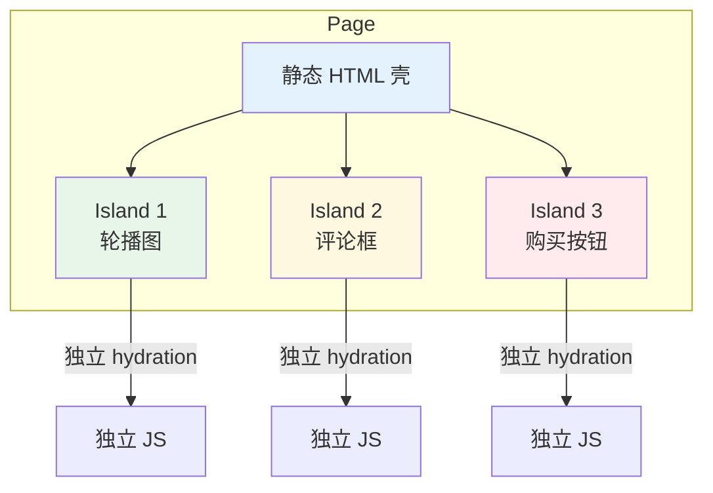
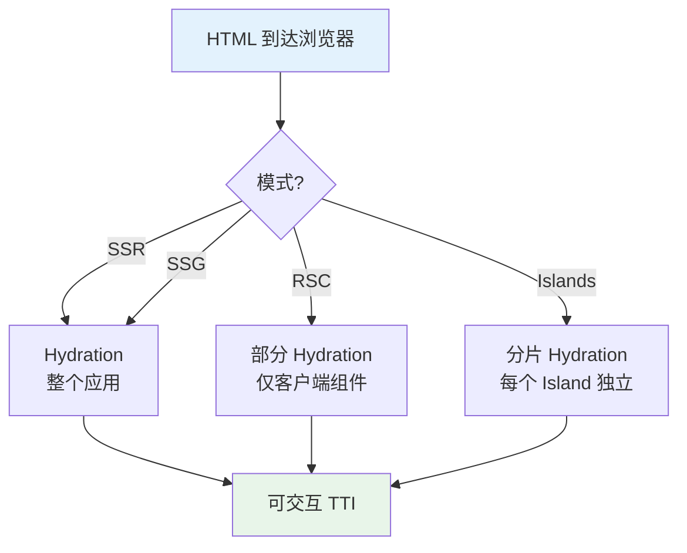

<!--
module:
  parent: front-end
  slug: front-end/rendering-modes
  type: article
  category: 主模块子文章
  summary: 渲染模式全景
-->

# 渲染模式全景

> 一句话定位：**CSR / SSR / SSG / ISR / RSC / Islands —— 前端"把 HTML 送到用户眼前"的 6 种方式**

2026 年，几乎没有项目还在"裸用"单一渲染模式。Next.js 的 App Router、Astro 的 Islands、Remix 的 Streaming SSR、Nuxt 的 Universal —— 每一种元框架的本质，都是**在 6 种渲染模式之间做排列组合**。理解它们，才能做出正确的架构选型。

---
## 引言：架构困境

渲染模式全景 的关键不是'选型'——是**选完之后怎么在 5 个 trade-off 里活下来**。

本篇用'决策困境'切入，比较几种主流路径并讲清取舍。

---

## 1. 六种模式速查

| 模式 | 渲染在哪 | 生成时机 | 首屏速度 | SEO | 交互性 | 代表框架 |
|------|---------|---------|---------|-----|--------|---------|
| **CSR** | 浏览器 | 运行时 | ⭐⭐ 慢 | ❌ 差 | ⭐⭐⭐⭐⭐ 完整 | React (CRA)、Vue CLI |
| **SSR** | 服务端 | 每次请求 | ⭐⭐⭐⭐ 快 | ✅ 好 | ⭐⭐⭐⭐⭐ 完整 | Next.js (Pages)、Nuxt |
| **SSG** | 构建时静态文件 | 构建时 | ⭐⭐⭐⭐⭐ 最快 | ✅ 最好 | ⭐⭐⭐⭐⭐（hydration 后） | Next.js (Static)、Astro、Gatsby |
| **ISR** | 构建时 + 增量重生成 | 构建时 + 后台定时 | ⭐⭐⭐⭐ 快 | ✅ 好 | ⭐⭐⭐⭐⭐ 完整 | Next.js (revalidate) |
| **RSC** | 服务端（流式） | 每次请求（流式） | ⭐⭐⭐⭐ 快 | ✅ 好 | ⭐⭐⭐⭐ 客户端组件交互 | Next.js App Router |
| **Islands** | 构建时 + 局部 hydration | 构建时 | ⭐⭐⭐⭐⭐ 最快 | ✅ 最好 | ⭐⭐⭐ 局部交互 | Astro、Eleventy + Islands |

---

## 2. 渲染模式演进

**演进主线**：从"全在浏览器做"→"移回服务端"→"构建时能做的先做"→"按需做"→"流式做"→"尽量少做"。

---

## 3. 六种模式详解

### 3.1 CSR（Client-Side Rendering）

**流程**：浏览器下载 HTML → 下载 JS bundle → JS 执行 → 调用 API → 渲染 DOM。

**优点**：交互丰富、部署简单（纯静态托管）、前后端分离彻底。
**缺点**：首屏慢（瀑布流加载）、SEO 几乎无效、白屏时间长。
**适用**：Dashboard、内部工具、SaaS 后台 —— **不需要 SEO 的高交互场景**。
**2026 定位**：已不再是默认选择，但在"后台管理类应用"中仍然合理。

---

### 3.2 SSR（Server-Side Rendering）

**流程**：每次请求 → 服务端渲染 HTML → 浏览器显示 → 同时下载 JS → JS hydration（接管交互）。

**优点**：首屏快（HTML 立即可见）、SEO 友好、支持流式渲染（Streaming SSR，边渲染边发送）。
**缺点**：服务器负载高（每次请求都要算一遍）、TTI 与 FCP 有时间差（hydration 阻塞交互）。
**代表**：Next.js Pages Router、Nuxt、Remix。
**适用**：电商、新闻、社交 —— **首屏速度和 SEO 都重要的场景**。

---

### 3.3 SSG（Static Site Generation）

**流程**：构建时生成所有页面的 HTML → 部署到 CDN → 用户直接拿到静态文件。

**优点**：速度最快（CDN 直出）、最便宜（无服务端计算）、最安全（无运行时服务端漏洞）。
**缺点**：页面数巨大时构建慢、内容更新要重新构建。
**代表**：Astro（默认）、Next.js `getStaticProps`、Gatsby、Hugo、Eleventy。
**适用**：博客、文档、营销页、落地页 —— **内容变化少、流量大的站点**。

---

### 3.4 ISR（Incremental Static Regeneration）

**流程**：构建时生成页面 → 部署 → 用户访问 → 后台按 `revalidate` 间隔异步重生成。

**优点**：兼顾 SSG 的速度 + 内容可更新。
**缺点**：`revalidate` 窗口内用户可能看到陈旧内容；Vercel 之外平台支持有限。
**代表**：Next.js `revalidate` 参数。
**适用**：电商商品页、新闻详情 —— **内容定期更新，但不需要实时的场景**。

---

### 3.5 RSC（React Server Components）

**核心突破**：把"服务端组件"和"客户端组件"**显式拆分**。服务端组件**永远不发送 JS 到客户端**，只在服务端渲染。

**与传统 SSR 的区别**：
| 维度 | 传统 SSR | RSC |
|------|---------|-----|
| 服务端渲染 | 整个组件树 | 只有标记 `'use server'` 的组件 |
| hydration | 全部组件都要 hydration | 客户端组件才 hydration |
| JS 体积 | 与服务端组件大小正相关 | 服务端组件 **零 JS** |
| 数据获取 | `getServerSideProps` | `async function` 直接 await |

**优点**：JS 体积大幅减小、首屏快、直接访问服务端资源（DB / 文件系统）。
**缺点**：心智模型复杂（`'use client'` / `'use server'` 边界）、服务端组件不能 `useState` / 绑定事件。
**代表**：Next.js App Router（唯一主流实现）。
**适用**：内容为主 + 局部交互的应用（博客、文档、电商前台）。

---

### 3.6 Islands Architecture（群岛架构）

**核心理念**：默认零 JS，**只在需要交互的地方"嵌入岛屿"**。

**与 RSC 的区别**：
| 维度 | RSC | Islands |
|------|-----|---------|
| 框架 | 仅 React | 多框架混用（React + Vue + Svelte 同页） |
| 交互粒度 | 客户端组件 | 任意组件可标为"交互岛" |
| 服务端访问 | 服务端组件直连 DB | 通常通过 API |
| 适用框架 | Next.js | Astro（主力） |

**代表**：Astro（Islands Architecture 的发明者）。
**适用**：博客、营销、电商前台 —— **内容为主，交互零散**。

---

## 4. 六大模式决策表

| 业务场景 | 推荐模式 | 理由 |
|---------|---------|------|
| **个人博客 / 文档站** | SSG / Islands | 零 JS、CDN 最快、SEO 最佳 |
| **电商商品页 / 新闻** | ISR / RSC | 内容定期更新，首屏要快 |
| **电商首页（含交互）** | RSC + Islands 组件 | 服务端取数 + 客户端交互并存 |
| **SaaS 后台 / Dashboard** | CSR | 不需 SEO，交互密集 |
| **社交平台 / Feed 流** | SSR + Streaming | 首屏重要，内容动态 |
| **营销落地页** | SSG / Islands | 转化依赖 LCP，零 JS 最优 |
| **企业内部工具** | CSR | 简单直接，无需 SEO |
| **多框架内容站** | Astro (Islands) | 混用 React/Vue 组件 |

---

## 5. Hydration：贯穿所有模式的共同难题

**Hydration 性能问题**：TTI（Time to Interactive）= FCP + Hydration 时间。当组件树巨大时，hydration 会阻塞主线程，导致 INP（交互到下一帧）变差。

**2026 优化方向**：
- **Partial Hydration**（RSC / Islands）：只 hydration 交互部分
- **Progressive Hydration**：按可视区域分批 hydration
- **Resumability**（Qwik）：完全避免 hydration，直接"恢复"状态
- **Streaming SSR**：边渲染边发 HTML，让用户更早看到内容

---

## 6. 元框架与渲染模式的关系

| 元框架 | 默认模式 | 支持的模式 |
|--------|---------|----------|
| **Next.js App Router** | RSC + Streaming SSR | RSC / SSR / SSG / ISR |
| **Next.js Pages Router** | SSR | SSR / SSG / ISR |
| **Nuxt 3** | SSR + Hybrid | SSR / SSG / ISR（per-route） |
| **Astro** | SSG + Islands | SSG / SSR（按需） + Islands |
| **Remix** | SSR + Streaming | SSR |
| **SvelteKit** | SSR + Hybrid | SSR / SSG / SPA |
| **Gatsby** | SSG | SSG |
| **Hugo / Eleventy** | SSG | SSG |

**关键趋势**：2026 年元框架普遍支持 **Hybrid Rendering** —— 同一个项目内，不同页面/路由可以选择不同的渲染模式。Next.js 的 `export const dynamic = 'force-static'` 和 Nuxt 的 `routeRules` 都是这种思想的体现。

---

## 7. 性能对比（典型电商场景）

| 模式 | FCP | LCP | TTI | JS 体积 | 服务端成本 |
|------|-----|-----|-----|--------|----------|
| CSR | 1.8s | 3.5s | 4.2s | 500KB | 低 |
| SSR | 0.8s | 1.2s | 2.1s | 500KB | 高 |
| SSG | 0.3s | 0.5s | 0.8s | 500KB | 无 |
| ISR | 0.3s | 0.5s | 0.8s | 500KB | 低 |
| RSC | 0.6s | 1.0s | 1.5s | **180KB** | 中 |
| Islands | 0.3s | 0.5s | 0.6s | **80KB** | 无 |

> 数据来源：[Astro vs Next.js Benchmark 2025](https://www.jonasdebber.com/blog/astro-vs-nextjs)、[Patterns Dev Rendering](https://www.patterns.dev/posts/rendering-patterns/)

---

## 8. 学习路径建议

1. **入门**（3 天）：理解 CSR / SSR / SSG 三种基础模式，手写一个 Next.js `getStaticProps` + `getServerSideProps` 对比 Demo
2. **进阶**（1 周）：理解 ISR / RSC / Islands 的设计动机，跑通 Next.js App Router 的 `'use client'` / `'use server'` 边界
3. **高级**（持续）：深入 Streaming SSR、Partial Hydration、Resumability 的底层实现

## 9. 交叉引用

- [`06-performance/`](../../06-performance/) — 渲染模式直接决定 LCP / TTI 基线
- [`03-frameworks/`](../../03-frameworks/) — 元框架与渲染模式的绑定关系
- [`09-frontend-and-ai/`](../../09-frontend-and-ai/) — RSC 与 AI 流式输出的天然契合
- [`12.story/13-frontend-renovation.md`](../../../12.story/13-frontend-renovation.md) — 阿明餐厅从 CSR 迁移到 ISR 的故事

---

## 10. 与其他模块的关系

- **上游**：[`03-frameworks/`](../../03-frameworks/) / [`04-engineering/`](../../04-engineering/)
- **下游**：被 [`06-performance/`](../../06-performance/)（性能基线）、[`08-cross-platform/`](../../08-cross-platform/)（跨端渲染策略）直接复用

---

← [返回 前端架构](../README.md)
