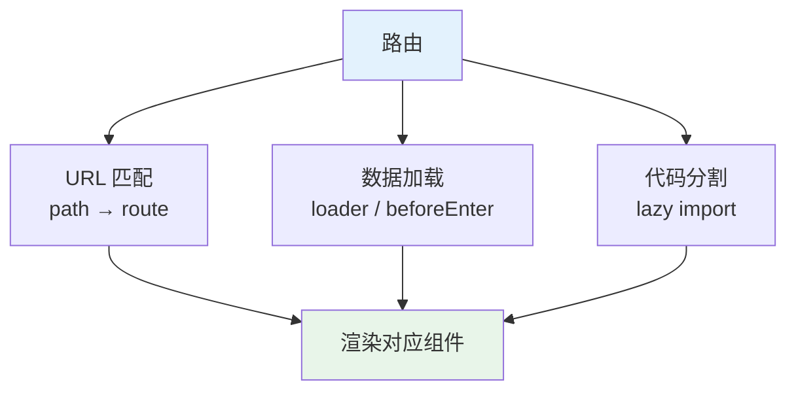
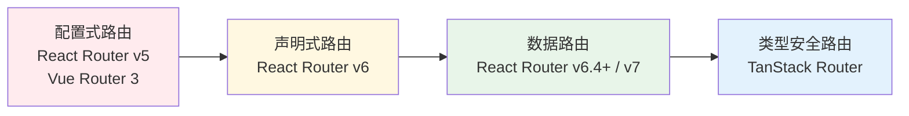

<!--
module:
  parent: front-end
  slug: front-end/routing
  type: article
  category: 主模块子文章
  summary: 路由
-->

# 路由

> 一句话定位：**React Router / Vue Router / TanStack Router —— 把 URL 变成"应用的入口"**

前端路由的本质是：**URL ↔ UI 的映射**。没有路由，SPA 就只是一堆组件；有了路由，URL 才成为"可分享、可刷新、可书签"的真实应用入口。

---
## 引言：反直觉代码

路由 的关键不是语法——是**看起来对**的代码背后那些'踩坑点'。

本篇用 3 个反直觉片段切入，把面试/生产中常被问起、但一深入就漏馅的点摆出来。

---

## 1. 路由的三层职责



| 职责 | 说明 | 关键 API |
|------|------|---------|
| **URL 匹配** | `/users/:id` → `UserDetailPage` | `path` / `:param` / `*` |
| **数据加载** | 进入路由前预取数据 | `loader` / `beforeEnter` / `useRouteLoaderData` |
| **代码分割** | 路由级懒加载 | `lazy()` / `React.lazy()` / `defineAsyncComponent()` |

---

## 2. 三大主流路由对比（2026）

### 2.1 React Router v7

| 维度 | 现状 |
|------|------|
| **使用率** | React 生态 ~70%（Next.js 项目除外） |
| **定位** | 框架无关的 React 路由库 |
| **核心特性** | Data Router API（v6.4+）、`loader` / `action`、`<Link prefetch>` |
| **2026 变化** | v7 与 Remix 合并，数据模式成默认；TanStack Router 崛起为第二选择 |

```tsx
// React Router v7
const router = createBrowserRouter([
  {
    path: '/users/:id',
    element: <UserPage />,
    loader: async ({ params }) => fetchUser(params.id),
    action: async ({ request }) => updateUser(request),
    children: [
      { path: 'posts', element: <UserPosts /> }
    ]
  }
])
```

### 2.2 Vue Router 4

| 维度 | 现状 |
|------|------|
| **使用率** | Vue 项目几乎 100% 标配 |
| **定位** | Vue 官方路由（与框架深度绑定） |
| **核心特性** | 组合式 API 守卫、`<Suspense>` 异步组件、命名视图 |
| **2026 状态** | 稳定，Vue 生态无替代品 |

```typescript
// Vue Router 4
const router = createRouter({
  history: createWebHistory(),
  routes: [
    {
      path: '/users/:id',
      component: UserPage,
      beforeEnter: async (to) => {
        const userStore = useUserStore()
        await userStore.fetchUser(to.params.id)
      }
    }
  ]
})
```

### 2.3 TanStack Router（2025-2026 黑马）

| 维度 | 现状 |
|------|------|
| **使用率** | React 生态 ~15%，快速上升 |
| **定位** | 类型安全的 React 路由 |
| **核心特性** | **端到端类型推导**（路径参数、搜索参数、loader 返回类型全部推导）、Search Params 验证 |
| **适用** | 大型 React 应用、需要强类型 URL 状态 |

```typescript
// TanStack Router
const userRoute = createRoute({
  getParentRoute: () => rootRoute,
  path: '/users/$userId',
  validateSearch: (search) => ({
    tab: search.tab ?? 'profile',
  }),
  loader: async ({ params }) => {
    return await fetchUser(params.userId) // 类型推导 userId 为 string
  },
})

// 使用时完整类型推导
function UserComponent() {
  const { userId } = userRoute.useParams()  // ✅ 类型推导
  const { tab } = userRoute.useSearch()     // ✅ 'profile' | ...
  const data = userRoute.useLoaderData()    // ✅ User 类型
}
```

---

## 3. 路由范式演进



---

## 4. 路由模式对比

| 模式 | 实现 | URL 形态 | 适用 |
|------|------|---------|------|
| **History 模式** | HTML5 History API | `/users/123` | **首选**，URL 干净 |
| **Hash 模式** | `window.location.hash` | `/#/users/123` | 静态托管（无服务端配置） |
| **Memory 模式** | 内存状态 | 无 URL 变化 | 测试 / React Native / 弹窗路由 |

**History 模式的服务端配置**：
- Nginx：`try_files $uri /index.html`
- Vercel / Netlify：自动处理（无需配置）
- 自建 Node：所有未匹配路由 fallback 到 `index.html`

---

## 5. 路由级代码分割

```typescript
// React + React Router v7
const UserPage = lazy(() => import('./pages/UserPage'))
const AdminPage = lazy(() => import('./pages/AdminPage'))

const router = createBrowserRouter([
  {
    path: '/users/:id',
    element: <Suspense fallback={<Loading />}><UserPage /></Suspense>,
  },
  {
    path: '/admin/*',
    element: <Suspense fallback={<Loading />}><AdminPage /></Suspense>,
  }
])
```

```typescript
// Vue Router 4
const routes = [
  {
    path: '/users/:id',
    component: () => import('./pages/UserPage.vue')  // 自动 lazy
  }
]
```

**最佳实践**：
- **路由级分割**（必做）：每个路由一个 chunk
- **组件级分割**（按需）：重型组件（图表、富文本编辑器）单独懒加载
- **库级分割**（构建工具）：`splitChunks` / `manualChunks` 拆分 node_modules

---

## 6. URL 状态 vs 全局状态

| 状态类型 | 该放哪 | 例子 |
|---------|--------|------|
| **分页 / 筛选 / 排序** | URL search params | `?page=2&sort=asc` |
| **搜索关键词** | URL search params | `?q=keyword` |
| **标签页切换** | URL path / search | `/users/123?tab=posts` |
| **用户偏好** | LocalStorage + Context | 主题、语言 |
| **表单临时状态** | 组件内 state | 未提交的草稿 |
| **登录态** | 全局 store / Context | 用户信息 |

> **核心原则**：**URL 是用户可分享、可收藏、可回退的状态**。凡是"用户希望刷新后保留"的状态，都应该进 URL。

---

## 7. 路由守卫与权限控制

```typescript
// React Router v7 - loader 拦截
const protectedRoute = {
  path: '/dashboard',
  loader: async ({ request }) => {
    const user = await getCurrentUser(request)
    if (!user) throw redirect('/login')
    return { user }
  },
  element: <Dashboard />
}

// Vue Router 4 - 全局守卫
router.beforeEach(async (to, from) => {
  const authStore = useAuthStore()
  if (to.meta.requiresAuth && !authStore.isLoggedIn) {
    return { path: '/login', query: { redirect: to.fullPath } }
  }
})
```

**权限控制三层防线**：
1. **路由级**：路由守卫 / loader 拦截
2. **组件级**：`<ProtectedRoute>` 包装器
3. **按钮级**：`usePermission()` hook

---

## 8. 路由测试策略

| 测试类型 | 工具 | 测试什么 |
|---------|------|---------|
| **单元测试** | Vitest + Testing Library | 组件渲染、路由参数读取 |
| **集成测试** | Testing Library + Router | 导航、重定向、守卫逻辑 |
| **E2E** | Playwright | 关键路由路径、权限跳转 |

---

## 9. 2026 趋势

1. **类型安全路由成为标配**：TanStack Router 的类型推导理念会下沉到 React Router
2. **路由与数据加载绑定**：`loader` / `action` 模式成主流
3. **Search Params 一等公民**：URL search params 是状态的"天然归属"
4. **文件路由 vs 配置路由**：Next.js / Nuxt 用文件路由；React Router / Vue Router 用配置路由 —— 二者长期共存
5. **嵌套路由**取代扁平路由：布局组件复用更彻底

---

## 10. 选型决策表

| 场景 | 推荐方案 | 理由 |
|------|---------|------|
| **Next.js / Nuxt 项目** | 框架内置路由 | 无需选择，与 SSR/SSG 集成 |
| **React SPA（小型）** | React Router v7 | 社区最大，生态最全 |
| **React SPA（大型）** | TanStack Router | 端到端类型安全 |
| **Vue 项目** | Vue Router 4 | 官方唯一选择 |
| **SvelteKit 项目** | 文件路由内置 | 与 SSR 深度集成 |
| **多框架 monorepo** | TanStack Router + 各自框架 | 统一心智模型 |

---

## 11. 学习路径建议

1. **入门**（3 天）：跑通 Vue Router 4 / React Router v7 的基础配置、动态参数、嵌套路由
2. **进阶**（1 周）：路由守卫 + 懒加载 + loader 数据模式
3. **高级**（持续）：TanStack Router 类型安全；Search Params 作为状态；嵌套布局优化

## 12. 交叉引用

- [`05-architecture/state-management/`](../state-management/) — 路由状态 vs 全局状态
- [`05-architecture/rendering-modes/`](../rendering-modes/) — 路由与 SSR/SSG 的协作
- [`04-engineering/`](../../04-engineering/) — 路由级代码分割
- [`06-performance/`](../../06-performance/) — 路由切换性能

---

## 13. 与其他模块的关系

- **上游**：[`03-frameworks/`](../../03-frameworks/) / [`05-architecture/state-management/`](../state-management/)
- **下游**：被 [`05-architecture/`](../)（布局嵌套）、[`06-performance/`](../../06-performance/)（代码分割）复用
