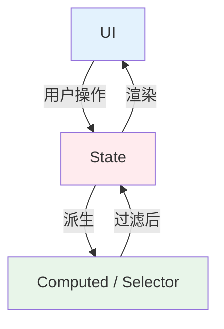
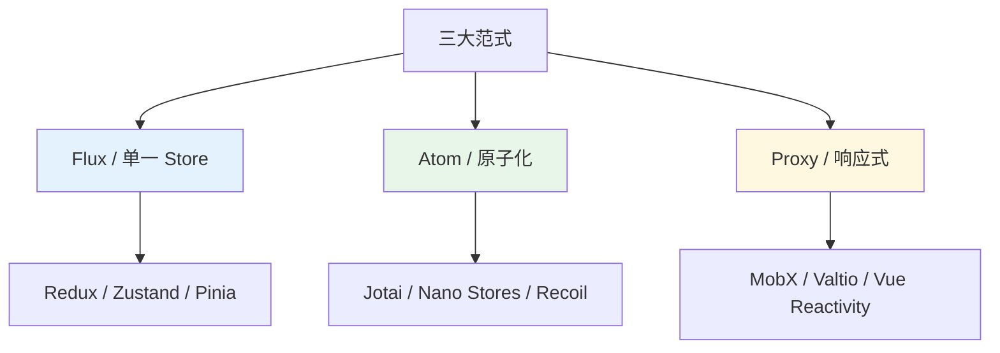
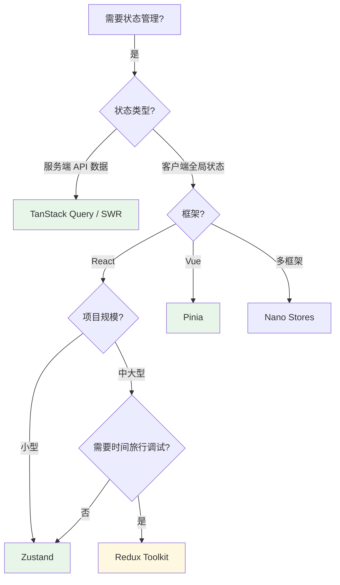

# 状态管理

> 一句话定位：**Redux / Zustand / Jotai / Pinia / Nano Stores —— 让"数据流"从混乱走向可控**

前端状态管理是 2015 年至今最"内卷"的领域之一。从 Redux 一家独大 → MobX 二分天下 → 2023 后 Zustand / Jotai / Nano Stores 等新势力全面上位，**选型已经从"用什么"变成"按什么粒度用"**。

---
## 引言：反直觉代码

状态管理 的关键不是语法——是**看起来对**的代码背后那些'踩坑点'。

本篇用 3 个反直觉片段切入，把面试/生产中常被问起、但一深入就漏馅的点摆出来。

---

## 1. 状态管理的本质问题



**核心矛盾**：
- UI 层组件越来越多 → 需要共享的状态越来越多
- 状态散落 → prop drilling（层层透传） / 重复请求 / 状态不一致
- 解法：把状态"提升"到组件外部，由专门的库统一管理

---

## 2. 状态分类

| 状态类型 | 例子 | 管理方式 |
|---------|------|---------|
| **UI 状态** | 弹窗开关、hover、折叠展开 | 组件内 `useState` / `ref` |
| **客户端全局状态** | 用户登录信息、主题、语言 | **状态管理库** |
| **服务端状态** | API 返回的列表、详情、聚合数据 | **TanStack Query / SWR** |
| **表单状态** | 表单字段值、校验状态 | React Hook Form / VeeValidate |
| **URL 状态** | 路由参数、查询字符串 | Router（Vue Router / React Router） |

> **2026 共识**：**服务端状态 ≠ 客户端状态**。TanStack Query / SWR 已经在 80%+ 场景取代了 Redux 的服务端缓存职责。状态管理库应聚焦于"真正需要全局共享的客户端状态"。

---

## 3. 主流方案对比（2026）

### 3.1 React 生态

| 库 | 范式 | 学习曲线 | 包体积 | 2026 使用趋势 | 适用 |
|----|------|---------|--------|--------------|------|
| **Redux Toolkit (RTK)** | Flux / 单一 store | ⭐⭐ 陡 | ~10KB | 存量项目主力 | 大型企业级应用 |
| **Zustand** | Flux-lite / 单一 store | ⭐⭐⭐⭐⭐ 极简 | ~1KB | ⭐⭐⭐⭐⭐ 增长最快 | **新项目首选** |
| **Jotai** | 原子化 / 多 store | ⭐⭐⭐⭐ 简单 | ~2KB | ⭐⭐⭐⭐ 上升 | 原子粒度状态 |
| **Recoil** | 原子化 | ⭐⭐⭐ | ~14KB | ⭐ 已停维 | 不推荐新项目 |
| **MobX** | Observable 响应式 | ⭐⭐⭐ | ~16KB | ⭐⭐ 稳定 | 复杂领域模型 |
| **Valtio** | Proxy 响应式 | ⭐⭐⭐⭐ | ~2KB | ⭐⭐⭐ | 响应式爱好者 |
| **Nano Stores** | 原子化 / 框架无关 | ⭐⭐⭐⭐⭐ | ~0.5KB | ⭐⭐⭐⭐ 上升 | 多框架 monorepo |

### 3.2 Vue 生态

| 库 | 状态 | 2026 推荐度 |
|----|------|----------|
| **Pinia** | Vue 官方唯一推荐（替代 Vuex） | ⭐⭐⭐⭐⭐ **首选** |
| **Vue Reactivity（`reactive` / `ref`）** | 简单场景原生够用 | ⭐⭐⭐⭐⭐ |

> **Vue 2026 共识**：90% 场景用 Vue 3 原生 `reactive`/`ref` + `provide/inject` 即可，复杂项目上 Pinia。**Vuex 已不再推荐**。

---

## 4. 范式对比：Flux vs 原子化 vs 响应式



| 范式 | 核心思想 | 优点 | 缺点 |
|------|---------|------|------|
| **Flux（单一 Store）** | 一个全局状态树，action → reducer → state | 可预测、时间旅行调试、DevTools 强 | 模板代码多、全局重渲染风险 |
| **Atom（原子化）** | 多个独立原子，每个原子是一个状态单元 | 精准订阅、bundle 友好 | 原子间关系需显式处理 |
| **Proxy（响应式）** | 用 Proxy 拦截属性读写，自动追踪依赖 | API 最自然、无模板代码 | 调试困难、不可变性差 |

---

## 5. 代码示例对比

### Redux Toolkit（Flux 范式）
```typescript
// store.ts
const counterSlice = createSlice({
  name: 'counter',
  initialState: { value: 0 },
  reducers: {
    increment: state => { state.value += 1 },
    decrement: state => { state.value -= 1 },
  },
})
export const { increment, decrement } = counterSlice.actions

// component.tsx
const { value } = useSelector(s => s.counter)
const dispatch = useDispatch()
dispatch(increment())
```

### Zustand（Flux-lite，2026 首选）
```typescript
// store.ts
const useCounter = create<CounterState>()(set => ({
  value: 0,
  increment: () => set(s => ({ value: s.value + 1 })),
  decrement: () => set(s => ({ value: s.value - 1 })),
}))

// component.tsx
const { value, increment } = useCounter()
```

### Jotai（原子化）
```typescript
const countAtom = atom(0)
const doubleAtom = atom(get => get(countAtom) * 2)  // 派生

function Counter() {
  const [count, setCount] = useAtom(countAtom)
  return <button onClick={() => setCount(c => c + 1)}>{count}</button>
}
```

### Pinia（Vue 官方）
```typescript
export const useCounter = defineStore('counter', () => {
  const count = ref(0)
  const double = computed(() => count.value * 2)
  const increment = () => count.value++
  return { count, double, increment }
})
```

---

## 6. 服务端状态：TanStack Query

**2026 共识**：**服务端状态（API 数据）不应该用 Redux / Zustand 管理**。

| 维度 | TanStack Query | SWR | Redux RTK Query |
|------|---------------|-----|----------------|
| 框架 | 框架无关（React / Vue / Solid） | 仅 React | 仅 Redux |
| 缓存 | 内存 + 失效策略 | 内存 | 内存 |
| 乐观更新 | ✅ 内置 | ❌ 需手写 | ✅ |
| 离线支持 | ✅ `persistQueryClient` | ❌ | ❌ |
| DevTools | ✅ | ❌ | ✅ Redux DevTools |

```typescript
// React 示例
const { data, isLoading, error } = useQuery({
  queryKey: ['users', userId],
  queryFn: () => fetchUser(userId),
  staleTime: 1000 * 60 * 5,  // 5 分钟内视为新鲜
  gcTime: 1000 * 60 * 30,    // 30 分钟无访问则垃圾回收
})
```

---

## 7. 选型决策树



---

## 8. 反模式清单

| 反模式 | 症状 | 正确做法 |
|--------|------|---------|
| **把所有状态塞全局 store** | store 臃肿、重渲染失控 | 区分 UI / 客户端 / 服务端状态 |
| **用 Redux 管 API 数据** | 模板代码爆炸 | 用 TanStack Query |
| **组件内状态全局化** | 每个小状态都进 store | 仅共享真正需要共享的 |
| **派生状态存 store** | 冗余存储导致不一致 | 用 selector / computed 派生 |
| **无视订阅粒度** | 一个 state 变化，整棵树重渲染 | Zustand 的 `subscribeWithSelector` / Jotai 原子 |

---

## 9. 学习路径建议

1. **入门**（3 天）：掌握 Vue 3 原生响应式（`ref` / `reactive` / `computed`）或 React `useState` + Context
2. **进阶**（1 周）：Zustand 或 Pinia 跑一个真实项目；TanStack Query 替代 API 状态管理
3. **高级**（持续）：原子化（Jotai / Nano Stores）在大型项目的应用；自定义 middleware；DevTools 深入

## 10. 交叉引用

- [`03-frameworks/`](../../03-frameworks/) — 框架选型决定状态管理选型
- [`05-architecture/routing/`](../routing/) — 路由状态 vs 全局状态
- [`06-performance/`](../../06-performance/) — 重渲染是性能杀手
- [`12.story/13-frontend-renovation.md`](../../../12.story/13-frontend-renovation.md) — 阿明餐厅状态管理演进史

---

## 11. 与其他模块的关系

- **上游**：[`03-frameworks/`](../../03-frameworks/) / [`02-language/`](../../02-language/)
- **下游**：被 [`05-architecture/`](../)（渲染架构依赖状态流）、[`06-performance/`](../../06-performance/)（状态粒度影响性能）复用
