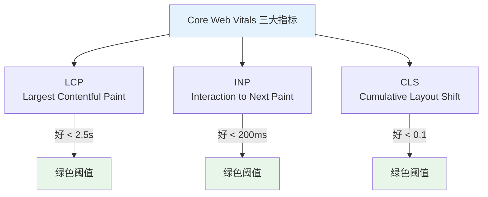
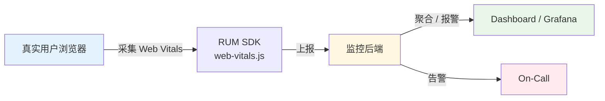

# 06 性能

> 一句话定位：**把"快"做成可量化、可监控、可回归的工程目标**

前端性能的本质是**用户感知到的等待时间**。从指标定义 → 度量 → 优化 → 监控，形成闭环。
本模块围绕 **Core Web Vitals（LCP / INP / CLS）** 展开，覆盖 2026 行业基线。

---

## 1. 五大主题

| 主题 | 核心内容 | 学习价值 |
|------|---------|---------|
| **Core Web Vitals** | LCP（最大内容渲染）/ INP（交互到下一帧）/ CLS（布局偏移） | SEO 排名因子 + 用户体验基线 |
| **Lighthouse 评分** | 评分项拆解 / 自动化检测 / CI 集成 | 性能门禁、回归防护 |
| **性能监控** | RUM（真实用户监控）/ APM（应用性能监控）/ Web Vitals 上报 | 线上问题发现、AB 验证 |
| **加载性能** | 资源优先级 / 预加载 / 关键 CSS / HTTP 缓存 / CDN | 首屏速度 |
| **运行时性能** | 长任务 / 防抖节流 / Web Worker / OffscreenCanvas / WASM | 交互流畅度 |

---

## 2. Core Web Vitals 三大指标

| 指标 | 含义 | 优化方向 |
|------|------|---------|
| **LCP**（最大内容渲染） | 视口内最大元素渲染完成的时刻 | 服务器响应 / 资源加载 / 渲染阻塞 |
| **INP**（交互到下一帧，2024 取代 FID） | 用户交互到浏览器绘制下一帧的延迟 | 主线程长任务拆分 / Web Worker |
| **CLS**（累计布局偏移） | 页面元素意外移动的累计分数 | 图片/视频固定宽高 / 字体预加载 |

**2024 重要更新**：INP 取代 FID 成为正式核心指标（Google 2024 年 3 月宣布），标志着"交互响应"取代"首次输入"成为新基线。

---

## 3. Lighthouse 评分项拆解

| 维度 | 占比 | 核心优化项 |
|------|------|----------|
| **性能（Performance）** | 100% | FCP / LCP / TBT / CLS / SI 综合 |
| **可访问性** | 独立维度 | ARIA / 对比度 / 键盘导航 |
| **最佳实践** | 独立维度 | HTTPS / 无废弃 API / 控制台无错误 |
| **SEO** | 独立维度 | meta 标签 / robots.txt / 结构化数据 |
| **PWA** | 独立维度 | Service Worker / Manifest / 离线 |

**关键洞见**：Lighthouse 单次跑分波动大，**生产监控必须用 RUM（真实用户监控）数据**。Lighthouse 仅适合 CI 门禁 + 调试工具。

---

## 4. 加载性能优化清单

| 优化项 | 收益 | 实施成本 |
|--------|------|---------|
| **HTTP 缓存 + 资源 hash** | ⭐⭐⭐⭐⭐ | ⭐ 1 行 |
| **CDN 加速** | ⭐⭐⭐⭐⭐ | ⭐⭐ |
| **关键 CSS 内联** | ⭐⭐⭐⭐ | ⭐⭐ |
| **图片懒加载 + 响应式 srcset** | ⭐⭐⭐⭐ | ⭐⭐ |
| **字体子集化 + `font-display: swap`** | ⭐⭐⭐ | ⭐⭐ |
| **路由级 code splitting** | ⭐⭐⭐⭐ | ⭐⭐⭐（框架支持） |
| **预加载关键资源 `<link rel=preload>`** | ⭐⭐⭐ | ⭐ |
| **Tree Shaking + 摇树** | ⭐⭐⭐ | ⭐ |
| **Brotli 压缩** | ⭐⭐⭐⭐ | ⭐ |

---

## 5. 运行时性能优化

| 场景 | 优化方案 |
|------|---------|
| **长任务（>50ms）** | 拆分为微任务 / `requestIdleCallback` / Web Worker |
| **复杂计算** | Web Worker / OffscreenCanvas / WASM |
| **高频事件** | 节流 throttle / 防抖 debounce / `passive: true` 监听 |
| **重排重绘** | 批量 DOM 操作 / `transform` 代替 `top` / GPU 合成层 |
| **大数据列表** | 虚拟滚动（react-virtuoso / vue-virtual-scroller） |
| **状态订阅过细** | Zustand / Jotai 细粒度订阅 / Redux Toolkit |

---

## 6. 性能监控体系

**推荐工具**：
- **采集**：`web-vitals` 官方库
- **后端**：自建 Prometheus + Grafana / SaaS（DataDog RUM / Sentry Performance / New Relic）
- **告警**：P75 / P95 双阈值，分级处理

---

## 7. 学习路径建议

1. **入门**（1 周）：理解 CWV 三大指标 + Chrome DevTools Performance 面板
2. **进阶**（1 个月）：Lighthouse CI 集成 + Web Vitals 上报 + 加载性能清单逐项优化
3. **高级**（持续）：RUM 体系搭建 + AB 实验 + 性能预算 Performance Budget

## 8. 本模块覆盖

| 主题 | 状态 | 说明 |
|------|------|------|
| Core Web Vitals | ✓ 已有 | [core-web-vitals/](core-web-vitals/) — LCP / INP / CLS 详解与优化 |
| 性能监控 | ✓ 已有 | [monitoring/](monitoring/) — RUM / APM / 报警体系 |
| Lighthouse 评分 | 速查 | 见第 3 节 |
| 加载性能 | 速查 | 见第 4 节 |
| 运行时性能 | 速查 | 见第 5 节 |

---

## 9. 交叉引用

- [`12.story/13-frontend-renovation.md`](../../../12.story/13-frontend-renovation.md) 第一、六章：阿明餐厅前端加载优化故事
- [`12.story/16-performance-optimization.md`](../../../12.story/16-performance-optimization.md) — 性能优化的 USE 方法论
- [`05-architecture/`](../05-architecture/) — 渲染模式（SSR/SSG/RSC）直接影响 LCP

---

## 10. 与其他模块的关系

- **上游**：[`05-architecture`](../05-architecture/)（渲染模式决定性能基线）
- **下游**：与 [`07-security`](../07-security/) 协同（性能优化常涉及安全开关取舍，如 CSP 影响加载）
