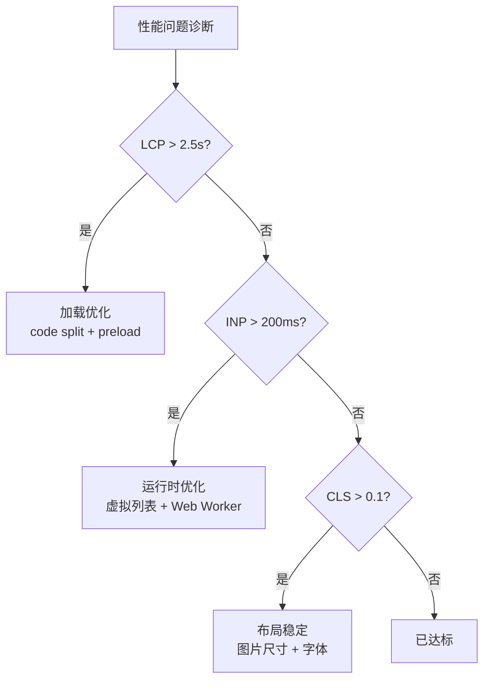

# 06 性能

> 一句话定位：**性能——从 Core Web Vitals 指标到运行时优化手段的完整体系**

本模块覆盖 Web 性能三大支柱：核心指标（LCP/INP/CLS）、监控工具（RUM/Lighthouse）、优化手段（code split/lazy load/虚拟列表等）。

---

## 1. 本模块覆盖

| 主题 | 状态 | 说明 |
|------|------|------|
| Core Web Vitals | ✓ 已有 | [core-web-vitals/](core-web-vitals/) — LCP / INP / CLS 详解 |
| 性能监控 | ✓ 已有 | [monitoring/](monitoring/) — RUM / Lighthouse CI / Sentry / Datadog |
| 优化手段 | ✓ 已有 (T12) | [optimization/](optimization/) — 加载/运行时/资源/网络 4 大类优化 |

> 速查对比见 [📖 顶层 3.10 性能监控速查](../README.md#310-性能监控速查)

---

## 2. 速查要点

- **LCP 目标 < 2.5s**：首屏最大内容绘制时间，影响用户感知速度
- **INP 目标 < 200ms**：交互响应时间，2024 起替代 FID
- **CLS 目标 < 0.1**：累计布局偏移，视觉稳定性
- **性能预算**：JS < 170KB / 图片 < 300KB / 字体 < 100KB（首次加载）

---

## 3. 选型建议

---

## 4. 与其他模块的关系

- **上游**：[01-foundation](../01-foundation/)（浏览器原理） / [03-frameworks](../03-frameworks/)
- **下游**：支撑所有前端项目的性能优化
- **横向**：[07-security](../07-security/) 关注安全，[06 性能] 关注体验

---

## 5. 学习建议

- 必读 [core-web-vitals](core-web-vitals/) 理解指标定义
- 必读 [optimization](optimization/) 掌握 4 大类优化手段
- 实战：Lighthouse CI 卡阈值 + RUM 接入

---

## 6. 数据时效性

- Core Web Vitals 每年更新（Google I/O 2024 引入 INP）
- Lighthouse 每季度发版
- web-vitals 库每季度更新

---

## 7. 关键术语

| 术语 | 解释 |
|------|------|
| LCP | Largest Contentful Paint |
| INP | Interaction to Next Paint |
| CLS | Cumulative Layout Shift |
| RUM | Real User Monitoring |
| FID | First Input Delay（已被 INP 替代） |
| TTI | Time to Interactive |
| TBT | Total Blocking Time |