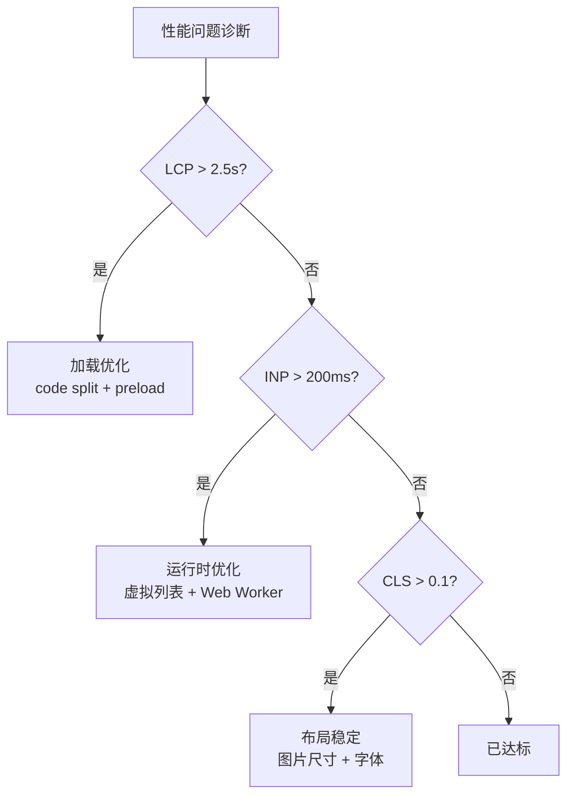

<!--
module:
  parent: note
  slug: 09.front-end/performance
  type: article
  category: 主模块子文章
  summary: 前端 06 性能
-->

# 06 性能

> 一句话定位：**性能——从 Core Web Vitals 指标到运行时优化手段的完整体系**

本模块覆盖 Web 性能三大支柱:核心指标(LCP / INP / CLS)、监控工具(RUM / Lighthouse)、优化手段(code split / lazy load / 虚拟列表等)。

---

## 1. 模块导航

| 主题 | 状态 | 说明 |
|------|------|------|
| Core Web Vitals | ✓ 已有 | [core-web-vitals/](core-web-vitals/) — LCP / INP / CLS 详解 |
| 性能监控 | ✓ 已有 | [monitoring/](monitoring/) — RUM / Lighthouse CI / Sentry / Datadog |
| 优化手段 | ✓ 已有 | [optimization/](optimization/) — 加载 / 运行时 / 资源 / 网络 4 大类优化 |

### 1.1 学习路径

- **入门**:必读 [core-web-vitals](core-web-vitals/) 理解指标定义
- **进阶**:必读 [optimization](optimization/) 掌握 4 大类优化手段(加载 / 运行时 / 资源 / 网络)
- **实战**:Lighthouse CI 卡阈值 + RUM 接入(线上大盘)

---

## 2. 知识脉络

---

## 3. 速查要点

- **LCP 目标 < 2.5s**:首屏最大内容绘制时间,影响用户感知速度
- **INP 目标 < 200ms**:交互响应时间,2024 起替代 FID
- **CLS 目标 < 0.1**:累计布局偏移,视觉稳定性
- **性能预算**:JS < 170KB / 图片 < 300KB / 字体 < 100KB(首次加载)

---

## 4. 核心优化手段

| 优化层 | 手段 | 典型实现 |
|--------|------|---------|
| 加载层 | Code Splitting / Lazy Load | Vite / Webpack 动态导入 + React.lazy |
| 资源层 | 图片格式 / 字体子集 | AVIF / WebP + woff2 子集化 |
| 网络层 | 资源优先级 / 边缘缓存 | preload / prefetch + CDN / Edge |
| 运行时层 | 虚拟列表 / Web Worker | react-window / 后台线程 |
| 渲染层 | SSR / Streaming / RSC | Next.js / Nuxt 流式渲染 |

---

## 5. 最佳实践

- 性能预算固化:JS < 170KB / 图片 < 300KB / 字体 < 100KB(首次加载)
- 图片:AVIF / WebP + `` + `width/height` 防 CLS
- 字体:`font-display: swap` + 子集化 + preload 关键字体
- 长列表必上虚拟列表(react-window / vue-virtual-scroller)
- 重计算丢 Web Worker / OffscreenCanvas,避免阻塞主线程
- Edge 缓存 + SSR 流式渲染缩短 TTFB 到 < 600ms

---

## 6. 常见面试题

- LCP / INP / CLS 三个指标分别测量什么?INP 为什么替代 FID?
- 长任务(Long Task)对 INP 的影响,如何用 `scheduler.yield()` 切片?
- 图片优化三件套:`loading="lazy"` / `decoding="async"` / `width+height` 防 CLS,各自原理
- SSR / Streaming / RSC 三种"快"的区别,TTFB / FCP / LCP 怎么分配
- 性能预算如何在 CI 中落地?Lighthouse CI 阈值卡口的工程实践

---

## 7. 与其他模块的关系

- **上游**:[01-foundation](../01-foundation/)(浏览器原理)/ [03-frameworks](../03-frameworks/)
- **下游**:支撑所有前端项目的性能优化
- **横向**:[07-security](../07-security/) 关注安全,[06 性能] 关注体验

---

## 📊 本节统计

- **主题数**:3(Core Web Vitals / 性能监控 / 优化手段)
- **子 README 数**:3 + 1 顶层 = 4
- **模块导航行数**:3(全已有)
- **学习路径主题数**:2(入门 / 进阶)
- **面试题数**:5
- **数据快照**:2026-06

---

← [返回前端工程总览](../README.md)
