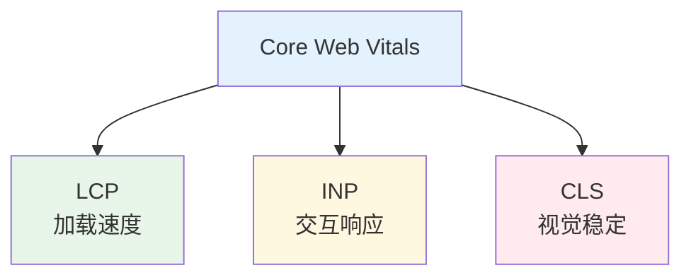

# Core Web Vitals 优化

> 一句话定位：**LCP / INP / CLS —— Google 的三大核心指标，决定 SEO 排名与用户体验**

Core Web Vitals（CWV）是 Google 定义的**用户体验量化指标**，直接影响 Google 搜索排名。2024 年 3 月 INP 取代 FID 成为正式核心指标，标志着"交互响应"成为新基线。

---
## 引言：性能对比

Core Web Vitals 优化 的关键不是'快'——是**什么时候慢、慢多少、为什么**。

本篇用'常见 vs 极端'两组数字切入，把排查思路和优化边界讲清。

---

## 1. 三大指标速查

| 指标 | 全称 | 衡量 | 好阈值 | 差阈值 |
|------|------|------|--------|--------|
| **LCP** | Largest Contentful Paint | 最大内容渲染时间 | < 2.5s | > 4s |
| **INP** | Interaction to Next Paint | 交互到下一帧延迟 | < 200ms | > 500ms |
| **CLS** | Cumulative Layout Shift | 累计布局偏移 | < 0.1 | > 0.25 |



---

## 2. LCP 优化

**LCP** = 视口内最大元素（通常是图片 / 标题 / 视频）渲染完成的时刻。

### 优化路径
1. **服务器响应时间（TTFB）**：CDN、边缘缓存、SSR
2. **渲染阻塞资源**：关键 CSS 内联、JS defer
3. **资源加载**：`<link rel=preload>` 关键图片
4. **图片优化**：WebP / AVIF + `loading="eager"`

### 代码示例
```html
<!-- 关键图片预加载 -->
<link rel="preload" as="image" href="/hero.webp">

<!-- 关键 CSS 内联 -->
<style>/* 首屏关键 CSS */</style>

<!-- 非关键 JS defer -->
<script src="app.js" defer></script>
```

---

## 3. INP 优化

**INP** = 用户交互（点击 / 输入）到浏览器绘制下一帧的延迟。

### 影响因素
- **事件响应延迟**：事件监听器注册慢
- **事件处理耗时**：长任务（>50ms）阻塞主线程
- **渲染延迟**：状态更新后，React/Vue 重新渲染慢

### 优化策略
| 策略 | 适用 |
|------|------|
| **拆分长任务** | 大循环、复杂计算 |
| **Web Worker** | 大数据处理 |
| **`requestIdleCallback`** | 非紧急任务延后 |
| **虚拟滚动** | 大列表渲染 |
| **防抖 / 节流** | 高频事件 |

```javascript
// ❌ 长任务阻塞主线程
button.addEventListener('click', () => {
  for (let i = 0; i < 100000; i++) {
    heavyComputation(i)
  }
})

// ✅ 拆分为微任务
button.addEventListener('click', async () => {
  for (let i = 0; i < 100000; i += 1000) {
    heavyComputationBatch(i, i + 1000)
    await new Promise(r => setTimeout(r, 0))  // 让出主线程
  }
})
```

---

## 4. CLS 优化

**CLS** = 页面元素意外移动的累计分数。

### 常见原因
| 原因 | 解决 |
|------|------|
| 图片无尺寸 | `width` + `height` 属性 |
| 字体加载闪烁 | `font-display: swap` + 预加载 |
| 动态广告 / iframe | 固定尺寸容器 |
| 动态插入内容 | 避免在视口内注入 |

```html
<!-- 图片必须指定尺寸（width/height 避免 CLS） -->
<!-- 示例： -->

<!-- 字体优化 -->
<link rel="preload" as="font" href="/font.woff2" crossorigin>
<style>
  @font-face {
    font-family: 'Custom';
    src: url('/font.woff2') format('woff2');
    font-display: swap;
  }
</style>
```

---

## 5. 度量工具

| 工具 | 类型 | 适用 |
|------|------|------|
| **Chrome DevTools** | 本地调试 | 开发者 |
| **PageSpeed Insights** | 在线 + 真实数据 | 快速检查 |
| **Lighthouse** | CI 集成 | 自动化测试 |
| **web-vitals.js** | 真实用户监控 | **生产首选** |
| **Search Console** | Google 官方 | SEO 监控 |
| **Chrome UX Report** | 全局真实数据 | 行业基线对比 |

### web-vitals.js 使用
```javascript
import { onLCP, onINP, onCLS } from 'web-vitals'

onLCP(metric => {
  analytics.send('LCP', metric.value)
})

onINP(metric => {
  analytics.send('INP', metric.value)
})

onCLS(metric => {
  analytics.send('CLS', metric.value)
})
```

---

## 6. 性能预算（Performance Budget）

| 类型 | 示例 | 监控方式 |
|------|------|---------|
| **指标预算** | LCP < 2.5s, INP < 200ms | RUM 报警 |
| **体积预算** | 首屏 JS < 170KB（4G 网络） | CI 检查 |
| **资源预算** | 图片 < 100KB，字体 < 50KB | 构建插件 |

### Lighthouse CI 集成
```yaml
# lighthouserc.json
{
  "ci": {
    "collect": {
      "url": ["http://localhost:3000/"],
      "numberOfRuns": 3
    },
    "assert": {
      "assertions": {
        "categories:performance": ["warn", { "minScore": 0.9 }],
        "largest-contentful-paint": ["error", { "maxNumericValue": 2500 }]
      }
    }
  }
}
```

---

## 7. 学习路径

1. **入门**（3 天）：理解三大指标 + DevTools Performance 面板
2. **进阶**（1 周）：web-vitals 上报 + Lighthouse CI
3. **高级**（持续）：RUM 体系搭建 + 性能预算 + AB 实验

## 8. 交叉引用

- [`06-performance/`](../) — 性能总览
- [`06-performance/monitoring/`](../monitoring/) — 监控体系
- [`05-architecture/rendering-modes/`](../../05-architecture/rendering-modes/) — 渲染模式影响 LCP
