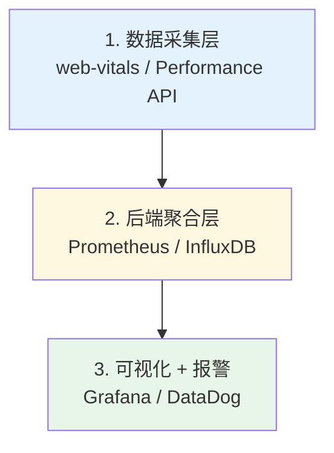
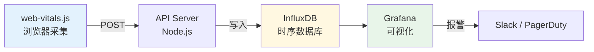

# 性能监控体系

> 一句话定位：**RUM / APM / 报警 —— 把"快"做成可量化、可回归、可问责的工程目标**

没有监控的性能优化 = 盲人摸象。Lighthouse 一次跑分波动 20%+，**真正的性能基线必须来自真实用户数据（RUM）**。

---

## 1. 监控体系三层架构



| 层级 | 工具 | 职责 |
|------|------|------|
| **采集** | `web-vitals.js`、Performance API | 在真实用户浏览器采集指标 |
| **聚合** | Prometheus / InfluxDB / SaaS 后端 | 存储、聚合、计算分位数 |
| **展示** | Grafana / DataDog / Sentry | 仪表盘 + 阈值报警 |

---

## 2. RUM vs 合成监控

| 类型 | 说明 | 工具 | 适用 |
|------|------|------|------|
| **RUM**（真实用户监控） | 真实用户浏览器采集 | web-vitals + 自建 / DataDog RUM / Sentry | **生产首选** |
| **合成监控** | 实验室环境定时跑 | Lighthouse CI / WebPageTest | CI 门禁 + 调试 |

**关键洞见**：
- RUM 反映**真实用户体验**（网络、设备、地理位置差异）
- 合成监控**可复现**，适合 CI 回归检测
- 二者互补：RUM 发现问题 → 合成监控复现 → 修复

---

## 3. web-vitals.js 生产集成

```typescript
// lib/metrics.ts
import { onLCP, onINP, onCLS, onFCP, onTTFB } from 'web-vitals'

function sendToAnalytics(name: string, value: number, rating: string) {
  // 发送到你的监控后端
  navigator.sendBeacon('/api/metrics', JSON.stringify({
    name,
    value: Math.round(value),
    rating,  // 'good' | 'needs-improvement' | 'poor'
    url: location.pathname,
    timestamp: Date.now(),
  }))
}

onLCP(metric => sendToAnalytics('LCP', metric.value, metric.rating))
onINP(metric => sendToAnalytics('INP', metric.value, metric.rating))
onCLS(metric => {
  // CLS 在页面生命周期内会多次变化，使用最终值
  if (!metric.isFinal) return
  sendToAnalytics('CLS', metric.value, metric.rating)
})
onFCP(metric => sendToAnalytics('FCP', metric.value, metric.rating))
onTTFB(metric => sendToAnalytics('TTFB', metric.value, metric.rating))
```

---

## 4. Performance API 高级采集

```typescript
// 自定义性能标记
performance.mark('feature-start')
// ... 执行某功能
performance.mark('feature-end')
performance.measure('feature-duration', 'feature-start', 'feature-end')

// 获取测量结果
const measure = performance.getEntriesByName('feature-duration')[0]
sendToAnalytics('feature-duration', measure.duration, 'good')

// 长任务监控
const observer = new PerformanceObserver((list) => {
  for (const entry of list.getEntries()) {
    if (entry.duration > 50) {
      sendToAnalytics('long-task', entry.duration, 'poor')
    }
  }
})
observer.observe({ entryTypes: ['longtask'] })

// 资源加载监控
const resourceObserver = new PerformanceObserver((list) => {
  for (const entry of list.getEntries()) {
    if (entry.responseEnd - entry.startTime > 1000) {
      console.warn('Slow resource:', entry.name)
    }
  }
})
resourceObserver.observe({ entryTypes: ['resource'] })
```

---

## 5. 报警策略

| 指标 | 阈值（P75） | 阈值（P95） | 报警级别 |
|------|------------|------------|---------|
| **LCP** | > 2.5s | > 4s | P1（严重） |
| **INP** | > 200ms | > 500ms | P1 |
| **CLS** | > 0.1 | > 0.25 | P2 |
| **TTFB** | > 800ms | > 1.8s | P2 |
| **JS 体积** | > 170KB | > 300KB | P2 |

**双阈值策略**：
- P75 超阈值 → 工作时间内处理
- P95 超阈值 → 立即报警

---

## 6. SaaS 监控工具

| 工具 | 优势 | 适用 |
|------|------|------|
| **DataDog RUM** | 全栈监控一体 | 企业级 |
| **Sentry Performance** | 错误 + 性能结合 | 中型项目 |
| **New Relic Browser** | APM 老牌 | 传统企业 |
| **SpeedCurve** | 性能专项 | 性能敏感项目 |
| **Calibre** | 性能 + SEO | 营销站点 |

---

## 7. 自建监控栈



---

## 8. 性能回归防护

```yaml
# lighthouse-ci.yml
name: Lighthouse CI
on: [pull_request]

jobs:
  lighthouse:
    runs-on: ubuntu-latest
    steps:
      - uses: actions/checkout@v4
      - run: npm ci && npm run build
      - run: npx @lhci/cli autorun
        env:
          LHCI_GITHUB_APP_TOKEN: ${{ secrets.LHCI_GITHUB_APP_TOKEN }}
```

---

## 9. 学习路径

1. **入门**（3 天）：理解 web-vitals 三大指标采集
2. **进阶**（1 周）：集成 Performance API + 自定义指标
3. **高级**（持续）：自建 RUM 栈 + 性能预算 + AB 实验

## 10. 交叉引用

- [`06-performance/`](../) — 性能总览
- [`06-performance/core-web-vitals/`](../core-web-vitals/) — CWV 指标详解
- [`04-engineering/`](../../04-engineering/) — CI 集成
