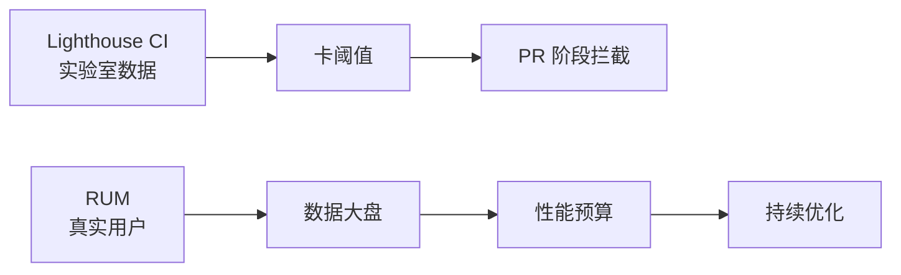

# 性能优化手段

> 一句话定位：**性能优化——从加载到运行时的 4 大类手段与实战代码**

## 1. 一句话定位

性能优化分为 4 大类：加载优化、运行时优化、资源优化、网络优化。本文档给出每类优化的具体手段、适用场景、实战代码。

## 2. 加载优化

### 2.1 Code Splitting

```javascript
// 动态 import
const Home = lazy(() => import('./Home'))

// 路由级 code split
const routes = [
  { path: '/', component: lazy(() => import('./pages/Home')) },
  { path: '/about', component: lazy(() => import('./pages/About')) },
]
```

### 2.2 Tree Shaking

- Webpack/Rollup 自动 tree shake
- 副作用标记 `package.json: "sideEffects": false`
- 避免 barrel exports（`index.ts` 重导出所有）

### 2.3 Preload / Prefetch

```html
<!-- preload：高优先级，本页面立即需要 -->
<link rel="preload" href="/critical.css" as="style">

<!-- prefetch：低优先级，下一页面可能需要 -->
<link rel="prefetch" href="/next-page.js">
```

### 2.4 Lazy Load

```javascript
// 图片懒加载


// 组件懒加载
const Heavy = lazy(() => import('./Heavy'))
```

## 3. 运行时优化

### 3.1 虚拟列表

- react-window / react-virtuoso（React）
- vue-virtual-scroller（Vue）
- 1 万行列表必须虚拟化

### 3.2 防抖 / 节流

```javascript
// 防抖：连续触发只执行最后一次
const debounced = debounce(fn, 300)

// 节流：固定时间间隔执行一次
const throttled = throttle(fn, 300)
```

### 3.3 Web Worker

- 复杂计算放 Worker（JSON 解析 / 图像处理 / 加密）
- Comlink 库简化 Worker 调用

### 3.4 OffscreenCanvas

- Canvas 渲染放 OffscreenCanvas
- 不阻塞主线程

## 4. 资源优化

### 4.1 图片优化

| 格式 | 适用 |
|------|------|
| WebP | 通用（95% 浏览器支持） |
| AVIF | 高级（85% 浏览器支持，压缩率更高） |
| SVG | 图标 / Logo |
| 响应式 | `<picture>` + `srcset` |

### 4.2 字体优化

```css
/* 字体子集化 */
@font-face {
  font-family: 'Custom';
  src: url('font.woff2') format('woff2');
  font-display: swap;  /* 避免 FOIT */
}
```

### 4.3 CSS Containment

```css
.card {
  contain: layout style paint;
  /* 告诉浏览器这个元素独立，避免大范围重排 */
}
```

## 5. 网络优化

### 5.1 HTTP/3 + QUIC

- HTTP/3 基于 QUIC（UDP），0-RTT 握手
- 移动弱网性能提升 30%+

### 5.2 边缘缓存（CDN）

- 静态资源 CDN 缓存
- SSR 边缘渲染（Cloudflare Workers / Vercel Edge）

### 5.3 Service Worker

- 离线优先（Cache First）
- 网络优先（Network First）
- Stale While Revalidate

### 5.4 压缩算法

- Brotli（比 Gzip 小 15%）
- 服务器启用 `Content-Encoding: br`

## 6. 性能监控闭环



## 7. 性能预算

- JS < 170KB（gzip 后）
- CSS < 50KB
- 图片 < 300KB（首屏）
- 字体 < 100KB
- LCP < 2.5s
- INP < 200ms
- CLS < 0.1

## 8. 关键术语

| 术语 | 解释 |
|------|------|
| LCP | Largest Contentful Paint |
| INP | Interaction to Next Paint |
| CLS | Cumulative Layout Shift |
| RUM | Real User Monitoring |
| SW | Service Worker |
| FOIT | Flash of Invisible Text |
| FOUT | Flash of Unstyled Text |
