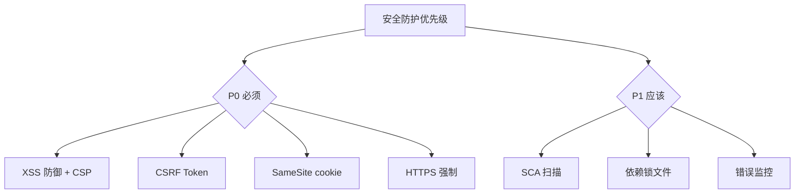

# 07 安全

> 一句话定位：**安全——前端必须防御的 6 大攻击与防护体系**

本模块覆盖 6 大前端安全主题:XSS / CSRF / CSP / CORS / 会话管理 / 依赖供应链,每个都有完整的攻击场景、防御手段、实战代码。

---

## 1. 本模块覆盖

| 主题 | 状态 | 说明 |
|------|------|------|
| XSS | ✓ 已有 | [xss/](xss/) — Reflected / Stored / DOM-based / 防御 |
| CSRF | ✓ 已有 | [csrf/](csrf/) — Token 验证 / SameSite cookie / 双重提交 |
| CSP | ✓ 已有 | [csp/](csp/) — Content Security Policy 头部 / nonce / hash |
| CORS | ✓ 已有 | [cors/](cors/) — 跨域机制 / 预检请求 / 简单请求 |
| 会话管理 | ✓ 已有 | [sessions/](sessions/) — Cookie / JWT / OAuth 2.0 / OIDC |
| 依赖供应链 | ✓ 已有 | [supply-chain/](supply-chain/) — SCA / npm audit / Snyk / 锁文件 |

> 速查对比见 [📖 顶层 3.11 安全速查](../README.md#311-安全速查)

---

## 2. 速查要点

- **CSP 是 XSS 的最后防线**:即使有 XSS 漏洞,CSP 也能阻止脚本执行
- **SameSite cookie**:默认 `Lax`,防止 CSRF;高敏感操作加 `SameSite=Strict`
- **JWT 不存敏感信息**:JWT payload 是 base64 编码,不是加密;敏感数据放服务端
- **依赖投毒防护**:锁文件 + 私有 npm 仓库 + SCA 扫描三件套

---

## 3. 选型建议

---

## 4. 与其他模块的关系

- **上游**:[01-foundation](../01-foundation/)(浏览器原理)
- **下游**:所有前端项目都必须考虑
- **横向**:[06-performance](../06-performance/) 关注体验,[07 安全] 关注防护

---

## 5. 学习建议

- 按 P0 优先级:[xss](xss/) → [csrf](csrf/) → [csp](csp/) → [cors](cors/)
- 高敏感应用加读 [sessions](sessions/)
- 团队项目加读 [supply-chain](supply-chain/)

---

## 6. 数据时效性

- OWASP Top 10 每 3-4 年更新
- CSP Level 3 持续演进
- SameSite 默认值 2020 年改为 Lax

---

## 7. 关键术语

| 术语 | 解释 |
|------|------|
| XSS | Cross-Site Scripting |
| CSRF | Cross-Site Request Forgery |
| CSP | Content Security Policy |
| CORS | Cross-Origin Resource Sharing |
| JWT | JSON Web Token |
| OIDC | OpenID Connect |
| SCA | Software Composition Analysis |
| OWASP | Open Web Application Security Project |
