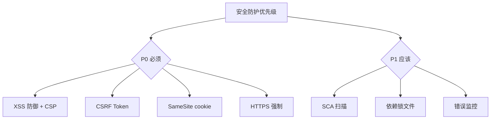

<!--
module:
  parent: note
  slug: 09.front-end/security
  type: article
  category: 主模块子文章
  summary: 前端 07 安全
-->

# 07 安全

> 一句话定位：**安全——前端必须防御的 6 大攻击与防护体系**

本模块覆盖 6 大前端安全主题:XSS / CSRF / CSP / CORS / 会话管理 / 依赖供应链,每个都有完整的攻击场景、防御手段、实战代码。

---

## 1. 模块导航

| 主题 | 状态 | 说明 |
|------|------|------|
| XSS | ✓ 已有 | [xss/](xss/) — Reflected / Stored / DOM-based / 防御 |
| CSRF | ✓ 已有 | [csrf/](csrf/) — Token 验证 / SameSite cookie / 双重提交 |
| CSP | ✓ 已有 | [csp/](csp/) — Content Security Policy 头部 / nonce / hash |
| CORS | ✓ 已有 | [cors/](cors/) — 跨域机制 / 预检请求 / 简单请求 |
| 会话管理 | ✓ 已有 | [sessions/](sessions/) — Cookie / JWT / OAuth 2.0 / OIDC |
| 依赖供应链 | ✓ 已有 | [supply-chain/](supply-chain/) — SCA / npm audit / Snyk / 锁文件 |

### 1.1 学习路径

- **入门**:按 P0 优先级学习 — [xss](xss/) → [csrf](csrf/) → [csp](csp/) → [cors](cors/)
- **高敏感应用**:补充阅读 [sessions](sessions/)(JWT / OAuth 2.0)
- **团队项目**:补充阅读 [supply-chain](supply-chain/)(依赖审计)

---

## 2. 知识脉络

---

## 3. 速查要点

- **CSP 是 XSS 的最后防线**:即使有 XSS 漏洞,CSP 也能阻止脚本执行
- **SameSite cookie**:默认 `Lax`,防止 CSRF;高敏感操作加 `SameSite=Strict`
- **JWT 不存敏感信息**:JWT payload 是 base64 编码,不是加密;敏感数据放服务端
- **依赖投毒防护**:锁文件 + 私有 npm 仓库 + SCA 扫描三件套

---

## 4. 核心威胁与防御

| 威胁 | 防御手段 | 优先级 |
|------|---------|-------|
| XSS(反射/存储/DOM 型) | 输入过滤 + 框架默认转义 + DOMPurify + CSP nonce | P0 |
| CSRF(跨站请求伪造) | SameSite cookie + CSRF Token + 双重提交 | P0 |
| CSP 绕过 | nonce / hash 锁定 + 报告 URI + Trusted Types | P0 |
| CORS 配置错误 | 精确 Origin 白名单 + 仅必要方法 / 头部 | P0 |
| 会话劫持 | HttpOnly + Secure + SameSite cookie + 短过期 | P0 |
| 依赖投毒 | 锁文件 + 私有 Registry + Socket.dev / Snyk | P1 |

---

## 5. 最佳实践

- CSP + SRI 标配:`script-src 'self' 'nonce-...'` + CDN 资源 `integrity="sha384-..."`
- XSS 防御优先用框架内置转义(React JSX / Vue 模板),不要自己拼字符串 HTML
- CSRF Token 用 SameSite + 双重提交 Cookie 双保险,避免依赖单一机制
- 依赖投毒防护:锁文件(lockfileVersion 2)+ 私有 Registry + SCA 扫描(Socket.dev / Snyk)
- JWT 仅存非敏感 `sub` / `exp` / `scope`;Refresh Token 走 HttpOnly Secure cookie
- 错误监控 + 用户行为日志双通道,异常登录 / 越权访问可追溯

---

## 6. 常见面试题

- XSS 三种类型(反射 / 存储 / DOM)的攻击场景与防御差异
- CSRF 与 XSS 的本质区别:CSRF 借用户权限,XSS 偷用户数据
- SameSite 三种取值(Strict / Lax / None)的 CSRF 防护差异
- CSP 指令优先级:`script-src` 与 `script-src-attr` / `script-src-elem` 关系
- JWT 为什么不存敏感信息?Refresh Token 与 Access Token 的轮换协议

---

## 7. 与其他模块的关系

- **上游**:[01-foundation](../01-foundation/)(浏览器原理)
- **下游**:所有前端项目都必须考虑
- **横向**:[06-performance](../06-performance/) 关注体验,[07 安全] 关注防护

---

## 📊 本节统计

- **主题数**:6(XSS / CSRF / CSP / CORS / 会话管理 / 依赖供应链)
- **子 README 数**:6 + 1 顶层 = 7
- **模块导航行数**:6(全已有)
- **学习路径主题数**:3(入门 / 高敏感 / 团队项目)
- **面试题数**:5
- **数据快照**:2026-06

---

← [返回前端工程总览](../README.md)
