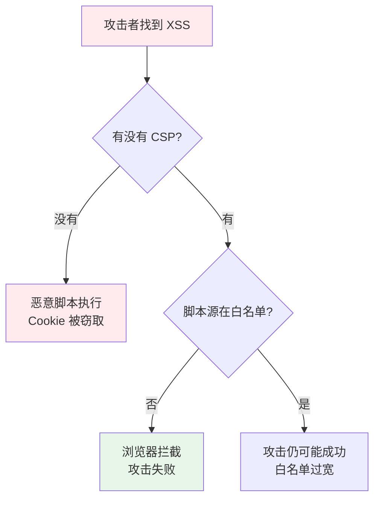
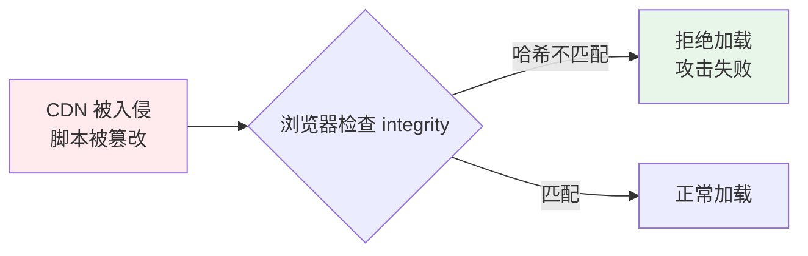

# CSP（内容安全策略）与 SRI（子资源完整性）

> 一句话定位：**CSP —— 浏览器层面的"白名单"，把 XSS / 数据注入的伤害降到最低**

CSP（Content Security Policy）通过 HTTP 响应头告诉浏览器："这个页面只允许加载这些来源的脚本 / 样式 / 图片 / ...。**不在白名单内的，一律拦截**。"

即使攻击者找到了 XSS 漏洞，CSP 也能让注入的脚本"无处可执行"——因为脚本源不在白名单里。

---
## 引言：生产 Bug

CSP（内容安全策略）与 SRI（子资源完整性） 的关键不是'防住'——是**出事后 5 分钟内能定位**。

本篇用真实生产场景切入：线上怎么炸、按官方文档写为什么也会错、怎么止血。

---

## 1. CSP 解决的问题



**CSP 是 XSS 的最后一道防线**，不是唯一防线。完整的防御体系：
1. 输入校验 + 输出编码（根治）
2. 框架默认转义（防线）
3. CSP（兜底）

---

## 2. CSP 指令分类

| 指令类别 | 指令 | 作用 |
|---------|------|------|
| **资源加载** | `default-src` | 所有资源的默认白名单 |
| | `script-src` | JS 来源白名单 |
| | `style-src` | CSS 来源白名单 |
| | `img-src` | 图片来源白名单 |
| | `font-src` | 字体来源白名单 |
| | `connect-src` | XHR / fetch / WebSocket 白名单 |
| | `media-src` | 音视频来源白名单 |
| | `object-src` | `<object>` / `<embed>` / Flash 白名单 |
| **行为控制** | `script-src 'unsafe-inline'` | 允许内联脚本（**削弱 CSP**） |
| | `script-src 'unsafe-eval'` | 允许 `eval`（**削弱 CSP**） |
| | `script-src 'nonce-xxx'` | 只允许带特定 nonce 的内联脚本 |
| | `script-src 'strict-dynamic'` | 信任脚本加载的其他脚本 |
| | `script-src 'unsafe-hashes'` | 允许特定 hash 的内联脚本 |
| **汇报** | `report-uri` | 违规时上报 URL（已废弃） |
| | `report-to` | 违规时上报到端点（新标准） |
| **其他** | `frame-ancestors` | 替代 `X-Frame-Options`，防点击劫持 |
| | `form-action` | 限制表单提交的目的地 |
| | `upgrade-insecure-requests` | 自动 HTTP → HTTPS |
| | `block-all-mixed-content` | 阻止 HTTPS 页面加载 HTTP 资源 |

---

## 3. CSP 配置示例

### 严格策略（现代站点推荐）

```http
Content-Security-Policy: 
  default-src 'self';
  script-src 'self' https://cdn.example.com;
  style-src 'self' 'unsafe-inline';  <!-- Tailwind / styled-components 需要 -->
  img-src 'self' data: https:;
  font-src 'self' https://fonts.gstatic.com;
  connect-src 'self' https://api.example.com;
  object-src 'none';
  frame-ancestors 'none';
  base-uri 'self';
  form-action 'self';
  upgrade-insecure-requests;
```

### 使用 nonce 支持内联脚本（Next.js / CRA 常用）

```http
Content-Security-Policy: 
  default-src 'self';
  script-src 'self' 'nonce-{random-nonce-per-request}';
  style-src 'self' 'nonce-{random-nonce-per-request}';
```

```javascript
// 服务端为每个请求生成 nonce
app.use((req, res, next) => {
  res.locals.nonce = crypto.randomBytes(16).toString('base64')
  next()
})

// HTML 中注入 nonce
<script nonce="<%= nonce %>">
  // 内联脚本
</script>
```

### 使用 hash（少量已知内联脚本）

```http
Content-Security-Policy: 
  script-src 'sha256-{hash-of-script}'
```

```bash
# 计算 hash
echo -n "console.log('hello')" | openssl dgst -sha256 -binary | openssl base64
# → 'sha256-qA2k...='
```

---

## 4. CSP 汇报：发现策略中的漏洞

**CSP 最大挑战**：配置不当会让正常功能失效。所以**先用汇报模式调试，再强制启用**。

```http
# 汇报模式：不拦截，只上报违规
Content-Security-Policy-Report-Only: 
  default-src 'self';
  script-src 'self';
  report-uri /csp-report;
```

```javascript
// Express：接收汇报
app.post('/csp-report', express.json({ type: 'application/csp-report' }), (req, res) => {
  console.log('CSP violation:', req.body)
  // 上报到监控
  res.status(204).end()
})
```

**调试流程**：
1. 先 `Report-Only` 模式部署 → 收集违规
2. 根据违规调整白名单 → 直到无违规
3. 改为强制模式 `Content-Security-Policy`

---

## 5. CSP 与常见框架的协作

| 框架 | CSP 注意事项 |
|------|------------|
| **React (CRA)** | 默认生成内联脚本，需要 nonce 或 `'unsafe-inline'` |
| **Next.js** | 自动处理 nonce；Vercel 默认 CSP 头 |
| **Vue (Vite)** | 开发模式 `eval` 频繁，生产构建无问题 |
| **Tailwind** | 运行时生成 CSS，需要 `'unsafe-inline'` 或 JIT 模式 |
| **Google Analytics** | 需要把 `https://www.google-analytics.com` 加入 `script-src` 和 `img-src` |

---

## 6. SRI（子资源完整性）

### 是什么？

SRI（Subresource Integrity）让浏览器校验外部脚本 / 样式的**内容哈希**。如果 CDN 被篡改，哈希不匹配，浏览器拒绝加载。

```html
<!-- 带 SRI 的外部脚本 -->
<script 
  src="https://cdn.example.com/react.production.min.js"
  integrity="sha384-..."
  crossorigin="anonymous">
</script>
```

### SRI 的价值



### 生成 SRI 哈希

```bash
# 命令行
openssl dgst -sha384 -binary react.min.js | openssl base64 -A

# 或使用 SRI 生成工具
npx sri-toolbox generate --files=react.min.js
```

### 2026 趋势

- **主流 CDN 都提供 SRI 标签**：unpkg、jsDelivr、cdnjs 自动生成
- **构建工具集成**：`html-webpack-plugin` / Vite 插件自动生成带 SRI 的 HTML
- **Vite 配置**：`build.sri: true` 即可为所有产物生成 SRI

---

## 7. CSP vs 其他安全头

| 安全头 | 作用 | 配置示例 |
|--------|------|---------|
| **CSP** | 资源加载白名单 | `Content-Security-Policy: default-src 'self'` |
| **X-Content-Type-Options** | 禁止 MIME 类型嗅探 | `X-Content-Type-Options: nosniff` |
| **X-Frame-Options** | 防止点击劫持（CSP `frame-ancestors` 已取代） | `X-Frame-Options: DENY` |
| **Strict-Transport-Security** | 强制 HTTPS | `Strict-Transport-Security: max-age=31536000; includeSubDomains` |
| **Referrer-Policy** | 控制 Referer 头部 | `Referrer-Policy: strict-origin-when-cross-origin` |
| **Permissions-Policy** | 限制浏览器 API（相机、麦克风等） | `Permissions-Policy: camera=(), microphone=()` |

**推荐配置集（helmet.js 默认）**：

```javascript
import helmet from 'helmet'
app.use(helmet())  // 设置全部安全头
```

```javascript
// 自定义 helmet
app.use(helmet({
  contentSecurityPolicy: {
    directives: {
      defaultSrc: ["'self'"],
      scriptSrc: ["'self'", "https://cdn.example.com"],
      styleSrc: ["'self'", "'unsafe-inline'"],  // Tailwind 需要
      imgSrc: ["'self'", "data:", "https:"],
      connectSrc: ["'self'", "https://api.example.com"],
    }
  }
}))
```

---

## 8. CSP 最佳实践

1. **从严格策略开始**：`default-src 'self'; object-src 'none'`
2. **使用 nonce / hash，避免 `'unsafe-inline'`**：内联脚本是 XSS 的温床
3. **永远不要用 `'unsafe-eval'`**：`eval` 让 CSP 形同虚设
4. **用 `report-uri` 收集违规**：调试阶段必备
5. **定期审计 CSP**：业务变化会引入新白名单需求
6. **搭配 SRI**：外部资源都加 `integrity`
7. **使用 `helmet.js`**：一套默认值覆盖 90% 场景

---

## 9. CSP 的局限

| 局限 | 说明 |
|------|------|
| ** `'unsafe-inline'` 泛滥** | 很多应用为了兼容 Tailwind / styled-components 不得不放开 |
| **base-uri 漏洞** | `<base>` 标签可重定向相对 URL，需显式 `base-uri 'self'` |
| **无法防御 DOM 型 XSS** | DOM 型 XSS 不加载新脚本，CSP 无法拦截 |
| **配置复杂** | 大型应用白名单管理困难 |

---

## 10. 实战检查清单

- [ ] 所有响应设置 `Content-Security-Policy` 头
- [ ] 优先用 `nonce` / `hash`，避免 `'unsafe-inline'` / `'unsafe-eval'`
- [ ] 外部脚本 / 样式使用 SRI `integrity`
- [ ] 使用 `helmet.js`（Express）或类似工具设置全套安全头
- [ ] 配置 `report-uri` 收集违规
- [ ] 显式设置 `base-uri 'self'`
- [ ] 显式设置 `object-src 'none'`
- [ ] 显式设置 `frame-ancestors 'none'`（防点击劫持）
- [ ] 启用 `upgrade-insecure-requests`
- [ ] 定期用 CSP Evaluator（https://csp-evaluator.withgoogle.com/）审计

---

## 11. 交叉引用

- [`07-security/xss/`](../xss/) — CSP 是 XSS 的最后一道防线
- [`07-security/cors/`](../cors/) — CSP `connect-src` 与 CORS 互补
- [`06-performance/`](../../06-performance/) — CSP 可能影响加载性能
- [`04-engineering/`](../../04-engineering/) — Vite 插件自动生成 SRI

---

## 12. 与其他模块的关系

- **上游**：[`07-security/xss/`](../xss/)
- **下游**：被所有对外发布的应用复用
