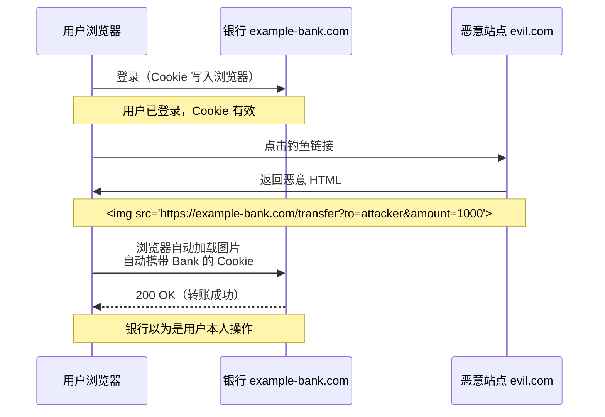
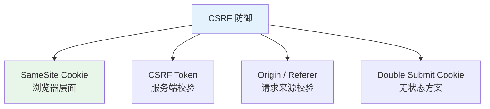
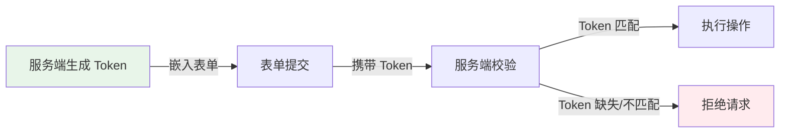

<!--
module:
  parent: front-end
  slug: front-end/csrf
  type: article
  category: 主模块子文章
  summary: CSRF 攻击与防御
-->

# CSRF（跨站请求伪造）

> 一句话定位：**CSRF —— 借用户的"身份证"，在用户的"不知情"下，做坏事**

CSRF（Cross-Site Request Forgery）的攻击目标**不是用户的数据，而是服务端**。攻击者利用"浏览器会自动携带 Cookie"的特性，诱导已登录用户访问恶意页面，让用户的浏览器"代替用户"向目标站点发送请求 —— 用户成了"被操纵的代理人"。

---
## 引言：生产 Bug

CSRF（跨站请求伪造） 的关键不是'防住'——是**出事后 5 分钟内能定位**。

本篇用真实生产场景切入：线上怎么炸、按官方文档写为什么也会错、怎么止血。

---

## 1. 攻击流程



**关键洞察**：
- 浏览器**不会**跨域读响应（CORS 保护），但**会**跨域发请求（只要不读响应就行）
- `` / `<link>` / `<form>` 等标签**可以跨域发请求**，且**自动携带 Cookie**
- 服务端看到请求带了有效 Cookie，就会认为是"合法用户操作"

---

## 2. 攻击触发方式

| 方式 | 特点 | 适用 |
|------|------|------|
| **GET 触发** | `` / `<link href="...">` | 仅对 GET 类接口有效（查询、转账等） |
| **POST 触发（简单表单）** | `<form method="POST" action="...">` | 对未验证 Content-Type 的接口有效 |
| **POST 触发（JS 自动提交）** | 隐藏表单 + `onload` 自动 submit | 用户体验无感 |
| **AJAX 触发** | 需要 CORS 允许 + 自定义头 | 通常被 CORS 拦截 |

```html
<!-- 最隐蔽的 POST 触发 -->
<body onload="document.forms[0].submit()">
  <form method="POST" action="https://example-bank.com/transfer">
    <input type="hidden" name="to" value="attacker-account">
    <input type="hidden" name="amount" value="1000">
  </form>
</body>
```

---

## 3. CSRF 防御体系



### 3.1 SameSite Cookie（最推荐，浏览器层面）

```http
Set-Cookie: sessionId=abc123; SameSite=Strict; Secure; HttpOnly
```

| SameSite 值 | 行为 | 适用 |
|------------|------|------|
| **Strict** | 任何跨站请求**都不携带** Cookie | 最安全，但影响用户体验（从邮件点链接进应用会丢失登录态） |
| **Lax**（默认） | 仅**顶级 GET 导航**携带 Cookie | **2026 默认值**，平衡安全与体验 |
| **None** | 所有跨站请求都携带（必须配合 `Secure`） | 需要跨站使用的 Cookie（如第三方嵌入） |

**SameSite=Lax 的"豁免"**：
- ✅ 用户点击链接 `<a href="...">` 进入（顶级 GET 导航）
- ❌ `<form method="POST">` 跨站提交
- ❌ `` / `<iframe>` / `fetch()` 跨站请求

> **2026 状态**：所有现代浏览器默认 `SameSite=Lax`，新站点几乎零配置即获得基础 CSRF 防护。

### 3.2 CSRF Token（经典方案）

**原理**：服务端给每个表单注入一个**不可预测、每个会话唯一**的 Token，表单提交时服务端校验。

```html
<form method="POST" action="/transfer">
  <input type="hidden" name="_csrf" value="a1b2c3d4e5...">  <!-- 服务端注入 -->
  <input name="to" value="...">
  <input name="amount" value="...">
</form>
```

**为什么有效**：
- 攻击者**无法读取**其他站点的响应（CORS 保护）
- 因此**无法获取**目标站点的 CSRF Token
- 没有 Token 的请求被服务端拒绝



### 3.3 Double Submit Cookie

**原理**：前端生成随机 Token → 同时放到 Cookie 和请求参数 → 服务端比对。

```javascript
// 前端
const token = Math.random().toString(36).slice(2)
document.cookie = `csrf_token=${token}; SameSite=Strict`
fetch('/api/transfer', {
  method: 'POST',
  headers: { 'X-CSRF-Token': token },
  body: JSON.stringify(data)
})
```

```python
# 服务端（伪代码）
def verify_csrf(request):
    cookie_token = request.cookies.get('csrf_token')
    header_token = request.headers.get('X-CSRF-Token')
    return cookie_token == header_token and cookie_token is not None
```

**适用**：无服务端状态的场景（如微服务架构）。

### 3.4 Origin / Referer 校验

**原理**：服务端检查 `Origin`（POST）或 `Referer`（GET）头部，**只允许同源来源**。

```python
# 服务端
def verify_origin(request):
    origin = request.headers.get('Origin') or request.headers.get('Referer')
    allowed = ['https://example-bank.com']
    return origin in allowed
```

**注意**：
- `Origin` 比 `Referer` 更可靠（`Referer` 可被隐私插件抹掉）
- 有些用户/插件会修改或禁用这两个头部

---

## 4. 防御方案对比

| 方案 | 实施成本 | 可靠性 | 兼容性 | 推荐度 |
|------|---------|--------|--------|--------|
| **SameSite=Lax** | ⭐ 零成本（默认） | ⭐⭐⭐⭐ 高 | ⭐⭐⭐⭐⭐ 现代浏览器 | ⭐⭐⭐⭐⭐ **首选** |
| **CSRF Token** | ⭐⭐⭐ 服务端支持 | ⭐⭐⭐⭐⭐ 极高 | ⭐⭐⭐⭐⭐ 全兼容 | ⭐⭐⭐⭐⭐ **经典方案** |
| **Double Submit Cookie** | ⭐⭐ 前端生成 | ⭐⭐⭐⭐ 高 | ⭐⭐⭐⭐⭐ | ⭐⭐⭐⭐ |
| **Origin/Referer 校验** | ⭐⭐ 服务端校验 | ⭐⭐⭐ 中（可被绕过） | ⭐⭐⭐⭐ | ⭐⭐⭐ 辅助 |

> **最佳实践**：**SameSite=Lax + CSRF Token 双重防线**，即使其中一个被绕过，另一个仍然生效。

---

## 5. CSRF vs XSS 关系

| 维度 | CSRF | XSS |
|------|------|------|
| 攻击目标 | 服务端（冒名操作） | 用户（窃取数据） |
| 攻击手段 | 伪造请求 | 注入脚本 |
| **关键联系** | XSS **可以绕过所有 CSRF 防护** | CSRF 不会导致 XSS |

> **洞见**：即使你有 CSRF Token，如果存在 XSS，攻击者可以直接在页面内读取 Token 并构造带 Token 的恶意请求。**防 XSS 是防 CSRF 的前提**。

---

## 6. 现代框架的 CSRF 防护

### Spring Security（Java）
```java
// 默认启用 CSRF 防护
http.csrf(csrf -> csrf.csrfTokenRepository(
    CookieCsrfTokenRepository.withHttpOnlyFalse()
))
```

### Express.js（Node）
```javascript
import csurf from 'csurf'  // 已停维，推荐 csurf-alternative
const csrfProtection = csrf({ cookie: true })
app.use(csrfProtection)
```

### Django（Python）
```python
# 默认启用，模板中使用 
<form method="POST">
  
  ...
</form>
```

### Next.js（React）
```typescript
// App Router：使用 cookie 存储 CSRF token
import { cookies } from 'next/headers'

export async function POST(request: Request) {
  const csrfToken = (await cookies()).get('csrf-token')?.value
  const headerToken = request.headers.get('x-csrf-token')
  if (csrfToken !== headerToken) {
    return Response.json({ error: 'Invalid CSRF token' }, { status: 403 })
  }
  // ...
}
```

---

## 7. API 接口的 CSRF 防护

**现代 SPA + REST/GraphQL API 的 CSRF 防护**：

| 方案 | 实现 |
|------|------|
| **CSRF Token 双提交** | Cookie + Header 双提交 |
| **Custom Header** | 所有 API 请求强制 `X-Requested-With: XMLHttpRequest` 头（攻击者无法通过 `<form>` 设置此头） |
| **JWT + Authorization 头** | 不用 Cookie 存身份，用 `Authorization: Bearer <jwt>`（跨站请求无法自动携带） |

```javascript
// 自定义头的 CSRF 防护
fetch('/api/data', {
  method: 'POST',
  headers: {
    'X-Requested-With': 'XMLHttpRequest',  // 跨站请求无法自动设置
    'Content-Type': 'application/json',
    'X-CSRF-Token': csrfToken
  },
  body: JSON.stringify(data)
})
```

> **2026 共识**：
> - 传统 Session/Cookie 应用 → SameSite + CSRF Token
> - 纯 API（SPA / 移动）→ JWT in `Authorization` 头（天然免疫 CSRF）
> - BFF 模式 → Cookie 仅用于 BFF 内部，BFF → 后端用 Service Token（详见 [../../05-architecture/bff/](../../05-architecture/bff/)）

---

## 8. 测试 CSRF 防护

| 工具 | 类型 |
|------|------|
| **OWASP ZAP** | 自动化扫描 CSRF 漏洞 |
| **Burp Suite** | 手动渗透测试 |
| **Postman / curl** | 验证跨站请求是否被拒绝 |

---

## 9. 实战检查清单

- [ ] Cookie 默认 `SameSite=Lax`
- [ ] 关键操作（转账、修改密码）使用 CSRF Token
- [ ] API 接口强制 `Content-Type: application/json` + 自定义头
- [ ] 防 XSS（CSRF 防护的前提）
- [ ] 敏感操作二次确认（输入密码 / 验证码）
- [ ] 服务端校验 `Origin` / `Referer` 作为辅助
- [ ] 定期 OWASP ZAP 扫描

---

## 10. 交叉引用

- [`07-security/xss/`](../xss/) — XSS 是 CSRF 防护的前提
- [`07-security/cors/`](../cors/) — CORS 限制了跨域响应读取
- [`07-security/sessions/`](../sessions/) — Cookie 属性设置
- [`05-architecture/bff/`](../../05-architecture/bff/) — BFF 模式天然免疫 CSRF

---

## 11. 与其他模块的关系

- **上游**：[`07-security/xss/`](../xss/) / [`07-security/cors/`](../cors/)
- **下游**：被所有涉及 Cookie 的应用复用

---

← [返回 前端安全](../README.md)
