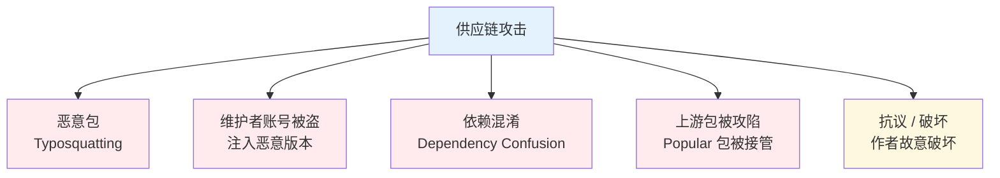
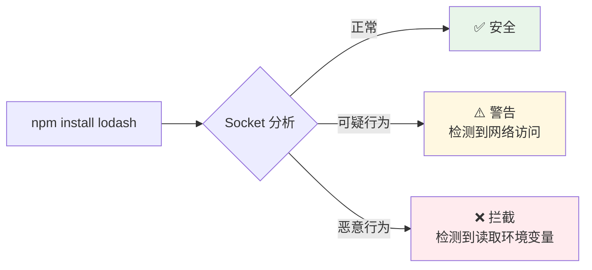

# 依赖供应链安全

> 一句话定位：**npm audit / Snyk / 锁文件 / 私有 Registry —— 守住"你没用到的代码"的攻击面**

前端项目 90%+ 的代码来自第三方依赖。你的 `package.json` 写了 30 个直接依赖，但 `node_modules` 里可能有 **500-1500 个**包 —— 每一个都是潜在的供应链攻击入口。

**真实案例**：
- **2021 color.js / faker.js**：作者故意发布破坏性版本，导致全球无数项目崩溃
- **2022 earth2data**：恶意包冒充 popular 包，窃取环境变量
- **2023 event-stream**：流行库被注入恶意代码，窃取加密货币钱包

---

## 1. 供应链攻击的类型



| 类型 | 例子 | 原理 |
|------|------|------|
| **Typosquatting（拼写劫持）** | `lodash` vs `lodash`、`react-dom` vs `react_Dom` | 诱导开发者装错包 |
| **维护者账号被盗** | event-stream 2018 | 攻击者拿到 npm 维护者 token |
| **依赖混淆** | 内部包名注册到公开 npm | 内部包名被外部注册，被内部安装覆盖 |
| **上游包被攻陷** | popular package hijacked | 攻击者拿到包的发布权 |
| **抗议 / 破坏** | color.js / faker.js 2021 | 维护者主动破坏下游 |

---

## 2. 第一道防线：`npm audit`

```bash
# 检查已知漏洞
npm audit

# 自动修复可修复的
npm audit fix

# 强制修复（可能引入大版本变更）
npm audit fix --force

# JSON 输出（适合 CI）
npm audit --json
```

### npm audit 的局限

| 局限 | 说明 |
|------|------|
| **只检查已知漏洞** | 0-day 漏洞检查不到 |
| **不查恶意包** | 没被 CVE 库收录的恶意包检测不到 |
| **依赖树过深** | 经常报 100+ 漏洞，但都是间接依赖的间接依赖 |

---

## 3. 第二道防线：Snyk / Socket / Guardian

| 工具 | 类型 | 核心价值 | 适用 |
|------|------|---------|------|
| **Snyk** | SCA（Software Composition Analysis） | CVE + 许可证 + 恶意包检测 | 企业首选 |
| **Socket** | 供应链专项 | 检测"可疑行为"（访问网络、读文件） | **新兴首选** |
| **Guardian (GitHub)** | GitHub 原生 | 自动 PR 修复漏洞 | GitHub 用户 |
| **npm 内置** | 基础 | 基础 CVE 检查 | 任何项目 |

### Socket 的价值：检测"行为异常"

Socket 不只看 CVE，而是分析包的**实际行为**：
- ❌ 是否访问网络？
- ❌ 是否读 `/etc/passwd`？
- ❌ 是否读 `process.env`？
- ❌ 是否运行 `postinstall` 脚本？
- ❌ 包大小是否异常？



---

## 4. 第三道防线：锁文件（Lock File）

### 锁文件的作用

| 文件 | 包管理器 | 内容 |
|------|---------|------|
| `package-lock.json` | npm | 所有依赖的精确版本 + 哈希 |
| `pnpm-lock.yaml` | pnpm | 同上 |
| `yarn.lock` | yarn | 同上 |
| `bun.lock` / `bun.lockb` | Bun | 同上 |

**锁文件解决什么？**
- ✅ **可复现构建**：不同机器、不同时间安装结果一致
- ✅ **版本锁定**：防止间接依赖"悄悄升级"
- ✅ **哈希校验**：检测到篡改立即报错
- ✅ **安全基线**：锁文件被攻击者修改 → 安装恶意版本

### 锁文件最佳实践

1. **必须提交到 Git**：锁文件是"构建基线"，不是 `.gitignore` 对象
2. **CI 必须用 `--frozen-lockfile`**：
   ```bash
   pnpm install --frozen-lockfile
   npm ci
   yarn install --frozen-lockfile
   ```
3. **锁文件变更要 Review**：PR 中的锁文件改动需要审查

---

## 5. 第四道防线：私有 Registry

### 私有 Registry 的作用

| 作用 | 说明 |
|------|------|
| **缓存公网包** | 减少网络依赖，加速安装 |
| **阻止恶意包** | 配置黑名单，禁止安装特定包 |
| **发布内部包** | 内部业务包不会与公网冲突 |
| **审计日志** | 谁装了什么包，有迹可查 |

### 主流方案

| Registry | 类型 | 适用 |
|----------|------|------|
| **Verdaccio** | 自建，开源 | 小团队 |
| **GitHub Packages** | 云服务 | GitHub 用户 |
| **AWS CodeArtifact** | AWS 云 | AWS 生态 |
| **JFrog Artifactory** | 企业级 | 大型企业 |
| **npm 官方私有 Registry** | 云服务 | npm 企业用户 |

### 依赖混淆攻击防御

**攻击原理**：内部包名（如 `@mycompany/auth`）被攻击者注册到公网 npm，当 `npm install` 时，如果内部 Registry 未配置为优先，可能安装到公网的恶意版本。

**防御**：
```bash
# .npmrc 配置 scope 指向私有 Registry
@mycompany:registry=https://npm.mycompany.com/
registry=https://registry.npmjs.org/
```

```yaml
# Verdaccio 配置：uplinks 优先级
uplinks:
  npmjs:
    url: https://registry.npmjs.org/

packages:
  '@mycompany/*':
    access: $all
    publish: $all
    # 不回源到公网
    
  '**':
    access: $all
    proxy: npmjs
```

---

## 6. 第五道防线：`postinstall` 脚本控制

**危险**：`postinstall` 在安装时执行，可运行任意脚本。
- 合法用途：`esbuild`、`core-js` 用 `postinstall` 下载二进制
- 恶意用途：窃取环境变量、下载后门

### 防御策略

```bash
# pnpm：默认禁用 postinstall（安全）
# npm：可通过配置禁用
npm config set ignore-scripts true
```

```json
// package.json：明确允许需要的 postinstall
{
  "pnpm": {
    "onlyBuiltDependencies": ["esbuild", "@swc/core", "core-js"]
  }
}
```

| 包管理器 | 默认行为 | 推荐 |
|---------|---------|------|
| **pnpm** | 禁用所有 `postinstall`，需显式允许 | ⭐⭐⭐⭐⭐ 最安全 |
| **npm 10+** | 默认启用，需手动禁 | ⭐⭐⭐ 中等 |
| **yarn** | 默认启用 | ⭐⭐⭐ 中等 |
| **Bun** | 默认启用 | ⭐⭐⭐ 中等 |

---

## 7. 许可证合规

| 许可证 | 类型 | 商用 | 修改开源 | 专利授权 |
|--------|------|------|---------|---------|
| **MIT** | 宽松 | ✅ | ❌ 不必 | ❌ 无 |
| **Apache 2.0** | 宽松 | ✅ | ❌ 不必 | ✅ 有 |
| **BSD 3-Clause** | 宽松 | ✅ | ❌ 不必 | ❌ 无 |
| **GPL 3.0** | Copyleft | ✅ | ✅ 必须 | ✅ 有 |
| **AGPL 3.0** | 强 Copyleft | ✅ | ✅ 必须，网络服务也必须 | ✅ 有 |
| **LGPL** | 弱 Copyleft | ✅ | ✅ 动态链接不必 | ❌ 无 |

### 许可证检查工具

```bash
# license-checker：列出所有依赖的许可证
npx license-checker --summary

# 检查是否有禁止的许可证
npx license-checker --failOn 'GPL-3.0;AGPL-3.0'
```

| 工具 | 作用 |
|------|------|
| **license-checker** | 基础检查 |
| **license-compliance** | CI 集成 |
| **Snyk Open Source** | 许可证 + 漏洞统一报告 |

---

## 8. CI 集成最佳实践

```yaml
# GitHub Actions 示例
name: Security
on: [push, pull_request]

jobs:
  security:
    runs-on: ubuntu-latest
    steps:
      - uses: actions/checkout@v4
      
      - uses: pnpm/action-setup@v2
        with:
          version: 9
      
      - uses: actions/setup-node@v4
        with:
          node-version: 20
          cache: 'pnpm'
      
      - name: Install dependencies (frozen lockfile)
        run: pnpm install --frozen-lockfile
      
      - name: npm audit
        run: pnpm audit --audit-level=high
      
      - name: Check licenses
        run: npx license-checker --failOn 'GPL-3.0;AGPL-3.0'
      
      - name: Socket scan
        run: npx @socketsecurity/cli scan .
```

---

## 9. 2026 趋势

1. **Socket 成为供应链安全新标准**：行为分析 > CVE 列表
2. **pnpm 默认禁止 postinstall**：安全基线提高
3. **SBOM（Software Bill of Materials）**：法规要求生成依赖清单
4. **Sigstore / 签名验证**：包的发布者身份可验证
5. **OpenSSF Scorecard**：评估开源项目的健康度

---

## 10. 实战检查清单

### 安装阶段
- [ ] 所有依赖通过私有 Registry 代理（防御依赖混淆）
- [ ] 锁文件必须提交 Git
- [ ] CI 使用 `--frozen-lockfile`
- [ ] 禁用或严格控制 `postinstall`（pnpm 首选）

### 审计阶段
- [ ] CI 集成 `npm audit` 或 Snyk
- [ ] 定期 Socket 扫描可疑行为
- [ ] 定期检查许可证合规性
- [ ] 订阅 npm Security Advisories

### 维护阶段
- [ ] 定期升级依赖（dependabot / renovate）
- [ ] 监控包的维护活跃度（GitHub stars、最近提交）
- [ ] 警惕"可疑新包"（名称与 popular 包相似）
- [ ] 锁文件变更必须 Review
- [ ] 生成 SBOM 留档

---

## 11. 交叉引用

- [`04-engineering/`](../../04-engineering/) — 包管理工具
- [`04-engineering/monorepo/`](../../../05.tools/monorepo/README.md/) — Monorepo 的依赖治理
- [`07-security/`](../) — 安全总览
- [`07-security/csp/`](../csp/) — CSP 是另一道防线

---

## 12. 与其他模块的关系

- **上游**：[`04-engineering/`](../../04-engineering/)（包管理工具链）
- **下游**：贯穿所有对外发布的应用
