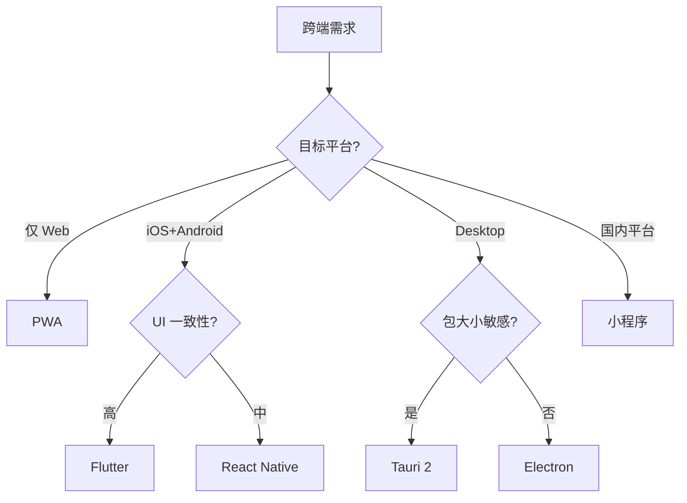

<!--
module:
  parent: note
  slug: 09.front-end/cross-platform
  type: article
  category: 主模块子文章
  summary: 前端 08 跨端
-->

# 08 跨端

> 一句话定位：**一次开发多端部署——从 Web 到移动、桌面、小程序的跨端方案**

本模块覆盖 5 大跨端方案:React Native / Flutter / Tauri / PWA / 小程序,对比性能、包大小、平台覆盖、适用场景。

---

## 1. 模块导航

| 主题 | 状态 | 说明 |
|------|------|------|
| 跨端选型决策 | ✓ 已有 | [mobile-tech-stack/](mobile-tech-stack/) — 原生 vs Flutter vs RN vs H5 vs 小程序 综合决策矩阵 |
| React Native | ✓ 已有 | [react-native/](react-native/) — 跨端主流 / Native 渲染 |
| 小程序 | ✓ 已有 | [mini-program/](mini-program/) — 微信 / 支付宝 / 抖音生态 |
| Flutter | ✓ 已有 | [flutter/](flutter/) — 一码三端 / Skia 渲染 |
| Tauri | ✓ 已有 | [tauri/](tauri/) — Rust 后端 / 轻量桌面 |
| PWA | ✓ 已有 | [pwa/](pwa/) — 渐进式 Web 应用 / 离线优先 |

### 1.1 学习路径

- **入门**:先读 [mobile-tech-stack/](mobile-tech-stack/) 选型决策矩阵
- **专项深入**:按目标平台选 1-2 个方向 — React Native / Flutter(移动)/ Tauri / PWA(桌面与离线)/ 小程序(国内)
- **实战**:先做小工具练手,再做完整应用;不要全部方案都学一遍

---

## 2. 知识脉络

---

## 3. 速查要点

- **跨端不是银弹**:性能敏感场景(游戏 / 视频编辑)优先原生
- **Flutter vs React Native**:UI 一致性要求高选 Flutter;JS 团队 + 生态丰富选 RN
- **Tauri vs Electron**:包大小敏感(< 10MB)选 Tauri;兼容性要求选 Electron
- **PWA 不是 App**:PWA 是渐进式 Web 增强,权限受限(iOS Push 限制)

---

## 4. 方案对比

| 方案 | 渲染 | 性能 | 包大小 | 平台覆盖 | 适用场景 |
|------|------|------|-------|---------|---------|
| React Native | Native | 中 | 中 | iOS / Android | 移动 App 主流 |
| Flutter | Skia | 高 | 大 | iOS / Android / Web / Desktop | 跨端 UI 一致性 |
| Tauri 2 | WebView | 高 | 小(< 10MB) | Desktop | 轻量桌面应用 |
| PWA | 浏览器 | 中 | 无 | 跨平台 | 渐进式增强 |
| 小程序 | WebView | 中 | 小 | 国内平台 | 微信 / 支付宝生态 |
| Electron | WebView | 中 | 大(100MB+) | Desktop | 兼容旧项目 |

---

## 5. 最佳实践

- 移动端优先 React Native / Flutter,二者满足 90% 跨端需求
- 桌面端:Tauri(轻量,+10MB)/ Electron(兼容性,生态丰富)按需选择
- 小程序:跨端框架用 Taro / uni-app,避免每个平台单独维护
- 性能敏感的页面(Web 长列表 / 视频编辑)回退原生,跨端不是银弹
- PWA 渐进增强:SOC(Service Worker 离线)→ Push API → 桌面安装提示

---

## 6. 常见面试题

- React Native 的 New Architecture:Fabric 渲染器 + TurboModule 与旧架构差异
- Flutter 的 Skia 自绘 vs React Native 的 Bridge / JSI 性能差异
- Tauri 为什么比 Electron 包小?Rust 内核 + WebView 共享的系统 WebView 优势
- 小程序双线程模型:逻辑层与渲染层为什么分离?与 Web Worker 差异
- PWA 的 Service Worker 缓存策略:StaleWhileRevalidate / CacheFirst / NetworkFirst 选择

---

## 7. 与其他模块的关系

- **上游**:[03-frameworks](../03-frameworks/)(React / Vue 基础)
- **下游**:支撑所有跨端项目
- **横向**:[05-architecture](../05-architecture/) 关注 Web 架构,[08 跨端] 关注多端架构

---

## 📊 本节统计

- **主题数**:6(选型决策 / React Native / 小程序 / Flutter / Tauri / PWA)
- **子 README 数**:6 + 1 顶层 = 7
- **模块导航行数**:6(全已有)
- **学习路径主题数**:2(选型矩阵 / 专项深入)
- **面试题数**:5
- **数据快照**:2026-06

---

← [返回前端工程总览](../README.md)
