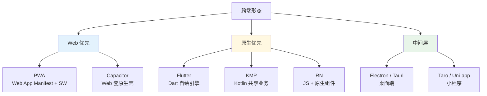

# 08 跨端

> 一句话定位：**一份代码 / 一支团队，跑遍 Web / 移动 / 桌面 / 小程序**

跨端的目标是"减少重复造轮子"，但每种跨端方案都有**性能 / 体验 / 生态 / 成本**的权衡。
本模块覆盖 2026 主流跨端方案：移动（RN/Flutter/Capacitor）、桌面（Electron/Tauri）、小程序、Taro/Uni-app、PWA、WebView 桥接。

---

## 1. 五大主题

| 主题 | 核心内容 | 学习价值 |
|------|---------|---------|
| **移动端** | React Native / Flutter / Capacitor / Kotlin Multiplatform | 跨 iOS / Android |
| **桌面端** | Electron / Tauri / Wails | 跨 Windows / macOS / Linux |
| **小程序** | 微信 / 支付宝 / 抖音 + Taro / Uni-app | 国内流量入口 |
| **PWA** | Service Worker / Web App Manifest / Push API | 移动 Web 体验增强 |
| **WebView 桥接** | JSBridge / Schema 协议 / Hybrid 框架 | Native ↔ Web 通信 |

---

## 2. 跨端形态全景

---

## 3. 移动端方案对比

| 方案 | 渲染方式 | 性能 | 生态 | 适用 | 2026 趋势 |
|------|---------|------|------|------|----------|
| **React Native** | 原生组件 + JS 桥 | ⭐⭐⭐ 中 | ⭐⭐⭐⭐⭐ 庞大 | 已有 React 团队 | 新架构 Fabric 性能提升 |
| **Flutter** | 自绘 Skia 引擎 | ⭐⭐⭐⭐⭐ 优 | ⭐⭐⭐⭐ 强 | 性能敏感 / 自定义 UI | Google 持续投入，桌面 / Web 一码三端 |
| **Capacitor** | WebView + 原生插件 | ⭐⭐⭐ 中 | ⭐⭐⭐ Ionic 生态 | Web 团队 / 快速上线 | Vite + Capacitor 成为新组合 |
| **Kotlin Multiplatform** | 原生 UI + 共享 Kotlin | ⭐⭐⭐⭐⭐ 优 | ⭐⭐ 成长中 | Android 团队 / Compose 路线 | JetBrains 押注，2026 关注度上升 |
| **Weex / Hippy** | 类 RN 国产 | ⭐⭐⭐ | ⭐⭐ 萎缩 | 存量项目 | 已被 RN/Flutter 取代 |

**选型建议**：
- 已有 React 团队 → **React Native**（学习成本低）
- 性能敏感 + 复杂 UI → **Flutter**（自绘引擎 + AOT）
- Web 团队 + 快速上线 → **Capacitor**（Web 代码 + 原生壳）
- 强类型 + 原生体验 → **Kotlin Multiplatform**（Compose 多平台）

---

## 4. 桌面端方案对比

| 方案 | 核心 | 包体积 | 性能 | 跨平台 | 适用 |
|------|------|--------|------|--------|------|
| **Electron** | Chromium + Node.js | 80-150MB | ⭐⭐⭐ | Win/macOS/Linux | 复杂应用（VSCode / Slack） |
| **Tauri** | 系统 WebView + Rust 后端 | 2-10MB | ⭐⭐⭐⭐⭐ | Win/macOS/Linux/iOS/Android | 追求小体积 + 高性能 |
| **Wails** | WebView + Go 后端 | 5-15MB | ⭐⭐⭐⭐ | Win/macOS/Linux | Go 团队首选 |

**2026 趋势**：Tauri 2.0 支持移动端，包体积比 Electron 小 10 倍以上，**正在快速蚕食 Electron 份额**。

---

## 5. 小程序方案对比

| 平台 | 流量 | 框架 | 跨端能力 |
|------|------|------|---------|
| **微信** | 13 亿+ 月活 | WXML/WXSS/JS | Taro / Uni-app 编译到多端 |
| **支付宝** | 8 亿+ 月活 | AXML/ACSS | 同上 |
| **抖音** | 7 亿+ 月活 | TTML | 同上 |
| **百度** | 6 亿+ 月活 | Swan | 同上 |

| 跨端框架 | 多端支持 | 学习曲线 | 生态 | 2026 趋势 |
|---------|---------|---------|------|----------|
| **Taro 4** | 微信/支付宝/抖音/百度 + RN + H5 | ⭐⭐⭐⭐ React 风格 | ⭐⭐⭐⭐ 京东系 | React 团队首选 |
| **Uni-app x** | 微信/支付宝/抖音 + H5 + App | ⭐⭐⭐⭐ Vue 风格 | ⭐⭐⭐⭐⭐ DCloud | Vue 团队首选，国内最大 |
| **Remax** | 微信为主 | ⭐⭐⭐ | ⭐⭐ | 维护放缓 |

**实战建议**：新项目首选 **Taro 4**（React）或 **Uni-app x**（Vue），**单一源码 + 6+ 端覆盖**。

---

## 6. PWA 三大支柱

| 支柱 | 作用 | 关键 API |
|------|------|---------|
| **Service Worker** | 离线缓存 / 后台同步 / 推送 | `navigator.serviceWorker.register()` |
| **Web App Manifest** | 安装到桌面 / 全屏 / 主题色 | `manifest.json` |
| **Push API** | 推送通知 | `PushManager.subscribe()` |

**适用**：内容站、电商前台、CRM、内部工具。**不适用**：高交互 SPA（应用商店分发更合适）。

---

## 7. WebView 桥接

**协议设计要点**：
- 单向调用：Web → Native 或 Native → Web
- 双向通信：使用 `Promise` 模式，请求/响应配对
- Schema 协议：URL 拦截（已过时，但存量项目仍有）
- 安全性：参数校验 + 权限白名单

---

## 8. 跨端选型决策树

| 业务场景 | 推荐方案 |
|---------|---------|
| **纯移动 App（iOS + Android）** | RN / Flutter / KMP |
| **移动 + Web 一套** | Next.js + RN / Flutter Web |
| **国内 + 多端流量** | Taro 4（微信/抖音/支付宝/H5） |
| **桌面工具类** | Tauri（小体积）/ Electron（生态） |
| **内部工具 / 快速验证** | PWA / Capacitor |
| **强性能游戏 / 特效** | 原生 + Flutter |

## 9. 学习路径建议

1. **入门**（2 周）：PWA 基础 + WebView 桥接原理
2. **进阶**（1 个月）：Taro 4 或 Uni-app 做一个跨端小程序
3. **高级**（持续）：Flutter / RN 性能调优 + 桌面端 Tauri 实战

## 10. 本模块覆盖

| 主题 | 状态 | 说明 |
|------|------|------|
| React Native | ✓ 已有 | [react-native/](react-native/) — 跨 iOS / Android 的 React 方案 |
| 小程序 | ✓ 已有 | [mini-program/](mini-program/) — Taro 4 / Uni-app x 跨端实战 |
| Flutter / Capacitor / KMP | 速查 | 见第 3 节 |
| 桌面端（Electron / Tauri） | 速查 | 见第 4 节 |
| PWA | 速查 | 见第 6 节 |

---

## 11. 交叉引用

- [`12.story/21-multiplatform-architecture.md`](../../../12.story/21-multiplatform-architecture.md) — 阿明餐厅多端架构故事（BFF / 跨平台框架 / 离线优先）
- [`12.story/26-globalization.md`](../../../12.story/26-globalization.md) — 国际化与跨区域部署（与 PWA 离线策略互补）
- [`12.story/13-frontend-renovation.md`](../../../12.story/13-frontend-renovation.md) — 前端工程化转型故事

---

## 12. 与其他模块的关系

- **上游**：[`05-architecture`](../05-architecture/)（微前端 / BFF 模式适用于多端）
- **下游**：与 [`09-frontend-and-ai`](../09-frontend-and-ai/) 协同（AI 能力常作为跨端差异化卖点）
