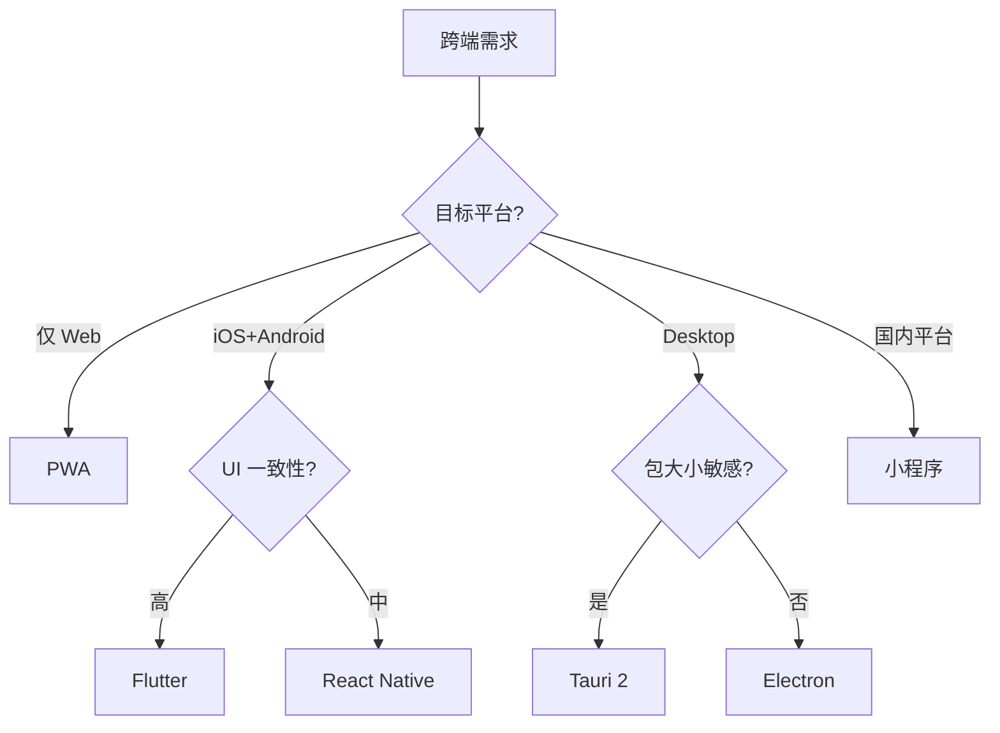

<!--
module:
  parent: front-end
  slug: front-end/cross-platform
  type: article
  category: 主模块子文章
  summary: 前端 08 跨端
-->

# 08 跨端

> 一句话定位：**一次开发多端部署——从 Web 到移动、桌面、小程序的跨端方案**

本模块覆盖 5 大跨端方案：React Native / Flutter / Tauri / PWA / 小程序，对比性能、包大小、平台覆盖、适用场景。

---
## 引言：反直觉代码
08 跨端 的关键不是语法——是**看起来对**的代码背后那些'踩坑点'。

本篇用 3 个反直觉片段切入，把面试/生产中常被问起、但一深入就漏馅的点摆出来。

---

## 1. 本模块覆盖

| 主题 | 状态 | 说明 |
|------|------|------|
| **跨端选型决策** | ✓ 已有 (2026 迁入) | [mobile-tech-stack/](mobile-tech-stack/) — 原生 vs Flutter vs RN vs H5 vs 小程序 综合决策矩阵 |
| React Native | ✓ 已有 | [react-native/](react-native/) — 跨端主流 / Native 渲染 |
| 小程序 | ✓ 已有 | [mini-program/](mini-program/) — 微信/支付宝/抖音生态 |
| Flutter | ✓ 已有 (T12) | [flutter/](flutter/) — 一码三端 / Skia 渲染 |
| Tauri | ✓ 已有 (T12) | [tauri/](tauri/) — Rust 后端 / 轻量桌面 |
| PWA | ✓ 已有 (T12) | [pwa/](pwa/) — 渐进式 Web 应用 / 离线优先 |

> 速查对比见 [📖 顶层 3.7 跨端速查](../README.md#37-跨端速查)
>
> 新读者建议：先看 [mobile-tech-stack/](mobile-tech-stack/) 选型决策 → 再看具体方案子目录（RN / Flutter / Tauri / PWA / 小程序）。

---

## 2. 速查要点

- **跨端不是银弹**：性能敏感场景（游戏 / 视频编辑）优先原生
- **Flutter vs React Native**：UI 一致性要求高选 Flutter；JS 团队 + 生态丰富选 RN
- **Tauri vs Electron**：包大小敏感（< 10MB）选 Tauri；兼容性要求选 Electron
- **PWA 不是 App**：PWA 是渐进式 Web 增强，权限受限（iOS Push 限制）

---

## 3. 选型建议

---

## 4. 与其他模块的关系

- **上游**：[03-frameworks](../03-frameworks/)（React/Vue 基础）
- **下游**：支撑所有跨端项目
- **横向**：[05-architecture](../05-architecture/) 关注 Web 架构，[08 跨端] 关注多端架构

---

## 5. 学习建议

- 选 1-2 个跨端方案深入，不要都学
- 推荐路径：[react-native](react-native/) 或 [flutter](flutter/) → [tauri](tauri/) / [pwa](pwa/)
- 实战：先做小工具练手，再做完整应用

---

## 6. 数据时效性

- Flutter / React Native 每年大版本
- Tauri 2.x 2024 发布
- 小程序平台每年更新

---

## 7. 关键术语

| 术语 | 解释 |
|------|------|
| JSBridge | JavaScript 与 Native 桥接 |
| Skia | Flutter 使用的 2D 图形库 |
| Impeller | Flutter 新一代渲染引擎（iOS 默认） |
| WebView | 浏览器内核组件 |
| Service Worker | PWA 离线缓存核心 |
| Manifest | PWA 应用清单 |
