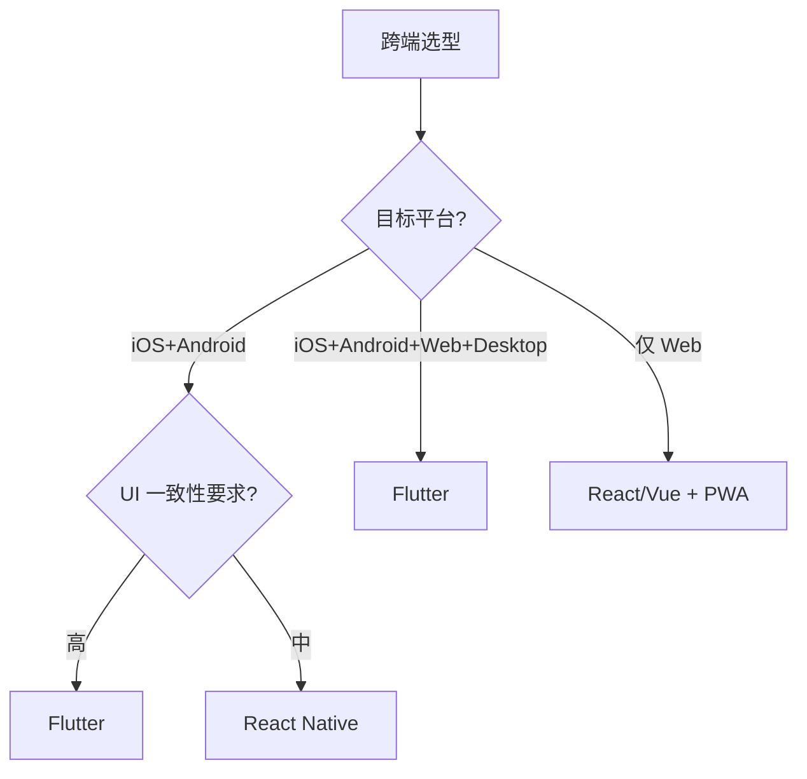

# Flutter 3.x

> 一句话定位：**Flutter — 一码三端的跨端 UI 框架（iOS / Android / Web / Desktop）**

## 1. 一句话定位

Flutter 是 Google 2018 年开源的跨端 UI 框架，使用 Dart 语言 + Skia 自绘引擎，实现 iOS / Android / Web / Desktop 一码多端。本文档聚焦 Flutter 3.x 工程实践。

## 2. 核心能力

- **Widget 体系**：万物皆 Widget（StatefulWidget / StatelessWidget）
- **Skia 渲染**：自绘引擎，不依赖平台原生控件
- **Hot Reload**：亚秒级热重载，提升开发效率
- **Platform Channels**：Dart ↔ Native 双向通信
- **Impeller 渲染引擎**（iOS 默认）：性能优于 Skia
- **Null Safety**：Dart 2.12+ 空安全

## 3. 生态速查

| 类别 | 推荐 | 备选 |
|------|------|------|
| 状态管理 | Riverpod 2 | Provider / Bloc / GetX |
| 路由 | go_router | AutoRoute |
| 网络 | dio | http |
| 数据存储 | Hive | SharedPreferences / sqflite |
| 动画 | flutter_animate | Rive / Lottie |
| 国际化 | intl / easy_localization | - |
| 测试 | flutter_test | mocktail |
| CI/CD | Codemagic / Fastlane | GitHub Actions |

## 4. 选型建议

## 5. 性能优化

- **Impeller 引擎**（iOS 默认启用，Android 2024 启用）
- **const Widget**：编译期常量
- **ListView.builder**：列表懒构建
- **RepaintBoundary**：减少重绘区域
- **Isolate**：Dart 多线程（计算密集型任务）
- **包大小优化**：R8 / ProGuard 混淆 + 资源压缩 + ABI split

## 6. 混合开发

- **Add-to-App**：原生应用嵌入 Flutter Module
- **FlutterBoost**：阿里开源的混合栈
- **Platform View**：在 Flutter 中嵌入原生 View（如地图）

## 7. 实战案例

- **某电商 App**：Flutter 3.x，5 万行代码，iOS + Android 包大小 30MB
- **某金融 App**：Flutter + 加密原生插件，安全合规通过
- **某 IoT App**：Flutter 控制智能家居，跨 iOS/Android/Web

## 8. 学习资源

- 官方文档：https://flutter.dev/
- 中文社区：https://flutter.cn/
- pub.dev：https://pub.dev/（包仓库）
- 实战：Todo List → 新闻 App → 电商 App

## 9. 关键术语

| 术语 | 解释 |
|------|------|
| Widget | Flutter UI 基本单元 |
| Skia | Google 2D 图形库 |
| Impeller | Flutter 新渲染引擎 |
| Dart | Flutter 编程语言 |
| Platform Channel | Dart ↔ Native 通信 |
| Isolate | Dart 多线程 |
| AOT | Ahead-of-Time 编译 |
