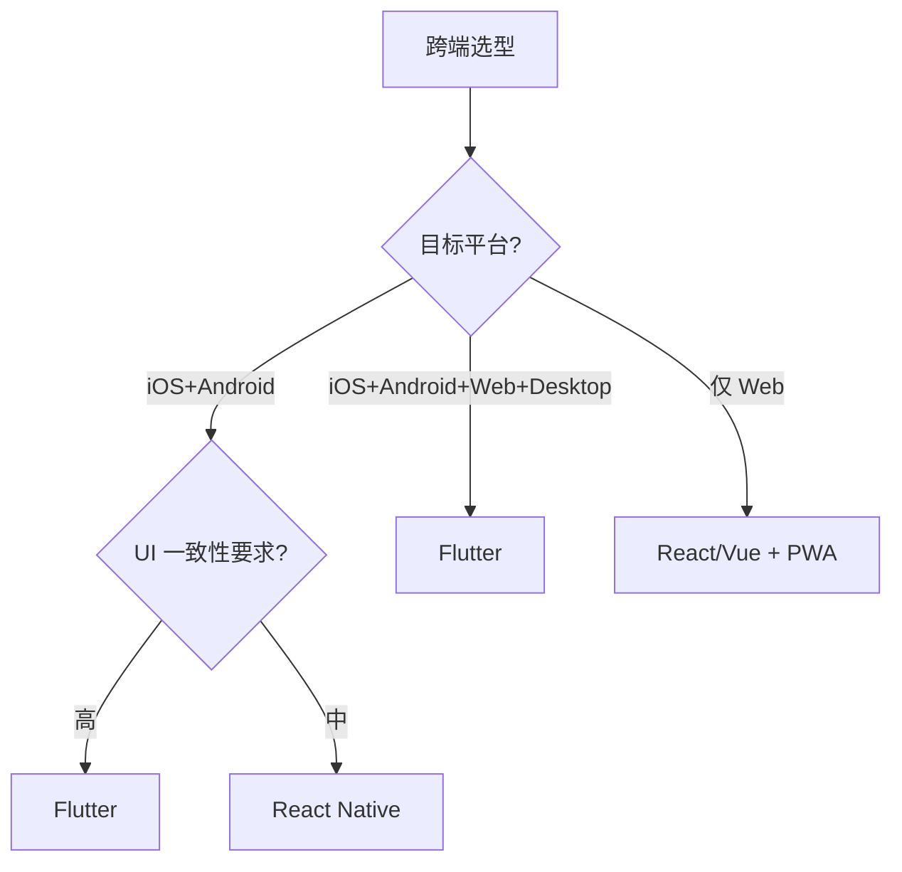

<!--
module:
  parent: front-end
  slug: front-end/flutter
  type: article
  category: 主模块子文章
  summary: Flutter 3.x
-->

# Flutter 3.x

## 引言：反直觉代码

Flutter 3.x 的关键不是语法——是**看起来对**的代码背后那些'踩坑点'。

本篇用 3 个反直觉片段切入，把面试/生产中常被问起、但一深入就漏馅的点摆出来。

---

> 一句话定位：**Flutter — 一码三端的跨端 UI 框架（iOS / Android / Web / Desktop）**

## 1. 一句话定位

Flutter 是 Google 2018 年开源的跨端 UI 框架，使用 Dart 语言 + Skia 自绘引擎，实现 iOS / Android / Web / Desktop 一码多端。本文档聚焦 Flutter 3.x 工程实践。

## 2. 核心能力

- **Widget 体系**：万物皆 Widget（StatefulWidget / StatelessWidget）
- **Skia 渲染**：自绘引擎，不依赖平台原生控件
- **Hot Reload**：亚秒级热重载，提升开发效率
- **Platform Channels**：Dart ↔ Native 双向通信
- **Impeller 渲染引擎**（iOS 默认）：性能优于 Skia
- **Null Safety**：Dart 2.12+ 空安全

## 3. 生态速查

| 类别 | 推荐 | 备选 |
|------|------|------|
| 状态管理 | Riverpod 2 | Provider / Bloc / GetX |
| 路由 | go_router | AutoRoute |
| 网络 | dio | http |
| 数据存储 | Hive | SharedPreferences / sqflite |
| 动画 | flutter_animate | Rive / Lottie |
| 国际化 | intl / easy_localization | - |
| 测试 | flutter_test | mocktail |
| CI/CD | Codemagic / Fastlane | GitHub Actions |

## 4. 选型建议



## 5. 性能优化

- **Impeller 引擎**（iOS 默认启用，Android 2024 启用）
- **const Widget**：编译期常量
- **ListView.builder**：列表懒构建
- **RepaintBoundary**：减少重绘区域
- **Isolate**：Dart 多线程（计算密集型任务）
- **包大小优化**：R8 / ProGuard 混淆 + 资源压缩 + ABI split

## 6. 混合开发

- **Add-to-App**：原生应用嵌入 Flutter Module
- **FlutterBoost**：阿里开源的混合栈
- **Platform View**：在 Flutter 中嵌入原生 View（如地图）

## 7. 实战案例

- **某电商 App**：Flutter 3.x，5 万行代码，iOS + Android 包大小 30MB
- **某金融 App**：Flutter + 加密原生插件，安全合规通过
- **某 IoT App**：Flutter 控制智能家居，跨 iOS/Android/Web

## 8. 学习资源

- 官方文档：https://flutter.dev/
- 中文社区：https://flutter.cn/
- pub.dev：https://pub.dev/（包仓库）
- 实战：Todo List → 新闻 App → 电商 App

## 9. 关键术语

| 术语 | 解释 |
|------|------|
| Widget | Flutter UI 基本单元 |
| Skia | Google 2D 图形库 |
| Impeller | Flutter 新渲染引擎 |
| Dart | Flutter 编程语言 |
| Platform Channel | Dart ↔ Native 通信 |
| Isolate | Dart 多线程 |
| AOT | Ahead-of-Time 编译 |

## 10. Platform Channels 代码示例

### 10.1 MethodChannel 双向通信

```dart
// Dart 端
import 'package:flutter/services.dart'

class BatteryService {
  static const _channel = MethodChannel('com.app/battery')

  Future<int> getBatteryLevel() async {
    try {
      final level = await _channel.invokeMethod<int>('getBatteryLevel')
      return level ?? -1
    } on PlatformException {
      return -1
    }
  }
}
```

```kotlin
// Android 端（Kotlin）
class MainActivity : FlutterActivity() {
  override fun configureFlutterEngine(flutterEngine: FlutterEngine) {
    super.configureFlutterEngine(flutterEngine)
    MethodChannel(flutterEngine.dartExecutor.binaryMessenger, "com.app/battery")
      .setMethodCallHandler { call, result ->
        if (call.method == "getBatteryLevel") {
          val level = getBatteryPercentage()
          result.success(level)
        } else {
          result.notImplemented()
        }
      }
  }
}
```

```swift
// iOS 端（Swift）
import Flutter

@main
@objc class AppDelegate: FlutterAppDelegate {
  override func application(
    _ application: UIApplication,
    didFinishLaunchingWithOptions launchOptions: [UIApplication.LaunchOptionsKey: Any]?
  ) -> Bool {
    let controller = window?.rootViewController as! FlutterViewController
    let channel = FlutterMethodChannel(
      name: "com.app/battery",
      binaryMessenger: controller.binaryMessenger
    )
    channel.setMethodCallHandler { (call, result) in
      if call.method == "getBatteryLevel" {
        result(getBatteryPercentage())
      } else {
        result(FlutterMethodNotImplemented)
      }
    }
    return super.application(application, didFinishLaunchingWithOptions: launchOptions)
  }
}
```

## 11. Isolate 多线程

### 11.1 compute() 简单场景

```dart
// 简单并行计算
import 'package:flutter/foundation.dart'

Future<List<int>> heavyCompute(List<int> input) async {
  return await compute(_parseInBackground, input)
}

List<int> _parseInBackground(List<int> input) {
  return input.map((n) => n * n).toList()
}
```

### 11.2 Isolate.run() 复杂场景

```dart
import 'dart:isolate'

Future<String> parseBigJson(String jsonString) async {
  return await Isolate.run(() {
    final data = jsonDecode(jsonString) as List
    return data.length.toString()
  })
}
```

## 12. 动画深入

### 12.1 AnimationController 基础

```dart
class FadeInWidget extends StatefulWidget {
  @override
  State<FadeInWidget> createState() => _FadeInWidgetState()
}

class _FadeInWidgetState extends State<FadeInWidget>
    with SingleTickerProviderStateMixin {
  late AnimationController _controller
  late Animation<double> _animation

  @override
  void initState() {
    super.initState()
    _controller = AnimationController(
      vsync: this,
      duration: Duration(milliseconds: 300),
    )
    _animation = CurvedAnimation(parent: _controller, curve: Curves.easeIn)
  }

  @override
  Widget build(BuildContext context) {
    return FadeTransition(opacity: _animation, child: Text('Hello'))
  }

  @override
  void dispose() {
    _controller.dispose()
    super.dispose()
  }
}
```

### 12.2 Hero 跨页面动画

```dart
// 列表页
Hero(tag: 'avatar-${user.id}', child: Image.network(user.avatar))

// 详情页
Hero(tag: 'avatar-${user.id}', child: Image.network(user.avatar, width: 200))
```

### 12.3 CustomPainter 自定义绘制

```dart
class CircleChartPainter extends CustomPainter {
  final double progress
  CircleChartPainter(this.progress)

  @override
  void paint(Canvas canvas, Size size) {
    final paint = Paint()
      ..color = Colors.blue
      ..strokeWidth = 8
      ..style = PaintingStyle.stroke
    canvas.drawArc(
      Rect.fromCircle(center: size.center(Offset.zero), radius: 80),
      0, progress * 2 * pi, false, paint,
    )
  }

  @override
  bool shouldRepaint(CircleChartPainter old) => old.progress != progress
}
```

## 13. Impeller vs Skia 对比

| 维度 | Skia | Impeller |
|------|------|----------|
| 架构 | CPU 录制命令 | 预编译 Metal/Vulkan |
| 抖动 | 偶发（首帧卡顿） | 显著减少 |
| 性能 | iOS 良好 | iOS 优于 Skia |
| 平台支持 | 全平台 | iOS 默认启用，Android 2024 启用 |
| 自定义着色器 | SkSL | GLSL（编译时转换） |
| 内存占用 | 较高 | 更低 |

## 14. 真实案例

### 14.1 IoT 智能家居

- 单一 Flutter 端控制 iOS/Android/Web 设备
- MQTT 协议 + WebSocket 双链路
- Platform Channels 调用蓝牙 SDK

### 14.2 金融 App

- 安全键盘（自绘组件）
- 加密插件（Platform Channels 调原生）
- 生物识别认证

### 14.3 电商 App

- 复杂动画（Hero + CustomPainter）
- 图片懒加载 + 缓存
- 多端复用业务逻辑

### 14.4 教育 App

- 音视频播放 + 字幕同步
- 富文本笔记（Quill 编辑器）
- 离线下载课程

### 14.5 社交 App

- 即时通讯（WebSocket + 消息队列）
- 动态发布（图片/视频/位置）
- 实时音视频（Agora/声网 SDK）
