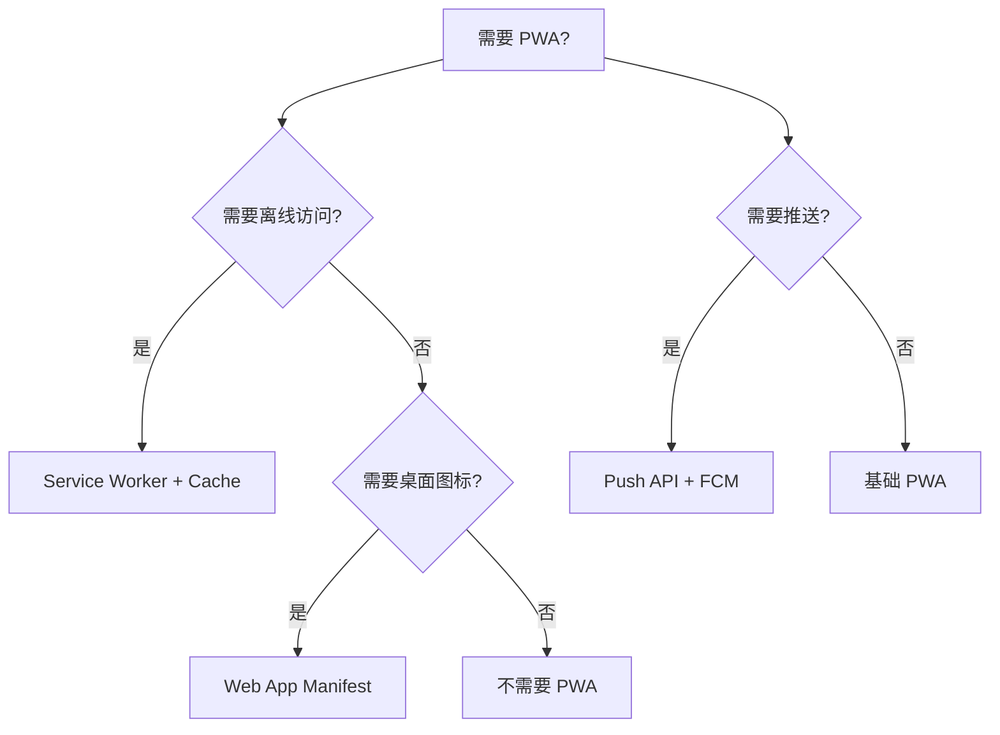

<!--
module:
  parent: front-end
  slug: front-end/pwa
  type: article
  category: 主模块子文章
  summary: PWA
-->

# PWA (Progressive Web App)

---

> 一句话定位：**PWA — 渐进式 Web 应用，离线优先 + 安装到桌面/主屏**

## 1. 一句话定位

PWA 是 Google 2015 年提出的 Web 应用形态，通过 Service Worker / Web App Manifest / Push API 等浏览器能力，让 Web 应用具备类似原生应用的体验：离线访问、桌面图标、推送通知。

## 2. 核心能力

- **Service Worker**：浏览器后台脚本，拦截网络请求实现离线缓存
- **Web App Manifest**：JSON 配置文件，定义应用名称、图标、主题色
- **Push API**：服务器推送通知到用户
- **Background Sync**：后台同步（即使页面关闭）
- **Cache API**：编程式缓存管理
- **IndexedDB**：客户端 NoSQL 存储

## 3. 生态速查

| 类别 | 推荐 | 备选 |
|------|------|------|
| Service Worker 库 | Workbox | 手动实现 |
| 构建集成 | Vite PWA Plugin | next-pwa / workbox-webpack-plugin |
| 推送服务 | Firebase Cloud Messaging | OneSignal |
| IndexedDB 封装 | Dexie.js | idb |
| 工具 | PWA Builder | - |
| 状态检测 | navigator.onLine | - |

## 4. 选型建议



## 5. 缓存策略

| 策略 | 适用 | 说明 |
|------|------|------|
| Cache First | 静态资源 | 优先用缓存，后台更新 |
| Network First | API 请求 | 优先网络，失败用缓存 |
| Stale While Revalidate | 一般资源 | 先返回缓存，后台更新缓存 |
| Network Only | 实时数据 | 不缓存 |
| Cache Only | 预编译资源 | 仅用缓存 |

## 6. 实战场景

- **某新闻 App**：PWA 离线阅读，已读文章本地缓存
- **某电商 App**：PWA + 推送，转化率提升 20%
- **某 SaaS 工具**：PWA 安装到桌面，使用体验接近原生

## 7. PWA 局限

- **iOS Push 限制**：iOS Safari 16.4+ 才支持 Web Push，且必须先安装到主屏
- **iOS 后台限制**：iOS 严格限制 Service Worker 生命周期
- **权限受限**：无法访问部分系统能力（NFC、蓝牙等）
- **不是 App Store 应用**：无法上架 App Store（除非用 PWABuilder 打包）

## 8. 学习资源

- MDN PWA 指南：https://developer.mozilla.org/en-US/docs/Web/Progressive_web_apps
- Web.dev PWA：https://web.dev/progressive-web-apps/
- Workbox 文档：https://developer.chrome.com/docs/workbox

## 9. 关键术语

| 术语 | 解释 |
|------|------|
| PWA | Progressive Web App |
| SW | Service Worker |
| Manifest | Web App Manifest |
| Cache API | 编程式缓存 |
| FCM | Firebase Cloud Messaging |
| Background Sync | 后台同步 API |

## 10. Service Worker 代码示例

### 10.1 Workbox 配置

```javascript
// vite.config.js
import { VitePWA } from 'vite-plugin-pwa'

export default {
  plugins: [
    VitePWA({
      registerType: 'autoUpdate',
      workbox: {
        globPatterns: ['**/*.{js,css,html,ico,png,svg,woff2}'],
        runtimeCaching: [
          {
            // API 请求 - Network First
            urlPattern: /^https:\/\/api\.example\.com\//,
            handler: 'NetworkFirst',
            options: {
              cacheName: 'api-cache',
              networkTimeoutSeconds: 5,
              expiration: { maxEntries: 50, maxAgeSeconds: 300 },
            },
          },
          {
            // 图片 - Cache First
            urlPattern: /\.(?:png|jpg|jpeg|svg|gif|webp)$/,
            handler: 'CacheFirst',
            options: {
              cacheName: 'image-cache',
              expiration: { maxEntries: 100, maxAgeSeconds: 2592000 },
            },
          },
        ],
      },
    }),
  ],
}
```

### 10.2 自定义缓存策略实现

```javascript
// sw.js
self.addEventListener('fetch', (event) => {
  const { request } = event

  // Stale While Revalidate
  if (request.url.includes('/static/')) {
    event.respondWith(staleWhileRevalidate(request))
  }
})

async function staleWhileRevalidate(request) {
  const cache = await caches.open('static-v1')
  const cached = await cache.match(request)
  const networkFetch = fetch(request).then((response) => {
    if (response.ok) cache.put(request, response.clone())
    return response
  })
  return cached || networkFetch
}
```

## 11. Web App Manifest 完整配置

```json
{
  "name": "MyApp - 全称",
  "short_name": "MyApp",
  "description": "应用描述",
  "start_url": "/",
  "scope": "/",
  "display": "standalone",
  "orientation": "portrait",
  "background_color": "#ffffff",
  "theme_color": "#000000",
  "lang": "zh-CN",
  "icons": [
    { "src": "/icons/icon-192.png", "sizes": "192x192", "type": "image/png" },
    { "src": "/icons/icon-512.png", "sizes": "512x512", "type": "image/png" },
    { "src": "/icons/icon-maskable-512.png", "sizes": "512x512", "type": "image/png", "purpose": "maskable" }
  ],
  "shortcuts": [
    {
      "name": "新建笔记",
      "short_name": "新建",
      "url": "/new",
      "icons": [{ "src": "/icons/new.png", "sizes": "96x96" }]
    }
  ],
  "categories": ["productivity", "utilities"]
}
```

## 12. Push API + FCM 集成

### 12.1 Service Worker 接收推送

```javascript
// sw.js
self.addEventListener('push', (event) => {
  const data = event.data?.json() ?? {}
  event.waitUntil(
    self.registration.showNotification(data.title, {
      body: data.body,
      icon: '/icons/icon-192.png',
      badge: '/icons/badge-72.png',
      data: { url: data.url },
      actions: [
        { action: 'open', title: '查看' },
        { action: 'dismiss', title: '忽略' },
      ],
    })
  )
})

self.addEventListener('notificationclick', (event) => {
  event.notification.close()
  if (event.action === 'open') {
    event.waitUntil(clients.openWindow(event.notification.data.url))
  }
})
```

### 12.2 订阅推送

```javascript
// main.js
import { initializeApp } from 'firebase/app'
import { getMessaging, getToken } from 'firebase/messaging'

const messaging = getMessaging()
const token = await getToken(messaging, {
  vapidKey: 'YOUR_VAPID_KEY',
})

// 发送 token 到后端
await fetch('/api/push/subscribe', {
  method: 'POST',
  body: JSON.stringify({ token }),
})
```

## 13. IndexedDB 实战（Dexie.js）

```javascript
import Dexie from 'dexie'

const db = new Dexie('MyAppDB')
db.version(1).stores({
  notes: '++id, title, createdAt, *tags',
  attachments: '++id, noteId, type',
})

// CRUD
await db.notes.add({ title: 'PWA 笔记', createdAt: Date.now(), tags: ['pwa'] })
const note = await db.notes.get(1)
await db.notes.update(1, { title: '更新后的标题' })

// 索引查询
const recent = await db.notes.where('createdAt').above(Date.now() - 86400000).toArray()

// 复合索引
const byTag = await db.notes.where('tags').equals('pwa').toArray()
```

## 14. 真实案例

### 14.1 新闻 App

- Service Worker 缓存已读文章
- Background Sync 离线提交评论
- Push 推送热点新闻

### 14.2 电商 App

- 离线浏览商品
- 安装到主屏转化率提升
- Push 推送降价提醒

### 14.3 SaaS 工具

- 离线编辑 + 联网同步
- 安装到桌面（类原生体验）
- 文件附件离线缓存

### 14.4 离线工具

- JSON 格式化 / 文本对比
- 完全本地运行（无后端依赖）
- Workbox 预缓存全部资源

### 14.5 游戏

- Canvas 游戏（OfflineCanvas 支持）
- IndexedDB 存游戏进度
- 离线可玩
