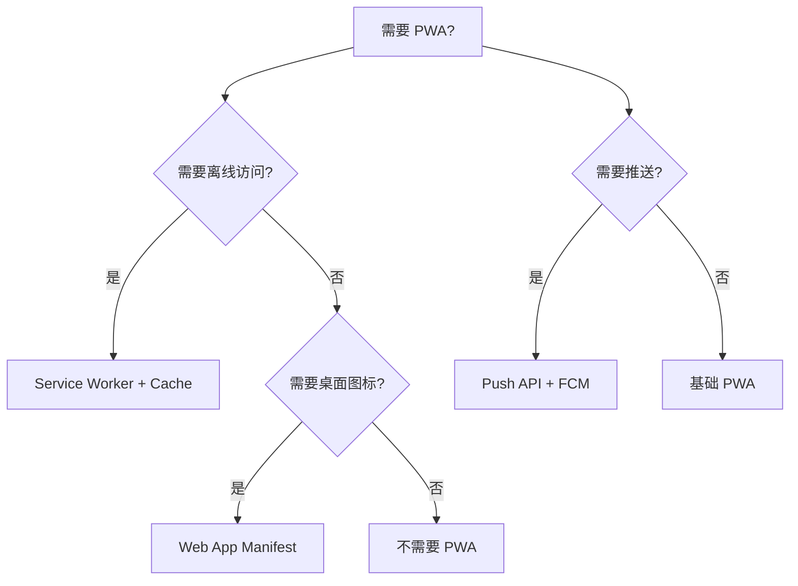

# PWA (Progressive Web App)

> 一句话定位：**PWA — 渐进式 Web 应用，离线优先 + 安装到桌面/主屏**

## 1. 一句话定位

PWA 是 Google 2015 年提出的 Web 应用形态，通过 Service Worker / Web App Manifest / Push API 等浏览器能力，让 Web 应用具备类似原生应用的体验：离线访问、桌面图标、推送通知。

## 2. 核心能力

- **Service Worker**：浏览器后台脚本，拦截网络请求实现离线缓存
- **Web App Manifest**：JSON 配置文件，定义应用名称、图标、主题色
- **Push API**：服务器推送通知到用户
- **Background Sync**：后台同步（即使页面关闭）
- **Cache API**：编程式缓存管理
- **IndexedDB**：客户端 NoSQL 存储

## 3. 生态速查

| 类别 | 推荐 | 备选 |
|------|------|------|
| Service Worker 库 | Workbox | 手动实现 |
| 构建集成 | Vite PWA Plugin | next-pwa / workbox-webpack-plugin |
| 推送服务 | Firebase Cloud Messaging | OneSignal |
| IndexedDB 封装 | Dexie.js | idb |
| 工具 | PWA Builder | - |
| 状态检测 | navigator.onLine | - |

## 4. 选型建议

## 5. 缓存策略

| 策略 | 适用 | 说明 |
|------|------|------|
| Cache First | 静态资源 | 优先用缓存，后台更新 |
| Network First | API 请求 | 优先网络，失败用缓存 |
| Stale While Revalidate | 一般资源 | 先返回缓存，后台更新缓存 |
| Network Only | 实时数据 | 不缓存 |
| Cache Only | 预编译资源 | 仅用缓存 |

## 6. 实战场景

- **某新闻 App**：PWA 离线阅读，已读文章本地缓存
- **某电商 App**：PWA + 推送，转化率提升 20%
- **某 SaaS 工具**：PWA 安装到桌面，使用体验接近原生

## 7. PWA 局限

- **iOS Push 限制**：iOS Safari 16.4+ 才支持 Web Push，且必须先安装到主屏
- **iOS 后台限制**：iOS 严格限制 Service Worker 生命周期
- **权限受限**：无法访问部分系统能力（NFC、蓝牙等）
- **不是 App Store 应用**：无法上架 App Store（除非用 PWABuilder 打包）

## 8. 学习资源

- MDN PWA 指南：https://developer.mozilla.org/en-US/docs/Web/Progressive_web_apps
- Web.dev PWA：https://web.dev/progressive-web-apps/
- Workbox 文档：https://developer.chrome.com/docs/workbox

## 9. 关键术语

| 术语 | 解释 |
|------|------|
| PWA | Progressive Web App |
| SW | Service Worker |
| Manifest | Web App Manifest |
| Cache API | 编程式缓存 |
| FCM | Firebase Cloud Messaging |
| Background Sync | 后台同步 API |
